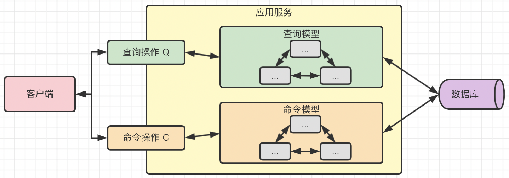

## 一、DDD 概览

DDD 是构建微服务系统的主流设计思想和模式。**DDD 提供的是一种开展业务建模和软件设计的方法论**。从架构设计上讲，DDD 认为良好的系统架构应该是技术架构和业务架构相互融合的结果，而不能脱离业务领域来设计技术架构。

针对业务领域，DDD 通过对业务架构和技术架构进行整合，提出了一组核心概念，包括：

- 用于描述业务的**通用语言**（Ubiquitous Language）；
- 用于对业务进行拆分的**限界上下文**（Boundary Context）；
- 用于设计业务对象的**领域模型对象**（Domain Model Object）；
- 用于实现业务规则的**领域服务**（Domain Service）；
- 用于管理业务状态的**领域事件**（Domain Event）；
- 用于保存业务数据的**资源库**（Repository）；
- 用于实现业务交互的**应用服务**（Application Service）。

## 二、DDD 建模

### 2.1 业务模型

1. **业务描述。**业务模型需要通过简洁而通用的语言进行描述，从而确保与模型相关的所有人都能够对模型所代表的业务场景和需求达成统一认识。
2. **业务拆分。**业务场景的复杂度决定了业务模型中功能组件的数量和关联关系，我们需要通过拆分的方式明确各个功能之间的边界。
3. **业务对象。**在一个业务场景中，势必存在一组业务对象，这些业务对象通过一定的交互关系构成了具体的业务场景。
4. **业务规则。**在一个业务模型中，内部的核心逻辑通过一系列的业务规则来进行展现，业务规则代表着具体领域下的业务价值。
5. **业务状态。**每个业务场景都是有状态的，这些状态构成了业务处理的流程和顺序，也是我们对业务进行建模的重点对象。
6. **业务数据。**所有业务模型都会产生数据，而且业务规则和业务状态的设计很大程度上都是围绕业务数据的处理过程来展开的，我们需要把核心的业务数据进行持久化保存。
7. **业务外观。**对于一个业务模型而言，我们都需要和客户端、其他业务模块以及第三方外部系统进行集成，这就需要开放一定的交互入口，我们把这部分内容称为业务外观。

### 2.2 DDD 设计方式


> **DDD 是系统业务架构和技术架构的结合体**。**设计方法是 DDD 的精髓**。事实上，在每一种设计方法的背后，DDD 都为开发人员提供了对应的技术组件，而这些技术组件和业务模型的各个维度都是一一对应的。

1. 战略设计。所谓战略设计，是一种高阶的设计方法，直接面向业务，其主要目标是**清晰区分系统中的不同业务关注点**。在实施过程中，战略设计需要考虑各个业务场景下不同业务操作所固有的边界，从而实现对领域的合理划分。从架构设计上讲，战略设计偏向于`业务架构`的规划和梳理。
2. 战术设计。相较战略设计，战术设计偏向于技术底层实现。针对战略设计中已经形成的业务领域和边界，战术设计的主要目标是**采用合理的、高效的技术手段来实现各个业务操作**。显然，战术设计关注`技术架构`的设计和实现。

## 三、业务建模和 DDD 战略设计

### 3.1 业务描述和通用语言

通用语言，也可以被称为`统一协作语言`，用来解决在实现业务模型时一个非常重要的问题，即**团队所有人如何使用同一种语言来描述业务需求**。

在业务人员和技术人员的协作过程中，要想在意识形态和认知体系上达成一致并不是一件容易的事情，因为业务人员和技术人员都有其自身的表达方式。引入通用语言的思路是基于领域知识和业务逻辑，统一团队成员对领域知识的认识，促进后续系统设计和代码实现中采用`领域词汇`来命名业务对象，而不是技术词汇。随着业务人员和技术人员采用同样的方式进一步沟通，我们将得到更多层次的通用语言，直到满足系统设计的目标为止。

即在业务人员和技术人员围绕业务场景的不断沟通，会逐渐细化业务细节，直至最终的系统设计满足业务目标要求为止。

### 3.2 业务拆分和限界上下文

找到合适的业务边界，把一个庞大复杂的业务模型拆分成若干个子模型。DDD 提供了**子域**（Sub Domain）的概念，一个子域专注于某一块业务。而在拆分过程中，子域的数量以及各个子域之间的边界取决于业务模型本身的复杂度和功能特性。

业务模型被拆分成多个子域之后，这些子域需要通过一定的集成策略整合在一起，才能实现完整的业务逻辑。为此，DDD 也引入了另一个新的概念，即限界上下文。**限界上下文明确了各个子域中需要交互的界限，并实现子域与子域之间的隔离**。

**某个限界上下文中的领域模型对象都只能作用于该上下文的内部**，即使是同一个业务概念，在不同的限界上下文中就代表着不同的领域模型，这就是“限界”这个名称的由来。

每个子域都有其限界上下文，各个限界上下文之间可以根据需要有效整合从而构成完整的领域模型。每个子域可以拆分成多个限界上下文，然后各个上下文之间可以通过上下文集成形成一个更为完整的模型。相当于就是一种从上往下的分层思想，先有领域，再拆分成子域，然后再进一步拆分成上下文，而整合的过程则是从下往上。

## 四、业务建模和 DDD 战术设计

> 在领域驱动设计中，战术设计方面的内容非常多，包括提取用于表示领域模型对象的聚合（Aggregate）、实体（Entity）和值对象（Value Object），以及用于在多个领域模型对象之间实现复杂业务逻辑的领域服务（Domain Service）、用于实现业务处理状态转发的领域事件（Domain Event）、用于实现统一化数据访问入口的资源库（Repository）、用于提取业务外观的应用程序（Application）。

### 4.1 业务对象和领域模型

在日常开发过程中，我们通常会从`数据库建模`的角度来规划对象的组织形式，也就是所谓的数据驱动（Data Driven）模式。和数据驱动不同，领域驱动采用了一种完全不同的设计方法，关注的是`领域模型对象`（Domain Model Object）。

领域模型对象和数据对象的本质区别在于前者**包含了丰富的操作行为和业务逻辑**，而后者则只包含了数据属性。我们认为领域模型对象更加适合对复杂业务实现建模。

在 DDD 中，领域模型对象包括三大类，即聚合（Aggregate）、实体（Entity）和值对象（Value Object）。

- **聚合对象：**DDD 中专门提出聚合对象这一概念的核心思想在于**简化对象之间的关联关系**，一个聚合内部的所有对象只能通过聚合对象来进行访问，从而有效降低了对象之间的交互复杂度。

- **实体对象：**`实体`是一个聚合内部具有唯一标识的一种业务对象。实体对象与数据对象之间的本质区别是它**状态的可变性以及具有的完整生命周期**。我们可以通过改变实体的状态来执行业务逻辑。有时候，我们把基于实体对象的建模方式称为充血模型（Rich Model），以便与基于数据对象的贫血模型（Anaemic Model）相区别。

- **值对象：**和实体对象相比，值对象就比较简单了。**值对象是一种不可变对象**，意味着我们无法改变它的状态，所以和贫血模型对象比较类似。另外，**值对象没有唯一标识，通常也不包含任何业务逻辑**。

### 4.2 业务规则和领域服务

针对业务模型中的业务逻辑，我们可以把它们抽象成一组业务规则（Business Rule）。业务规则的实现涉及到一组领域模型对象之间的交互和操作。由于单个领域模型对象无法承接这些业务规则，这时候，DDD 提供了领域服务（Domain Service）概念。

**领域服务本质上就是为如何整合多个领域模型对象提供了独立的操作入口**

### 4.3 业务状态和领域事件

现实中很多场景都可以抽象成事件（Event），例如，当某一个操作发生时发送一个消息，如果出现了某种情况执行某个既定业务操作等。本质上，**这些事件代表的就是一种业务状态的变化**。

与普通的领域模型对象不同，我们关注这些事件的发生时机、事件本身携带的状态变化信息，以及我们需要针对事件做出的响应方式。因此，DDD 专门针对事件抽取了一种独立的建模对象，这就是**领域事件**（Domain Event）。

### 4.4 业务数据和资源仓库

开发人员会把数据保存到各种关系型数据库或 NoSQL 数据库等数据持久化媒介中，这是数据驱动模式的基本开发过程。而 DDD 认为系统中应该存在一个访问入口，我们可以基于这个入口执行对领域模型对象的统一操作。无论是聚合、实体，还是值对象，我们都应该创建另一种对象来作为这些对象的提供方。**在 DDD 中，资源库（Repository）实际上就是充当了领域模型对象的提供方**。

简单讲，资源库作为对象的提供方指的就是能够实现对象的持久化，但这种持久化操作是技术无关性的，即领域模型不需要关注通过何种技术获取领域模型对象，而只需要明确对象的来源是资源库。**开发人员通过资源库屏蔽了数据访问的技术复杂性。**

### 4.5 业务外观和应用服务

对于任何一个系统而言，不可避免会存在面向用户交互的用户界面，也可能存在面向外部系统对接的集成需求。无论是用户界面，还是系统集成，都不是领域驱动设计的重点。但是，针对用户界面，我们需要明确“如何将领域对象渲染到用户界面中，以及如何将用户操作反映到领域模型”这两个基本问题。面向系统集成需求也是同样。我们把这部分工作统称为业务外观。

为了实现业务外观与领域模型之间的解耦，我们可以使用经典的外观模式，在分层架构中，可以使用这一模式定义系统中每一层的入口。这种外观类就是**应用服务**（Application Service）。应用服务会完成与前面提到的各种领域模型对象之间的交互和协作。

## 五、子域和限界上下文的拆分与集成

> DDD 作为一套软件设计方法论，基本思路在于清楚界分不同的系统与业务关注点，并采用技术设计工具按照领域模型实现系统。面对日益复杂的软件系统本身以及围绕软件系统所展开的过程和组织因素，DDD 在战略设计和战术设计上为我们提供了完备的技术组件。

### 5.1 子域和限界上下文核心概念

子域和限界上下文都属于 DDD 的战略设计部分内容，其目的就是完成对业务系统的有效拆分和集成。

- 子域：系统拆分的切入点。
- 限界上下文：业务整合的边界。

### 5.2 子域的类型

- 核心子域：代表系统中核心业务的一类子域。
- 支撑子域：代表专注于某一方面业务的一类子域。
- 通用子域：代表具有公用功能或基础设施能力的一类子域。

### 5.3 限界上下文映射关系

当我们把领域拆分成多个子域之后，我们就有了多个子域，也就有了多个限界上下文。随之而来的问题在于如何有效地管理这些限界上下文之间的关联关系，即实现上下文之间的正确**映射**。从依赖关系而言，不同上下文之间存在一种`上游（Upstream）`和`下游（Downstream）`的对应关系。

任何一个上下文原则上都可以位于其他上下文的上游或下游。

### 5.4 限界上下文的集成模式

限界上下文集成模式的基本述求在于两点：一点是**解耦**，另一点是**统一**。

`解耦`比较容易理解，即两个上下文集成时，我们应该避免某一个上下文的变更导致另一个上下文也需要做调整。这个过程需要综合考虑具体的隔离技术以及集成之后所带来的访问可用性和容错性等问题。

`统一`指的是两个上下文之间应该采用一致的集成方式。通常，处于上游的上下文会给出约定的交互方式和通信协议，包括具体的接口定义、字段语义以及数据传输方式等。

基于以上述求，DDD 为我们提供了两种主要的上下文集成模式，即**防腐层（Anticorruption Layer，ACL）和统一协议（Unified Protocol，UP）**。

`防腐层`代表的是专门为了实现集成而设计的一个独立层，在这个独立层中完成了所有与上下文集成相关的工作，从而避免与集成相关的处理逻辑混淆到业务代码中。

`统一协议`则是提供一致性的协议定义，促使其他上下文通过协议进行访问。


### 5.5 实践方法论

1. 找到系统的核心域，并根据核心域的定位和作用梳理其通用语言。核心域的通用语言包括该子域的名称以及基本需求约束。
2. 判断系统是否只要一个核心域就能满足建模需求。如果不是，那就要判断是否需要相应的支撑子域和通用子域。支撑子域和通用子域不一定都需要，但有时候系统也会存在多个支撑子域或通用子域。
3. 明确了子域之后，就可以分析限界上下文，我们已经需要考虑到限界上下文之间的划分边界，并明确映射关系和集成模式。

## 六、领域对象提取

**实体和值对象是聚合的组成部分，而值对象同时也是实体的组成部分。**


### 6.1 实体

实体对象和数据对象的区别在于，实体中除了定义了数据属性之外，还包含了业务的状态以及围绕这些状态所产生的生命周期，也就是说它具有**可变性**。同时，我们也需要使用唯一标识来区分不同的实体对象，也就是说它具有**唯一性**。

```java
/**
 * 实体对象
 */
public class Order {
    /**
     * 唯一标识：代表唯一性
     */
    private String orderNumber;
    private String deliveryAddress;
    private List<Goods> goodsList;
    
    /**
     * 添加商品：代表可变性，状态改变的是 goodList 中的元素
     */
    public void addGoods(Goods goods) {
    }
    
    /**
     * 获取订单总价：代表可变性，状态改变是根据总商品数量进行计算的订单总价格
     */
    public Float getTotolPrice() {   
    }
    
    // 省略getter和setter方法...
}
```

唯一标识是实体对象必须具备的一种属性，也是实体与值对象之间核心区别之一。

可变性是实体对象与值对象的另一个核心区别。实际上，关于实体对象可变性的讨论，已经不仅仅局限于领域模型对象的设计，而是衍生到了关于架构模式上的探讨。在**贫血模型**中，领域对象实际上就是数据对象，即领域对象的作用只是作为保存状态或者传递状态，自身并不包含任何业务逻辑。相对的，**充血模型**中的领域对象一般都会具备面向特定业务操作的方法定义，同时对自身对象的生命周期进行统一的管理和维护。

### 6.2 值对象

值对象的特征决定了如何分离值对象的方法。与实体对象相比，值对象自身没有状态，所以是一种不可变对象。在设计过程中，通常我们会先识别系统中的实体对象，然后从实体对象中分离出潜在的值对象。

**值对象可以用来表示业务数据类型，值对象也可以在上下文集成中充当对外的数据媒介。**

值对象在实现上需要**严格保持其不变性**，通过只用构造函数、不用 setter 方法等手段可以构建一个合适的值对象。

### 6.3 聚合

聚合（Aggregate）是一种**最核心的领域模型对象**。和限界上下文被用来划分子域之间的业务边界一样，在领域模型对象中，我们也需要从软件复杂度的角度出发，明确对象之间的边界。

聚合的设计思想实际上很简单，就是**尽量减少系统中对象之间的关联关系，简化外部组件对领域模型对象的访问入口，从而降低系统的复杂度**。

聚合有两部分组成，分别是**聚合根和聚合边界**。

- 聚合根：聚合对外暴露的访问对象，外部组件只能通过这个聚合根对象实现对聚合的修改和更新。
- 聚合边界：聚合的业务边界和范围，规定了一个聚合内部应该具备哪些业务逻辑和操作。通过聚合边界的定义，我们也确保聚合内部的数据操作具有严格的事务性。

## 七、领域事件提炼

所谓领域事件，就是将**领域中所发生的业务状态变更抽取出来形成一系列独立的事件**。对领域事件进行建模的核心要点在于明确事件的**生命周期**。领域事件生命周期包括生成（Generate）、存储（Store）、分发（Dispatch）和消费（Consume）四个阶段。


基于业务描述提取领域事件是比较直接的做法，但有时候并不能确保完全识别出所需要提取的领域事件。从设计原则上讲，**但凡涉及到聚合状态的变化，我们就可以提取领域事件**，这是事件最基本的识别方法。

在领域事件命名上，我们一般采用**聚合名+动作过去时的形式**。同时，作为一种事件类的对象，领域事件中势必需要包含生成时间、全局唯一的标识符等基础信息。领域事件在 DDD 中代表的是当前系统的瞬时状态，所以是一种`不可变对象`，一旦生成就无法进行修改。

从聚合的状态变化，我们可以得出对应的领域事件。领域事件本身表达的是聚合状态变化的一种结果。而领域事件的处理过程可以是在触发事件的限界上下文内部，但更多的时候我们需要跨多个限界上下文来完成某个聚合状态变化的传递。

## 八、应用服务抽取

> CQRS 的全称是 **Command Query Responsibility Segregation**，也就是**命令和查询职责分离**。

数据操作的基本表现就是增加（Create）、检索（Retrieve）、更新（Update）和删除（Delete）。其中 CRUD 中的 R 代表`读`，而剩余的 CUD 则代表`写`。

在我们执行一个具体的数据操作时，如果该操作的结果是返回一个值，它就具有**查询（Query）** 的性质，也就是`读`的性质；而如果一个操作的目的是要改变数据的状态，**那么它就具有命令（Command）** 的性质，也就是`写`的性质。这样，我们把数据操作对应到了一个个具体的方法上。如果一个方法没有返回值，那么它就是命令操作，反之就是一个查询操作。针对这两大类操作，我们也可以构建两大类应用服务，分别是**查询服务和命令服务**。而对应地，在领域模型的设计上，也需要引入两大类新的对象，即**查询对象（Query Object）和命令对象（Command Object）**。

在 CQRS 模式中，通过**严格区分命令操作和查询操作**，有助于提升系统性能，也有利于确保系统的安全性。



应用服务是领域模型的直接使用者，负责业务流程的协调，同时还使用资源库并解耦服务输出。

应用服务是 **DDD 中唯一一个与用户界面进行直接交互的技术组件**。另一方面，应用服务虽然涉及与多个 DDD 技术组件之间的交互和协调，但通常不包含业务，表现为很薄的一个层次。

命令和事件往往是成对出现的。