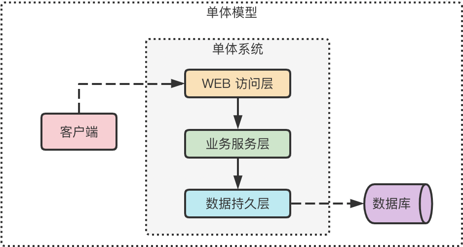
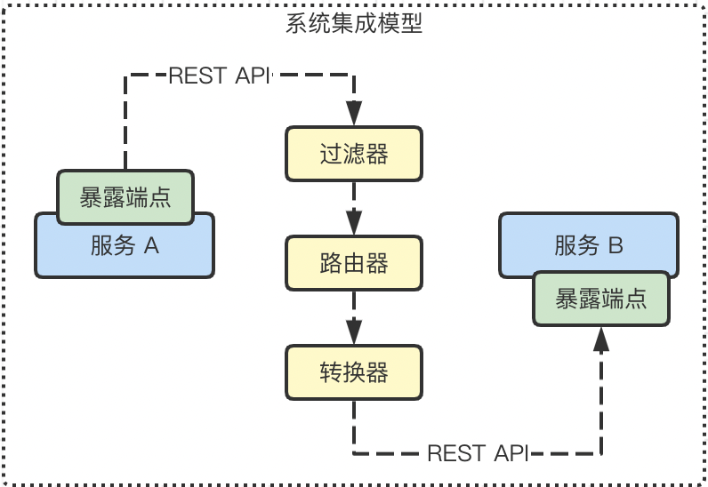

## 一、技术组件概览

### 1.1 技术选型

- Spring Boot：服务搭建脚手架
- Spring Cloud：微服务体系一站式开发
- Axon：CQRS 以及事件机制的支持

### 1.2 技术实现模型

- 单体模型
- 系统集成模型
- 微服务模型
- 消息通信模型

## 二、服务模型介绍

### 2.1 单体模型

在分布式和微服务架构成为主流的开发模式之前，单体（Monolithic）系统一直是软件系统的主要表现形式。单体系统的结构通常都比较简单，在代码逻辑上包括数据访问、业务处理、Web 访问等功能模块，而在物理结构上就是一个一体化的部署包。单体系统还有一个显著特征，即一个系统通常对应着一个数据库。

单体模型的优势是**简单性**，但我们认为它**并不适合构建 DDD 系统**。究其原因，在于互联网应用在业务体系发展的同时常常还伴随着不断的变化，系统的用户体量和性能要求也不是以往传统行业所能够相比的。软件系统背后所承载的业务功能复杂度以及快速迭代的节奏，已远远超出了单体系统的设计和开发要求。

DDD 通过子域和限界上下文把业务系统的领域和边界做了合理划分，其目的正是为了应对系统演进过程中的复杂性。而在单体系统中，并没有根据业务领域对代码结构进行物理上的合理拆分，导致对系统的任何一处修改都会影响到整个系统的构建和发布。

### 2.2 系统集成模型

既然单体实现模型存在明显的缺陷，我们就应该把业务系统进行合理拆分，并在物理上划清边界。这时候，根据限界上下文来拆分服务是最常见的做法。当限界上下文被拆分成一个个独立的物理服务之后，就需要完成这些服务之间的有效集成，我们把这种实现模型称为**系统集成模型**。

在系统集成模式中，我们可以通过各个服务暴露的 HTTP 端点并使用 REST API 来完成服务与服务之间的远程调用。

在系统集成的实现过程中，我们还可以引入一系列辅助性的功能组件。例如，想要基于不同条件对数据进行筛选，那么可以引入过滤器（Filter）；关于数据如何到达目标应用系统，可以使用路由器（Router）；而关于如何在异构系统之间完成数据的转换和适配，则可以引入转换器（Transformer）。

这些过滤、路由、转换等功能构成了系统集成的基本需求，在实现上这些组件属于应用程序的一部分，但应用程序应该与系统集成组件进行解耦，这时候就需要引入专门实现系统集成功能的组件，即端点（Endpoint）。

### 2.3 微服务模型

微服务架构本质上也是一种系统集成模型，但提供了一些额外的技术组件，从而使得系统集成过程变得更加简单高效。在微服务架构中，各个限界上下文同样被拆分成独立的微服务，它们之间通过服务的**注册（Registration）和发现（Discovery）** 实现相互调用。

在微服务架构中，提供服务注册和发现机制的是注册中心。注册中心可以分为客户端和服务器两大组件，其中客户端组件嵌入在服务提供者和消费者中。服务消费者基于注册中心中所存储的服务实例信息向服务提供者发起远程调用。

### 2.4 消息通信模型

事件驱动架构的实现方式就是**消息通信机制**。消息通信机制能够降低服务之间的耦合度。