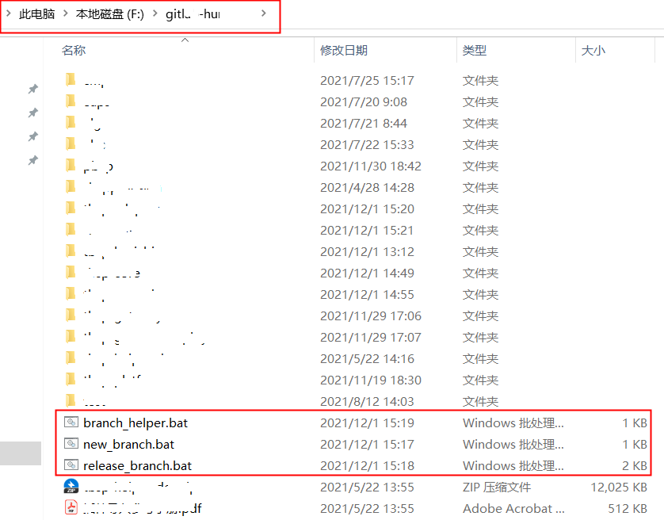
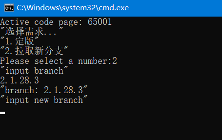

简化多项目分支同版本维护

<!--more-->

### 一、为什么需要一个这样的脚本

​		现在中台需要维护的项目比较多，从底层支撑项目到业务层项目再到网关聚合项目的分支管理，目前是通过`IDEA`不断的在项目之间切换。本人体验过定版的流程，需要将所有的项目，从底层开始，进行新版本分支的拉取，打上版本号，再提交，之后再切回老分支，去掉快照`SNAPSHOT`，整个过程比较机械化。或者还有这么一种场景，我们对新需求的开发，需要拉一个新分支为某个现场做补丁版本，也是需要从底层项目开始拉分支。

### 二、Branch Helper 能做什么

​		目前脚本仅支持：1、项目定版；2、拉取补丁分支

### 三、怎么使用 Branch Helper

```markdown
- `Branch Helper`是`bat`批处理脚本，建议运行在`Windows`操作系统上
- 使用之前需要配置好本地路径
- `branch_helper.bat`、`release_branch.bat`、`new_branch.bat`三个文件需要放在统一目录下
```

#### 步骤零、添加 Maven 插件依赖

在需要被脚本覆盖到的项目中，添加如下依赖：

```xml
<build>
    <plugins>
        <plugin>
            <groupId>org.codehaus.mojo</groupId>
            <artifactId>versions-maven-plugin</artifactId>
            <version>2.7</version>
            <configuration>
                <!--是否备份-->
                <generateBackupPoms>false</generateBackupPoms>
            </configuration>
        </plugin>
    </plugins>
</build>
```

#### 步骤一、配置脚本本地路径

​		用文本编辑器打开`branch_hepler.bat`文件，配置`script_dir`为当前脚本所在目录，例如：

​		

​		

#### 步骤二 配置项目文件所在路径

​		用文本编辑器打开`branch_hepler.bat`文件，配置`dir_path`为当前项目路径，**多项目之间用`,`分隔**，例如：

  

​		

#### 步骤三、双击 branch_hepler.bat 文件，进入引导界面

  

#### 步骤四、选择对应功能


#### 步骤五、输入当前分支（需要确保当前分支在远程）


#### 步骤六、输入新分支



#### 完成

至此，操作完成，等待指令执行即可，中间过程可能会有交互。

### 四、结束语

​		`branch_helper`纯粹为了方便而产生，欢迎使用者提供测试之后的建议，同时也欢迎一起维护脚本，甚至可以用别的方式开发出更加便利的实现方案。

    开源地址：https://gitee.com/yiwenup/branch-helper