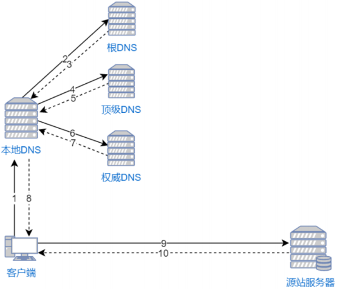

> `CDN（Content Delivery Network）`，即**内容分发网络**。其目的是通过在现有的`Internet`中**增加缓存层**，将网站的内容发布到最接近用户的网络“边缘“的节点，使用户可以就近取得所需的内容，提高用户访问网站的响应速度。从技术上全面解决由于网络带宽小、用户访问量大、网点分布不均等原因，提高用户访问网站的响应速度。

## 一、DNS域名解析流程

`DNS（Domain Name System）`为域名解析系统，核心作用就是将一个域名解析为一个`IP`地址。在我们网浏览器地址栏输入一个域名之后，将会发生以下`DNS`解析步骤：

1. 客户端首先会在本机的`hosts`文件和`hosts`缓存中查找该域名对应的IP地址
2. 如果本机中没查找到，则会到本地`DNS`查询该域名对应的IP地址
3. 如果本地`DNS`中仍然没有该域名的`IP`信息时，则会由本地`DNS`依次向**根DNS** 、 **顶级域DNS** 、 **权威DNS**进行询问，最终本地DNS将IP地址发送给客户端
4. 客户端通过IP地址向远程的源站服务器发出HTTP请求并获取相应的数据内容

## 二、基于DNS的CDN加速

`CDN`会将对源站的请求导向距离该用户较近的最优缓存节点响应数据内容。

加入了`DNS`的域名解析模式，会在原有`DNS`解析基础上，增加**`GSLB`**、**`SLB`**和**缓存服务器**概念：

- `GSLB（Global Server Load Balancing）`为全局负载均衡服务器。主要功能是根据用户的本地DNS（通常距离用户的物理位置较近）的IP地址**判断用户的位置**，筛选出距离用户较近的本地负载均衡系统（SLB） ，并**将该SLB的IP地址作为结果返回给本地DNS**。
- `SLB（Server Load Balancing）`为负载均衡器。主要负责判断缓存服务器集群中是否包含用户请求的资源数据，如果缓存服务器中存在请求的资源，则根据缓存服务器集群中节点的健康程度、负载量、连接数等因素筛选出最优的缓存节点，并**将HTTP请求重定向到最优的缓存节点上**。
- 缓存服务器指的就是`CND`网络中的边缘服务器节点。

以下流程表示加入了`CDN`的`DNS`解析步骤（请求：`http://www.yiwenup.cloud`）：

1. 用户发起HTTP请求，首先需要通过本地DNS通过"迭代解析"的方式获取域名的IP地址
2. 如果本地DNS的缓存中没有该域名的记录，则向根DNS发送DNS查询报文
3. 根DNS发现域名的前缀为"cloud"，则给出负责解析cloud的顶级DNS的IP地址
4. 本地DNS向顶级DNS发送DNS查询报文
5. 顶级DNS发现域名的前缀为"yiwenup.cloud"，在本地记录中查找负责该前缀的权威DNS的IP地址并进行回复
6. 本地DNS向权威DNS 发送DNS查询报文
7. 权威DNS查找到一条NAME字段为`www.yiwenup.cloud`的CNAME记录，该记录的Value字段为"yiwenup.cdn.cloud"；并且还找到另一条NAME字段为"yiwenup.cdn.cloud"的A记录，该记录的Value字段为GSLB的IP地址
8. 本地DNS向GSLB发送DNS查询报文
9. GSLB根据本地DNS的IP地址判断用户的大致位置，并且综合考量最优的SLB的IP地址填入DNS回应报文，作为DNS查询的最终结果；
10. 本地DNS回复客户端的DNS请求，将上一步的IP地址作为最终结果回复给客户端
11. 客户端根据IP地址向SLB发送HTTP请求
12. SLB综合考虑缓存服务器集群中各个节点的资源限制条件、健康度、负载情况等因素，筛选出最优的缓存节点后回应客户端的HTTP请求（状态码为302，重定向地址为最优缓存节点的IP地址）
13. 客户端接收到SLB的HTTP回复后，重定向到该缓存节点上
14. 缓存节点判断请求的资源是否存在、过期，将缓存的资源直接回复给客户端，否则到源站进行数据更新再回复
