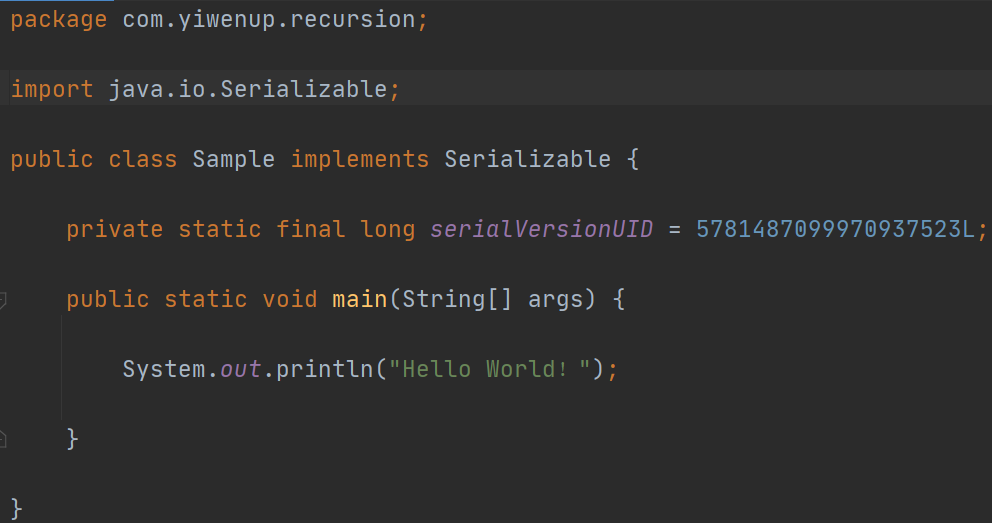
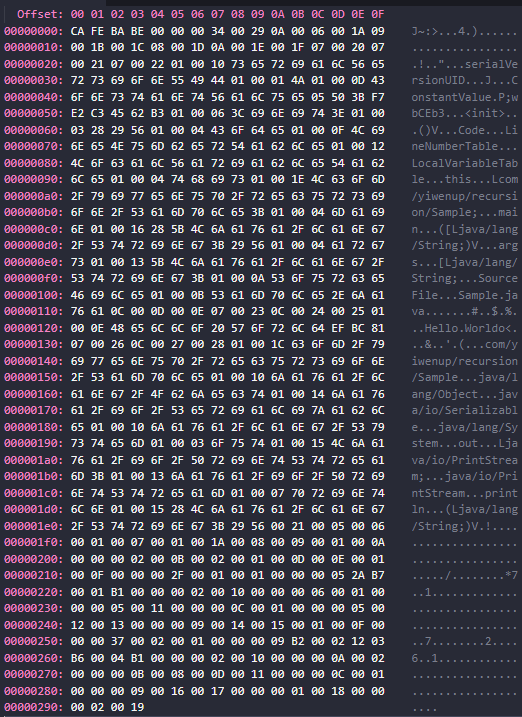

## 1. Java 类文件结构

如上，是一个结构简单的 Java 类文件`Sample.java`，Java 类文件经过编译器进行源码编译之后，将会得到 .class 字节码文件。

## 2. Class 字节码文件

## 3. 无符号数和表

Class 文件是以 8 个字节为一组基础单位的二进制流，各个数据项之间都是严格按顺序紧凑的排列在文件中的，之间没有任何分隔符。

Class 文件是采用类似于 C 语言的结构体的伪结构来进行数据存储的，这种伪结构有两种数据类型：**无符号数**、**表**。

无符号数：

​	**无符号数属于基本数据类型**，以 u1、u2、u4、u8 分别代表 1个字节、2个字节、4个字节、8个字节的无符号数，**由无符号数进而来描述数字、索引引用、数量值或者按 UTF8 编码构成的字符串**。

表：

​	**表是**由无符号整数或者其他表构成的**复合数据类型**，为了便于区分，所有表的命名习惯上都以`_info`结尾。表是用来描述有层次关系的复合结构的数据类型。

## 4. 魔数和版本号

字节码文件以二进制编码打开后，文件的**前 4 个字节即为魔数**，按如图所示即为：CA FE BA BE。用于也仅用于标识当前字节码文件能否被`JVM`接受。

**魔数之后的 4 个字节即为主次版本号**。前 2 个字节表示的是次版本号，如图所示即为：00 00，后 2 个字节表示的是主版本号，如图所示即为：00 34。主次版本号用于标识当前字节码文件可以被多少版本的`JVM`执行。如图的 00 00 00 34 对应的就是 JDK8，前后依次增减。

> 00 00 00 34 -> JDK 8
>
> 00 00 00 33 -> JDK 7
>
> 00 00 00 32 -> JDK 6

## 5. 常量池

### 5.1 常量池计数

由于常量池中常量的数量是不固定的，所以在常量池的入口需要放置一个`u2`类型的数据，代表常量池容量计数值。

而计数习惯上**常量池计数是从 1 开始进行计数的**，如上图所示，常量池计数为 00 29 ，十六进制的 29，转为十进制即为 41，则表示当前常量池中的常量数量为 41。

常量池计数从 1 开始而不是从 0 开始的目的在于：如果后面某些指向常量池的索引值的数据在特定情况下需要表达 "不引用任何一个常量池项目" 的含义，则可以把索引值设置为 0 来表示。例如：匿名内部类本身是没有类名的，进行名称引用的时候则会将 index 执行 0。

### 5.2 常量池存放的内容

常量池主要存储两大类常量：字面量和符号引用。

- 字面量：字面量比较接近于 Java 语言层面的常量概念