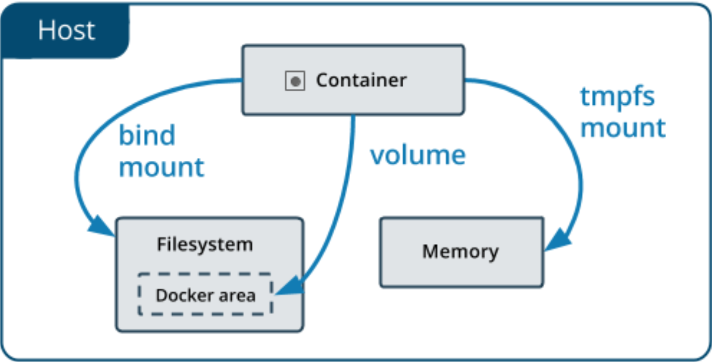

## 一、Docker 基础概念

### 1.1 Docker 架构

> Docker 用 Go 编程语言编写，并利用 Linux 内核的多种功能来交付其功能。 Docker 使用一种称为名称空间的技术来提供容器的隔离工作区。运行容器时，Docker 会为该容器创建一组名称空间。这些名称空间提供了一层隔离，容器的每个方面都在单独的名称空间中运行，并且对其的访问仅限于该名称空间。


- Client：客户端。操作docker服务器的客户端(命令行或者界面)
- Docker_Host：Docker主机。安装Docker服务的主机
- Docker_Daemon：后台进程。运行在Docker服务器的后台进程
- Containers：容器。在Docker服务器中的容器(一个容器一般是一个应用实例，容器间互相隔离)
- Images：镜像、映像、程序包。Image 是只读模板，其中包含创建Docker容器的说明。容器是由 Image 运行而来，Image 固定不变。
- Registries：仓库。存储 Docker Image 的地方，官方远程仓库地址: https://hub.docker.com/search

### 1.2 Docker 隔离原理

- namespace 六项隔离（资源隔离）

  | namespace | 系统调用参数  | 隔离内容                   |
  | --------- | ------------- | -------------------------- |
  | UTS       | CLONE_NEWUTS  | 主机和域名                 |
  | IPC       | CLONE_NEWIPC  | 信号量、消息队列和共享内存 |
  | PID       | CLONE_NEWPID  | 进程编号                   |
  | Network   | CLONE_NEWNET  | 网络设备、网络栈、端口等   |
  | Mount     | CLONE_NEWNS   | 挂载点（文件系统）         |
  | User      | CLONE_NEWUSER | 用户和用户组               |

- cgroups 资源限制

---

### 1.3 cgroups

> cgroup 资源控制系统，每种子系统独立地控制一种资源，主要功能如下：
>
> - 资源限制：限制任务使用的资源总额，并在超过这个配额时发出提示
> - 优先级分配：分配CPU时间片数量及磁盘IO带宽大小、控制任务运行的优先级
> - 资源统计：统计系统资源使用量，如CPU使用时长、内存用量等
> - 任务控制:对任务执行挂起、恢复等操作

| 子系统                            | 功能                                                         |
| --------------------------------- | ------------------------------------------------------------ |
| cpu                               | 使用调度程序控制任务对CPU的使用                              |
| cpuacct（CPU Accounting）         | 自动生成cgroup中任务对CPU资源使用情况的报告                  |
| cpuset                            | 为cgroup中的任务分配独立的CPU（多处理器系统时）和内存        |
| devices                           | 开启或关闭cgroup中任务对设备的访问                           |
| freezer                           | 挂起或恢复cgroup中的任务                                     |
| memory                            | 设定cgroup中任务对内存使用量的限定，并生成这些任务对内存资源使用情况的报告 |
| perf_event（Linux CPU性能探测器） | 使cgroup中的任务可以进行统一的性能测试                       |
| net_cls（Docker未使用）           | 通过等级识别符标记网络数据包，从而允许Linux流量监控程序（Traic Controller）识别从具体cgroup中生成的数据包 |

## 二、Docker 命令


> 所有命令手册：https://docs.docker.com/engine/reference/commandline/docker/

### 2.1 常见命令

| 命令       | 作用                                                         |
| ---------- | ------------------------------------------------------------ |
| attach     | 绑定到运行中容器的标准输入输出以及错误流（这样似乎也能进入容器内容，但是一定小心，他们操作的就是控制台，控制台的退出命令会生效，比如 redis，nginx 等） |
| build      | 从一个 Dockerfile 文件构建镜像                               |
| builder    | Manage builds                                                |
| checkpoint | Manage checkpoints                                           |
| commit     | 把容器的改变提交创建一个新的镜像                             |
| config     | Manage Docker configs                                        |
| container  | 管理容器                                                     |
| context    | Manage contexts                                              |
| cp         | 容器和本地文件系统间 复制 文件/文件夹                        |
| create     | 创建新容器，但并不启动（注意与 docker run 的区分）需要手动启动。start\stop |
| diff       | 检查容器里文件系统结构的更改【A:添加文件或目录 D:文件或者目录删除 C:文件或者目录更改】 |
| events     | 获取服务器的实时事件                                         |
| exec       | 在运行时的容器内运行命令                                     |
| export     | 导出容器的文件系统为一个tar文件。commit是直接提交成镜像，export是导出成文件方便传输 |
| history    | 显示镜像的历史                                               |
| image      | 管理镜像                                                     |
| images     | 列出所有镜像                                                 |
| import     | 导入tar的内容创建一个镜像，再导入进来的镜像直接启动不了容器。<br /> docker-entrypoint.sh nginx -g 'daemon o;'<br/> docker ps --no-trunc<br />看下之前的完整启动命令再用他 |
| info       | 显示系统信息                                                 |
| inspect    | 获取docker对象的底层信息                                     |
| kill       | 杀死一个或者多个容器                                         |
| load       | 从 tar 文件加载镜像                                          |
| login      | 登录Docker registry                                          |
| logout     | 退出Docker registry                                          |
| logs       | 获取容器日志。容器以前在前台控制台能输出的所有内容，都可以看到 |
| manifest   | Manage Docker image manifests and manifest lists             |
| network    | 管理网络                                                     |
| node       | Manage Swarm nodes                                           |
| pause      | 暂停一个或者多个容器                                         |
| plugin     | Manage plugins                                               |
| port       | 列出容器的端口映射                                           |
| ps         | 列出所有容器                                                 |
| pull       | 从registry下载一个image 或者repository                       |
| push       | 给registry推送一个image或者repository                        |
| rename     | 重命名一个容器                                               |
| restart    | 重启一个或者多个容器                                         |
| rm         | 移除一个或者多个容器                                         |
| rmi        | 移除一个或者多个镜像                                         |
| run        | 创建并启动容器                                               |
| save       | 把一个或者多个 **镜像** 保存为tar文件                        |
| search     | 去docker hub寻找镜像                                         |
| secret     | Manage Docker secrets                                        |
| service    | Manage services                                              |
| stack      | Manage Docker stacks                                         |
| start      | 启动一个或者多个容器                                         |
| stats      | 显示容器资源的实时使用状态                                   |
| stop       | 停止一个或者多个容器                                         |
| swarm      | Manage Swarm                                                 |
| system     | Manage Docker                                                |
| tag        | 给源镜像创建一个新的标签，变成新的镜像                       |
| top        | 显示正在运行容器的进程                                       |
| trust      | Manage trust on Docker images                                |
| unpause    | pause的反操作                                                |
| update     | 更新一个或者多个docker容器配置                               |
| version    | Show the Docker version information                          |
| volume     | 管理卷                                                       |
| wait       | Block until one or more containers stop, then print their exit codes |

### 2.2 经验总结

- 尽量选择版本是`alpine`的或者`slim`的，基础环境小

  ```markdown
  busybox:是一个集成了一百多个最常用Linux命令和工具的软件。linux工具里的瑞士军刀
  alpine:Alpine操作系统是一个面向安全的轻型Linux发行版经典最小镜像，基于busybox，功能比 Busybox完善
  slim:docker hub中有些镜像有slim标识，都是瘦身了的镜像
  无论是制作镜像还是下载镜像，优先选择alpine类型
  ```

- 删除全部镜像

  ```sh
  docker rmi -f $(docker images -aq)
  ```

- 移除游离镜像

  ```sh
  docker image prune
  ```

- 重命名

  ```sh
  docker tag 原镜像:标签 新镜像名:标签
  ```

- `docker kill`是强制`kill -9`（直接拔电源）

- `docker stop`可以允许优雅停机（当前正在运行中的程序处理完所有事情后再停止）

- `docker run -d == docker create + docker start`

- 把镜像保存成`tar`文件

  ```sh
  docker save -o aaa.tar nginx:latest
  ```

- 把压缩包里面的内容直接导成镜像

  ```sh
  docker load -i aaa.tar
  ```

- 交互模式进入当前镜像启动的容器

  ```sh
  docker run -it nginx
  ```

### 2.3 Docker 经典命令

```sh
docker run
```

- -d：后台运行容器，并返回容器ID
- -i：以交互模式运行容器，通常与 -t 同时使用
- -P：随机端口映射，容器内部端口随机映射到主机的端口
- -p：指定端口映射，格式为:主机（宿主）端口:容器端口
- -t：为容器重新分配一个伪输入终端，通常与 -i 同时使用
- --name="nginx-lb"：:为容器指定一个名称
- --dns 8.8.8.8：指定容器使用的DNS服务器，默认和宿主一致
- --dns-search example.com：指定容器DNS搜索域名，默认和宿主一致
- -h "mars"：指定容器的hostname
- -e username="ritchie"：设置环境变量
- --env-file=[]：从指定文件读入环境变量
- --cpuset="0-2" or --cpuset="0,1,2"：绑定容器到指定CPU运行
- -m：设置容器使用内存最大值
- --net="bridge"：指定容器的网络连接类型，支持 bridge/host/none/container 四种类型;
- --link=[]：添加链接到另一个容器
- --expose=[]：开放一个端口或一组端口
- --restart：指定重启策略，可以写--restart=awlays 总是故障重启；no 容器退出不重启；on-failure 非正常状态退出会重启；on-failure:3 非正常退出会重启，最多3次；unless-stopped 容器退出时总是重启
- --volume , -v：绑定一个卷。一般格式 主机文件或文件夹:虚拟机文件或文件夹

---


```sh
# 把容器里面的复制出来 
docker cp [OPTIONS] CONTAINER:SRC_PATH DEST_PATH|-
# 把外部的复制进去
docker cp [OPTIONS] SRC_PATH|- CONTAINER:DEST_PATH
```

- `SRC_PATH`指定为一个文件时
  - `DEST_PATH`不存在，则会创建文件，名为`DEST_PATH`，内容为`SRC_PATH`的内容
  - `DEST_PATH`不存在，且以`/`结尾，会报错
  - `DEST_PATH`存在，并且是一个文件，文件内容会替换为`SRC_PATH`的内容
  - `DEST_PATH`存在，并且是一个目录，文件会复制到目录中，文件名为`SRC_PATH`的名字
- `SRC_PATH`指定为一个目录时
  - `DEST_PATH`不存在，则会创建目录，复制`SRC_PATH`中的所有内容
  - `DEST_PATH`存在，但是是文件，则报错
  - `DEST_PATH`存在，且是目录，`SRC_PATH`不以`/.`结束，`SRC_PATH`目录复制到`DEST_PATH`里面
  - `DEST_PATH`存在，且是目录，`SRC_PATH`以`/.`结束，`SRC_PATH`目录里面的内容复制到`DEST_PATH`里面

### 2.4 示例典型部署

#### 2.4.1 Nginx

```sh
# 注意 外部的/nginx/conf下面的内容必须存在，否则挂载会覆盖 
docker run --name nginx-app \
-v /app/nginx/html:/usr/share/nginx/html:ro \
-v /app/nginx/conf:/etc/nginx
-d nginx
```

#### 2.4.2 MySQL

```sh
# MySQL 5.x
# 5.7版本
docker run -p 3306:3306 --name mysql57-app \ -v /app/mysql/log:/var/log/mysql \
-v /app/mysql/data:/var/lib/mysql \
-v /app/mysql/conf:/etc/mysql/conf.d \
-e MYSQL_ROOT_PASSWORD=123456 \
-d mysql:5.7
```

```sh
# #8.x版本,引入了 secure-file-priv 机制，磁盘挂载将没有权限读写data数据，所以需要将权限透传，或者chmod -R 777 /app/mysql/data
# --privileged 特权容器，容器内使用真正的root用户 
docker run -p 3306:3306 --name mysql8-app \ -v /app/mysql/conf:/etc/mysql/conf.d \
-v /app/mysql/log:/var/log/mysql \
-v /app/mysql/data:/var/lib/mysql \
-e MYSQL_ROOT_PASSWORD=123456 \
--privileged \
-d mysql
```

#### 2.4.3 Redis

```sh
# 提前准备好redis.conf文件，创建好相应的文件夹。如:
# port 6379
# appendonly yes
#更多配置参照 https://raw.githubusercontent.com/redis/redis/6.0/redis.conf
docker run -p 6379:6379 --name redis \
-v /app/redis/redis.conf:/etc/redis/redis.conf \
-v /app/redis/data:/data \
-d redis:6.2.1-alpine3.13 \
redis-server /etc/redis/redis.conf --appendonly yes
```

#### 2.4.4 ElasticSearch

```sh
#准备文件和文件夹，并chmod -R 777 xxx
#配置文件内容，参照 https://www.elastic.co/guide/en/elasticsearch/reference/7.5/node.name.html 搜索相 关配置
# 考虑为什么挂载使用esconfig ...
docker run --name=elasticsearch -p 9200:9200 -p 9300:9300 \
-e "discovery.type=single-node" \
-e ES_JAVA_OPTS="-Xms300m -Xmx300m" \
-v /app/es/data:/usr/share/elasticsearch/data \
-v /app/es/plugins:/usr/shrae/elasticsearch/plugins \
-v esconfig:/usr/share/elasticsearch/config \
-d elasticsearch:7.12.0
```

#### 2.4.5 Tomcat

```sh
# 考虑，如果我们每次 -v 都是指定磁盘路径，是不是很麻烦? 
docker run --name tomcat-app -p 8080:8080 \
-v tomcatconf:/usr/local/tomcat/conf \
-v tomcatwebapp:/usr/local/tomcat/webapps \
-d tomcat:jdk8-openjdk-slim-buster
```

## 三、Docker 存储原理

### 3.1 镜像容器存储

```dockerfile
FROM ubuntu:15.04
COPY . /app
RUN make /app
CMD python /app/app.py
```

- 该Dockerfile包含四个命令，每个命令创建一个层。 
- FROM语句从ubuntu:15.04映像创建一个图层开始。 
- COPY命令从Docker客户端的当前目录添加一些文件。
- RUN命令使用make命令构建您的应用程序。
- 最后，最后一层指定要在容器中运行的命令。
- 每一层只是与上一层不同的一组，这些层彼此堆叠。
- 创建新容器时，可以在基础层之上添加一个新的可写层。 该层通常称为“容器层”。对运行中的容器所做的所有更改(例如写入新文件，修改现有文件和删除文件)都将写入此薄可写容器层。


- 容器和镜像之间的主要区别是可写顶层。
- 在容器中添加新数据或修改现有数据的所有写操作都存储在此可写层中。
- 删除容器后，可写层也会被删除。 基础图像保持不变。 因为每个容器都有其自己的可写容 器层，并且所有更改都存储在该容器层中，所以多个容器可以共享对同一基础映像的访问， 但具有自己的数据状态。


### 3.2 文件挂载



- Volumes（卷）：存储在主机文件系统的一部分中，该文件系统由Docker管理（在Linux上是/var/lib/docker/volumes/）。非Docker进程不应修改文件系统的这一部分。 卷是在Docker中持久存 储数据的最佳方法

  > 如果将空卷装入存在文件或目录的容器中的目录中，则容器中的内容(复制)到该卷中
  > 如果启动一个容器并指定一个尚不存在的卷，则会创建一个空卷

  ```sh
  docker run -dP -v :/etc/nginx nginx
  # docker将创建出匿名卷，并保存容器/etc/nginx下面的内容
  ```

  ```sh
  docker run -dP -v nginx:/etc/nginx nginx
  # docker将创建出名为nginx的卷，并保存容器/etc/nginx下面的内容
  ```

- bind mounts（绑定挂载） 可以存储在主机系统上。它们甚至可能是重要的系统文件或目录。Docker主机或Docker容器上的非Docker进程可以随时对其进行修改

  > 如果将绑定安装或非空卷安装到存在某些文件或目录的容器中的目录中，则这些文件或目录会被 安装遮盖，就像您将文件保存到Linux主机上的/ mnt中一样，然后 将USB驱动器安装到/ mnt中。 在卸载USB驱动器之前，/ mnt的内容将被USB驱动器的内容遮盖。 被遮盖的文件不会被删除或更 改，但是在安装绑定安装或卷时将无法访问

  > 外部目录覆盖内部容器目录内容，但不是修改。所以谨慎，外部空文件夹挂载方式也会导致容器内部是空文件夹。

  ```sh
  docker run -dP -v /my/nginx:/etc/nginx nginx
  # bind mount和 volumes 的方式写法区别在于
  # 所有以/开始的都认为是 bind mount ，不以/开始的都认为是 volumes.
  ```

- tmpfs mounts（临时挂载） 仅存储在主机系统的内存中，并且永远不会写入主机系统的文件系统

### 3.3 卷

- 创建卷名

  ```sh
  docker volume create xxx
  ```

- 查询卷详情

  ```sh
  docker volume inspect xxx
  ```

- 列出所有卷

  ```sh
  docker volume ls
  ```

- 移除无用卷

  ```sh
  docker volume prune
  ```


## 四、Docker 网络原理

### 4.1 容器网络交互

```bash
# name连接容器的名称，alias连接的别名
--link name:alias
```

```bash
docker run -d -e MYSQL_ROOT_PASSWORD=123456 --name mysql01 mysql:5.7
docker run -d --link mysql01:mysql --name tomcat tomcat:7
docker exec -it tomcat bash
cat /etc/hosts
ping mysql
```

### 4.2 默认网络原理

Docker 使用 Linux 桥接，在宿主机虚拟一个 Docker 容器网桥（docker0），Docker 启动一个容器时会根据 Docker 网桥的网段分配给容器一个 IP 地址，称为 Container-IP，同时 Docker 网桥是每个容器的默认网关。 因为在同一宿主机内的容器都接入同一个网桥，这样容器之间就能够通过容器的 Container-IP 直接通信。


Docker 容器网络就很好的利用了 Linux 虚拟网络技术，在本地主机和容器内分别创建一个虚拟接口，并让他们彼此联通（这样一对接口叫 veth pair）

Docker 中的网络接口默认都是虚拟的接口。虚拟接口的优势就是转发效率极高（因为 Linux 是在内核中进行数据的复制来实现虚拟接口之间的数据转发，无需通过外部的网络设备交换），对于本地系统和容器系统来说，虚拟接口跟一个正常的以太网卡相比并没有区别，只是他的速度快很多

每启动一个容器都会在宿主机处注册一个虚拟网卡


### 4.3 网络模式

| 网络模式  | 配置                     | 说明                                                         |
| --------- | ------------------------ | ------------------------------------------------------------ |
| bridge    | --net=bridge             | 默认值，在Docker网桥docker0上为容器创建新的网络栈            |
| none      | --net=none               | 不配置网络，用户可以稍后进入容器，自行配置                   |
| container | -- net=container:name/id | 容器和另外一个容器共享Network namespace。 <br />kubernetes中的pod就是多个容器共享一个Network namespace |
| host      | --net=host               | 容器和宿主机共享Network namespace                            |
| 用户自定  | --net=自定网络           | 用户自己用network命令定义网络，在创建容器的时候启动          |

### 4.4 自建网络入门

> docker0 网络是默认的，但是域名方式访问不通

```sh
docker network create --driver bridge --subnet 192.168.0.0/16 --gateway 192.168.0.1 mynet
```

```sh
docker network ls
```

## 五、Dockerfile - 基础指令

> Dockerfile由一行行命令语句组成，并且支持以#开头的注释行。
>
> 一般而言，Dockerfile可以分为四部分：**基础镜像信息**、**维护者信息**、**镜像操作指令**、**启动时执行指令**

| 指令        | 说明                                                         |
| ----------- | ------------------------------------------------------------ |
| FROM        | 指定基础镜像                                                 |
| MAINTAINER  | 指定维护者信息，已经过时，可以使用LABEL maintainer=xxx 来替代 |
| RUN         | 运行命令                                                     |
| CMD         | 指定启动容器时默认的命令                                     |
| ENTRYPOINT  | 指定镜像的默认入口运行命令                                   |
| EXPOSE      | 声明镜像内服务监听的端口                                     |
| ENV         | 指定环境变量，可以在docker run的时候使用-e改变               |
| ADD         | 复制指定的src路径下的内容到容器中的dest路径下，src可以为url会自动下载， 可以为tar文件，会自动解压 |
| COPY        | 复制本地主机的src路径下的内容到镜像中的dest路径下，但不会自动解压等 |
| LABEL       | 指定生成镜像的元数据标签信息                                 |
| VOLUME      | 创建数据卷挂载点                                             |
| USER        | 指定运行容器时的用户名或UID                                  |
| WORKDIR     | 配置工作目录，为后续的RUN、CMD、ENTRYPOINT指令配置工作目录   |
| ARG         | 指定镜像内使用的参数(如版本号信息等)，可以在build的时候，使用--build- args改变 |
| OBBUILD     | 配置当创建的镜像作为其他镜像的基础镜像是，所指定的创建操作指令 |
| STOPSIGNAL  | 容器退出的信号值                                             |
| HEALTHCHECK | 健康检查                                                     |
| SHELL       | 指定使用shell时的默认shell类型                               |

### 5.1 FROM

FROM 指定基础镜像，最好挑一些apline，slim之类的基础小镜像。scratch镜像是一个空镜像，常用于多阶段构建。

### 5.2 LABEL

标注镜像的一些说明信息

```dockerfile
LABEL multi.label1="value1" multi.label2="value2" other="value3"
LABEL multi.label1="value1" \
      multi.label2="value2" \
      other="value3"
```

### 5.3 RUN

- RUN指令在当前镜像层顶部的新层执行任何命令，并提交结果，生成新的镜像层。
- 生成的提交映像将用于Dockerfile中的下一步。分层运行RUN指令并生成提交符合Docker的核心概念，就像源代码控制一样。
- exec形式可以避免破坏shell字符串，并使用不包含指定shell可执行文件的基本映像运行RUN命令。可以使用SHELL命令更改shell形式的默认shell。在shell形式中，您可以使用\(反斜杠)将一条 RUN 指令继续到下一行

```dockerfile
RUN /bin/bash -c 'source $HOME/.bashrc; \
echo $HOME'
# 上面等于下面这种写法
RUN /bin/bash -c 'source $HOME/.bashrc; echo $HOME'
RUN ["/bin/bash", "-c", "echo hello"]

# 由于[]不是shell形式，所以不能输出变量信息，而是输出$msg。其他任何/bin/sh -c 的形式都可以输出变量信息
```

### 5.4 CMD 和 ENTRYPOINT

```dockerfile
# CMD 有 3 种写法
 CMD ["executable","param1","param2"] # exec 方式,首选方式
 CMD ["param1","param2"] # 为ENTRYPOINT提供默认参数
 CMD command param1 param2 # shell 形式
```

```dockerfile
# ENTRYPOINT 有 2 种写法
 ENTRYPOINT ["executable", "param1", "param2"] # exec 方式,首选方式
  ENTRYPOINT command param1 param2 # shell 形式
```

- 都可以作为容器的启动入口
- 只能有一个 `CMD`，如果列出多个`CMD`，则只有最后一个`CMD`才会生效
- `CMD`的主要目的是为执行中的容器提供默认值。这些默认值可以包含可执行文件，也可以省略可执行文件，在这种情况下，还必须指定`ENTRYPOINT`指令
- 如果使用`CMD`为`ENTRYPOINT`指令提供默认参数，则`CMD`和`ENTRYPOINT`指令均应使用JSON数组格式指定
- docker run 启动参数会覆盖`CMD`内容

### 5.5 ARG 和 ENV

- `ARG`指令定义了一个变量，用户可以在构建时使用`--build-arg=传递`，`docker build`命令会将其传递给构建器。
- `--build-arg`指定参数会覆盖`Dockerfile`中指定的同名参数
- 如果用户指定了未在`Dockerfile`中定义的构建参数 ，则构建会输出警告
- `ARG`只在构建期有效，运行期无效

---

- 在构建阶段中所有后续指令的环境中使用，并且在许多情况下也可以内联替换。 

- 引号和反斜杠可用于在值中包含空格。

- `ENV`可以使用`key value`的写法，但是这种不建议使用了，后续版本可能会删除

  ```sh
  ENV MY_MSG hello
  ENV MY_NAME="John Doe"
  ENV MY_DOG=Rex\ The\ Dog
  ENV MY_CAT=fluffy
  #多行写法如下
  ENV MY_NAME="John Doe" MY_DOG=Rex\ The\ Dog \
      MY_CAT=fluffy
  ```

- `docker run --env`可以修改这些值

- 容器运行时ENV值可以生效

- `ENV`在`image`阶段就会被解析并持久化（docker inspect image查看）

### 5.6 ADD 和 COPY

```dockerfile
# COPY 有 2 种写法
COPY [--chown=<user>:<group>] <src>... <dest>
COPY [--chown=<user>:<group>] ["<src>",... "<dest>"]
```

- `--chown`功能仅在用于构建Linux容器的Dockerfiles上受支持，而在Windows容器上不起作用 

- COPY指令从 src 复制新文件或目录，并将它们添加到容器的文件系统中，路径为 dest 

- 可以指定多个 src 资源，但是文件和目录的路径将被解释为相对于构建上下文的源。

-  每个 src 都可以包含通配符，并且匹配将使用Go的 filepath.Match 规则进行

  ```dockerfile
  COPY hom* /mydir/ # 当前上下文，以home开始的所有资源
  COPY hom?.txt /mydir/ # ?匹配单个字符
  COPY test.txt relativeDir/ # 目标路径如果设置为相对路径，则相对与 WORKDIR 开始 
  # 把 “test.txt” 添加到 <WORKDIR>/relativeDir/
  COPY test.txt /absoluteDir/ #也可以使用绝对路径，复制到容器指定位置
  # 所有复制的新文件都是uid(0)/gid(0)的用户，可以使用--chown改变 
  COPY --chown=55:mygroup files* /somedir/
  COPY --chown=bin files* /somedir/
  COPY --chown=1 files* /somedir/
  COPY --chown=10:11 files* /somedir/
  ```

---

- `ADD`用法同`COPY`，且拥有自动下载远程文件和解压的功能
- `src`路径必须在构建的上下文中。不能使用`../xx /xx`这种方式，因为docker 构建的第一步是将上下文目录（和子目录）发送到docker 守护程序。
- 如果`src`是`URL`，并且`dest`不以斜杠结尾，则从`URL`下载文件并将其复制到`dest`。如果`dest`以斜杠结尾，将自动推断出`URL`的名字（保留最后一部分），保存到`dest`
- 如果`src`是目录，则将复制目录的整个内容，包括文件系统元数据

### 5.7 WORKDIR 和 VOLUME

- `WORKDIR`指令为`Dockerfile`中跟随它的所有 `RUN`，`CMD`，`ENTRYPOINT`，`COPY`，`ADD `指令设置工作目录。如果`WORKDIR`不存在，即使以后的`Dockerfile`指令中未使用它也将被创建。 

- `WORKDIR`指令可在`Dockerfile`中多次使用。 如果提供了相对路径，则它将相对于上一个`WORKDIR`指令的路径

  ```dockerfile
  WORKDIR /a 
  WORKDIR b 
  WORKDIR c 
  RUN pwd #结果 /a/b/c
  ```

- 也可以用到环境变量

  ```dockerfile
  ENV DIRPATH=/path
  WORKDIR $DIRPATH/$DIRNAME 
  RUN pwd
  #结果 /path/$DIRNAME
  ```

---

- `VOLUME`把容器的某些文件夹映射到主机外部

  ```dockerfile
  VOLUME ["/var/log/"] #可以是JSON数组 
  VOLUME /var/log #可以直接写
  VOLUME /var/log /var/db #可以空格分割多个
  ```

- 用 `VOLUME` 声明了卷，那么以后对于卷内容的修改会被丢弃，所以，一定要在`VOLUME`声明之前将内容修改好

### 5.8 USER

- `USER`指令设置运行映像时要使用的用户名(或`UID`)以及可选的用户组(或`GID`)，以及`Dockerfile`中`USER`后面所有`RUN`，`CMD`和`ENTRYPOINT`指令

  ```dockerfile
  USER <user>[:<group>]
  USER <UID>[:<GID>]
  ```

### 5.9 EXPOSE

```dockerfile
EXPOSE <port> [<port>/<protocol>...]
EXPOSE [80,443]
EXPOSE 80/tcp
EXPOSE 80/udp
```

- EXPOSE指令通知Docker容器在运行时在指定的网络端口上进行侦听。 可以指定端口是侦听TCP还 是UDP，如果未指定协议，则默认值为TCP。
- EXPOSE指令实际上不会发布端口。 它充当构建映像的人员和运行容器的人员之间的一种文档，即 有关打算发布哪些端口的信息。 要在运行容器时实际发布端口，请在docker run上使用-p标志发布 并映射一个或多个端口，或使用-P标志发布所有公开的端口并将其映射到高阶端口

## 六、Dockerfile - 多阶段构建

> 多阶段构建用于提供一种 Dockerfile 的优化策略，易阅读，易维护

### 6.1 多阶段构建前

```dockerfile
# 构建一个 JavaWeb 后端镜像
FROM maven
WORKDIR /app
COPY . .
RUN mvn clean package
COPY /app/target/*.jar /app/app.jar
ENTRYPOINT  java -jar app.jar
```

### 6.2 多阶段构建后

```dockerfile
# 第一阶段:环境构建
FROM maven:3.5.0-jdk-8-alpine AS builder
WORKDIR /app
ADD ./ /app
RUN mvn clean package -Dmaven.test.skip=true
# 第二阶段，最小运行时环境，只需要jre
FROM openjdk:8-jre-alpine
# 修改时区
RUN ln -sf /usr/share/zoneinfo/Asia/Shanghai /etc/localtime && echo 'Asia/Shanghai' >/etc/timezone
LABEL maintainer="534096094@qq.com"
# 从上一个阶段复制内容
COPY --from=builder /app/target/*.jar /app.jar
ENV JAVA_OPTS=""
ENV PARAMS=""
# 运行jar包
ENTRYPOINT [ "sh", "-c", "java -Djava.security.egd=file:/dev/./urandom $JAVA_OPTS -jar /app.jar $PARAMS" ]
```

```xml
<!--为了加速下载需要在pom文件中复制如下 --> 
<repositories>
    <repository>
        <id>aliyun</id>
        <name>Nexus Snapshot Repository</name>
        <url>https://maven.aliyun.com/repository/public</url>
        <layout>default</layout>
        <releases>
            <enabled>true</enabled>
        </releases>
        <!--snapshots默认是关闭的,需要开启 --> <snapshots>
        <enabled>true</enabled>
        </snapshots>
    </repository>
</repositories>
<pluginRepositories>
    <pluginRepository>
        <id>aliyun</id>
        <name>Nexus Snapshot Repository</name>
        <url>https://maven.aliyun.com/repository/public</url>
        <layout>default</layout>
        <releases>
            <enabled>true</enabled>
        </releases>
        <snapshots>
            <enabled>true</enabled>
        </snapshots>
    </pluginRepository>
</pluginRepositories>
```

### 6.3 镜像瘦身最佳实践

- 选择尽量小的基础镜像

- 合并RUN环节的所有指令，少生成一些层

- RUN期间可能安装其他程序会生成临时缓存，要自行删除

  ```dockerfile
  # 举个🌰
  RUN apt-get update && apt-get install -y \
    bzr \
    cvs \
    git \
    mercurial \
    subversion \
    && rm -rf /var/lib/apt/lists/*
  ```

- 使用 `.dockerignore` **文件**，排除上下文中无需参与构建的资源

- 使用多阶段构建

- 合理使用构建缓存加速构建
