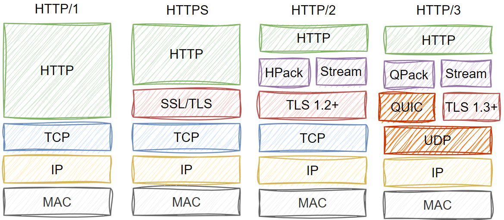
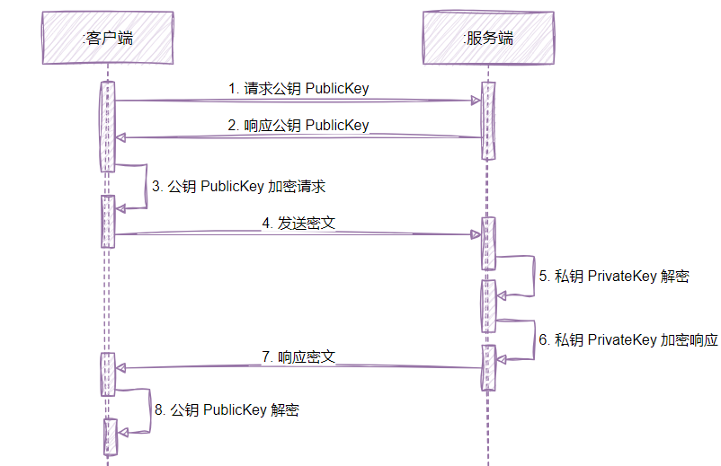
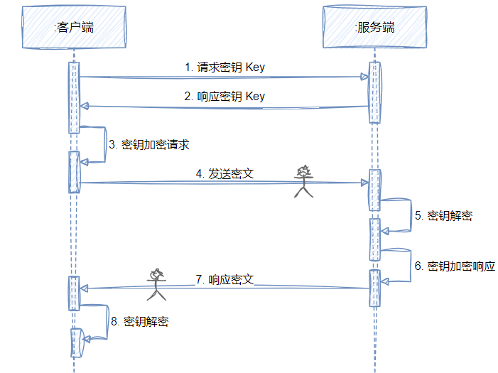
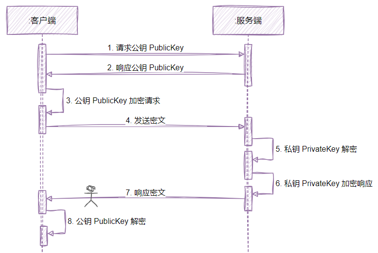
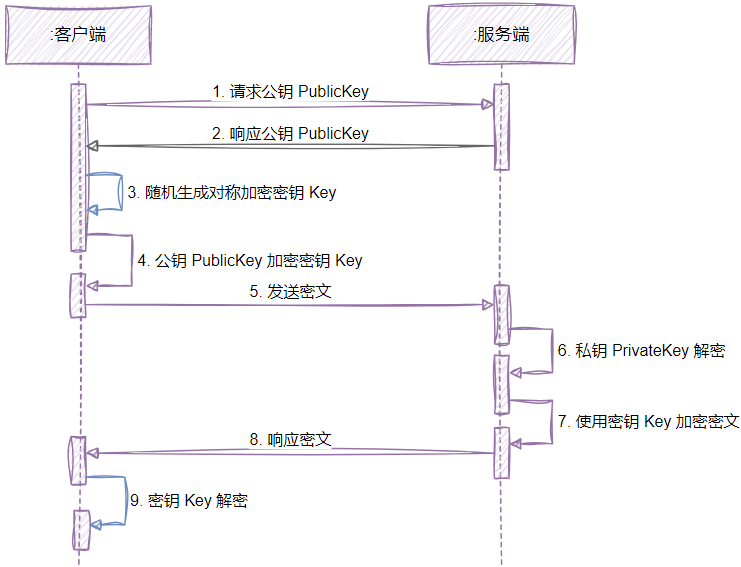
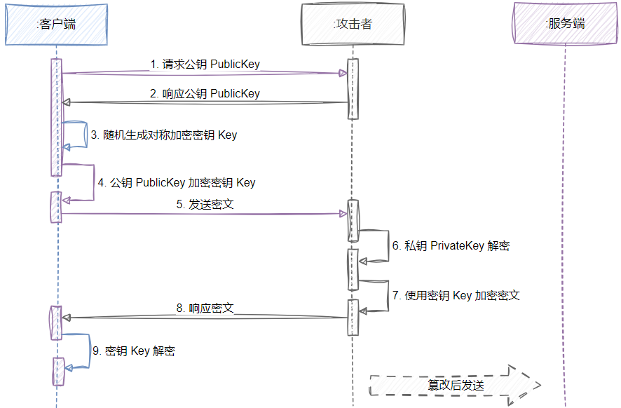
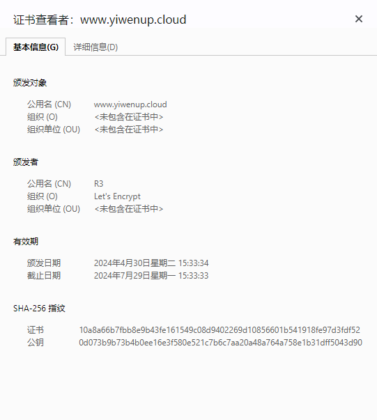

## 一、概述

`HTTPS`并非是应用层一个新的协议，通常`HTTP`直接和`TCP`通信，`HTTPS`则先和安全层`（SSL/TLS）`通信，然后安全层再和`TCP`层通信。

`HTTPS`中的安全层`SSL/TLS`主要做三件事：

- 所有的信息都是加密传输的，第三方无法窃听
- 配备身份验证（服务端程序），防止身份被冒充
- 具有校验机制，一旦被篡改，通信双方会立刻发现

`TLS`全称为传输层安全协议`Transport Layer Security Protocol`，`TLS/SSL`是一种加密通道的规范。由`TLS`记录协议（TLS record Protocol）和`TLS`握手协议（TLS handshake Protocol）这两层协议叠加而成的。

- 记录协议（TLS Record protocol）：TLS记录协议位于TLS握手协议的下层，是负责使用对称密码对消息进行加密通信的部分。加密使用的密钥是通过握手协议在服务器和客户端之间协商决定的
- 握手协议（TLS Handshaking Protocols）：由`TLS Change Ciper Spec Protocol`（密码规格变更协议）和`TLS Alert Protocol`（警告协议）组成。负责在客户端和服务器之间协商决定密码算法和共享密钥。
  - 密码规格变更协议（TLS Change Ciper Spec Protocol）：负责向通信对象传达变更密码方式的信号，当协议中途发生错误时，就会通过警告协议传达给对方。
  - 警告协议（TLS Alert Protocol）：是TLS握手协议负责在发送错误时将错误传达给对方。

## 二、对称/非对称加密

### 2.1 对称加密

> 采用单钥密码系统的加密方法，同一个密钥可以同时用作信息的加密和解密，这种加密方法称为对称加密，也称为单密钥加密。
>
> - 加密：明文 + 密钥 -> 密文
> - 解密：密文 + 密钥 -> 明文
>
> 对称加密通常使用的是相对较小的密钥，一般小于 256 bit。因为密钥越大，加密越强，但加密与解密的过程越慢。如果只用 1 bit来做这个密钥，那黑客们可以先试着用 0 来解密，不行的话就再用 1 解；但如果你的密钥有1 MB大，黑客们可能永远也无法破解，但加密和解密的过程要花费很长的时间。**密钥的大小既要照顾到安全性，也要照顾到效率。**

优点：算法公开、计算量小、加密速度快、加密效率高。

缺点：相对非对称加密不算特别安全，只有一份密钥，密文如果被拦截，且密钥也被劫持，那么信息很容易被破译。

常用算法：

- DES（Data Encryption Standard）：数据加密标准（现在用的比较少，因为它的加密强度不够，能够暴力破解）
- 3DES：原理和DES几乎是一样的，只是使用3个密钥，对相同的数据执行三次加密，增强加密强度。(缺点：要维护3个密钥，大大增加了维护成本)
- AES（Advanced Encryption Standard）：高级加密标准，用来替代原先的DES，目前美国国家安全局使用的，苹果的钥匙串访问采用的就AES加密。是现在公认的最安全的加密方式，是对称密钥加密中最流行的算法。*`AES128`和`AES256`主要区别是密钥长度不同（分别是`128bits`和`256bits`)、加密处理轮数不同（分别是`10`轮，`14`轮），后者强度高于前者*

### 2.2 非对称加密

> 非对称加密算法需要两个密钥：公开密钥（public key） 和私有密钥（private key）。公开密钥和私有密钥是一对。
>
> - 用公开密钥对数据进行加密，只有用对应的私有密钥才能解密
> - 用私有密钥对数据进行加密，只有用对应的公开密钥才能解密

优点：相对对称加密算法更加安全。

缺点：加解密效率相对较低。

常用算法：

- RSA
- DSA
- ECDSA

### 2.3 对称加密组合非对称加密

> 以下分析推导都是基于两点前提出发：
>
> - 客户端具有不可控因素，在整个客户端、服务端体系中是不可信的
> - 客户端和服务端在通信的过程中是无状态的

首先，对于对称加密其实很容易看出，**攻击者只要伪装客户端请求服务端，就能获取到密钥，只要劫持到通信报文，那么就可以通过密钥解密通信密文**，安全问题很大。

其次，对于非对称加密，**客户端向服务端的通信报文很难被解密，因为该报文是公钥加密的，必须得私钥解密，但是私钥攻击者几乎拿不到；但是服务端向客户端通信的报文就很容易被解密，因为此时的报文是私钥加密的，攻击者只要伪装客户端就能拿到公钥，用公钥解密私钥加密的密文就行**。

那么我们接着往下推导，是否有方法能够结合对称加密的效率以及非对称加密的安全，各取精华组合使用呢？

- 我们让客户端在和服务端通信之前，**先协商出一串随机字符，作为后续报文加密的对称加密密钥使用**
- 这个过程需要由客户端生成一串随机密钥，之后向服务端请求公钥，用这个公钥将密钥加密后发送给服务端，由于公钥加密只能私钥解密，因此攻击者在这个过程是没办法窃取随机密钥的
- 服务端拿到密文之后，使用私钥进行解密，得到这个随机密钥，用随机密钥加密一小段信息发送给客户端，客户端使用密钥解密成功，这个过程由于攻击者始终无法窃取到密钥，所以也无法解密密文
- 最终，客户端和服务端协商出这个密钥，作为后续报文对称加密使用

## 三、数字签名和证书

上面我们推导出了一种**对称加密结合非对称加密**的方案，看上去是比较安全的，**解决了攻击者窃听报文的问题**。

但是实际上，攻击者完全可以伪装服务端和客户端通信，形成一种虚假的随机密钥协商，还是能够拿到客户端密钥的，后续再篡改客户端报文，直接攻击服务端。

这些问题的本质实际上是：

1. 真实的客户端和服务端之间，无法校验报文的完整性，不知道是否被中间篡改过
2. 客户端不知道正在通信的是不是真实的服务端，服务端无法证明“我是我”这个问题

因此，`HTTPS`对于上述两点问题分别采用**数字签名**和**证书**来解决。

### 3.1 数字签名

> 数字签名能确定消息确实是由发送方签名并发出来的，因为别人假冒不了发送方的签名，同时能确定消息的完整性,证明数据是否未被篡改过。

- 数字签名生成：将要发送的数据先用`Hash`算法（摘要算法、散列算法）生成消息摘要，然后用发送者的私钥加密生成数字签名，与原文一起传送给接收者。
- 数字签名验证：接收者只有用发送者的公钥才能解密被加密的摘要信息，然后用`Hash`函数对收到的原文产生一个摘要信息，与上一步得到的摘要信息对比。如果相同，则说明收到的信息是完整的，在传输过程中没有被修改，否则说明信息被修改过，因此数字签名能够验证信息的完整性。

常用算法：

- MD(Message Digest)：消息摘要算法
- SHA(Secure Hash Algorithm)：安全散列算法
- MAC(Message Authentication Code)：消息认证码

问题：

整个过程的前提是客户端知道服务器的公钥。问题的关键的是，和消息本身一样，公钥不能在不安全的网络中直接发送给客户端，或者说**拿到的公钥如何证明是服务器的**。此时就需要引入了证书颁发机构（Certificate Authority，简称CA），`CA`数量并不多，客户端内置了所有受信任CA的证书。

### 3.2 证书

> 数字证书是一个经**证书认证结构**数字签名的包含公开密钥、拥有者信息的文件，有点像生活中的身份证、护照等，是由一个官方的证书颁发机构签发的一组数据。这种证书很难伪造，用于使用者的身份证明。
>
> `CA`是证书的签发机构，它是公钥基础设施（Public Key Infrastructure，PKI）的核心。`CA`是负责签发证书、认证证书、管理已颁发证书的机关。
>
> 证书包含以下信息：
>
> 申请者公钥、申请者的组织信息和个人信息、签发机构的信息、有效时间、证书序列号等信息的明文，**同时包含一个`CA`机构的数字签名**。 其中签名的产生算法：首先，使用散列函数计算公开的明文信息的信息摘要，然后，**采用`CA`的私钥对信息摘要进行加密，密文即签名**；

- 客户端向服务端发起一个安全连接的请求，服务端返回经过`CA`认证的数字证书，证书里面包含了服务器的`PublicKey`

- 客户端读取证书中的相关的明文信息，采用相同的散列函数计算得到信息摘要，然后利用对应`CA`的公钥解密签名数据，对比证书的信息摘要，如果一致，则可以确认证书的合法性，即服务器的公开密钥是值得信赖的

- 客户端还会验证证书相关的域名信息、有效时间等信息，并且客户端会内置信任`CA`的证书信息(包含公钥)，如果`CA`不被信任，则找不到对应`CA`的证书，证书也会被判定非法

- *`CA`把自己的`CA`证书集成在了浏览器和操作系统里面。客户端拿到浏览器或者操作系统的时候，已经有了`CA`证书，没有必要通过网络获取，那自然也不存在劫持的问题。*

  

## 四、HTTPS安全原理

### 4.1 TLS 握手过程

1. 客户端给出`TLS`协议版本号、一个客户端生成的随机数（第一个随机数），以及客户端支持的加密方法。**（明文通讯）**
2. 服务端确认双方使用的加密方法，并给出数字证书、以及一个服务器生成的随机数（第二个随机数）。**（明文通讯）**
3. 客户端确认数字证书有效，然后生成一个新的随机数（第三个随机数），并使用数字证书中的公钥加密这个随机数，发给服务器。（使用非对称加密算法）
4. 服务端使用自己的私钥，获取客户端发来的随机数（第三个随机数），**此时双方都有三个一模一样的随机数，前两个是明文发送的，最后客户端生成的是使用证书中的公钥密文发送的**。
5. 客户端和服务端根据约定的加密方法，使用前面的三个随机数经过特定的算法，生成**会话密钥**（session key），用来加密接下来的整个对话过程
6. 客户端和服务端都会第一次使用会话密钥加密一个消息发送给对方

### 4.2 会话恢复

如果客户端和服务端在上面六大步骤握手之后，通信意外断开，再次建立可信的会话成本也是比较高的，因此有`Session ID`和`Session Ticket`两种方式协助重建会话

- `Session ID`的思想很简单，就是每一次对话都有一个编号（session ID）。如果对话中断，下次重连的时候，只要客户端给出这个编号，且服务器有这个编号的记录，双方就可以重新使用已有的会话密钥，而不必重新生成一把。但是在`Session ID`只会在一个服务实例上留存，在目前主流的分布式架构下，如果没有特别指定负载均衡策略，请求一旦去往别的服务实例，那么会话将会验证失败
- `Session Ticket`就是解决分布式部署问题（**但是和浏览器的支持相关**）。客户端不再发送`Session ID`，而是发送在上一次会话过程中服务端提供的`Session Ticket`。这个`Session Ticket`是加密的，只有服务端才能解密，其中包括本次对话的主要信息，比如对话密钥和加密方法。当服务端收到`Session Ticket`后，能解密就不必重新生成会话密钥了

