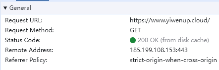
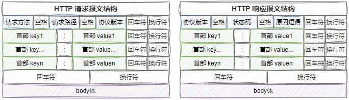

## 一、HTTP报文了解

> HTTP 报文是在 HTTP 应用程序之间发送的数据块（ 用于 HTTP 协议交互的信息）。请求端（客户端）的 HTTP 报文叫做请求报文，响应端（服务器端）的叫做响应报文。

- Remote Address：访问目标URL解析出来的IP地址，443 表示当前https协议
- Referrer Policy： Referrer 表示用户指明当前请求的来源页面，整体 Referrer Policy 表示对于同源的请求，会发送完整的 url 作为引用地址，目的是防盗链

- Accept：表示请求可以支持的响应格式，其中的 q=x 表示优先级权重，未配置的默认优先级最高，等同于 q=1
- Accept-Encoding：告知服务器本地浏览器支持的压缩方式
- Sec-Fetch-Dest：表示浏览器期望获得什么类型的资源
- Sec-Fetch-Mode：navigate，表示这是一个浏览器的页面切换请求
- Sec-Fetch-Site：表示一个请求发起的来源和目标资源来源之间的关系，cross site 为跨域请求，same-origin 为同源请求
- Sec-Fetch-User：?1 表示 true
- Upgrade-Insecure-Requests：1 表示当前浏览器告诉服务器，浏览器是可以处理https请求的，即使访问的https请求中又包含了其他的http请求
- User-Agent：描述浏览器的信息

- Content-Encoding：对应请求头中的 Accept-Encoding 列表中的某一项
- Content-Type：对应请求头中的 Accept 列表中的某一项
- Server：web应用程序部署的容器，比如 Nginx
- Vary：Accept-Encoding，告诉浏览器服务端报文来自边缘 cdn 的压缩策略参照请求头中的 Accept-Encoding

## 二、HTTP报文格式

> HTTP 中将一次完整的请求和响应成为一次 **HTTP 事务**，使用流入（inbound）和流出（outbound）来具体描述 HTTP 事务的处理方向。对应的，所有 HTTP 报文都可以分为两类：请求报文（request message）和响应报文（response message）
>
> HTTP 请求和响应具有相似的结构

-  一行起始行（start line）用于描述要执行的请求，或者是对应的状态，成功或失败，这个起始行总是单行的
- 一个HTTP头（header）集合指明请求或描述消息正文
- 一个空行指示所有关于请求的元数据已经发送完毕
- 一个可选的包含请求相关数据的正文（body），或者响应相关的文档

## 三、HTTP请求

### 3.1 请求起始行

起始行 *(start-line)*包含三个元素：

1.  一个 *HTTP* 方法，一个动词（GET 或者 POST）或者一个名词（HEAD 或者 OPTIONS），描述要执行的动作。 例如，GET 表示要获取资源，POST 表示向服务器推送数据（创建或修改资源）。
2. 请求目标（request target），通常是一个URL，或者是协议、端口和域名的绝对路径，通常以请求的环境为特征。请求的格式因不同的 HTTP 方法而异。它可以是：
   - 一个完整的URL，被称为绝对形式 *（absolute form）*，主要在使用 GET 方法连接到代理时使用。比如：GET https://www.yiwenup.cloud/
   - 由域名和可选端口（以 ':' 为前缀）组成的 URL 的 authority component，称为 *authority form*。 仅在使用 CONNECT 建立 HTTP 隧道时才使用。比如：CONNECT developer.mozilla.org:80 HTTP/1.1
   - 星号形式*（asterisk form）*，一个简单的星号（ '*' ），配合 OPTIONS 方法使用，代表整个服务器。比如：OPTIONS * HTTP/1.1
3. *HTTP* 版本 *(HTTP version*)，定义了剩余报文的结构，作为对期望的响应版本的指示符

### 3.2 请求头

- 不区分大小写的字符串
- 一个 header 的 key 紧跟着冒号（':'）和一个 header 的值

### 3.3 请求体

- 不是所有的请求都有一个 body：例如获取资源的请求，GET，HEAD，DELETE 和 OPTIONS，通常它们不需要 body
- 有些请求将数据发送到服务器以便更新数据：常见的的情况是 POST 请求（包含 HTML 表单数据）

## 四、HTTP响应

### 4.1 状态行

HTTP 响应的起始行被称作 状态行 *(status line)*，包含以下信息：

1.  协议版本，通常为 HTTP/1.1
2. 状态码 *(status code)*，表明请求是成功或失败
3. 状态文本 *(status text)*。一个简短的，纯粹的信息，通过状态码的文本描述，帮助人们理解该 HTTP 消息

### 4.2 响应头

- 不区分大小写的字符串
- 一个 header 的 key 紧跟着冒号（':'）和一个 header 的值

### 4.3 响应体

- 不是所有的响应都有一个 body

## 五、HTTP请求方式

| 方法    | 是否包含Body | 描述                                                         |
| ------- | ------------ | ------------------------------------------------------------ |
| GET     | 否           | 常用于请求服务器某个资源                                     |
| POST    | 是           | 最初是用来向服务器输入数据的。通常会用它来支持表单提交，交给服务端处理 |
| PUT     | 是           | 语义上是请求服务器将请求体中的内容进行创建，如果对应 URL 存在了请求体中的资源，则用请求体中的内容更新替换 |
| DELETE  | 否           | 请求服务器删除 URL 中的所指定的资源                          |
| HEAD    | 否           | HEAD 方法与 GET 方法的行为很类似， 但服务器在响应中只返回首部。 不会返回实体的主体部分。 这就允许客户端在未获取实际资源的情况下， 对资源的首部进行检查 |
| OPTIONS | 否           | OPTIONS 方法请求 Web 服务器告知其支持的各种功能。 可以询问服务器通常支持哪些方法， 或者对某些特殊资源支持哪些方法 |

## 六、HTTP响应状态码
