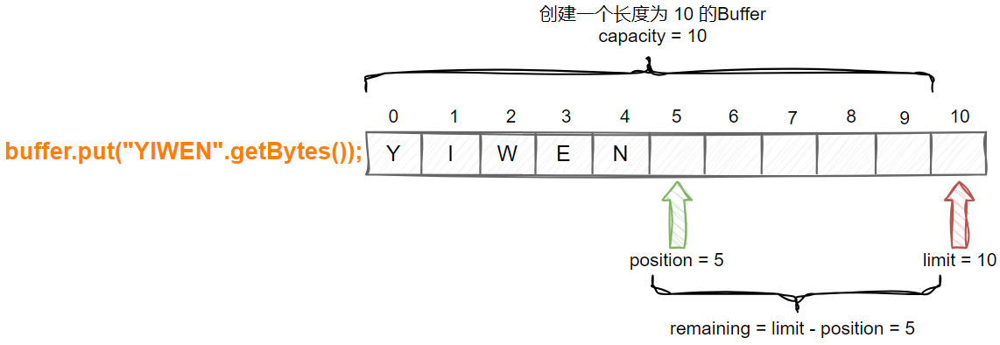
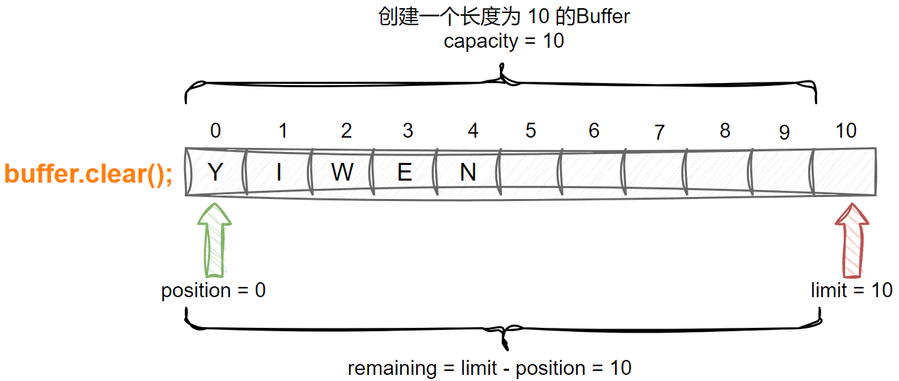

> `Java`共支持三种网络`IO`模型，分别是：BIO（同步阻塞）、NIO（同步非阻塞）、AIO（异步非阻塞）
>
> - 阻塞与非阻塞：指的是线程在访问资源的时候，对于资源未准备就绪的状态，会进行挂起等待直到资源就绪
> - 同步与异步：指的是线程获取资源的机制，可以让资源基于回调的方式，在合适的时机给到处理的线程

## 一、BIO

`BIO`举例就是传统的`Socket`编程，当有客户端请求过来的时候，服务端会为这个请求分配一个线程来做处理，期间这个线程无法做别的事情，即使这个请求没有做任何实际的事情。

`BIO`的问题：

- 每个请求都需要创建独立的线程分配给对应的客户端服务
- 并发数较大时，需要创建大量线程来处理连接，系统资源占用较大
- 连接建立后，如果当前线程暂时没有数据可读，则线程就阻塞在`Read`操作上，造成线程资源浪费

编程示例：

## 二、NIO

`NIO`对于客户端的请求，会先将连接注册在多路复用器上，由多路复用器轮询连接进行派发处理。

`NIO`相对`BIO`：

- `BIO`以流的方式处理数据，而`NIO`以缓冲区的方式处理数据，缓冲区`I/O`的效率比流`I/O`高很多
- `BIO`是阻塞的，`NIO`则是非阻塞的
- `BIO`基于字节流和字符流进行操作，而`NIO`基于`Channel`和`Buffer`进行操作，数据总是从`Channel`读取到`Buffer`中，或者从`Buffer`写入到`Channel`中。`Selector`用于监听多个`Channel`的事件（比如：连接请求， 数据到达等），因此使用单个线程就可以监听多个客户端`Channel`
- `BIO`中流只能是单向的（输入流或输出流），而`NIO`中的`Buffer`是可读可写的，`Channel`也是双向的

`NIO`中核心三大件：`Buffer`、`Channel`和`Selector`。一个线程对应绑定一个`Selector`，一个`Selector`可以承载多个`Channel`的事件注册，`Selector`轮询每一个注册在`Channel`上的事件，会根据不同的事件做不同的处理。`Buffer`底层是一个数组承载网络数据信息。

### 2.1 Buffer

缓冲区本质上是一个可以读写数据的内存块，可以理解成是一个数组，该对象提供了一组方法，可以更轻松地使用内存块，缓冲区对象内置了一些机制，能够跟踪和记录缓冲区的状态变化情况。`Channel`提供从网络读取数据的渠道，但是**读写数据都必须经由`Buffer`**

- `Buffer`通过`allocate`或`wrap`方法创建，前者创建时`postion`指向索引`0`的位置，后者创建时`postion`指向`limit`的位置

  

- 可以通过`put`方法将字节数组添加进`Buffer`，此时`postion`指向的位置会移动，并且`remaining`会同步计算

  

- 通过调用`flip`方法，**切换读模式**。此时`postion`会复位在索引为`0`的位置，而`limit`会指向之前`postion`所指向的索引位置，`remaining`也会同步计算

  

- 通过调用`clear`方法，**切换写模式**。此时`postion`会复位在索引为`0`的位置，而`limit`则会指向`capacity`的索引位置，`remaining`也会同步计算

  

### 2.2 Channel

常用的`Channel`实现类有：FileChannel，DatagramChannel，ServerSocketChannel和SocketChannel。

- FileChannel 用于文件的数据读写
- DatagramChannel 用于 UDP 的数据读写
- ServerSocketChannel 和 SocketChannel 用于 TCP 的数据读写。**ServerSocketChanne 类似 ServerSocket；SocketChannel 类似 Socket**

### 2.3 Selector

Selector 能够检测多个注册的服务端通道上是否有事件发生，如果有事件发生，便获取事件然后针对每个事件进行相应的处理。这样就可以只用一个单线程去管理多个通道，也就是管理多个连接和请求。**只有在通道真正有读写事件发生时，才会进行读写，就大大地减少了系统开销，并且不必为每个连接都创建一个线程，不用去维护多个线程，避免了多线程之间的上下文切换导致的开销**。

### 2.4 编程示例

## 三、AIO

AIO 引入异步通道的概念，采用了 Proactor 模式，简化了程序编写，有效的请求才启动线程，它的特点是先由操作系统完成后才通知服务端程序启动线程去处理，一般适用于连接数较多且连接时间较长的应用

Proactor 模式是一个消息异步通知的设计模式，Proactor 通知的不是就绪事件，而是操作完成事件，这也就是操作系统异步 IO 的主要模型。

## 四、适用场景总结

- `BIO`方式适用于连接数目比较小且固定的架构，这种方式对服务器资源要求比较高，并发局限于应用中，JDK1.4以前的唯一选择，但程序简单易理解
- `NIO`方式适用于连接数目多且连接比较短（轻操作）的架构，比如聊天服务器，弹幕系统，服务器间通讯等。编程比较复杂，JDK1.4 开始支持
- `AIO`方式使用于连接数目多且连接比较长（重操作）的架构，比如相册服务器，充分调用 OS 参与并发操作， 编程比较复杂，JDK7 开始支持。
