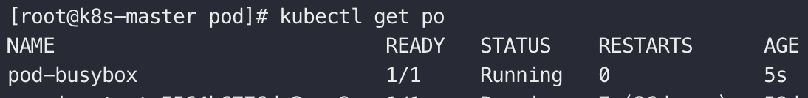
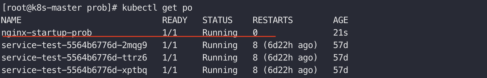
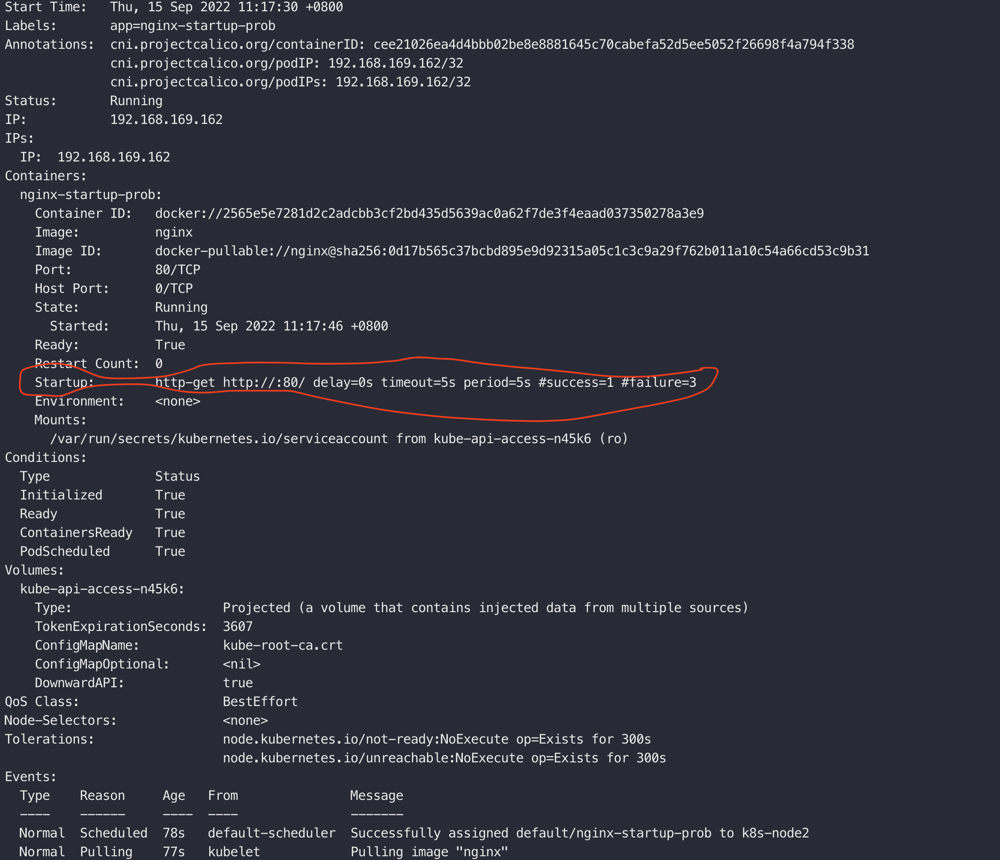
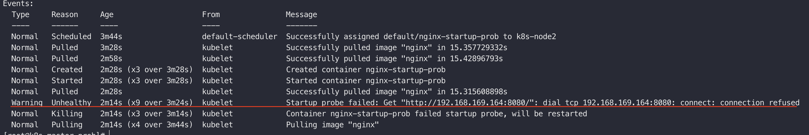
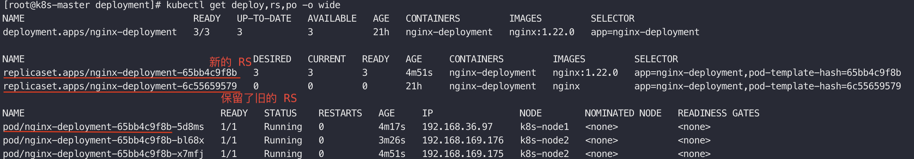
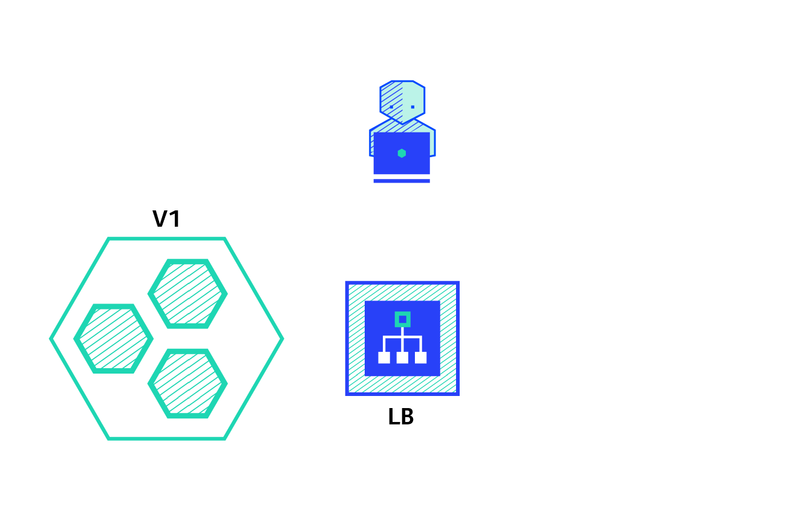

## 一、啥是工作负载

```sh
# 获取 dashboard 登陆令牌
kubectl -n kubernetes-dashboard describe secret $(kubectl -n kubernetes-dashboard get secret | grep admin-user | awk '{print $1}')
```


以上即为工作负载


对于`k8s`来说，`pod`是部署的基本单位，控制着一组`container`，而我们的应用又往往是一组`pod`协同工作的结果，`pod`只是`k8s`意义上的一次部署单位，如何给`pod`赋能，便是其余工作负载需要做的事情了，比如`deployment`通过`replica set`来控制`pod`的期望副本数，以此来保证`pod`在某台机器上出现故障不可用的时候，可以迅速挑选合适的节点再次拉起。

## 二、从 pod 说起

> - pod 是一组容器的集合单位。
>
> - pod 天然就为内部的容器群提供了可共享的网络与存储。
>
> - 通常情况下，我们不直接创建`pod`，而是使用其他工作负载来创建`pod`，使其拥有自愈等能力。
>
> - `pod`中创建的容器一般都会有一个对应的`pause`容器作为`sidecar`为其提供网络能力。`service mesh`便是通过`sidecar`思想进行的服务网格治理。
>
>   
>
>   

### 2.1 编写一个 pod

> 善用`kubectl explain`。

```sh
vim pod-busybox.yaml
```

```yaml
apiVersion: v1
kind: Pod
metadata:
  name: "pod-busybox"
  namespace: default
  labels:
    app: "pod-busybox"
spec:
  containers:
  - name: busybox
    image: "busybox"
    command: 
    - "sh"
    - "-c"
    # 为什要 sleep，因为当前的 busybox 镜像没有阻塞进程，在启动执行命令之后会立马停止
    - "echo hello world!! && sleep 6000" 
```

```sh
kubectl apply -f pod-busybox.yaml
```

```sh
kubectl get po
```



```sh
kubectl logs pod-busybox
```


### 2.2 静态 pod

> - 所谓静态`pod`，就是专门放在`/etc/kubernetes/manifests`目录下的描述文件
> - `kublet`在启动的过程中，会扫描这个目录，把这个目录下的`pod`都启动起来

### 2.3 pod 的生命周期

- 初始化容器
- 应用容器
- 临时容器

### 2.4 pod 的探针机制

> 探针是针对**容器**而言的一种健康检查机制：kubectl explain pod.spec.containers.[startupProbe/livenessProbe/readinessProbe]

> 使用场景：
>
> - `kubelet`使用探针，会主动按照配置给`Pod`里面的所有容器发送响应的探测请求
> - 微服务的健康检查
> - `spring boot`应用的优雅停机

#### 2.4.1 启动探针

> - `kubelet`使用启动探针，来检测应用是否已经启动。
> - 启动探针是一次性探针，用来检测容器是否启动成功，当容器启动成功之后该探针就不再使用了。
> - 在启动探针完成之前，其他的探针不会开始工作。
> - 如果启动探针探测失败，则会重启`pod`。
> - **对于启动过程中需要加载数据、预热缓存的应用容器，启动探针一定要指定，以此来保证容器运行是稳定的。**

1. 首先，按`nginx`镜像编写一个正常的`pod`，启动探针配置为如果能访问当前`pod`的`nginx`则认为启动成功

```yaml
apiVersion: v1
kind: Pod
metadata:
  name: "nginx-startup-prob"
  namespace: default
  labels:
    app: "nginx-startup-prob"
spec:
  containers:
  - name: nginx-startup-prob
    image: "nginx"
    ports:
    - containerPort: 80
    startupProbe:
      # 探测的机制就是访问当前pod ip的nginx
      httpGet:
        port: 80
      # 间隔多少时间探测一次
      periodSeconds: 5
      # 达到成功阈值，认为启动成功
      successThreshold: 1
      # 达到失败阈值，认为启动失败
      failureThreshold: 3
      # 探测超时时间（秒） 
      timeoutSeconds: 5
```





2. 接下来模拟启动失败，将访问的端口修改为当前镜像不暴露的，造成启动探针探测失败，看看现象

```yaml
apiVersion: v1
kind: Pod
metadata:
  name: "nginx-startup-prob"
  namespace: default
  labels:
    app: "nginx-startup-prob"
spec:
  containers:
  - name: nginx-startup-prob
    image: "nginx"
    ports:
    - containerPort: 80
    startupProbe:
      # 探测的机制就是访问当前pod ip的nginx
      httpGet:
        port: 8080 ###################### 调整探针访问端口
      # 间隔多少时间探测一次
      periodSeconds: 5
      # 达到成功阈值，认为启动成功
      successThreshold: 1
      # 达到失败阈值，认为启动失败
      failureThreshold: 3
      # 探测超时时间（秒） 
      timeoutSeconds: 5
```




#### 2.4.2 存活探针

> - `kubelet`使用存活探针，来检测容器是否正常存活。
> - 如果存活探针探测失败，则会重启`pod`。
> - **存活探针经常用来重启一些确实在运行的但是已经出现死锁无法继续服务的容器。**
> - **通常配合属性`initialDelaySeconds`使用，该属性配置如果较大，可能会导致应用一段时间不可用，配置如果较小，则可能会陷入无限重启。**

```yaml
apiVersion: v1
kind: Pod
metadata:
  name: "nginx-liveness-probe"
  namespace: default
  labels:
    app: "nginx-liveness-probe"
spec:
  containers:
  - name: nginx-liveness-probe
    image: "nginx"
    ports:
    - containerPort: 80
    # 启动探针
    startupProbe:
      # 探测的机制就是检测当前容器目录中是否有nginx的index.html
      exec:
        command:
        - "/bin/sh"
        - "-c"
        - "cat /usr/share/nginx/html/index.html"
      # 间隔多少时间探测一次
      periodSeconds: 5
      # 达到成功阈值，认为启动成功
      successThreshold: 1
      # 达到失败阈值，认为启动失败
      failureThreshold: 3
      # 探测超时时间（秒） 
      timeoutSeconds: 5
    # 存活探针
    livenessProbe:
      # 探测的机制就是访问当前pod ip的nginx
      httpGet:
        port: 80
      # 在容器启动多久之后，才开始进行存活探测
      initialDelaySeconds: 20
      # 间隔多少时间探测一次
      periodSeconds: 5
      # 达到成功阈值，认为启动成功
      successThreshold: 1
      # 达到失败阈值，认为启动失败
      failureThreshold: 3
      # 探测超时时间（秒） 
      timeoutSeconds: 5
```

#### 2.4.3 就绪探针

> - `kubelet`使用就绪探针，来检测容器是否准备**好了可以接收流量**。
> - 当一个`Pod`内的所有容器都准备好了，才能把这个`Pod`看作就绪了。
> - **`Service`后端负载均衡多个`Pod`，如果某个`Pod`还没就绪，就会从`service`负载均衡里面剔除。**
> - **就绪探针并不会导致应用的重启。**

```yaml
apiVersion: v1
kind: Pod
metadata:
  name: "nginx-readiness-probe"
  namespace: default
  labels:
    app: "nginx-readiness-probe"
spec:
  containers:
  - name: nginx-readiness-probe
    image: "nginx"
    ports:
    - containerPort: 80
    # 启动探针
    startupProbe:
      # 探测的机制就是检测当前容器目录中是否有nginx的index.html
      exec:
        command:
        - "/bin/sh"
        - "-c"
        - "cat /usr/share/nginx/html/index.html"
      # 间隔多少时间探测一次
      periodSeconds: 5
      # 达到成功阈值，认为启动成功
      successThreshold: 1
      # 达到失败阈值，认为启动失败
      failureThreshold: 3
      # 探测超时时间（秒） 
      timeoutSeconds: 5
    # 存活探针
    livenessProbe:
      # 探测的机制就是访问当前pod ip的nginx
      httpGet:
        port: 80
      # 间隔多少时间探测一次
      periodSeconds: 5
      # 达到成功阈值，认为启动成功
      successThreshold: 1
      # 达到失败阈值，认为启动失败
      failureThreshold: 3
      # 探测超时时间（秒） 
      timeoutSeconds: 5
    # 就绪探针
    readinessProbe:
      # 探测的机制就是访问当前pod ip的nginx
      httpGet:
        port: 80
      # 间隔多少时间探测一次
      periodSeconds: 5
      # 达到成功阈值，认为启动成功
      successThreshold: 1
      # 达到失败阈值，认为启动失败
      failureThreshold: 3
      # 探测超时时间（秒） 
      timeoutSeconds: 5
```

#### 2.4.4 三类探针的关系


## 三、再谈 Deployment

> kubectl explain deployment

> - 一个`Deployment`为一组`Pods`与`ReplicaSets`提供声明式更新能力。即我们可以在`Deployment`中描述一组`Pods`的动态更新副本数量的能力（**扩缩容、自愈、故障转移**），这些能力由`ReplicaSets`提供。
> - **我们只需要在`Deployment`中描述`Pods`的最终状态，`k8s`会通过`Deployment Controller`以受控的速率更改实际状态，以达到期望的状态，是一种最终一致性的设计体现。**

### 3.1 编写一个 deployment

```yaml
apiVersion: apps/v1
kind: Deployment
metadata:
  name:  nginx-deployment
  labels:
    app:  nginx-deployment
spec:
  selector:
    matchLabels:
      app: nginx-deployment
  replicas: 3
  template:
    metadata:
      labels:
        app:  nginx-deployment
    spec:
      containers:
      - name:  nginx-deployment
        image:  nginx
        ports:
        - containerPort:  80
```

通过执行以上`yaml`文件，可以得到：

- `1`个`deploy`：其中`deploy`的名字即描述文件中定义的
- `1`个`rs`：`rs`的名字取`deploy`的名字，再拼接上`pod-template-hash`的一串随机字符
- `3`个`pod`：`pod`的名字取`rs`的名字，再拼接上一串随机字符


由此，我们可以再次明确`deploy`/`rs`/`pod`之间的关系：**`Deployment`控制`RS`，`RS`控制`Pod`的副本数。`RS`只提供了副本数量的控制功能。`Deployment`每部署一个新版本就会创建一个新的副本集，利用他记录状态，回滚也是直接让指定的`RS`生效。**

### 3.2 Deployment 更新

> `Deploy`在每次对`pod template`做了修改之后，都会触发一次更新上线

#### 3.2.1 原理机制

> - 仅当`Deployment`中的`Pod`模板（即 `.spec.template`）发生改变时， 才会触发`Deployment`上线。 其他更新（如对 Deployment 执行扩缩容的操作）不会触发上线动作。
> - **上线动作原理： 创建新的`rs`，准备就绪后，替换旧的`rs`（此时不会删除，因为`deploy.spec.revisionHistoryLimit` 指定了保留几个版本，默认是10）**

```sh
# 通过 kubectl 命令直接修改镜像
# kubectl set image 部署名称 容器名称=新镜像名称
kubectl set image deployment.apps/nginx-deployment nginx-deployment=nginx:1.22.0
```



可以观测到效果：

- 创建了一份新的`rs`，之前的`rs`还在
- 滚动更新了`pod`，总是保证副本数量的`25%`可用，直到最终全部更新成新的镜像的`pod`

```sh
# 其他的一些命令

############ 查看上线状态 #############
kubectl rollout status <deployment的名字>

########### 查看历史变更记录 ###########
kubectl rollout history <deployment的名字>
######### 会滚到某次历史变更记录 ########
kubectl rollout undo <deployment的名字> --to-revision=<REVISION编号>

############### 累计更新 ##############
# 暂停记录版本
kubectl rollout pause <deployment的名字>
# 中间有多次的更新操作......
# 让多次累计生效
kubectl rollout resume deployment.v1.apps/nginx-deployment
```

#### 3.2.2 滚动升级 - 比例缩放



> **比例缩放要解决的事情，是在`deployment`应用滚动升级的过程中，要保证当前应用仍然能够对外提供服务。**
>
> 涉及了两个配置参数：
>
> - `maxSurge`：最大增量，可以是数字也可以是百分比，默认是 25%。
> - `maxUnavailable`：最大不可用量，可以是数字也可以是百分比，默认是 25%。

参考如下示例，构造了一次部署，共`10`个副本数：

```yaml
apiVersion: apps/v1
kind: Deployment
metadata:
  name:  rollup-nginx-deploy
  namespace: default
  labels:
    app:  rollup-nginx-deploy
spec:
  selector:
    matchLabels:
      app: rollup-nginx-deploy
  replicas: 10
  strategy:
    rollingUpdate:
      maxSurge: 30%
      maxUnavailable: 20%
    type: RollingUpdate
  template:
    metadata:
      labels:
        app:  rollup-nginx-deploy
    spec:
      containers:
      - name:  rollup-nginx-deploy
        image: nginx
```

部署完成后，当前集群状态如下图：


当对`deployment`做出了更新的时候（比如说镜像升级），可以观测到**滚动升级**过程。总是保证（1-80%）的可用；且总是保证会有（30%）是在创建，当某个`pod`创建完成时，会随即将一个旧的`pod`进行`Terminaling`，之后再拉起一个`pod`的创建。


#### 3.2.3 动态扩缩容（HPA）


> HPA（HorizontalPodAutoscaler），即动态扩缩容。该能力借助于一些性能探测组件，当`k8s`发现当前工作负责需要更多的资源才可以支撑正常工作时，便会自动对资源扩缩。
>
> HPA 是水平扩缩容的一种策略，通过补充`pod`来分担压力。此外还有一些其他的策略是垂直方向的，通过为`pod`分配更多的`cpu`等资源实现。

1. 首先需要安装 [metrics-server](https://github.com/kubernetes-sigs/metrics-server)，我们集群可以通过`metrics-server`感知工作负载的压力。参照官方文档，下载部署文件

   ```sh
   wget https://github.com/kubernetes-sigs/metrics-server/releases/latest/download/components.yaml
   ```

2. 查看文件内容，看看是否有镜像之类的，国内环境一般可能无法下载到镜像，建议自己找渠道把镜像下载好，方便复用的话最好上传到阿里云

   ```yaml
   apiVersion: v1
   kind: ServiceAccount
   metadata:
     labels:
       k8s-app: metrics-server
     name: metrics-server
     namespace: kube-system
   ---
   apiVersion: rbac.authorization.k8s.io/v1
   kind: ClusterRole
   metadata:
     labels:
       k8s-app: metrics-server
       rbac.authorization.k8s.io/aggregate-to-admin: "true"
       rbac.authorization.k8s.io/aggregate-to-edit: "true"
       rbac.authorization.k8s.io/aggregate-to-view: "true"
     name: system:aggregated-metrics-reader
   rules:
   - apiGroups:
     - metrics.k8s.io
     resources:
     - pods
     - nodes
     verbs:
     - get
     - list
     - watch
   ---
   apiVersion: rbac.authorization.k8s.io/v1
   kind: ClusterRole
   metadata:
     labels:
       k8s-app: metrics-server
     name: system:metrics-server
   rules:
   - apiGroups:
     - ""
     resources:
     - nodes/metrics
     verbs:
     - get
   - apiGroups:
     - ""
     resources:
     - pods
     - nodes
     verbs:
     - get
     - list
     - watch
   ---
   apiVersion: rbac.authorization.k8s.io/v1
   kind: RoleBinding
   metadata:
     labels:
       k8s-app: metrics-server
     name: metrics-server-auth-reader
     namespace: kube-system
   roleRef:
     apiGroup: rbac.authorization.k8s.io
     kind: Role
     name: extension-apiserver-authentication-reader
   subjects:
   - kind: ServiceAccount
     name: metrics-server
     namespace: kube-system
   ---
   apiVersion: rbac.authorization.k8s.io/v1
   kind: ClusterRoleBinding
   metadata:
     labels:
       k8s-app: metrics-server
     name: metrics-server:system:auth-delegator
   roleRef:
     apiGroup: rbac.authorization.k8s.io
     kind: ClusterRole
     name: system:auth-delegator
   subjects:
   - kind: ServiceAccount
     name: metrics-server
     namespace: kube-system
   ---
   apiVersion: rbac.authorization.k8s.io/v1
   kind: ClusterRoleBinding
   metadata:
     labels:
       k8s-app: metrics-server
     name: system:metrics-server
   roleRef:
     apiGroup: rbac.authorization.k8s.io
     kind: ClusterRole
     name: system:metrics-server
   subjects:
   - kind: ServiceAccount
     name: metrics-server
     namespace: kube-system
   ---
   apiVersion: v1
   kind: Service
   metadata:
     labels:
       k8s-app: metrics-server
     name: metrics-server
     namespace: kube-system
   spec:
     ports:
     - name: https
       port: 443
       protocol: TCP
       targetPort: https
     selector:
       k8s-app: metrics-server
   ---
   apiVersion: apps/v1
   kind: Deployment
   metadata:
     labels:
       k8s-app: metrics-server
     name: metrics-server
     namespace: kube-system
   spec:
     selector:
       matchLabels:
         k8s-app: metrics-server
     strategy:
       rollingUpdate:
         maxUnavailable: 0
     template:
       metadata:
         labels:
           k8s-app: metrics-server
       spec:
         # 声明当前镜像获取方式通过私有仓库，secret 已创建在当前 namespace 下（kube-system）
         # kubectl create secret -n kube-system docker-registry repo-aliyun   --docker-server=registry.cn-hangzhou.aliyuncs.com   --docker-username=市民小朱   --docker-password=xxx
         imagePullSecrets:
         - name: repo-aliyun
         containers:
         - args:
           # 非线上环境，仅作学习，通过添加参数 --kubelet-insecure-tls 来禁用证书校验
           - --kubelet-insecure-tls
           - --cert-dir=/tmp
           - --secure-port=4443
           - --kubelet-preferred-address-types=InternalIP,ExternalIP,Hostname
           - --kubelet-use-node-status-port
           - --metric-resolution=15s
           # 调整本次部署的镜像地址，取自本人自己的镜像源
           image: registry.cn-hangzhou.aliyuncs.com/yiwenup/metrics-server:v0.6.1
           imagePullPolicy: IfNotPresent
           livenessProbe:
             failureThreshold: 3
             httpGet:
               path: /livez
               port: https
               scheme: HTTPS
             periodSeconds: 10
           name: metrics-server
           ports:
           - containerPort: 4443
             name: https
             protocol: TCP
           readinessProbe:
             failureThreshold: 3
             httpGet:
               path: /readyz
               port: https
               scheme: HTTPS
             initialDelaySeconds: 20
             periodSeconds: 10
           resources:
             requests:
               cpu: 100m
               memory: 200Mi
           securityContext:
             allowPrivilegeEscalation: false
             readOnlyRootFilesystem: true
             runAsNonRoot: true
             runAsUser: 1000
           volumeMounts:
           - mountPath: /tmp
             name: tmp-dir
         nodeSelector:
           kubernetes.io/os: linux
         priorityClassName: system-cluster-critical
         serviceAccountName: metrics-server
         volumes:
         - emptyDir: {}
           name: tmp-dir
   ---
   apiVersion: apiregistration.k8s.io/v1
   kind: APIService
   metadata:
     labels:
       k8s-app: metrics-server
     name: v1beta1.metrics.k8s.io
   spec:
     group: metrics.k8s.io
     groupPriorityMinimum: 100
     insecureSkipTLSVerify: true
     service:
       name: metrics-server
       namespace: kube-system
     version: v1beta1
     versionPriority: 100
   ```

3. 变更`components.yaml`后，创建部署

   ```sh
   kubectl apply -f components.yaml
   ```

4. 测试命令查看指标信息

   ```sh
   kubectl top nodes --use-protocol-buffers
   ```

   ```sh
   kubectl top pods --use-protocol-buffers
   ```

5. 包括登陆`dashboard`也可以查看到更多的仪表盘信息

   

6. 基于`metrics-server`进行`hpa`扩缩容测试，

#### 3.2.4 金丝雀升级

