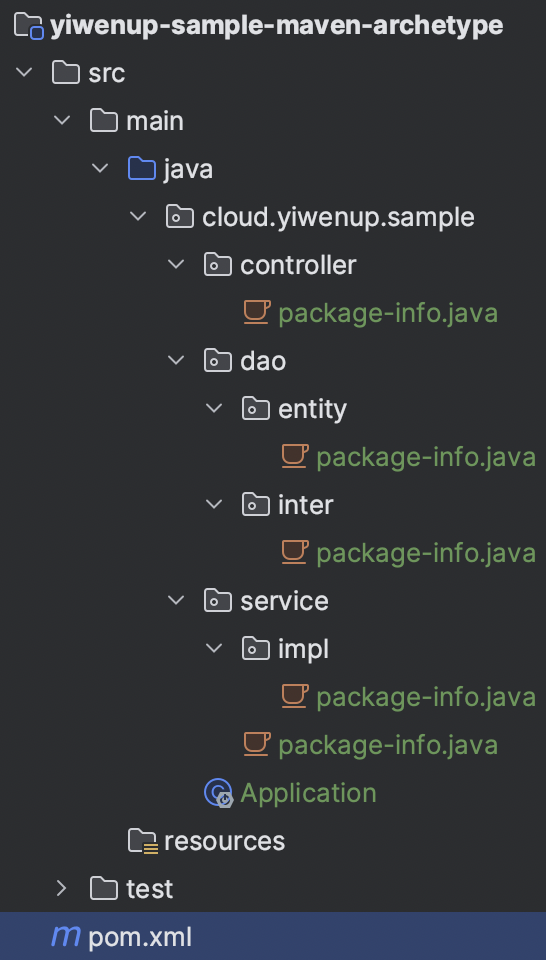
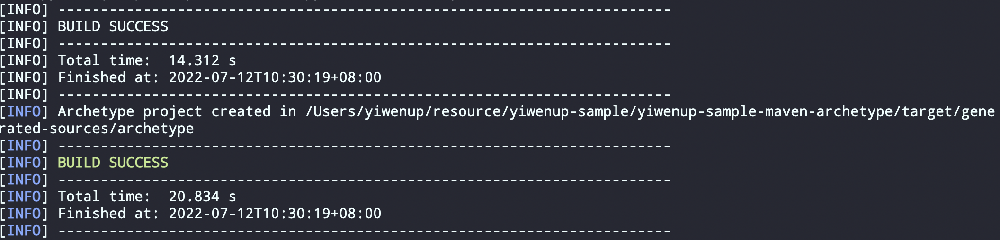
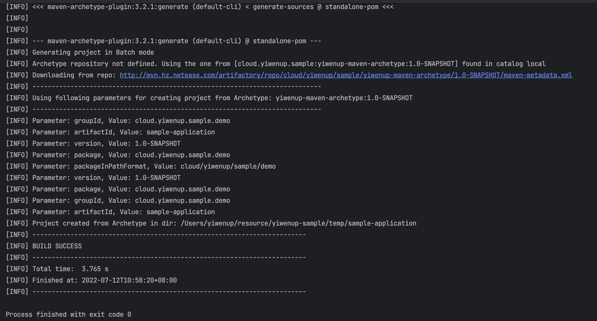

## 一、自定义 Maven 骨架

> `Maven`骨架带来的好处就是在微服务盛行的当下，每个服务的依赖都是大体相同的，比如`JavaWeb`项目通常基于`Spring`生态，那么如果采用`Maven`进行依赖管理的话，每个项目引入的依赖其实都差不多，而且在统一规范下，微服务的目录结构也应该是一致的。
>
> 所以如果每次创建微服务都要重复这个建立项目、配置依赖、创建目录结构等这些重复的步骤是不必要的，我们可以根据自己团队的使用习惯，统一定制属于自己的`Maven`项目骨架，每出现一个微服务的开发需求时，都应该基于骨架直接建立项目。另一方面，使用骨架工程，我们还可以更方便的将其接入流水线，实现项目基于骨架创建，直接推送给仓库。

### 1.1 初始化骨架项目

> 骨架项目是指一套适用当前团队的项目代码，其中应该包含通常的依赖、常用配置文件以及配置内容、普遍能接受的代码层级与目录风格。


这是新初始化的一套项目，其中还没有添加任何的代码，也没有划分任何的包层级关系，没有引用任何依赖

### 1.2 定制骨架项目

- 添加依赖（其中最核心的是`maven-archetype-plugin`依赖）

  ```xml
  <?xml version="1.0" encoding="UTF-8"?>
  <project xmlns="http://maven.apache.org/POM/4.0.0"
           xmlns:xsi="http://www.w3.org/2001/XMLSchema-instance"
           xsi:schemaLocation="http://maven.apache.org/POM/4.0.0 http://maven.apache.org/xsd/maven-4.0.0.xsd">
      <modelVersion>4.0.0</modelVersion>
  
      <groupId>cloud.yiwenup.sample</groupId>
      <artifactId>yiwenup-sample-maven-archetype</artifactId>
      <version>1.0-SNAPSHOT</version>
  
      <packaging>jar</packaging>
  
      <dependencyManagement>
          <dependencies>
              <!-- Spring Boot Bom -->
              <dependency>
                  <groupId>org.springframework.boot</groupId>
                  <artifactId>spring-boot-dependencies</artifactId>
                  <version>2.6.7</version>
                  <scope>import</scope>
                  <type>pom</type>
              </dependency>
          </dependencies>
      </dependencyManagement>
  
      <dependencies>
          <dependency>
              <groupId>org.springframework.boot</groupId>
              <artifactId>spring-boot-starter-web</artifactId>
              <exclusions>
                  <exclusion>
                      <groupId>org.springframework.boot</groupId>
                      <artifactId>spring-boot-starter-logging</artifactId>
                  </exclusion>
              </exclusions>
          </dependency>
  
          <dependency>
              <groupId>org.springframework.boot</groupId>
              <artifactId>spring-boot-starter-log4j2</artifactId>
          </dependency>
  
          <dependency>
              <groupId>org.projectlombok</groupId>
              <artifactId>lombok</artifactId>
              <optional>true</optional>
          </dependency>
  
          <!-- region 常用工具依赖 -->
          <dependency>
              <groupId>com.google.guava</groupId>
              <artifactId>guava</artifactId>
              <version>31.1-jre</version>
          </dependency>
          <dependency>
              <groupId>cn.hutool</groupId>
              <artifactId>hutool-all</artifactId>
              <version>5.8.3</version>
          </dependency>
          <!-- endregion -->
      </dependencies>
  
      <build>
          <plugins>
  
              <!-- region 【骨架工程核心插件】 -->
              <plugin>
                  <groupId>org.apache.maven.plugins</groupId>
                  <artifactId>maven-archetype-plugin</artifactId>
                  <version>3.2.1</version>
              </plugin>
              <!-- endregion -->
  
              <plugin>
                  <groupId>org.apache.maven.plugins</groupId>
                  <artifactId>maven-compiler-plugin</artifactId>
                  <version>3.10.1</version>
                  <configuration>
                      <source>1.8</source>
                      <target>1.8</target>
                      <encoding>UTF-8</encoding>
                  </configuration>
              </plugin>
          </plugins>
      </build>
  
  </project>
  ```

- 划分目录（此处按流行的`MVC`三层风格）

  

- 新增配置文件

  

- 添加骨架模板规则描述文件`archetype.properties`

  ```properties
  archetype.groupId=cloud.yiwenup.sample
  archetype.artifactId=yiwenup-maven-archetype
  archetype.version=1.0-SNAPSHOT
  # 需要采用template解析和替换本配置文件定义的参数的文件
  #archetype.filteredExtensions=java,properties,xml,yml
  archetype.filteredExtensions=java,xml
  
  # 需要忽略的文件
  excludePatterns=*.iml,.idea,.gitignore,.mvn
  ```

### 1.3 生成代码骨架

> 在前面的步骤，我们准备好了骨架工程，接下来就是将这个工程做成代码骨架

1. 进入到工程的根目录

   

2. 执行命令，进行骨架结构生成

   ```bash
   mvn clean archetype:create-from-project -s <maven的setting.xml文件位置>
   ```

   

3. 将骨架代码安装到本地`maven`仓库

   > 根据上述提示，我们已经使用命令将骨架代码生成到了`/Users/yiwenup/resource/yiwenup-sample/yiwenup-sample-maven-archetype/target/generated-sources/archetype`位置，我们进入到该位置，将骨架进行安装

   ```bash
   maven clean install -DskipTests -fae
   # -DskipTests：编译测试代码但是跳过测试
   # -fae：fail at end
   ```

   

   

4. 至此，`maven`项目自定义骨架就已经安装完成。

## 二、新建 Maven 项目用于测试

> 基于之前安装好的骨架，我们通过`java`代码的方式运用其直接生成项目

### 2.1 新建 Maven 项目用于测试

```xml
<?xml version="1.0" encoding="UTF-8"?>
<project xmlns="http://maven.apache.org/POM/4.0.0"
         xmlns:xsi="http://www.w3.org/2001/XMLSchema-instance"
         xsi:schemaLocation="http://maven.apache.org/POM/4.0.0 http://maven.apache.org/xsd/maven-4.0.0.xsd">
    <modelVersion>4.0.0</modelVersion>

    <groupId>cloud.yiwenup.sample</groupId>
    <artifactId>yiwenup-sample-maven-archetype-generator</artifactId>
    <version>1.0-SNAPSHOT</version>

    <build>
        <plugins>
            <plugin>
                <groupId>org.apache.maven.plugins</groupId>
                <artifactId>maven-compiler-plugin</artifactId>
                <version>3.10.1</version>
                <configuration>
                    <source>8</source>
                    <target>8</target>
                    <encoding>UTF-8</encoding>
                </configuration>
            </plugin>
        </plugins>
    </build>

</project>
```

### 2.2 引入依赖

```xml
<!-- maven 客户端工具 -->
<dependency>
    <groupId>org.apache.maven.shared</groupId>
    <artifactId>maven-invoker</artifactId>
    <version>3.0.1</version>
</dependency>
```

### 2.3 编写代码

```java
package cloud.yiwenup.sample.maven.archetype.generator;

import org.apache.maven.shared.invoker.DefaultInvocationRequest;
import org.apache.maven.shared.invoker.DefaultInvoker;
import org.apache.maven.shared.invoker.InvocationResult;
import org.apache.maven.shared.invoker.Invoker;
import org.apache.maven.shared.invoker.InvokerLogger;
import org.apache.maven.shared.invoker.MavenInvocationException;
import org.apache.maven.shared.invoker.PrintStreamLogger;
import org.apache.maven.shared.utils.io.FileUtils;

import java.io.File;
import java.io.IOException;
import java.util.Arrays;

/**
 * 文件描述
 *
 * @Project yiwenup-sample
 * @Package cloud.yiwenup.sample.maven.archetype.generator
 * @Author yiwenup
 * @Date 2022-07-12 10:50:32
 * @Description
 */
public class TestGenerator {

    /**
     * 项目所属组织 - 低码平台是通过配置方式
     */
    public static final String PROJECT_GROUP = "cloud.yiwenup.sample.demo";

    /**
     * 项目名称 - 低码平台是通过配置方式
     */
    public static final String PROJECT_NAME = "sample-application";

    public static void main(String[] args) {

        // region 创建在骨架工程同级创建临时目录 2022/7/7
        String parent = new File("/Users/yiwenup/resource/yiwenup-sample/yiwenup-sample-maven-archetype").getParent();
        File genTempDirectory = new File(parent, "temp");
        boolean mkdirs = genTempDirectory.mkdirs();
        if (!mkdirs) {
            System.out.println("临时目录已存在，跳过创建");
        }
        // endregion

        // region 在临时目录下新建项目目录 2022/7/7
        File file = new File(genTempDirectory, PROJECT_NAME);
        // 如果之前创建过项目目录，则删除
        if (file.exists()) {
            try {
                FileUtils.forceDelete(file);
            } catch (IOException e) {
                e.printStackTrace();
            }
        }
        // endregion

        // region 准备环境信息 2022/7/7
        String mavenHome = System.getenv("MAVEN_HOME");
        String localRepo = mavenHome + "/localRepo";
        // endregion

        // region 构建 Maven 运行参数 2022/7/7
        DefaultInvocationRequest request = new DefaultInvocationRequest();
        request.setGoals(Arrays.asList("archetype:generate",
                "--batch-mode",
                "-DarchetypeGroupId=cloud.yiwenup.sample",
                "-DarchetypeArtifactId=yiwenup-maven-archetype",
                "-DarchetypeVersion=1.0-SNAPSHOT",
                "-DarchetypeCatalog=local",
                "-DgroupId=" + PROJECT_GROUP,
                "-DartifactId=" + PROJECT_NAME
        ));
        // 表示当前命令运行在临时目录下
        request.setBaseDirectory(genTempDirectory);

        // 设置 Maven 仓库位置
        request.setLocalRepositoryDirectory(new File(localRepo));
        // endregion

        // region 准备 Maven 命令执行器 2022/7/7
        StringBuilder errorMsgBuilder = new StringBuilder();
        Invoker invoker = new DefaultInvoker();
        invoker.setLogger(new PrintStreamLogger(System.err, InvokerLogger.ERROR));
        invoker.setOutputHandler(line -> errorMsgBuilder.append("\n").append(line));
        invoker.setErrorHandler(line -> errorMsgBuilder.append("\n").append(line));
        invoker.setMavenHome(new File(mavenHome));
        // endregion

        // region 执行 2022/7/7
        InvocationResult invocationResult = null;
        boolean isSuccess = false;
        try {
            invocationResult = invoker.execute(request);
            isSuccess = invocationResult.getExitCode() == 0;
        } catch (MavenInvocationException e) {
            e.printStackTrace();
        }

        if (!isSuccess) {
            System.out.println("create app:{} project error with exist code: " + invocationResult.getExitCode());
        }

        System.out.println(errorMsgBuilder);
        // endregion
    }
}
```



至此，可以通过`main`方法的运行直接生成自定义骨架的项目