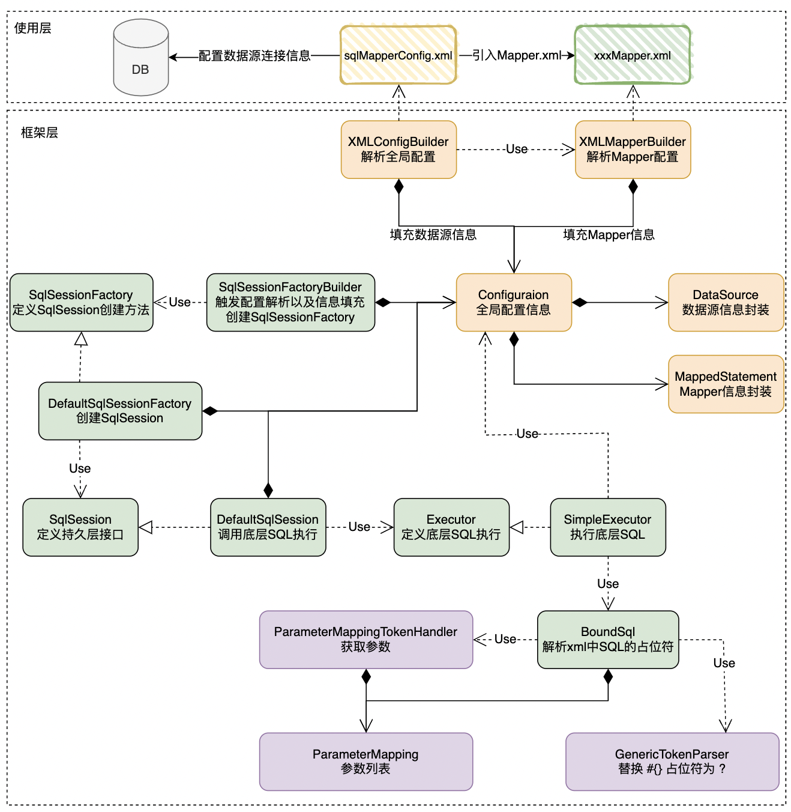
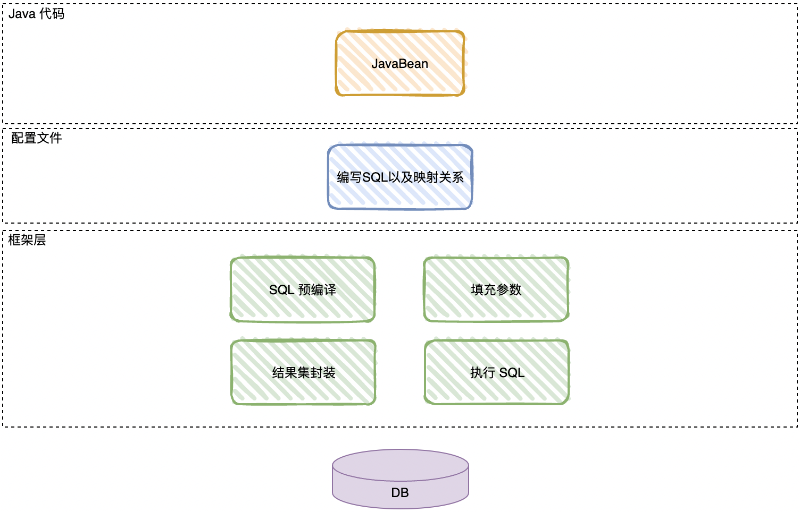
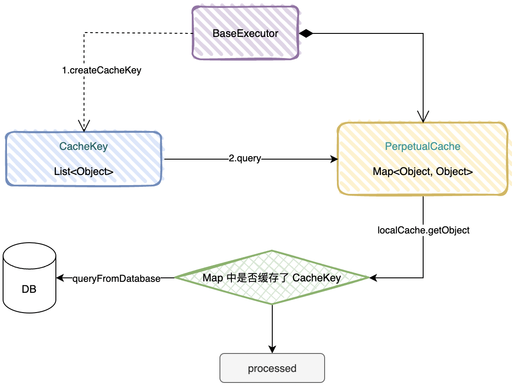
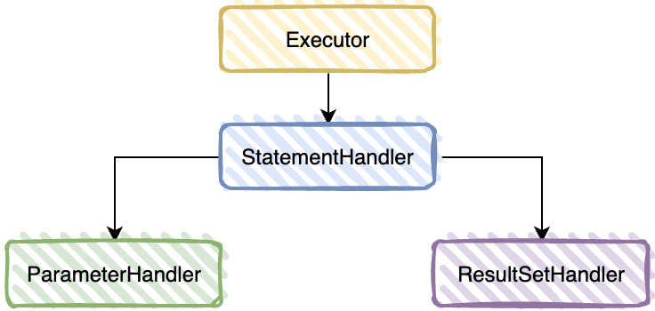

## 一、JDBC 操作数据库

> 知其然，更要知其所以然。在学习 Mybatis 框架之前，首先需要了解该框架的前世今生。持久层框架出现之前，通常的做法是通过 JDBC 进行数据库操作。

### 1.1 使用 JDBC 示例

1. 建立测试项目，组织 maven 依赖。

   ```xml
   <?xml version="1.0" encoding="UTF-8"?>
   <project xmlns="http://maven.apache.org/POM/4.0.0"
            xmlns:xsi="http://www.w3.org/2001/XMLSchema-instance"
            xsi:schemaLocation="http://maven.apache.org/POM/4.0.0 http://maven.apache.org/xsd/maven-4.0.0.xsd">
       <modelVersion>4.0.0</modelVersion>
   
       <groupId>cloud.yiwenup</groupId>
       <artifactId>yiwenup-sample-mybatis</artifactId>
       <version>1.0-SNAPSHOT</version>
   
       <properties>
           <project.java.version>1.8</project.java.version>
           <project.charset.encoding>UTF-8</project.charset.encoding>
   
           <mysql.version>8.0.28</mysql.version>
   
           <maven.plugin.version>3.10.1</maven.plugin.version>
       </properties>
   
       <dependencies>
           <dependency>
               <groupId>mysql</groupId>
               <artifactId>mysql-connector-java</artifactId>
               <version>${mysql.version}</version>
           </dependency>
       </dependencies>
   
       <build>
           <plugins>
               <plugin>
                   <groupId>org.apache.maven.plugins</groupId>
                   <artifactId>maven-compiler-plugin</artifactId>
                   <version>${maven.plugin.version}</version>
                   <configuration>
                       <source>${project.java.version}</source>
                       <target>${project.java.version}</target>
                       <testSource>${project.java.version}</testSource>
                       <testTarget>${project.java.version}</testTarget>
                       <encoding>${project.charset.encoding}</encoding>
                   </configuration>
               </plugin>
           </plugins>
       </build>
   
   </project>
   ```

2. 使用 JDBC 操作数据库

   ```java
   /**
    * 文件描述
    *
    * @Project yiwenup-sample
    * @Package cloud.yiwenup.sample.jdbc
    * @Author yiwenup
    * @Date 2022-06-08 09:05:23
    * @Description JDBC方式操作数据库
    */
   public class JdbcDemo {
       public static void main(String[] args) {
           Connection connection = null;
           PreparedStatement preparedStatement = null;
           ResultSet resultSet = null;
           try {
               // region 加载数据库驱动
               Class.forName("com.mysql.cj.jdbc.Driver");
               // endregion
   
               // region 连接数据源
               connection = DriverManager.getConnection("url", "username", "password");
               // endregion
   
               // region 定义SQL语句
               String sql = "select * from staff where staff_id = ?";
               // endregion
   
               // region 预编译SQL
               preparedStatement = connection.prepareStatement(sql);
               // 设置参数，第一个参数为sql语句中参数的序号(从1开始)，第二个参数为设置的参数值
               preparedStatement.setString(1, "staff1");
               // endregion
   
               // region 执行SQL，获取数据集
               resultSet = preparedStatement.executeQuery();
               // endregion
   
               // region 遍历结果集封装数据模型
               List<Staff> staffList = new ArrayList<>();
               while (resultSet.next()) {
                   Staff staff = new Staff();
                   staff.setId(String.valueOf(resultSet.getInt("id")));
                   staff.setStaffId(resultSet.getString("staff_id"));
                   staff.setStaffName(resultSet.getString("staff_name"));
                   staff.setDescription(resultSet.getString("description"));
                   staffList.add(staff);
               }
               // endregion
   
               staffList.forEach(System.out::println);
           } catch (Exception e) {
               e.printStackTrace();
           } finally {
               // region 释放资源
               try {
                   if (resultSet != null) {
                       resultSet.close();
                   }
                   if (preparedStatement != null) {
                       preparedStatement.close();
                   }
                   if (connection != null) {
                       connection.close();
                   }
               } catch (Exception e) {
                   e.printStackTrace();
               }
               // endregion
           }
       }
   
       static class Staff {
           private String id;
           private String staffId;
           private String staffName;
           private String description;
   		
           // 省略 get/set/toString...
       }
   }
   ```

### 1.2 使用 JDBC 的缺点

1. 数据连接频繁创建释放，消耗系统资源，影响性能
2. SQL 语句嵌入在实际代码中，包括查询条件也是嵌入在代码中的，硬编码方式不利于扩展，可维护性差
3. 结果集数据提取之后还需要认为封装对象，操作繁琐

### 1.3 改进思路

1. 使用数据库连接池初始化连接资源
2. 将 SQL 语句从代码中进行抽取，解耦出来，单独放在 XML 中定义
3. 使用反射技术，将结果集根据属性映射，自动填充到目标模型上

## 二、自定义持久层框架

使用组合模式、建造者模式、工厂模式、代理模式实现。



使用层只需要建立全局的配置，添加数据源的连接信息，具体数据层的映射文件路径，之后再独立写各个数据层的映射文件即可。

```xml
<!-- sqlMapperConfig.xml -->
<?xml version="1.0" encoding="UTF-8" ?>
<configuration>
    <jdbc>
        <property name="driver" value="com.mysql.cj.jdbc.Mysql"/>
        <property name="url" value="url"/>
        <property name="username" value="username"/>
        <property name="password" value="password"/>
    </jdbc>
    <mappers>
        <mapper resource="userMapper.xml"/>
        <mapper resource="staffMapper.xml"/>
    </mappers>
</configuration>
```

```xml
<!-- staffMapper.xml -->
<?xml version="1.0" encoding="UTF-8" ?>
<mapper namespace="Staff">
    <select id="selectList" paramType="java.lang.String" resType="cloud.yiwenup.sample.entity.Staff">
        select * from staff where staff_name = #{staffName}
    </select>
</mapper>
```

框架层会使用`dom4j`解析以上配置文件，并将解析内容封装到`Configuration`和`MappedStatement`中，使用`SqlSessionFactory`创建`SqlSession`，`SqlSession`中定义了`CRUD`方法，具体的实现将交由`Execuor`进行数据连接获取，`SQL`解析以及预编译、执行、结果集反射封装。

## 三、走进 Mybatis

Mybatis 是一款优秀的半自动化 ORM 框架，它支持定制化 SQL，存储过程以及高级映射。Mybatis 原先是 apache 的一个开源项目 ibatis，之后迁入 Google Code 旗下，在 ibatis 3.x 版本正式更名为 Mybatis。Mybatis 对于开发人员来说，SQL 和 java 代码解耦，功能边界明确，Java 代码专注业务，而 xml 中配置的 SQL 可以专注数据。



## 四、Mybatis 入门使用

### 4.1 准本工作

1. 搭建项目，组织 maven 依赖

   ```xml
   <?xml version="1.0" encoding="UTF-8"?>
   <project xmlns="http://maven.apache.org/POM/4.0.0"
            xmlns:xsi="http://www.w3.org/2001/XMLSchema-instance"
            xsi:schemaLocation="http://maven.apache.org/POM/4.0.0 http://maven.apache.org/xsd/maven-4.0.0.xsd">
       <modelVersion>4.0.0</modelVersion>
   
       <groupId>cloud.yiwenup</groupId>
       <artifactId>yiwenup-sample-mybatis</artifactId>
       <version>1.0-SNAPSHOT</version>
   
       <properties>
           <project.java.version>1.8</project.java.version>
           <project.charset.encoding>UTF-8</project.charset.encoding>
   
           <mysql.version>8.0.28</mysql.version>
           <mybatis.version>3.5.9</mybatis.version>
           <junit.version>4.12</junit.version>
           <log4j.version>1.2.12</log4j.version>
   
           <maven.plugin.version>3.10.1</maven.plugin.version>
       </properties>
   
       <dependencies>
           <dependency>
               <groupId>org.mybatis</groupId>
               <artifactId>mybatis</artifactId>
               <version>${mybatis.version}</version>
           </dependency>
           <dependency>
               <groupId>mysql</groupId>
               <artifactId>mysql-connector-java</artifactId>
               <version>${mysql.version}</version>
               <scope>runtime</scope>
           </dependency>
           <dependency>
               <groupId>junit</groupId>
               <artifactId>junit</artifactId>
               <version>${junit.version}</version>
               <scope>test</scope>
           </dependency>
           <dependency>
               <groupId>log4j</groupId>
               <artifactId>log4j</artifactId>
               <version>${log4j.version}</version>
           </dependency>
       </dependencies>
   
       <build>
           <plugins>
               <plugin>
                   <groupId>org.apache.maven.plugins</groupId>
                   <artifactId>maven-compiler-plugin</artifactId>
                   <version>${maven.plugin.version}</version>
                   <configuration>
                       <source>${project.java.version}</source>
                       <target>${project.java.version}</target>
                       <testSource>${project.java.version}</testSource>
                       <testTarget>${project.java.version}</testTarget>
                       <encoding>${project.charset.encoding}</encoding>
                   </configuration>
               </plugin>
           </plugins>
       </build>
   
   </project>
   ```

2. 创建测试表结构

   ```sql
   DROP TABLE IF EXISTS `staff`;
   
   CREATE TABLE `staff` (
     `id` bigint(20) NOT NULL AUTO_INCREMENT,
     `staff_id` varchar(100) DEFAULT NULL,
     `staff_name` varchar(100) DEFAULT NULL,
     `description` varchar(100) DEFAULT NULL,
     PRIMARY KEY (`id`)
   ) ENGINE=InnoDB DEFAULT CHARSET=utf8;
   
   INSERT INTO `staff` VALUES ('1', 'staff1', 'staffname1', 'description1');
   INSERT INTO `staff` VALUES ('2', 'staff2', 'staffname2', 'description2');
   ```

3. 建立全局配置

   ```xml
   <?xml version="1.0" encoding="UTF-8" ?>
   <!DOCTYPE configuration PUBLIC "-//mybatis.org//DTD Config 3.0//EN"
           "http://mybatis.org/dtd/mybatis-3-config.dtd">
   <configuration>
       <environments default="dev">
           <environment id="dev">
               <transactionManager type="JDBC"/>
               <dataSource type="POOLED">
                   <property name="driver" value="com.mysql.cj.jdbc.Driver"/>
                   <property name="url" value="url"/>
                   <property name="username" value="username"/>
                   <property name="password" value="password"/>
               </dataSource>
           </environment>
       </environments>
   
       <mappers>
           <mapper resource="mapper/StaffMapper.xml"/>
       </mappers>
   </configuration>
   ```

### 4.2 入门使用 - 查询

1. 建立表对应实体类

   ```java
   /**
    * 文件描述
    *
    * @Project yiwenup-sample
    * @Package cloud.yiwenup.sample.mybatis.entity
    * @Author yiwenup
    * @Date 2022-06-08 14:57:21
    * @Description
    */
   public class Staff {
       private Integer id;
       private String staffId;
       private String staffName;
       private String description;
       // 省略 get/set 方法
   }
   ```

2. 创建映射文件`StaffMapper.xml`

   ```xml
   <?xml version="1.0" encoding="UTF-8" ?>
   <!DOCTYPE mapper
           PUBLIC "-//mybatis.org//DTD Mapper 3.0//EN"
           "http://mybatis.org/dtd/mybatis-3-mapper.dtd">
   <mapper namespace="staffMapper">
   
       <resultMap id="staff" type="cloud.yiwenup.sample.mybatis.entity.Staff">
           <id column="id" jdbcType="BIGINT" javaType="java.lang.Integer" property="id"/>
           <result column="staff_id" jdbcType="VARCHAR" javaType="java.lang.String" property="staffId"/>
           <result column="staff_name" jdbcType="VARCHAR" javaType="java.lang.String" property="staffName"/>
           <result column="description" jdbcType="VARCHAR" javaType="java.lang.String" property="description"/>
       </resultMap>
   
       <select id="findAll" resultMap="staff">
           select * from staff
       </select>
   
       <select id="selectByName" parameterType="java.util.Map" resultMap="staff">
           select * from staff where staff_name = #{staffName}
       </select>
   </mapper>
   ```

3. 单元测试类

   ```java
   @Test
   public void findAll() {
       InputStream inputStream = this.getClass().getClassLoader().getResourceAsStream("config/SqlMapConfig.xml");
   
       SqlSessionFactory sqlSessionFactory = new SqlSessionFactoryBuilder().build(inputStream);
   
       try (SqlSession sqlSession = sqlSessionFactory.openSession()) {
           List<Staff> list = sqlSession.selectList("staffMapper.findAll");
           System.out.println(list);
       } catch (Exception e) {
           e.printStackTrace();
       }
   }
   
   @Test
   public void selectByName() {
       InputStream inputStream = this.getClass().getClassLoader().getResourceAsStream("config/SqlMapConfig.xml");
   
       SqlSessionFactory sqlSessionFactory = new SqlSessionFactoryBuilder().build(inputStream);
   
       try (SqlSession sqlSession = sqlSessionFactory.openSession()) {
           Map<String, String> map = new HashMap<>();
           map.put("staffName", "staffname2");
           Staff staff = sqlSession.selectOne("staffMapper.selectByName", map);
           System.out.println(staff);
       } catch (Exception e) {
           e.printStackTrace();
       }
   }
   ```

### 4.3 入门使用 - 新增

1. 映射文件`StaffMapper.xml`

   ```xml
   <?xml version="1.0" encoding="UTF-8" ?>
   <!DOCTYPE mapper
           PUBLIC "-//mybatis.org//DTD Mapper 3.0//EN"
           "http://mybatis.org/dtd/mybatis-3-mapper.dtd">
   <mapper namespace="staffMapper">
       <insert id="save" parameterType="cloud.yiwenup.sample.mybatis.entity.Staff">
           insert into staff (staff_id, staff_name, description)
           values (#{staffId}, #{staffName}, #{description})
       </insert>
   </mapper>
   ```

2. 单元测试

   ```java
   @Test
   public void save() {
       InputStream inputStream = this.getClass().getClassLoader().getResourceAsStream("config/SqlMapConfig.xml");
   
       SqlSessionFactory sqlSessionFactory = new SqlSessionFactoryBuilder().build(inputStream);
   
       try (SqlSession sqlSession = sqlSessionFactory.openSession()) {
           Staff staff = new Staff();
           staff.setStaffId("staff3");
           staff.setStaffName("staffname3");
           staff.setDescription("desc3");
           int affect = sqlSession.insert("staffMapper.save", staff);
           System.out.println(affect);
           // 提交事务
           sqlSession.commit();
       } catch (Exception e) {
           e.printStackTrace();
       }
   }
   ```

### 4.4 入门使用 - 修改

1. 映射文件`StaffMapper.xml`

   ```xml
   <?xml version="1.0" encoding="UTF-8" ?>
   <!DOCTYPE mapper
           PUBLIC "-//mybatis.org//DTD Mapper 3.0//EN"
           "http://mybatis.org/dtd/mybatis-3-mapper.dtd">
   <mapper namespace="staffMapper">
       <update id="modify" parameterType="java.util.Map">
           update staff set staff_name = #{staffName}, description = #{description} where id = #{id}
       </update>
   </mapper>
   ```

2. 单元测试

   ```java
   @Test
   public void modify() {
       InputStream inputStream = this.getClass().getClassLoader().getResourceAsStream("config/SqlMapConfig.xml");
   
       SqlSessionFactory sqlSessionFactory = new SqlSessionFactoryBuilder().build(inputStream);
   
       try (SqlSession sqlSession = sqlSessionFactory.openSession()) {
           Map<String, String> map = new HashMap<>();
           map.put("staffName", "tobedelaaaaaaa");
           map.put("description", "tobedel");
           map.put("id", "4");
           int affect = sqlSession.update("staffMapper.modify", map);
           System.out.println(affect);
           // 提交事务
           sqlSession.commit();
       } catch (Exception e) {
           e.printStackTrace();
       }
   }
   ```

### 4.5 入门使用 - 删除

1. 映射文件`StaffMapper.xml`

   ```xml
   <?xml version="1.0" encoding="UTF-8" ?>
   <!DOCTYPE mapper
           PUBLIC "-//mybatis.org//DTD Mapper 3.0//EN"
           "http://mybatis.org/dtd/mybatis-3-mapper.dtd">
   <mapper namespace="staffMapper">
       <delete id="deleteById" parameterType="java.lang.Integer">
           delete from staff where id = #{id}
       </delete>
   </mapper>
   ```

2. 单元测试

   ```java
   @Test
   public void deleteById() {
       InputStream inputStream = this.getClass().getClassLoader().getResourceAsStream("config/SqlMapConfig.xml");
   
       SqlSessionFactory sqlSessionFactory = new SqlSessionFactoryBuilder().build(inputStream);
   
       try (SqlSession sqlSession = sqlSessionFactory.openSession()) {
           int affect = sqlSession.delete("staffMapper.deleteById", 4);
           System.out.println(affect);
           // 提交事务
           sqlSession.commit();
       } catch (Exception e) {
           e.printStackTrace();
       }
   }
   ```

### 4.6 SqlMapConfig 配置解析


`transactionManager`有两种类型：

- JDBC：这个配置就是直接使用了JDBC 的提交和回滚设置，它依赖于从数据源得到的连接来管理事务作用域。
- MANAGED：这个配置几乎没做什么。它从来不提交或回滚一个连接，而是让容器来管理事务的整个生 命周期(比如 JEE 应用服务器的上下文)。 默认情况下它会关闭连接，然而一些容器并不希望这样，因 此需要将 closeConnection 属性设置为 false 来阻止它默认的关闭行为。

`dataSource`有三种类型：

- UNPOOLED：这个数据源的实现只是每次被请求时打开和关闭连接。 
- POOLED：这种数据源的实现利用池的概念将 JDBC 连接对象组织起来。
- JNDI:这个数据源的实现是为了能在如 EJB 或应用服务器这类容器中使用，容器可以集中或在外部配 置数据源，然后放置一个 JNDI 上下文的引用。

`mapper`标签的使用方式可以有如下

```xml
<!-- 使用相对于类路径的资源引用 -->
<mapper resource="org/mybatis/builder/AuthorMapper.xml"/>
<!-- 使用完全限定资源定位符(URL) -->
<mapper url="file:///var/mappers/AuthorMapper.xml"/>
<!-- 使用映射器接口实现类的完全限定类名 -->
<mapper class="org.mybatis.builder.AuthorMapper"/>
<!-- 将包内的映射器接口实现全部注册为映射器 -->
<package name="org.mybatis.builder"/>
```

### 4.7 StaffMapper 配置解析


主要说明的是 namespace 和 语句 id 会组成当前语句的唯一标识

### 4.8 主流使用方式

> Mybatis 的使用者目前最主流的使用方式是通过代理实现。

1. 定义接口

   ```java
   /**
    * 文件描述
    *
    * @Project yiwenup-sample
    * @Package cloud.yiwenup.sample.mybatis.dao
    * @Author yiwenup
    * @Date 2022-06-08 16:27:23
    * @Description 代理方式
    */
   public interface StaffProxyMapper {
       /**
        * 根据姓名查询
        *
        * @param staffName 姓名
        * @return 员工列表
        */
       List<Staff> selectByName(String staffName);
   }
   ```

2. 定义与接口对应的 mapper

   ```xml
   <?xml version="1.0" encoding="UTF-8" ?>
   <!DOCTYPE mapper
           PUBLIC "-//mybatis.org//DTD Mapper 3.0//EN"
           "http://mybatis.org/dtd/mybatis-3-mapper.dtd">
   <mapper namespace="cloud.yiwenup.sample.mybatis.dao.StaffProxyMapper">
   
       <resultMap id="staff" type="cloud.yiwenup.sample.mybatis.entity.Staff">
           <id column="id" jdbcType="BIGINT" javaType="java.lang.Integer" property="id"/>
           <result column="staff_id" jdbcType="VARCHAR" javaType="java.lang.String" property="staffId"/>
           <result column="staff_name" jdbcType="VARCHAR" javaType="java.lang.String" property="staffName"/>
           <result column="description" jdbcType="VARCHAR" javaType="java.lang.String" property="description"/>
       </resultMap>
   
       <select id="selectByName" parameterType="java.lang.String" resultMap="staff">
           select * from staff where staff_name = #{staffName}
       </select>
   </mapper>
   ```

3. 新增的 xml 加入全局配置

   ```xml
   <?xml version="1.0" encoding="UTF-8" ?>
   <!DOCTYPE configuration PUBLIC "-//mybatis.org//DTD Config 3.0//EN"
           "http://mybatis.org/dtd/mybatis-3-config.dtd">
   <configuration>
       <environments default="dev">
           <environment id="dev">
               <transactionManager type="JDBC"/>
               <dataSource type="POOLED">
                   <property name="driver" value="com.mysql.cj.jdbc.Driver"/>
                   <property name="url" value="url"/>
                   <property name="username" value="usernmae"/>
                   <property name="password" value="password"/>
               </dataSource>
           </environment>
       </environments>
   
       <mappers>
           <mapper resource="mapper/StaffProxyMapper.xml"/>
       </mappers>
   </configuration>
   ```

4. 单元测试

   ```java
   @Test
   public void selectByNameProxy() throws IOException {
       InputStream inputStream = Resources.getResourceAsStream("config/SqlMapConfig.xml");
   
       SqlSessionFactory sqlSessionFactory = new SqlSessionFactoryBuilder().build(inputStream);
   
       try (SqlSession sqlSession = sqlSessionFactory.openSession()) {
           StaffProxyMapper mapper = sqlSession.getMapper(StaffProxyMapper.class);
           List<Staff> list = mapper.selectByName("staffname2");
           System.out.println(list);
       } catch (Exception e) {
           e.printStackTrace();
       }
   }
   ```

## 五、Mybatis 复杂映射

> 首先需要基于上文的`SqlMapConfig.xml`，再添加一段配置，可以打印 SQL。
>
> ```xml
> <settings>
>     <setting name="logImpl" value="STDOUT_LOGGING"/>
> </settings>
> ```

### 5.1 准备工作

1. 执行 SQL 准备环境

   ```sql
   -- ----------------------------
   -- Table structure for user
   -- ----------------------------
   DROP TABLE IF EXISTS `user`;
   CREATE TABLE `user` (
     `id` int(11) NOT NULL AUTO_INCREMENT,
     `username` varchar(50) DEFAULT NULL,
     `password` varchar(50) DEFAULT NULL,
     `birthday` varchar(50) DEFAULT NULL,
     PRIMARY KEY (`id`)
   ) ENGINE=InnoDB AUTO_INCREMENT=3 DEFAULT CHARSET=utf8;
   
   -- ----------------------------
   -- Records of user
   -- ----------------------------
   INSERT INTO `user` VALUES ('1', 'lucy', '123', '2019-12-12');
   INSERT INTO `user` VALUES ('2', 'tom','123', '2019-12-12');
   
   DROP TABLE IF EXISTS `orders`;
   CREATE TABLE `orders` (
     `id` int(11) NOT NULL AUTO_INCREMENT,
     `ordertime` varchar(255) DEFAULT NULL,
     `total` double DEFAULT NULL,
     `uid` int(11) DEFAULT NULL,
     PRIMARY KEY (`id`),
     KEY `uid` (`uid`),
     CONSTRAINT `orders_ibfk_1` FOREIGN KEY (`uid`) REFERENCES `user` (`id`)
   ) ENGINE=InnoDB AUTO_INCREMENT=4 DEFAULT CHARSET=utf8;
   
   -- ----------------------------
   -- Records of orders
   -- ----------------------------
   INSERT INTO `orders` VALUES ('1', '2019-12-12', '3000', '1');
   INSERT INTO `orders` VALUES ('2', '2019-12-12', '4000', '1');
   INSERT INTO `orders` VALUES ('3', '2019-12-12', '5000', '2');
   
   -- ----------------------------
   -- Table structure for sys_role
   -- ----------------------------
   DROP TABLE IF EXISTS `sys_role`;
   CREATE TABLE `sys_role` (
     `id` int(11) NOT NULL AUTO_INCREMENT,
     `rolename` varchar(255) DEFAULT NULL,
     `roleDesc` varchar(255) DEFAULT NULL,
     PRIMARY KEY (`id`)
   ) ENGINE=InnoDB AUTO_INCREMENT=3 DEFAULT CHARSET=utf8;
   
   -- ----------------------------
   -- Records of sys_role
   -- ----------------------------
   INSERT INTO `sys_role` VALUES ('1', 'CTO', 'CTO');
   INSERT INTO `sys_role` VALUES ('2', 'CEO', 'CEO');
   
   -- ----------------------------
   -- Table structure for sys_user_role
   -- ----------------------------
   DROP TABLE IF EXISTS `sys_user_role`;
   CREATE TABLE `sys_user_role` (
     `userid` int(11) NOT NULL,
     `roleid` int(11) NOT NULL,
     PRIMARY KEY (`userid`,`roleid`),
     KEY `roleid` (`roleid`),
     CONSTRAINT `sys_user_role_ibfk_1` FOREIGN KEY (`userid`) REFERENCES `user` (`id`),
     CONSTRAINT `sys_user_role_ibfk_2` FOREIGN KEY (`roleid`) REFERENCES `sys_role` (`id`)
   ) ENGINE=InnoDB DEFAULT CHARSET=utf8;
   
   -- ----------------------------
   -- Records of sys_user_role
   -- ----------------------------
   INSERT INTO `sys_user_role` VALUES ('1', '1');
   INSERT INTO `sys_user_role` VALUES ('2', '1');
   INSERT INTO `sys_user_role` VALUES ('1', '2');
   INSERT INTO `sys_user_role` VALUES ('2', '2');
   ```

### 5.2 一对一查询

> 一个订单，仅属于一个用户

1. 新建`Order`和`User`实体

   ```java
   public class Order {
       private int id;
       private Date ordertime;
       private double total;
       /**
        * 代表当前订单从属于哪一个客户
        */
       private User user;
       // 省略 get/set 方法...
   }
   ```

   ```java
   public class User {
       private int id;
       private String username;
       private String password;
       private Date birthday;
       // 省略 get/set 方法...
   }
   ```

2. 创建接口

   ```java
   /**
    * 文件描述
    *
    * @Project yiwenup-sample
    * @Package cloud.yiwenup.sample.mybatis.dao
    * @Author yiwenup
    * @Date 2022-06-08 17:25:26
    * @Description 订单Mapper
    */
   public interface OrderMapper {
       /**
        * 查询订单
        *
        * @return 订单列表
        */
       List<Order> findAll();
   }
   ```

3. 创建Mapper

   ```xml
   <?xml version="1.0" encoding="UTF-8" ?>
   <!DOCTYPE mapper
           PUBLIC "-//mybatis.org//DTD Mapper 3.0//EN"
           "http://mybatis.org/dtd/mybatis-3-mapper.dtd">
   <mapper namespace="cloud.yiwenup.sample.mybatis.dao.OrderMapper">
       <resultMap id="orderMap" type="cloud.yiwenup.sample.mybatis.entity.Order">
           <result property="id" column="id"/>
           <result property="ordertime" column="ordertime"/>
           <result property="total" column="total"/>
           <association property="user" javaType="cloud.yiwenup.sample.mybatis.entity.User">
               <result column="uid" property="id"/>
               <result column="username" property="username"/>
               <result column="password" property="password"/>
               <result column="birthday" property="birthday"/>
           </association>
       </resultMap>
       <select id="findAll" resultMap="orderMap">
           select * from orders o,user u where o.uid=u.id
       </select>
   </mapper>
   ```

4. 单元测试

   ```java
   @Test
   public void one2one() throws IOException {
       InputStream inputStream = Resources.getResourceAsStream("config/SqlMapConfig.xml");
   
       SqlSessionFactory sqlSessionFactory = new SqlSessionFactoryBuilder().build(inputStream);
   
       try (SqlSession sqlSession = sqlSessionFactory.openSession()) {
           OrderMapper mapper = sqlSession.getMapper(OrderMapper.class);
           List<Order> list = mapper.findAll();
           System.out.println(list);
       } catch (Exception e) {
           e.printStackTrace();
       }
   }
   ```

### 5.3 一对多查询

> 一个用户可以有多个订单

1. 修改`User`实体

   ```java
   /**
    * 文件描述
    *
    * @Project yiwenup-sample
    * @Package cloud.yiwenup.sample.mybatis.entity
    * @Author yiwenup
    * @Date 2022-06-08 17:19:52
    * @Description 用户对象
    */
   public class User {
       private int id;
       private String username;
       private String password;
       private Date birthday;
   
       /**
        * 一个用户可以有多个订单
        */
       private List<Order> orderList;
   }
   ```

2. 创建接口

   ```java
   /**
    * 文件描述
    *
    * @Project yiwenup-sample
    * @Package cloud.yiwenup.sample.mybatis.dao
    * @Author yiwenup
    * @Date 2022-06-08 17:41:36
    * @Description 用户Mapper
    */
   public interface UserMapper {
       /**
        * 查询所有用户
        * @return 用户列表
        */
       List<User> findAll();
   }
   ```

3. 创建 Mapper

   ```xml
   <?xml version="1.0" encoding="UTF-8" ?>
   <!DOCTYPE mapper
           PUBLIC "-//mybatis.org//DTD Mapper 3.0//EN"
           "http://mybatis.org/dtd/mybatis-3-mapper.dtd">
   <mapper namespace="cloud.yiwenup.sample.mybatis.dao.UserMapper">
   
       <resultMap id="userMap" type="cloud.yiwenup.sample.mybatis.entity.User">
           <result column="id" property="id"/>
           <result column="username" property="username"/>
           <result column="password" property="password"/>
           <result column="birthday" property="birthday"/>
           <collection property="orderList" ofType="cloud.yiwenup.sample.mybatis.entity.Order">
               <result column="oid" property="id"/>
               <result column="ordertime" property="ordertime"/>
               <result column="total" property="total"/>
           </collection>
       </resultMap>
   
       <select id="findAll" resultMap="userMap">
           select *,o.id oid from user u left join orders o on u.id=o.uid
       </select>
   </mapper>
   ```

4. 单元测试

   ```java
   @Test
   public void one2more() throws IOException {
       InputStream inputStream = Resources.getResourceAsStream("config/SqlMapConfig.xml");
   
       SqlSessionFactory sqlSessionFactory = new SqlSessionFactoryBuilder().build(inputStream);
   
       try (SqlSession sqlSession = sqlSessionFactory.openSession()) {
           UserMapper mapper = sqlSession.getMapper(UserMapper.class);
           List<User> list = mapper.findAll();
           System.out.println(list);
       } catch (Exception e) {
           e.printStackTrace();
       }
   }
   ```

### 5.4 多对多查询

> 一个用户可以有多个角色，一个角色也可以绑定多个用户

1. 创建`Role`实体类，修改`User`实体类

   ```java
   /**
    * 文件描述
    *
    * @Project yiwenup-sample
    * @Package cloud.yiwenup.sample.mybatis.entity
    * @Author yiwenup
    * @Date 2022-06-08 17:52:12
    * @Description 角色实体
    */
   public class Role {
       private int id;
       private String rolename;
       // 省略 get/set 方法
   }
   ```

   ```java
   /**
    * 文件描述
    *
    * @Project yiwenup-sample
    * @Package cloud.yiwenup.sample.mybatis.entity
    * @Author yiwenup
    * @Date 2022-06-08 17:19:52
    * @Description 用户对象
    */
   public class User {
       private int id;
       private String username;
       private String password;
       private Date birthday;
   
       /**
        * 一个用户可以有多个订单
        */
       private List<Order> orderList;
   
       /**
        * 一个用户可以有多个角色
        */
       private List<Role> roleList;
       
       // 省略 get/set 方法
   }
   ```

2. 修改 `UserMapper`接口

   ```java
   /**
    * 文件描述
    *
    * @Project yiwenup-sample
    * @Package cloud.yiwenup.sample.mybatis.dao
    * @Author yiwenup
    * @Date 2022-06-08 17:41:36
    * @Description 用户Mapper
    */
   public interface UserMapper {
       /**
        * 查询所有用户
        *
        * @return 用户列表
        */
       List<User> findAll();
   
       /**
        * 查询用户与角色
        *
        * @return 用户（带角色）列表
        */
       List<User> findAllUserAndRole();
   }
   ```

3. 修改`UserMapper.xml`

   ```xml
   <?xml version="1.0" encoding="UTF-8" ?>
   <!DOCTYPE mapper
           PUBLIC "-//mybatis.org//DTD Mapper 3.0//EN"
           "http://mybatis.org/dtd/mybatis-3-mapper.dtd">
   <mapper namespace="cloud.yiwenup.sample.mybatis.dao.UserMapper">
   
       <resultMap id="userMap" type="cloud.yiwenup.sample.mybatis.entity.User">
           <result column="id" property="id"/>
           <result column="username" property="username"/>
           <result column="password" property="password"/>
           <result column="birthday" property="birthday"/>
           <collection property="orderList" ofType="cloud.yiwenup.sample.mybatis.entity.Order">
               <result column="oid" property="id"/>
               <result column="ordertime" property="ordertime"/>
               <result column="total" property="total"/>
           </collection>
           <collection property="roleList" ofType="cloud.yiwenup.sample.mybatis.entity.Role">
               <result column="rid" property="id"/>
               <result column="rolename" property="rolename"/>
           </collection>
       </resultMap>
   
       <resultMap id="userRoleMap" type="cloud.yiwenup.sample.mybatis.entity.User">
           <result column="id" property="id"/>
           <result column="username" property="username"/>
           <result column="password" property="password"/>
           <result column="birthday" property="birthday"/>
           <collection property="roleList" ofType="cloud.yiwenup.sample.mybatis.entity.Role">
               <result column="rid" property="id"/>
               <result column="rolename" property="rolename"/>
           </collection>
       </resultMap>
   
       <select id="findAll" resultMap="userMap">
           select *,o.id oid from user u left join orders o on u.id=o.uid
       </select>
   
       <select id="findAllUserAndRole" resultMap="userRoleMap">
           select u.*,r.*,r.id rid from user u left join user_role ur on
               u.id=ur.user_id inner join role r on ur.role_id=r.id
       </select>
   
   </mapper>
   ```

4. 单元测试

   ```java
   @Test
   public void more2more() throws IOException {
       InputStream inputStream = Resources.getResourceAsStream("config/SqlMapConfig.xml");
   
       SqlSessionFactory sqlSessionFactory = new SqlSessionFactoryBuilder().build(inputStream);
   
       try (SqlSession sqlSession = sqlSessionFactory.openSession()) {
           UserMapper mapper = sqlSession.getMapper(UserMapper.class);
           List<User> list = mapper.findAllUserAndRole();
           list.forEach(user -> {
               System.out.println(user.getUsername());
               user.getRoleList().forEach(System.out::println);
               System.out.println("----------------------------------");
           });
       } catch (Exception e) {
           e.printStackTrace();
       }
   }
   ```


## 六、Mybatis 注解式开发

> 可以作为了解，但是本人非常不建议使用这种开发模式在实际的开发过程，原因如下：
>
> - 只适用于简单的 SQL，对于动态 SQL 写法过于复杂，不利于维护
> - SQL 和 Java 代码耦合

### 6.1 基本增删改查

1. 新建 DAO 层接口`UserAnnoMapper.java`

   ```java
   /**
    * 文件描述
    *
    * @Project yiwenup-sample
    * @Package cloud.yiwenup.sample.mybatis.dao
    * @Author yiwenup
    * @Date 2022-06-09 09:01:21
    * @Description 注解式开发
    */
   public interface UserAnnoMapper {
       /**
        * 新增用户
        *
        * @param user 用户信息
        */
       @Insert("insert into user (username, password, birthday) values (#{username}, #{password}, #{birthday})")
       void add(User user);
   
       /**
        * 修改用户信息
        *
        * @param user 用户信息
        */
       @Update("update user set username = #{username}, password = #{password} where id = #{id}")
       void updateById(User user);
   
       /**
        * 根据ID查询用户
        *
        * @param id ID
        * @return 用户信息
        */
       @Select("select * from user where id = #{id}")
       User selectById(int id);
   
       /**
        * 查询所有
        *
        * @return 用户列表
        */
       @Select("select * from user")
       List<User> findAll();
   
       /**
        * 删除用户
        *
        * @param id ID
        */
       @Delete("delete from user where id = #{id}")
       void deleteById(int id);
   }
   ```

2. 注册全局配置

   ```xml
   <?xml version="1.0" encoding="UTF-8" ?>
   <!DOCTYPE configuration PUBLIC "-//mybatis.org//DTD Config 3.0//EN"
           "http://mybatis.org/dtd/mybatis-3-config.dtd">
   <configuration>
   
       <settings>
           <setting name="logImpl" value="STDOUT_LOGGING"/>
       </settings>
       
       <environments default="dev">
           <environment id="dev">
               <transactionManager type="JDBC"/>
               <dataSource type="POOLED">
                   <property name="driver" value="com.mysql.cj.jdbc.Driver"/>
                   <property name="url" value="jdbc:mysql://124.223.155.114:3306/mybatis_learn?useUnicode=true&amp;useSSL=false&amp;allowPublicKeyRetrieval=true"/>
                   <property name="username" value="root"/>
                   <property name="password" value="lottery"/>
               </dataSource>
           </environment>
       </environments>
   
       <mappers>
           <mapper class="cloud.yiwenup.sample.mybatis.dao.UserAnnoMapper"/>
       </mappers>
   </configuration>
   ```

3. 单元测试

   ```java
   /**
    * 文件描述
    *
    * @Project yiwenup-sample
    * @Package cloud.yiwenup.sample.mybatis
    * @Author yiwenup
    * @Date 2022-06-09 09:10:42
    * @Description 注解开发测试
    */
   public class AnnotationTest {
   
       private UserAnnoMapper userAnnoMapper;
   
       private SqlSession sqlSession;
   
       @Before
       public void before() throws IOException {
           InputStream resourceAsStream = Resources.getResourceAsStream("config/SqlMapConfig.xml");
   
           SqlSessionFactory sqlSessionFactory = new SqlSessionFactoryBuilder().build(resourceAsStream);
   
           sqlSession = sqlSessionFactory.openSession(true);
           userAnnoMapper = sqlSession.getMapper(UserAnnoMapper.class);
       }
   
       @After
       public void after() {
           if (sqlSession != null) {
               sqlSession.close();
           }
       }
   
       @Test
       public void add() {
           User user = new User();
           user.setUsername("张三");
           user.setPassword("zhangsan");
           user.setBirthday(new Date());
           userAnnoMapper.add(user);
       }
   
       @Test
       public void update() {
           User user = new User();
           user.setId(3);
           user.setUsername("李四");
           user.setPassword("lisi");
           userAnnoMapper.updateById(user);
       }
   
       @Test
       public void selectById() {
           User user = userAnnoMapper.selectById(3);
           System.out.println(user);
       }
   
       @Test
       public void findAll() {
           List<User> users = userAnnoMapper.findAll();
           users.forEach(System.out::println);
       }
   
       @Test
       public void deleteById() {
           userAnnoMapper.deleteById(3);
       }
   }
   ```

### 6.2 复杂映射 - 一对一

1. 新建接口`OrderAnnoMapper.java`

   ```java
   /**
    * 文件描述
    *
    * @Project yiwenup-sample
    * @Package cloud.yiwenup.sample.mybatis.dao
    * @Author yiwenup
    * @Date 2022-06-09 09:26:05
    * @Description 订单Mapper（注解式）
    */
   public interface OrderAnnoMapper {
   
       /**
        * 查询订单
        *
        * @return 订单列表
        */
       @Select("select * from orders")
       @Results({
               @Result(id = true, property = "id", column = "id"),
               @Result(property = "ordertime", column = "ordertime"),
               @Result(property = "total", column = "total"),
               @Result(property = "user", column = "uid", javaType = User.class,
                       one = @One(select = "cloud.yiwenup.sample.mybatis.dao.UserAnnoMapper.selectById"))
       })
       List<Order> findAll();
   }
   ```

   ```java
   /**
    * 文件描述
    *
    * @Project yiwenup-sample
    * @Package cloud.yiwenup.sample.mybatis.dao
    * @Author yiwenup
    * @Date 2022-06-09 09:01:21
    * @Description 注解式开发
    */
   public interface UserAnnoMapper {
       /**
        * 根据ID查询用户
        *
        * @param id ID
        * @return 用户信息
        */
       @Select("select * from user where id = #{id}")
       User selectById(int id);
   }
   ```

2. 单元测试

   ```java
   @Test
   public void one2one() {
       List<Order> orders = orderAnnoMapper.findAll();
       orders.forEach(System.out::println);
   }
   ```

### 6.3 复杂映射 - 一对多

1. `UserAnnoMapper`新增方法

   ```java
   /**
    * 文件描述
    *
    * @Project yiwenup-sample
    * @Package cloud.yiwenup.sample.mybatis.dao
    * @Author yiwenup
    * @Date 2022-06-09 09:01:21
    * @Description 注解式开发
    */
   public interface UserAnnoMapper {
       /**
        * 根据ID查询用户
        *
        * @param id ID
        * @return 用户信息
        */
       @Select("select * from user where id = #{id}")
       User selectById(int id);
       
       /**
        * 查询用户及其订单（一对多）
        *
        * @return 信息列表
        */
       @Select("select * from user")
       @Results({
               @Result(id = true, property = "id", column = "id"),
               @Result(property = "username", column = "username"),
               @Result(property = "password", column = "password"),
               @Result(property = "birthday", column = "birthday"),
               @Result(property = "orderList", column = "id", javaType = List.class,
                       many = @Many(select = "cloud.yiwenup.sample.mybatis.dao.OrderAnnoMapper.selectByUid"))
       })
       List<User> findAllUserAndOrder();
   }
   ```

   ```java
   /**
    * 文件描述
    *
    * @Project yiwenup-sample
    * @Package cloud.yiwenup.sample.mybatis.dao
    * @Author yiwenup
    * @Date 2022-06-09 09:26:05
    * @Description 订单Mapper（注解式）
    */
   public interface OrderAnnoMapper {
   
       /**
        * 查询订单
        *
        * @return 订单列表
        */
       @Select("select * from orders")
       @Results({
               @Result(id = true, property = "id", column = "id"),
               @Result(property = "ordertime", column = "ordertime"),
               @Result(property = "total", column = "total"),
               @Result(property = "user", column = "uid", javaType = User.class,
                       one = @One(select = "cloud.yiwenup.sample.mybatis.dao.UserAnnoMapper.selectById"))
       })
       List<Order> findAll();
   
       /**
        * 根据 UID 查询订单列表
        *
        * @param uid 用户ID
        * @return 订单列表
        */
       @Select("select * from orders where uid = #{uid}")
       List<Order> selectByUid(String uid);
   }
   ```

2. 单元测试

   ```java
   @Test
   public void one2more() {
       List<User> list = userAnnoMapper.findAllUserAndOrder();
       list.forEach(System.out::println);
   }
   ```

### 6.4 复杂映射 - 多对多

1. `UserAnnoMapper`新增方法

   ```java
   /**
    * 文件描述
    *
    * @Project yiwenup-sample
    * @Package cloud.yiwenup.sample.mybatis.dao
    * @Author yiwenup
    * @Date 2022-06-09 09:01:21
    * @Description 注解式开发
    */
   public interface UserAnnoMapper {
       /**
        * 根据ID查询用户
        *
        * @param id ID
        * @return 用户信息
        */
       @Select("select * from user where id = #{id}")
       User selectById(int id);
       
       /**
        * 查询用户及其订单（一对多）
        *
        * @return 信息列表
        */
       @Select("select * from user")
       @Results({
               @Result(id = true, property = "id", column = "id"),
               @Result(property = "username", column = "username"),
               @Result(property = "password", column = "password"),
               @Result(property = "birthday", column = "birthday"),
               @Result(property = "orderList", column = "id", javaType = List.class,
                       many = @Many(select = "cloud.yiwenup.sample.mybatis.dao.OrderAnnoMapper.selectByUid"))
       })
       List<User> findAllUserAndOrder();
   
       /**
        * 查询用户与角色（多对多）
        * @return 用户列表
        */
       @Select("select * from user")
       @Results({
               @Result(id = true, property = "id", column = "id"),
               @Result(property = "username", column = "username"),
               @Result(property = "password", column = "password"),
               @Result(property = "birthday", column = "birthday"),
               @Result(property = "roleList", column = "id", javaType = List.class,
                       many = @Many(select = "cloud.yiwenup.sample.mybatis.dao.RoleAnnoMapper.selectByUid"))
       })
       List<User> findAllUserAndRole();
   }
   ```

   ```java
   public interface RoleAnnoMapper {
       /**
        * 查询角色（关联用户）
        *
        * @param uid
        * @return
        */
       @Select("select * from role r,user_role ur where r.id=ur.role_id and ur.user_id=#{uid}")
       List<Role> selectByUid(int uid);
   }
   ```

2. 单元测试

   ```java
   @Test
   public void more2more() {
       List<User> list = userAnnoMapper.findAllUserAndRole();
       list.forEach(System.out::println);
   }
   ```

## 七、Mybatis 缓存 - 一级缓存

> 一级缓存又叫做查询缓存，作用在`SqlSession`中，在 Mybatis 中是默认开启的。

### 7.1 实践现象

```java
List<User> users1 = userAnnoMapper.findAll();
users1.forEach(System.out::println);

System.out.println("------------------");

List<User> users2 = userAnnoMapper.findAll();
users2.forEach(System.out::println);
```


- 在同一个`SqlSession`中的两次相同的查询。第一次查询首先会在一级缓存中查询是否执行过当前语句，没有执行过，则访问数据库获取数据，之后将数据缓存。第二次查询会在一级缓存中尝试查询，发现缓存中之前执行过，那么就直接从缓存中获取数据。
- 如果两次查询之间存在命令类操作（新增、修改、删除），则该操作会清空缓存，在第二次查询的时候就会走数据库查询。
- 清空`SqlSession`的一级缓存的操作，目的是为了保证缓存数据总是最新的。

### 7.2 一级缓存原理



- 首先一级缓存本质上是`PerpetualCache`中的一个 HashMap，这个类对外提供了操作缓存的方法。
- `BaseExecutor`在执行查询操作的时候，会通过`createCacheKey`方法根据`statementId`/`offset`/`limit`/`sql`/`parameter`封装`CacheKey`，将以上五个参数放在一个 List 中。
- 之后`BaseExecutor`使用`CacheKey`执行`query`方法，该方法中调用`PerpetualCache`的`getObject`方法查询缓存中是否存在当前 key，如果存在，则取缓存中的数据结果；如果不存在，则调用`queryFromDatabase`方法查询数据库，最终再将查询结果放入缓存。

## 八、Mybatis 缓存 - 二级缓存

> 二级缓存的作用范围是`namespace`。它支持多个`SqlSeesion`，并且即使是两个不同的 Mapper，但是如果它们的`namespace`一致，那也能共享缓存。
>
> 二级缓存默认不开启，需要在全局配置中声明：<setting name="cacheEnabled" value="true"/> ，此外，还需要在指定的 Mapper 中配置上 <cache />
>
> 二级缓存还依赖对应的 pojo 实现 Serializable 接口，这是因为二级缓存的介质可以不止内存，通过扩展`Cache`接口，还可以将数据缓存在磁盘中，所以需要实现序列化接口。

### 8.1 二级缓存图解


- 二级缓存默认是全局开启的，使用的时候只需要在具体的 Mapper 处加上`<cache/>`
- 当第一个`SqlSession`执行 SQL 的时候，会查询二级缓存中是否有数据，此时还没有的话，会直接访问数据库查询，并将查询的结果数据序列化存储
- 此时第二个`SqlSession`在同一个`namespace`下执行相同的 SQL 时，会在缓存中检索，如果命中了，则直接将数据取出并返回。**注意：如果第一个 `SqlSession`还没有`close`，那么第二次的`SqlSession`还是会认为当前的缓存是未命中的**
- 和一级缓存一样，如果两次查询之间存在了命令类操作，那么缓存也是会被清空的

## 九、Mybatis 缓存 - 三级缓存

> 不论是一级缓存，还是二级缓存，都是内存级别的缓存，内存级缓存在分布式场景下缺少了访问公共性，每个服务实例仅在自己的内存中维护，一方面导致了数据的冗余，另一方面数据的过于分散增加了一致性维护的成本。
>
> 在分布式场景下通常使用分布式缓存策略统一数据节点缓存，所谓的三级缓存即：实现`Cache`接口，整合缓存中间件，比较流行的缓存中间件目前是`Redis`，并且 Mybatis 也官方实现了整合 Redis 的方案。


- Mybatis 官方实现的三级缓存通过整合 Redis 中间件，实现 Cache 接口
- `RedisCache`通过`RedisConfigurationBuilder`创建`RedisConfig`并解析，其中`RedisConfig`继承了`JedisPoolConfig`，最终能够使用 Redis 客户端`Jedis`创建连接池`JedisPool`
- 三级缓存操作的过程就是通过调用回调方法`RedisCallback#doWithRedis(Jedis jedis)`实现的

## 十、Mybatis 的插件机制

### 10.1 插件简介



Mybatis 通过四大核心组件，对开发者友好提供了易于扩展的插件机制。对 Mybatis 来说插件就是拦截器，用来增强核心对象的功能，增强功能本质上是借助于底层的**动态代理**实现的。

- Executor：执行器。处理`update`/`query`/`commit`/`rollback`等方法
- StatementHandler：SQL 语法构建器。处理`prepare`/`parameterize`/`batch`/`update`/`query`等方法
- ParameterHandler：参数处理器。处理`getParameterObject`/`setParameters`等方法
- ResultSetHandler：结果集处理器。处理`handleResultSets`/`handleOutputParameters`等方法

### 10.2 插件使用

1. 实现接口`Interceptor`

   ```java
   /**
    * 文件描述
    *
    * @Project yiwenup-sample
    * @Package cloud.yiwenup.sample.mybatis.plugin
    * @Author yiwenup
    * @Date 2022-06-10 10:46:01
    * @Description
    */
   @Intercepts({
           // 此处需要配置待拦截的组件信息，method 的方法名称以及 args 参数信息都需要准确，可以参考 StatementHandler 源码配置
           @Signature(type = StatementHandler.class, method = "prepare", args = {Connection.class, Integer.class})
   })
   public class MyPlugin implements Interceptor {
       /**
        * 每次执行到待拦截方法的时候，都会进入增强方法
        */
       @Override
       public Object intercept(Invocation invocation) throws Throwable {
           System.out.println("@@@@@@@@@@@@@@@@@@@增强逻辑...");
           return invocation.proceed();
       }
   
       /**
        * 为拦截器生成一个代理，放入拦截器链中
        */
       @Override
       public Object plugin(Object target) {
           System.out.println("@@@@@@@@@@@@@@@@@@@将要包装的目标对象:" + target);
           return Plugin.wrap(target, this);
       }
   
       /**
        * 插件初始化的时候会被首先调用，仅调用一次，方便将外部配置引入
        */
       @Override
       public void setProperties(Properties properties) {
           System.out.println("@@@@@@@@@@@@@@@@@@@插件配置的初始化参数:" + properties);
       }
   }
   ```

2. 全局配置文件中注册拦截器

   ```xml
   <plugins>
       <plugin interceptor="cloud.yiwenup.sample.mybatis.plugin.MyPlugin">
           <property name="username" value="zhangsan"/>
       </plugin>
   </plugins>
   ```

3. 测试结果

   

### 10.3 插件原理

- 插件核心的位置是实现`intercept`方法，在此处可以定制增强内容，另外的关键点是`plugin`方法，这个方法中的默认实现是调用了`Plugin.wrap(target, intercept)`
- `Plugin.wrap(target, intercept)`的底层静态实现中，首先会校验插件`MyPlugin`的类注解，看看是不是声明了`@Intercepts`/`@Signature`，组装待拦截信息为一个`Map<Class<?>, Set<Method>>`，其中 Map 的 key 便是四大组件之一，Map 的 value 是其中的方法
- 获取到`Map<Class<?>, Set<Method>>`之后，`Plugin.wrap(target, intercept)`拿出`target`参数的类信息，判断当前待代理的对象是否是在 `Map<Class<?>, Set<Method>>`中，如果不在，则直接放行
- 如果`target`是在待拦截对象中，那么就使用`JDK动态代理`为其生成代理对象，最终执行到`InvocationHandler#invoke`中
- 在`Plugin#invoke`中，首先还是判断当前的方式是否是`Map<Class<?>, Set<Method>>`中的待增强方法，如果是，则执行`MyPlugin#intercept`，否则进行放行处理

### 10.4 插件机制的使用场景

- PageHelper：分页插件
- tk.mybatis：基于 Mybatis 封装的增强通用 Mapper

## 十一、Mybatis 架构原理


### 11.1 Mybatis 主要构件及相互关系

- SqlSession：作为MyBatis工作的主要顶层API，表示和数据库交互的会话，完成必要数据库增删改查功能
- **Executor**：MyBatis执行器，是MyBatis调度的核心，负责SQL语句的生成和查询缓存的维护
- **StatementHandler**：封装了 JDBC Statement 操作，负责对 JDBC statement 的操作，如设置参数、将 Statement 结果集转换成 List集合
- **ParameterHandler**：负责对用户传递的参数转换成 JDBC Statement 所需要的参数。主要是参数映射配置、参数映射解析、参数类型解析
- **ResultSetHandler**：负责将 JDBC 返回的 ResultSet 结果集对象转换成 List 类型的集合
- TypeHandler：负责 java 数据类型和 jdbc 数据类型之间的映射和转换
- MappedStatement：维护了一条 <select | update | delete | insert> 节点的封装
- SqlSource：负责根据用户传递的 parameterObject，动态地生成 SQL 语句，将信息封装到 BoundSql 对象中，并返回
- BoundSql：表示动态生成的 SQL 语句以及相应的参数信息

### 11.2 流程解析

1. 加载配置文件，或者解析注解参数，封装`Configuration`对象
2. 使用端调用上层 API，通过`SqlSession`开启会话发送数据请求
3. 框架层接收到请求，根据`statementId`查询`MappedStatement`
4. 根据`MappedStatement`对象获取最终要执行的 SQL 和传入的参数
5. 获取数据库连接，访问数据库，执行 SQL 并拿到执行结果
6. 根据`MappedStatement`对象中的结果集映射配置对得到的执行结果进行转换，最终得到处理结果
7. 释放资源并返回处理结果

## 十二、Mybatis 周边

- PageHelper
- Mybatis-Plus
- tk.mybatis
