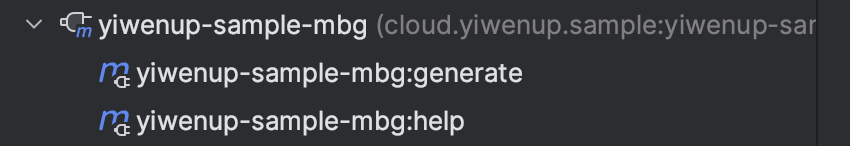

## 一、MybatisGenerator 介绍

> 官网地址：https://mybatis.org/generator/

`Mybatis`是一套半自动化的`ORM`框架，所谓半自动化，其实就是相对其他的同类别数据层框架（比如`Hibernate`）而言，他没有完全屏蔽底层`SQL`，而是预留了用户可定制的入口，可以是注解形式也可以是配置文件形式。

那么通常情况下，我们作为开发者，`CRUD`其实差别不大，基础的`DAO`层代码应该是一致，如果每次新建一张表，都要去对应建立一个实体类，去写一个接口，可能还要写`XML`文件，在表字段多的情况下，过于复杂，因此`Mybatis`官方推荐了一套根据表结构逆向生成代码的工具`MybatisGenerator`。

## 二、MybatisGenerator 使用

> 本示例基于`Maven`工程，使用`MybatisGenerator`提供的`Maven`插件`mybatis-generator-maven-plugin`

### 2.1 引入插件

```xml
<plugins>
    <plugin>
        <groupId>org.mybatis.generator</groupId>
        <artifactId>mybatis-generator-maven-plugin</artifactId>
        <version>1.4.1</version>
        <executions>
            <execution>
                <id>Generate MyBatis Artifacts</id>
                <goals>
                    <goal>generate</goal>
                </goals>
            </execution>
        </executions>
        <configuration>
            <overwrite>true</overwrite>
            <verbose>true</verbose>
            <configurationFile>${basedir}/src/main/resources/mbg/generator-config.xml</configurationFile>
            <outputDirectory>${basedir}/src/main/java</outputDirectory>
        </configuration>
        <dependencies>
            <dependency>
                <groupId>mysql</groupId>
                <artifactId>mysql-connector-java</artifactId>
                <version>8.0.29</version>
                <scope>runtime</scope>
            </dependency>
        </dependencies>
    </plugin>
</plugins>
```

插件引入需要注意的一些问题：

- configurationFile：这里填写的是配置文件的路径，该配置文件中描述了`mybatis generator`在生成代码的时候所需的信息
- dependency：此处需要依赖数据库驱动，并且，如果后续使用一些基于`mbg`扩展的插件，也需要在此处做依赖引入

### 2.2 配置文件

```xml
<?xml version="1.0" encoding="UTF-8"?>
<!DOCTYPE generatorConfiguration
        PUBLIC "-//mybatis.org//DTD MyBatis Generator Configuration 1.0//EN"
        "http://mybatis.org/dtd/mybatis-generator-config_1_0.dtd">

<generatorConfiguration>

    <context id="MySQLTables" targetRuntime="Mybatis3" defaultModelType="flat">

        <!-- 设置字符集 -->
        <property name="javaFileEncoding" value="UTF-8"/>
        <!-- 文件覆盖，不合并 -->
        <property name="isMergeable" value="false" />

        <!-- 注释 -->
        <commentGenerator>
            <property name="suppressAllComments" value="false" />
            <property name="suppressDate" value="false" />
            <property name="dateFormat" value="yyyy-MM-dd HH:mm:ss"/>
            <property name="addRemarkComments" value="true"/>
            <property name="author" value="yiwenup" />
        </commentGenerator>

        <!-- 数据库链接 -->
        <jdbcConnection driverClass="com.mysql.cj.jdbc.Driver"
                        connectionURL="url"
                        userId="user"
                        password="pwd">
            <property name="remarksReporting" value="true"/>
        </jdbcConnection>

        <javaTypeResolver>
            <property name="forceBigDecimals" value="true" />
        </javaTypeResolver>

        <!-- 实体类 -->
        <javaModelGenerator targetPackage="cloud.yiwenup.sample.mybatis.ext.entity" targetProject="./src/main/java">
            <property name="enableSubPackages" value="true" />
            <property name="trimStrings" value="true" />
        </javaModelGenerator>

        <!-- XML -->
        <sqlMapGenerator targetPackage="cloud.yiwenup.sample.mybatis.ext.inter"  targetProject="./src/main/resources">
            <property name="enableSubPackages" value="true" />
        </sqlMapGenerator>

        <!-- 接口 -->
        <javaClientGenerator type="XMLMAPPER" targetPackage="cloud.yiwenup.sample.mybatis.ext.inter"  targetProject="./src/main/java">
            <property name="enableSubPackages" value="true" />
        </javaClientGenerator>

        <!-- 表 -->
        <table tableName="activity" domainObjectName="Activity" />
    </context>
</generatorConfiguration>
```

配置文件需要注意的问题：

- 每个标签都是按顺序编排的，不能随意改动标签的位置
- `javaClientGenerator`的`type`属性，推荐用`XMLMAPPER`，因为这种风格能将`SQL`脚本与`Java`代码解耦，`SQL`写在`XML`文件中
- `context`的`targetRuntime`需要选择`Mybatis3`

## 三、MybatisGenerator 扩展

### 3.1 背景简述

- 首先，市面上已经存在了许多与`MybatisGenerator`相同思想的代码生成器了，常见的是`Mybatis Plus`体系下的`Mybatis Plus Generator`，`Mybatis Generator`能根据表结构逆向生成`DAO`层的代码，而`Mybatis Plus Generator`则是在`Mybatis Generator`的基础上，不仅仅局限于生成`DAO`层的代码，还能生成基于`MVC`三层模式下的`Service`层与`Controller`层的代码。然而，针对`Mybatis Generator`，其生成的代码存在局限性，比如无法做到**批量插入**这类的高阶功能以及无法实现**一套代码进行多种数据库产品的适配**。而针对`Mybatis Plus Generator`虽然能一站式的生成`MVC`各层级的代码，却仅仅是简单的增删改查，通常都是复杂的业务场景，需要手动编排代码逻辑，对开发人员来说，增加了熟悉`Mybatis Plus Generator`的成本以及大量方法的冗余。
- 其次，市面上已经有很多的开发者已经开始基于`Mybatis Generator`的扩展，开发**适合自己的**扩展代码部分，但是我们使用上来说，一方面不能全照搬过来，需要根据自身情况进行取舍借鉴，另一方面，如果所在团队对于新技术的引进有特别多的审批卡点，也存在诸多不方便之处。
- 因此，基于自身情况，定制属于团队的，生成代码相对纯净的代码生成器是**提效且必要**的。

### 3.2 扩展实现

> 本着授人以鱼不如授人以渔。这里会列出一些本人在开发过程中常用的扩展点，大家可以基于`Mybatis Generator`预置的扩展点进行定制。当然，也可以`fork`官方的代码进行源码的改造，请遵守开源协议。以下演示非源码改造的过程。

1. 建立`maven`工程，主要依赖`mybatis-generator-core`

   ```xml
   <dependency>
       <groupId>org.mybatis.generator</groupId>
       <artifactId>mybatis-generator-core</artifactId>
       <version>1.4.1</version>
   </dependency>
   ```

2. 找到需要介入的扩展点进行改造

   - CommentGenerator：实现该接口，可以进行注释的添加

     ```java
     /**
      * addJavaFileComment - 对所有的 Java 文件进行注释的添加
      *
      * compilationUnit.addFileCommentLin() - 添加文件头，可新增版权信息
      * ((JavaElement) compilationUnit).addJavaDocLine - 添加 JavaDoc
      */
     ```

     ```java
     /**
      * addClassComment - 对内部类注释
      *
      * ((JavaElement) compilationUnit).addJavaDocLine - 添加 JavaDoc
      */
     ```

     ```java
     /**
      * addFieldComment( 3个入参 ) - 对字段注释
      *
      * field.addJavaDocLine
      */
     ```

     ```java
     /**
      * addGetterComment - 对get方法注释
      *
      * method.addJavaDocLine
      */
     ```

     ```java
     /**
      * addSetterComment - 对set方法注释
      *
      * method.addJavaDocLine
      */
     ```

     ```java
     /**
      * addFieldComment( 2个入参 ) - 对example类的字段注释
      *
      * field.addJavaDocLine
      */
     ```

     ```java
     /**
      * addGeneralMethodComment - 对example/mapper的方法注释
      *
      * method.addJavaDocLine
      */
     ```

     ```java
     /**
      * addRootComment - 对XML的文件顶部加注释
      *
      * rootElement.addElement
      */
     ```

     ```java
     /**
      * addComment - 对XML的文件非顶部加注释
      *
      * xmlElement.addElement
      */
     ```

   - PluginAdapter：实现该接口，可以进行生成代码的介入

     ```java
     /**
      * sqlMapGenerated - XML文件介入【强烈建议设置为文件不合并，采用覆盖方式】
      *
      * sqlMap.setMergeable(false); - 强烈建议
      */
     ```

     ```java
     /**
      * sqlMapDocumentGenerated - XML文件补充方法
      *
      * document.getRootElement().addElement(answer) - 通过构造 answer 这类的文档结构，追加到原文档结构中
      */
     ```

     ```java
     /**
      * clientGenerated - mapper.java调整
      *
      * interfaze.addImportedType - 追加包导入
      * interfaze.addAnnotation - 追加注解
      * 通过继承 AbstractJavaMapperMethodGenerator 的类，使用其 addInterfaceElements(interfaze) 方法追加方法
      */
     ```

     ```java
     /**
      * sqlMapInsertElementGenerated - 介入进行 XML <insert> 节点的构造
      */
     ```

     ```java
     /**
      * sqlMapInsertSelectiveElementGenerated - 介入进行 XML <insertSelective> 节点的构造
      */
     ```

     ```java
     /**
      * sqlMapUpdateByExampleSelectiveElementGenerated - 介入进行 XML <updateByExampleSelective> 节点的构造
      */
     ```

     ```java
     /**
      * sqlMapUpdateByExampleWithoutBLOBsElementGenerated - 介入进行 XML <updateByExample> 节点的构造
      */
     ```

     ```java
     /**
      * sqlMapUpdateByPrimaryKeySelectiveElementGenerated - 介入进行 XML <updateByPrimaryKeySelective> 节点的构造
      */
     ```

     ```java
     /**
      * sqlMapUpdateByPrimaryKeyWithoutBLOBsElementGenerated - 介入进行 XML <updateByPrimaryKey> 节点的构造
      */
     ```

### 3.3 实现参考示例

> 示例主要需求实现三个目标：
>
> 1. 日期使用数据库函数，拒绝Java代码手动赋值
> 2. 新增批量插入方法`insertBatch`
> 3. 中文文档注释

- `MybatisPlugin`：做代码内容的改造

  ```java
  /**
   * 文件描述
   *
   * @Project generator
   * @Package org.mybatis.generator.api
   * @Author yiwenup
   * @Date 2022-08-03 10:35:46
   * @Description 自定义插件
   */
  public class MybatisPlugin extends PluginAdapter {
      private final String creDateTag;
      private final String updDateTag;
      private final List<Integer> dateTypes;
  
      public MybatisPlugin() {
          this.creDateTag = properties.getProperty("creDateTag", "create_time");
          this.updDateTag = properties.getProperty("updDateTag", "update_time");
          this.dateTypes = Arrays.asList(Types.TIMESTAMP, Types.TIME, Types.DATE, Types.TIME_WITH_TIMEZONE, Types.TIMESTAMP_WITH_TIMEZONE);
      }
  
      @Override
      public boolean validate(List<String> warnings) {
          return true;
      }
  
      @Override
      public boolean sqlMapGenerated(GeneratedXmlFile sqlMap, IntrospectedTable introspectedTable) {
          sqlMap.setMergeable(false);
          return true;
      }
  
      @Override
      public boolean sqlMapDocumentGenerated(Document document, IntrospectedTable introspectedTable) {
  
          addInsertColumnListElement(document, introspectedTable);
          AbstractXmlElementGenerator insertBatchElementGenerator = new InsertBatchElementGenerator();
          insertBatchElementGenerator.setContext(context);
          insertBatchElementGenerator.setIntrospectedTable(introspectedTable);
          insertBatchElementGenerator.addElements(document.getRootElement());
          return true;
      }
  
      @Override
      public boolean clientGenerated(Interface interfaze, IntrospectedTable introspectedTable) {
          interfaze.addImportedType(new FullyQualifiedJavaType("org.apache.ibatis.annotations.Mapper"));
          interfaze.addAnnotation("@Mapper");
  
          // 新增insertBatch方法
          AbstractJavaMapperMethodGenerator methodGenerator = new InsertBatchMethodGenerator();
          methodGenerator.setContext(context);
          methodGenerator.setIntrospectedTable(introspectedTable);
          methodGenerator.addInterfaceElements(interfaze);
          return true;
      }
  
      @Override
      public boolean sqlMapInsertElementGenerated(XmlElement element, IntrospectedTable introspectedTable) {
  
          if (introspectedTable.getColumn(creDateTag).filter(c -> dateTypes.contains(c.getJdbcType())).isPresent()
                  || introspectedTable.getColumn(creDateTag).filter(c -> dateTypes.contains(c.getJdbcType())).isPresent()) {
              // 清除之前的代码块
              element.getElements().clear();
              // 重新组织
              context.getCommentGenerator().addComment(element);
              StringBuilder insertClause = new StringBuilder("insert into " + introspectedTable.getFullyQualifiedTableNameAtRuntime() + " (");
  
              StringBuilder valuesClause = new StringBuilder("values (");
  
              List<String> valuesClauses = new ArrayList<>();
              List<IntrospectedColumn> columns =
                      ListUtilities.removeIdentityAndGeneratedAlwaysColumns(introspectedTable.getAllColumns());
              for (int i = 0; i < columns.size(); i++) {
  
                  insertClause.append(MyBatis3FormattingUtilities.getEscapedColumnName(columns.get(i)));
                  if (columns.get(i).getActualColumnName().equalsIgnoreCase(creDateTag) || columns.get(i).getActualColumnName().equalsIgnoreCase(updDateTag)) {
                      valuesClause.append("${dbDate}");
                  } else {
                      valuesClause.append(MyBatis3FormattingUtilities.getParameterClause(columns.get(i)));
                  }
                  if (columns.size() > i + 1) {
                      insertClause.append(", ");
                      valuesClause.append(", ");
                  }
  
                  if (valuesClause.length() > 80) {
                      element.addElement(new TextElement(insertClause.toString()));
                      insertClause.setLength(0);
                      OutputUtilities.xmlIndent(insertClause, 1);
  
                      valuesClauses.add(valuesClause.toString());
                      valuesClause.setLength(0);
                      OutputUtilities.xmlIndent(valuesClause, 1);
                  }
              }
  
              insertClause.append(')');
              element.addElement(new TextElement(insertClause.toString()));
  
              valuesClause.append(')');
              valuesClauses.add(valuesClause.toString());
  
              for (String clause : valuesClauses) {
                  element.addElement(new TextElement(clause));
              }
          }
  
          return true;
      }
  
      @Override
      public boolean sqlMapInsertSelectiveElementGenerated(XmlElement element, IntrospectedTable introspectedTable) {
          if (introspectedTable.getColumn(creDateTag).filter(c -> dateTypes.contains(c.getJdbcType())).isPresent()
                  || introspectedTable.getColumn(creDateTag).filter(c -> dateTypes.contains(c.getJdbcType())).isPresent()) {
              // 清除之前的代码块
              element.getElements().clear();
              // 重新组织
              context.getCommentGenerator().addComment(element);
              element.addElement(new TextElement("insert into " + introspectedTable.getFullyQualifiedTableNameAtRuntime()));
  
              XmlElement insertTrimElement = new XmlElement("trim");
              insertTrimElement.addAttribute(new Attribute("prefix", "("));
              insertTrimElement.addAttribute(new Attribute("suffix", ")"));
              insertTrimElement.addAttribute(new Attribute("suffixOverrides", ","));
              element.addElement(insertTrimElement);
  
              XmlElement valuesTrimElement = new XmlElement("trim");
              valuesTrimElement.addAttribute(new Attribute("prefix", "values ("));
              valuesTrimElement.addAttribute(new Attribute("suffix", ")"));
              valuesTrimElement.addAttribute(new Attribute("suffixOverrides", ","));
              element.addElement(valuesTrimElement);
  
              StringBuilder sb = new StringBuilder();
              for (IntrospectedColumn col : ListUtilities.removeIdentityAndGeneratedAlwaysColumns(introspectedTable.getAllColumns())) {
  
                  if (col.isSequenceColumn() || col.getFullyQualifiedJavaType().isPrimitive()) {
                      sb.setLength(0);
                      sb.append(MyBatis3FormattingUtilities.getEscapedColumnName(col)).append(',');
                      insertTrimElement.addElement(new TextElement(sb.toString()));
  
                      sb.setLength(0);
                      sb.append(MyBatis3FormattingUtilities.getParameterClause(col)).append(',');
                      valuesTrimElement.addElement(new TextElement(sb.toString()));
  
                      continue;
                  }
  
                  sb.setLength(0);
                  if (col.getActualColumnName().equalsIgnoreCase(creDateTag) || col.getActualColumnName().equalsIgnoreCase(updDateTag)) {
                      sb.append(MyBatis3FormattingUtilities.getEscapedColumnName(col)).append(',');
                      insertTrimElement.addElement(new TextElement(sb.toString()));
                  } else {
                      sb.append(col.getJavaProperty()).append(" != null");
                      XmlElement insertNotNullElement = new XmlElement("if");
                      insertNotNullElement.addAttribute(new Attribute("test", sb.toString()));
  
                      sb.setLength(0);
                      sb.append(MyBatis3FormattingUtilities.getEscapedColumnName(col)).append(',');
                      insertNotNullElement.addElement(new TextElement(sb.toString()));
                      insertTrimElement.addElement(insertNotNullElement);
                  }
  
                  sb.setLength(0);
                  if (col.getActualColumnName().equalsIgnoreCase(creDateTag) || col.getActualColumnName().equalsIgnoreCase(updDateTag)) {
                      sb.append("${dbDate}").append(',');
                      valuesTrimElement.addElement(new TextElement(sb.toString()));
                  } else {
                      sb.append(col.getJavaProperty()).append(" != null");
                      XmlElement valuesNotNullElement = new XmlElement("if");
                      valuesNotNullElement.addAttribute(new Attribute("test", sb.toString()));
  
                      sb.setLength(0);
                      sb.append(MyBatis3FormattingUtilities.getParameterClause(col)).append(',');
                      valuesNotNullElement.addElement(new TextElement(sb.toString()));
                      valuesTrimElement.addElement(valuesNotNullElement);
                  }
              }
          }
  
          return true;
      }
  
      @Override
      public boolean sqlMapUpdateByExampleSelectiveElementGenerated(XmlElement element, IntrospectedTable introspectedTable) {
          if (introspectedTable.getColumn(updDateTag).filter(col -> dateTypes.contains(col.getJdbcType())).isPresent()) {
              // 清除之前的代码块
              element.getElements().clear();
              // 重新组织
              context.getCommentGenerator().addComment(element);
              StringBuilder sb = new StringBuilder("update ")
                      .append(introspectedTable.getAliasedFullyQualifiedTableNameAtRuntime());
              element.addElement(new TextElement(sb.toString()));
  
              XmlElement dynamicElement = new XmlElement("set");
              element.addElement(dynamicElement);
  
              for (IntrospectedColumn col : ListUtilities.removeGeneratedAlwaysColumns(introspectedTable.getAllColumns())) {
  
                  if (col.getActualColumnName().equalsIgnoreCase(creDateTag) && dateTypes.contains(col.getJdbcType())) {
                      continue;
                  }
  
                  sb.setLength(0);
                  if (col.getActualColumnName().equalsIgnoreCase(updDateTag)) {
                      sb.append(MyBatis3FormattingUtilities.getAliasedEscapedColumnName(col))
                              .append(" = ")
                              .append("${dbDate}")
                              .append(',');
  
                      dynamicElement.addElement(new TextElement(sb.toString()));
                  } else {
                      sb.append(col.getJavaProperty("row."))
                              .append(" != null");
                      XmlElement isNotNullElement = new XmlElement("if");
                      isNotNullElement.addAttribute(new Attribute("test", sb.toString()));
  
                      sb.setLength(0);
                      sb.append(MyBatis3FormattingUtilities.getAliasedEscapedColumnName(col))
                              .append(" = ")
                              .append(MyBatis3FormattingUtilities.getParameterClause(col, "row."))
                              .append(',');
                      isNotNullElement.addElement(new TextElement(sb.toString()));
  
                      dynamicElement.addElement(isNotNullElement);
                  }
              }
  
              XmlElement ifElement = buildUpdateExampleElement(introspectedTable);
              element.addElement(ifElement);
          }
          return true;
      }
  
      @Override
      public boolean sqlMapUpdateByExampleWithoutBLOBsElementGenerated(XmlElement element, IntrospectedTable introspectedTable) {
          if (introspectedTable.getColumn(updDateTag).filter(col -> dateTypes.contains(col.getJdbcType())).isPresent()) {
              // 清除之前的代码块
              element.getElements().clear();
              context.getCommentGenerator().addComment(element);
              // 重新组织
              StringBuilder sb = new StringBuilder("update ")
                      .append(introspectedTable.getAliasedFullyQualifiedTableNameAtRuntime());
              element.addElement(new TextElement(sb.toString()));
  
              sb.setLength(0);
              sb.append("set ");
  
              Iterator<IntrospectedColumn> iter = ListUtilities.removeGeneratedAlwaysColumns(introspectedTable.getNonBLOBColumns()).iterator();
              while (iter.hasNext()) {
                  IntrospectedColumn col = iter.next();
  
                  if (col.getActualColumnName().equalsIgnoreCase(creDateTag) && dateTypes.contains(col.getJdbcType())) {
                      continue;
                  }
  
                  sb.append(MyBatis3FormattingUtilities.getAliasedEscapedColumnName(col)).append(" = ");
                  if (col.getActualColumnName().equalsIgnoreCase(updDateTag)) {
                      sb.append("${dbDate}");
                  } else {
                      sb.append(MyBatis3FormattingUtilities.getParameterClause(col, "row."));
                  }
  
                  if (iter.hasNext()) {
                      sb.append(',');
                  }
  
                  element.addElement(new TextElement(sb.toString()));
  
                  if (iter.hasNext()) {
                      sb.setLength(0);
                      OutputUtilities.xmlIndent(sb, 1);
                  }
              }
  
              XmlElement ifElement = buildUpdateExampleElement(introspectedTable);
              element.addElement(ifElement);
          }
          return true;
      }
  
      @Override
      public boolean sqlMapUpdateByPrimaryKeySelectiveElementGenerated(XmlElement element, IntrospectedTable introspectedTable) {
          if (introspectedTable.getColumn(updDateTag).filter(col -> dateTypes.contains(col.getJdbcType())).isPresent()) {
              // 清除之前的代码块
              element.getElements().clear();
              context.getCommentGenerator().addComment(element);
              // 重新组织
              StringBuilder sb = new StringBuilder("update ")
                      .append(introspectedTable.getFullyQualifiedTableNameAtRuntime());
              element.addElement(new TextElement(sb.toString()));
  
              XmlElement dynamicElement = new XmlElement("set");
              element.addElement(dynamicElement);
  
              for (IntrospectedColumn col :
                      ListUtilities.removeGeneratedAlwaysColumns(introspectedTable.getNonPrimaryKeyColumns())) {
  
                  if (col.getActualColumnName().equalsIgnoreCase(creDateTag) && dateTypes.contains(col.getJdbcType())) {
                      continue;
                  }
  
                  sb.setLength(0);
                  if (col.getActualColumnName().equalsIgnoreCase(updDateTag)) {
                      sb.append(MyBatis3FormattingUtilities.getEscapedColumnName(col))
                              .append(" = ")
                              .append("${dbDate}")
                              .append(',');
                      dynamicElement.addElement(new TextElement(sb.toString()));
  
                  } else {
                      sb.append(col.getJavaProperty())
                              .append(" != null");
                      XmlElement isNotNullElement = new XmlElement("if");
                      isNotNullElement.addAttribute(new Attribute("test", sb.toString()));
  
                      sb.setLength(0);
                      sb.append(MyBatis3FormattingUtilities.getEscapedColumnName(col))
                              .append(" = ")
                              .append(MyBatis3FormattingUtilities.getParameterClause(col))
                              .append(',');
                      isNotNullElement.addElement(new TextElement(sb.toString()));
  
                      dynamicElement.addElement(isNotNullElement);
                  }
              }
  
              buildPrimaryKeyWhereClause(element, introspectedTable);
          }
  
          return true;
      }
  
      @Override
      public boolean sqlMapUpdateByPrimaryKeyWithoutBLOBsElementGenerated(XmlElement element, IntrospectedTable introspectedTable) {
          if (introspectedTable.getColumn(updDateTag).filter(col -> dateTypes.contains(col.getJdbcType())).isPresent()) {
              // 清除之前的代码块
              element.getElements().clear();
              // 重新组织
              context.getCommentGenerator().addComment(element);
              StringBuilder sb = new StringBuilder("update ")
                      .append(introspectedTable.getFullyQualifiedTableNameAtRuntime());
              element.addElement(new TextElement(sb.toString()));
  
              sb.setLength(0);
              sb.append("set ");
  
              Iterator<IntrospectedColumn> iter = ListUtilities.removeGeneratedAlwaysColumns(introspectedTable.getBaseColumns()).iterator();
              while (iter.hasNext()) {
                  IntrospectedColumn col = iter.next();
  
                  if (col.getActualColumnName().equalsIgnoreCase(creDateTag) && dateTypes.contains(col.getJdbcType())) {
                      continue;
                  }
  
                  sb.append(MyBatis3FormattingUtilities.getEscapedColumnName(col)).append(" = ");
                  if (col.getActualColumnName().equalsIgnoreCase(updDateTag)) {
                      sb.append("${dbDate}");
                  } else {
                      sb.append(MyBatis3FormattingUtilities.getParameterClause(col));
                  }
  
                  if (iter.hasNext()) {
                      sb.append(',');
                  }
  
                  element.addElement(new TextElement(sb.toString()));
  
                  if (iter.hasNext()) {
                      sb.setLength(0);
                      OutputUtilities.xmlIndent(sb, 1);
                  }
              }
  
              buildPrimaryKeyWhereClause(element, introspectedTable);
          }
          return true;
      }
  
      private void addInsertColumnListElement(Document document, IntrospectedTable introspectedTable) {
          XmlElement answer = new XmlElement("sql");
  
          answer.addAttribute(new Attribute("id", "Insert_Column_List"));
  
          context.getCommentGenerator().addComment(answer);
  
          Iterator<IntrospectedColumn> iter = introspectedTable.getNonBLOBColumns().iterator();
          StringBuilder sb = new StringBuilder();
          while (iter.hasNext()) {
              IntrospectedColumn col = iter.next();
              boolean hasDateTag = col.getActualColumnName().equalsIgnoreCase(creDateTag) || col.getActualColumnName().equalsIgnoreCase(updDateTag);
              if (dateTypes.contains(col.getJdbcType()) && hasDateTag) {
                  sb.append("${dbDate}");
              } else {
                  sb.append(MyBatis3FormattingUtilities.getParameterClause(col, "row."));
              }
  
              if (iter.hasNext()) {
                  sb.append(", ");
              }
  
              if (sb.length() > 80) {
                  answer.addElement(new TextElement(sb.toString()));
                  sb.setLength(0);
              }
          }
  
          if (sb.length() > 0) {
              answer.addElement(new TextElement(sb.toString()));
          }
  
          document.getRootElement().addElement(answer);
      }
  
      private void buildPrimaryKeyWhereClause(XmlElement element, IntrospectedTable introspectedTable) {
          boolean first = true;
          for (IntrospectedColumn introspectedColumn : introspectedTable.getPrimaryKeyColumns()) {
              String line;
              if (first) {
                  line = "where ";
                  first = false;
              } else {
                  line = "  and ";
              }
  
              line += MyBatis3FormattingUtilities.getEscapedColumnName(introspectedColumn);
              line += " = ";
              line += MyBatis3FormattingUtilities.getParameterClause(introspectedColumn);
              element.addElement(new TextElement(line));
          }
      }
  
      private XmlElement buildUpdateExampleElement(IntrospectedTable introspectedTable) {
          XmlElement ifElement = new XmlElement("if");
          ifElement.addAttribute(new Attribute("test", "example != null"));
  
          XmlElement includeElement = new XmlElement("include");
          includeElement.addAttribute(new Attribute("refid",
                  introspectedTable.getMyBatis3UpdateByExampleWhereClauseId()));
          ifElement.addElement(includeElement);
          return ifElement;
      }
  }
  ```

- `MybatisCommentGenerator`：做注释的生成

  ```java
  /**
   * 文件描述
   *
   * @Project generator
   * @Package org.mybatis.generator.internal
   * @Author yiwenup
   * @Date 2022-08-02 15:00:05
   * @Description 自定义注释
   */
  public class MybatisCommentGenerator implements CommentGenerator {
  
      private final Properties properties;
  
      private final String now;
  
      private final String author;
  
      public MybatisCommentGenerator() {
          this.properties = new Properties();
          this.now = LocalDateTime.now().format(DateTimeFormatter.ofPattern("yyyy-MM-dd HH:mm:ss"));
          this.author = System.getProperty("user.name", "ctp");
      }
  
      @Override
      public void addConfigurationProperties(Properties properties) {
          this.properties.putAll(properties);
      }
  
      @Override
      public void addJavaFileComment(CompilationUnit compilationUnit) {
          JavaElement javaElement = (JavaElement) compilationUnit;
          tagJavaDocLines(javaElement, compilationUnit.getType());
  
          compilationUnit.addFileCommentLine("/*");
          compilationUnit.addFileCommentLine(" * " + compilationUnit.getType().getShortName() + ".java");
          compilationUnit.addFileCommentLine(" * Copyright © 2019-" + LocalDate.now().getYear() + " YiwenUp Technologies Inc.");
          compilationUnit.addFileCommentLine(" * All right reserved.");
          compilationUnit.addFileCommentLine(" * www.yiwenup.cloud");
          compilationUnit.addFileCommentLine(" */");
      }
  
      @Override
      public void addClassComment(InnerClass innerClass, IntrospectedTable introspectedTable) {
          // 内部类
          tagJavaDocLines(innerClass, innerClass.getType());
      }
  
      @Override
      public void addFieldComment(Field field, IntrospectedTable introspectedTable, IntrospectedColumn introspectedColumn) {
          // 模型类的字段
          field.addJavaDocLine("/**");
          field.addJavaDocLine(" * " + field.getName());
          field.addJavaDocLine(" * <p>");
          field.addJavaDocLine(" * " + introspectedColumn.getRemarks());
          field.addJavaDocLine(" */");
      }
  
      @Override
      public void addGetterComment(Method method, IntrospectedTable introspectedTable, IntrospectedColumn introspectedColumn) {
          method.addJavaDocLine("/**");
          method.addJavaDocLine(" * 获取字段 " + introspectedTable.getFullyQualifiedTableNameAtRuntime() + "." + introspectedColumn.getActualColumnName() + "（" + introspectedColumn.getRemarks() + "）");
          method.addJavaDocLine(" *");
          method.addJavaDocLine(" * @return " + introspectedTable.getFullyQualifiedTableNameAtRuntime() + "." + introspectedColumn.getActualColumnName() + "（" + introspectedColumn.getRemarks() + "）");
          method.addJavaDocLine(" */");
      }
  
      @Override
      public void addSetterComment(Method method, IntrospectedTable introspectedTable, IntrospectedColumn introspectedColumn) {
          method.addJavaDocLine("/**");
          method.addJavaDocLine(" * 设置字段 " + introspectedColumn.getJavaProperty() + " - " + introspectedTable.getFullyQualifiedTableNameAtRuntime() + "." + introspectedColumn.getActualColumnName() + "（" + introspectedColumn.getRemarks() + "）");
          method.addJavaDocLine(" *");
          method.addJavaDocLine(" * @param " + introspectedColumn.getJavaProperty() + " - " + introspectedTable.getFullyQualifiedTableNameAtRuntime() + "." + introspectedColumn.getActualColumnName() + "（" + introspectedColumn.getRemarks() + "）");
          method.addJavaDocLine(" */");
      }
  
      @Override
      public void addFieldComment(Field field, IntrospectedTable introspectedTable) {
          // example 的字段
          switch (field.getName()) {
              default:
                  break;
              case "orderByClause":
                  field.addJavaDocLine("/**");
                  field.addJavaDocLine(" * orderByClause 排序字段");
                  field.addJavaDocLine(" */");
                  break;
              case "distinct":
                  field.addJavaDocLine("/**");
                  field.addJavaDocLine(" * distinct 是否过滤重复数据");
                  field.addJavaDocLine(" */");
                  break;
              case "oredCriteria":
                  field.addJavaDocLine("/**");
                  field.addJavaDocLine(" * oredCriteria 过滤条件实例");
                  field.addJavaDocLine(" */");
                  break;
          }
      }
  
      @Override
      public void addGeneralMethodComment(Method method, IntrospectedTable introspectedTable) {
          // example 和 mapper
          method.addJavaDocLine("/**");
          switch (method.getName()) {
              default:
                  otherMethod(method);
                  break;
              case "countByExample":
                  method.addJavaDocLine(" * 根据指定的条件获取数据库记录数: " + introspectedTable.getFullyQualifiedTableNameAtRuntime());
                  method.addJavaDocLine(" *");
                  method.addJavaDocLine(" * @param example Example对象");
                  method.addJavaDocLine(" * @return long 符合条件的记录数");
                  break;
              case "deleteByExample":
                  method.addJavaDocLine(" * 根据指定的条件删除数据库符合条件的记录: " + introspectedTable.getFullyQualifiedTableNameAtRuntime());
                  method.addJavaDocLine(" *");
                  method.addJavaDocLine(" * @param example Example对象");
                  method.addJavaDocLine(" * @return int 删除影响的记录数");
                  break;
              case "deleteByPrimaryKey":
                  method.addJavaDocLine(" * 根据主键删除数据库的记录: " + introspectedTable.getFullyQualifiedTableNameAtRuntime());
                  method.addJavaDocLine(" *");
                  method.addJavaDocLine(" * @return int 删除影响的记录数");
                  break;
              case "insert":
                  method.addJavaDocLine(" * 新写入数据库记录: " + introspectedTable.getFullyQualifiedTableNameAtRuntime());
                  method.addJavaDocLine(" *");
                  method.addJavaDocLine(" * @param row 实体对象");
                  method.addJavaDocLine(" * @return int 写入影响的记录数");
                  break;
              case "insertSelective":
                  method.addJavaDocLine(" * 动态字段,写入数据库记录: " + introspectedTable.getFullyQualifiedTableNameAtRuntime());
                  method.addJavaDocLine(" *");
                  method.addJavaDocLine(" * @param row 实体对象");
                  method.addJavaDocLine(" * @return int 写入影响的记录数");
                  break;
              case "selectByExample":
                  method.addJavaDocLine(" * 根据指定的条件查询符合条件的数据库记录: " + introspectedTable.getFullyQualifiedTableNameAtRuntime());
                  method.addJavaDocLine(" *");
                  method.addJavaDocLine(" * @param example Example对象");
                  method.addJavaDocLine(" * @return " + method.getReturnType().get().getShortName() + " 符合条件的记录");
                  break;
              case "selectByPrimaryKey":
                  method.addJavaDocLine(" * 根据指定主键获取一条数据库记录: " + introspectedTable.getFullyQualifiedTableNameAtRuntime());
                  method.addJavaDocLine(" *");
                  introspectedTable.getPrimaryKeyColumns().forEach(pk -> {
                      method.addJavaDocLine(" * @param " + pk.getJavaProperty() + " " + pk.getRemarks());
                  });
                  method.addJavaDocLine(" * @return " + method.getReturnType().get().getShortName() + " 实体对象");
                  break;
              case "updateByExampleSelective":
                  method.addJavaDocLine(" * 动态根据指定的条件来更新符合条件的数据库记录: " + introspectedTable.getFullyQualifiedTableNameAtRuntime());
                  method.addJavaDocLine(" *");
                  method.addJavaDocLine(" * @param row  实体对象");
                  method.addJavaDocLine(" * @param example Example对象");
                  method.addJavaDocLine(" * @return int 更新影响的记录数");
                  break;
              case "updateByExample":
                  method.addJavaDocLine(" * 根据指定的条件来更新符合条件的数据库记录: " + introspectedTable.getFullyQualifiedTableNameAtRuntime());
                  method.addJavaDocLine(" *");
                  method.addJavaDocLine(" * @param row  实体对象");
                  method.addJavaDocLine(" * @param example Example对象");
                  method.addJavaDocLine(" * @return int 更新影响的记录数");
                  break;
              case "updateByPrimaryKeySelective":
                  method.addJavaDocLine(" * 动态字段,根据主键来更新符合条件的数据库记录: " + introspectedTable.getFullyQualifiedTableNameAtRuntime());
                  method.addJavaDocLine(" *");
                  method.addJavaDocLine(" * @param row 实体对象");
                  method.addJavaDocLine(" * @return int 更新影响的记录数");
                  break;
              case "updateByPrimaryKey":
                  method.addJavaDocLine(" * 根据主键来更新符合条件的数据库记录: " + introspectedTable.getFullyQualifiedTableNameAtRuntime());
                  method.addJavaDocLine(" *");
                  method.addJavaDocLine(" * @param row 实体对象");
                  method.addJavaDocLine(" * @return int 更新影响的记录数");
                  break;
          }
          method.addJavaDocLine(" */");
      }
  
      @Override
      public void addRootComment(XmlElement rootElement) {
          rootElement.addElement(new TextElement("<!--"));
          rootElement.addElement(new TextElement("  WARNING - "));
          rootElement.addElement(new TextElement("  Copyright © 2019-" + LocalDate.now().getYear() + " YiwenUp Technologies Inc. "));
          rootElement.addElement(new TextElement("  All right reserved. "));
          rootElement.addElement(new TextElement("  www.yiwenup.cloud "));
          rootElement.addElement(new TextElement("  "));
          rootElement.addElement(new TextElement("  由工具逆向生成，请勿手动修改文件"));
          rootElement.addElement(new TextElement("  Author is " + this.author));
          rootElement.addElement(new TextElement("  Date " + this.now));
          rootElement.addElement(new TextElement("-->"));
      }
  
      @Override
      public void addComment(XmlElement xmlElement) {
          xmlElement.addElement(new TextElement("<!--"));
          xmlElement.addElement(new TextElement("  WARNING - "));
          xmlElement.addElement(new TextElement("  由工具逆向生成，请勿手动修改文件"));
          xmlElement.addElement(new TextElement("-->"));
      }
  
      private void otherMethod(Method method) {
          if (method.isConstructor()) {
              method.addJavaDocLine(" * " + method.getName() + " 构造器");
          } else {
              method.addJavaDocLine(" * " + method.getName());
              if (!method.getParameters().isEmpty()) {
                  method.addJavaDocLine(" *");
                  method.getParameters().forEach(param -> method.addJavaDocLine(" * @param " + param.getName() + " 参数"));
              }
              method.getReturnType().ifPresent(ret -> {
                  method.addJavaDocLine(" *");
                  method.addJavaDocLine(" * @return " + ret.getShortName() + " 返回值");
              });
          }
      }
  
      private void tagJavaDocLines(JavaElement javaElement, FullyQualifiedJavaType compilationUnit) {
          javaElement.addJavaDocLine("/**");
          javaElement.addJavaDocLine(" * 文件描述");
          javaElement.addJavaDocLine(" *");
          javaElement.addJavaDocLine(" * @Project Mybatis Generation Extension");
          javaElement.addJavaDocLine(" * @Package " + compilationUnit.getPackageName());
          javaElement.addJavaDocLine(" * @Author " + this.author);
          javaElement.addJavaDocLine(" * @Date " + now);
          javaElement.addJavaDocLine(" * @Description 由工具逆向生成，请勿手动修改文件");
          javaElement.addJavaDocLine(" */");
      }
  }
  ```

## 四、Maven 插件化

> 参考`Mybatis Generator`，通过集成`maven`插件开发，降低使用复杂度，并且取消配置文件（这是因为配置文件的自由度过高，而往往开发只需要一种代码风格即可），将所需的参数通过暴露的方式让开发者填写即可运行产生代码。

1. 改造原先的`pom`，主要修改点是`packaging`调整为`maven-plugin`，之后引入插件开发的依赖`maven-plugin-api`、`maven-plugin-annotations`、`maven-plugin-plugin`

   ```xml
   <?xml version="1.0" encoding="UTF-8"?>
   <project xmlns="http://maven.apache.org/POM/4.0.0"
            xmlns:xsi="http://www.w3.org/2001/XMLSchema-instance"
            xsi:schemaLocation="http://maven.apache.org/POM/4.0.0 http://maven.apache.org/xsd/maven-4.0.0.xsd">
       <modelVersion>4.0.0</modelVersion>
   
       <groupId>cloud.yiwenup.sample</groupId>
       <artifactId>yiwenup-sample-mbg-maven-plugin</artifactId>
       <version>1.0-SNAPSHOT</version>
   
       <packaging>maven-plugin</packaging>
       <name>Yiwenup MBG Maven Plugin</name>
   
       <properties>
           <project.build.sourceEncoding>UTF-8</project.build.sourceEncoding>
           <maven.compiler.source>1.8</maven.compiler.source>
           <maven.compiler.target>1.8</maven.compiler.target>
       </properties>
   
       <dependencies>
           <dependency>
               <groupId>org.apache.maven</groupId>
               <artifactId>maven-plugin-api</artifactId>
               <version>3.8.6</version>
               <scope>provided</scope>
           </dependency>
           <dependency>
               <groupId>org.apache.maven.plugin-tools</groupId>
               <artifactId>maven-plugin-annotations</artifactId>
               <version>3.6.4</version>
               <scope>provided</scope>
           </dependency>
           <dependency>
               <groupId>org.mybatis.generator</groupId>
               <artifactId>mybatis-generator-core</artifactId>
               <version>1.4.1</version>
           </dependency>
       </dependencies>
   
       <build>
           <plugins>
               <plugin>
                   <groupId>org.apache.maven.plugins</groupId>
                   <artifactId>maven-plugin-plugin</artifactId>
                   <version>3.6.4</version>
                   <executions>
                       <execution>
                           <id>default-descriptor</id>
                           <phase>process-classes</phase>
                       </execution>
                       <execution>
                           <id>generated-helpmojo</id>
                           <goals>
                               <goal>helpmojo</goal>
                           </goals>
                       </execution>
                   </executions>
               </plugin>
               <plugin>
                   <groupId>org.apache.maven.plugins</groupId>
                   <artifactId>maven-surefire-plugin</artifactId>
                   <configuration>
                       <skip>true</skip>
                   </configuration>
               </plugin>
           </plugins>
       </build>
   </project>
   ```

2. 新建插件入口，组装`mbg`配置，暴露交互参数

   ```java
   /**
    * 文件描述
    *
    * @Project yiwenup-sample
    * @Package cloud.yiwenup.sample.mbg.extension
    * @Author yiwenup
    * @Date 2022-08-03 16:02:11
    * @Description 插件入口
    */
   @Mojo(name = "generate", defaultPhase = LifecyclePhase.GENERATE_SOURCES,
           requiresDependencyResolution = ResolutionScope.TEST)
   public class MybatisGenerateMojo extends AbstractMojo {
   
       /**
        * JDBC连接驱动
        */
       @Parameter(property = "jdbcDriver", required = true)
       private String jdbcDriver;
   
       /**
        * JDBC连接地址
        */
       @Parameter(property = "jdbcURL", required = true)
       private String jdbcURL;
   
       /**
        * JDBC连接用户
        */
       @Parameter(property = "jdbcUserId", required = true)
       private String jdbcUserId;
   
       /**
        * JDBC连接密码
        */
       @Parameter(property = "jdbcPassword", required = true)
       private String jdbcPassword;
   
       /**
        * 单表
        */
       @Parameter(property = "tableName", required = true)
       private String tableName;
   
       /**
        * 如果指定了表名称，则按指定的，否则默认按驼峰转
        */
       @Parameter(property = "entityName")
       private String entityName;
   
       /**
        * Java文件位置：entity/example/mapper.java
        */
       @Parameter(property = "javaFileLocation", defaultValue = "${project.basedir}/src/main/java", required = true)
       private File javaFileLocation;
   
       /**
        * XML文件位置：mapper.xml
        */
       @Parameter(property = "xmlFileLocation", defaultValue = "${project.basedir}/src/main/resources", required = true)
       private File xmlFileLocation;
   
       /**
        * 模型类文件具体包路径：entity/example
        */
       @Parameter(property = "modelPackage", required = true)
       private String modelPackage;
   
       /**
        * mapper文件包路径：mapper.java/.xml
        */
       @Parameter(property = "mapperPackage", required = true)
       private String mapperPackage;
   
       /**
        * 创建时间特殊处理列
        */
       @Parameter(property = "creDateTag", defaultValue = "create_time", required = true)
       private String creDateTag;
   
       /**
        * 修改时间特殊处理列
        */
       @Parameter(property = "updDateTag", defaultValue = "update_time", required = true)
       private String updDateTag;
   
       public void execute() throws MojoExecutionException, MojoFailureException {
   
           List<String> warnings = new ArrayList<>();
   
           try {
   
               Configuration configuration = new Configuration();
               Context context = new Context(ModelType.FLAT);
               context.setId("MybatisGenerateMojo");
               context.setTargetRuntime("MyBatis3");
   
               context.addProperty("javaFileEncoding", "UTF-8");
               context.addProperty("isMergeable", "false");
   
               PluginConfiguration pluginConfiguration = new PluginConfiguration();
               pluginConfiguration.setConfigurationType("cloud.yiwenup.sample.mbg.extension.MybatisPlugin");
               pluginConfiguration.addProperty("creDateTag", "create_time");
               pluginConfiguration.addProperty("updDateTag", "update_time");
               context.addPluginConfiguration(pluginConfiguration);
   
               CommentGeneratorConfiguration commentGeneratorConfiguration = new CommentGeneratorConfiguration();
               commentGeneratorConfiguration.setConfigurationType("cloud.yiwenup.sample.mbg.extension.MybatisCommentGenerator");
               context.setCommentGeneratorConfiguration(commentGeneratorConfiguration);
   
               JDBCConnectionConfiguration jdbcConnectionConfiguration = new JDBCConnectionConfiguration();
               jdbcConnectionConfiguration.setDriverClass(jdbcDriver);
               jdbcConnectionConfiguration.setConnectionURL(jdbcURL);
               jdbcConnectionConfiguration.setUserId(jdbcUserId);
               jdbcConnectionConfiguration.setPassword(jdbcPassword);
               jdbcConnectionConfiguration.addProperty("remarksReporting", "true");
               context.setJdbcConnectionConfiguration(jdbcConnectionConfiguration);
   
               JavaTypeResolverConfiguration javaTypeResolverConfiguration = new JavaTypeResolverConfiguration();
               javaTypeResolverConfiguration.addProperty("forceBigDecimals", "true");
               context.setJavaTypeResolverConfiguration(javaTypeResolverConfiguration);
   
               JavaModelGeneratorConfiguration javaModelGeneratorConfiguration = new JavaModelGeneratorConfiguration();
               javaModelGeneratorConfiguration.setTargetProject(javaFileLocation.getPath());
               javaModelGeneratorConfiguration.setTargetPackage(modelPackage);
               javaModelGeneratorConfiguration.addProperty("enableSubPackages", "true");
               javaModelGeneratorConfiguration.addProperty("trimStrings", "true");
               context.setJavaModelGeneratorConfiguration(javaModelGeneratorConfiguration);
   
               SqlMapGeneratorConfiguration sqlMapGeneratorConfiguration = new SqlMapGeneratorConfiguration();
               sqlMapGeneratorConfiguration.setTargetProject(xmlFileLocation.getPath());
               sqlMapGeneratorConfiguration.setTargetPackage(mapperPackage);
               sqlMapGeneratorConfiguration.addProperty("enableSubPackages", "true");
               context.setSqlMapGeneratorConfiguration(sqlMapGeneratorConfiguration);
   
               JavaClientGeneratorConfiguration javaClientGeneratorConfiguration = new JavaClientGeneratorConfiguration();
               javaClientGeneratorConfiguration.setConfigurationType("XMLMAPPER");
               javaClientGeneratorConfiguration.setTargetProject(javaFileLocation.getPath());
               javaClientGeneratorConfiguration.setTargetPackage(mapperPackage);
               context.setJavaClientGeneratorConfiguration(javaClientGeneratorConfiguration);
   
               TableConfiguration tableConfiguration = new TableConfiguration(context);
               tableConfiguration.setTableName(tableName);
               tableConfiguration.setDomainObjectName(StringUtility.stringHasValue(entityName) ? entityName : parseTable2Object(tableName));
               context.addTableConfiguration(tableConfiguration);
   
               configuration.addContext(context);
               MyBatisGenerator generator = new MyBatisGenerator(configuration, new DefaultShellCallback(true), warnings);
               generator.generate(new MavenProgressCallback(getLog(), true));
           } catch (Exception e) {
               getLog().error(e.getMessage());
               throw new MojoExecutionException(e.getMessage());
           }
   
           for (String error : warnings) {
               getLog().warn(error);
           }
       }
   
       public String parseTable2Object(String tableName) {
           return Arrays.stream(tableName.split("_"))
                   .map(word -> String.valueOf(word.charAt(0)).toUpperCase().concat(word.substring(1)))
                   .collect(Collectors.joining());
       }
   }
   ```

3. 编译打包：`mvn clean install -DskipTests -fae`

4. 测试项目进行插件引入，并配置核心参数

   ```xml
   <plugin>
       <groupId>cloud.yiwenup.sample</groupId>
       <artifactId>yiwenup-sample-mbg-maven-plugin</artifactId>
       <version>1.0-SNAPSHOT</version>
       <executions>
           <execution>
               <id>Yiwenup MBG Maven Plugin</id>
               <goals>
                   <goal>generate</goal>
               </goals>
           </execution>
       </executions>
       <configuration>
           <jdbcDriver>com.mysql.cj.jdbc.Driver</jdbcDriver>
           <jdbcURL>jdbcURL</jdbcURL>
           <jdbcUserId>userId</jdbcUserId>
           <jdbcPassword>password</jdbcPassword>
           <tableName>tableName</tableName>
           <modelPackage>cloud.yiwenup.sample.mybatis.ext.entity</modelPackage>
           <mapperPackage>cloud.yiwenup.sample.mybatis.ext.inter</mapperPackage>
       </configuration>
       <dependencies>
           <dependency>
               <groupId>mysql</groupId>
               <artifactId>mysql-connector-java</artifactId>
               <version>8.0.29</version>
               <scope>runtime</scope>
           </dependency>
       </dependencies>
   </plugin>
   ```

5. 运行插件

   

6. Done！

