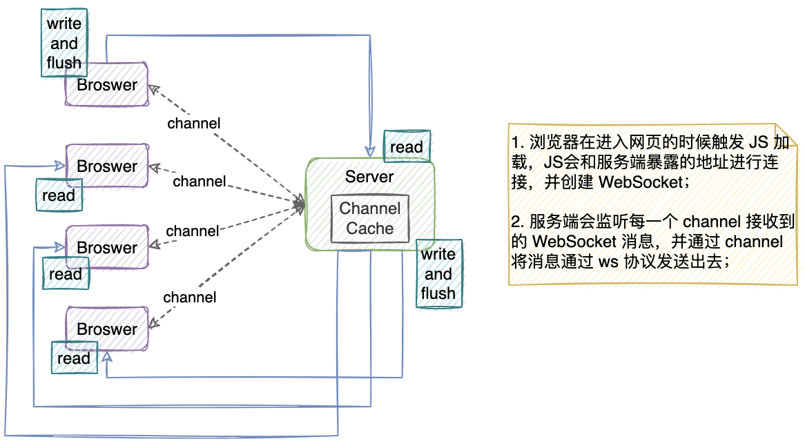

## 一、用于TCP栈示例

> 实现一个简答的多人聊天室，可以在服务端监测用户上线/下线，以及转发某个用户的消息到其他用户


```java
/**
 * @Author yiwenup
 * @Description 服务端
 */
public class NettyChatServer {

    private final int port;

    public NettyChatServer(int port) {
        this.port = port;
    }

    private void run() {
        NioEventLoopGroup bossGroup = new NioEventLoopGroup(1);
        NioEventLoopGroup workerGroup = new NioEventLoopGroup();
        try {
            ChannelFuture bind = new ServerBootstrap()
                    .group(bossGroup, workerGroup)
                    .option(ChannelOption.SO_BACKLOG, 32)
                    .childOption(ChannelOption.SO_KEEPALIVE, Boolean.TRUE)
                    .channel(NioServerSocketChannel.class)
                    .childHandler(new ChannelInitializer<SocketChannel>() {
                        @Override
                        protected void initChannel(SocketChannel ch) throws Exception {
                            ch.pipeline().addLast(new StringEncoder());
                            ch.pipeline().addLast(new StringDecoder());
                            ch.pipeline().addLast(new NettyChatServerHandler());
                        }
                    }).bind(port);
            System.out.println("服务端启动成功...");
            bind.channel().closeFuture().syncUninterruptibly();
        } finally {
            bossGroup.shutdownGracefully();
            workerGroup.shutdownGracefully();
        }
    }

    public static void main(String[] args) {
        new NettyChatServer(9999).run();
    }
}
```

```java
/**
 * @Author yiwenup
 * @Description 服务端处理
 */
public class NettyChatServerHandler extends SimpleChannelInboundHandler<String> {

    // 缓存用户通信 Channel
    private static final List<Channel> clients = new ArrayList<>();

    @Override
    public void channelActive(ChannelHandlerContext ctx) throws Exception {
        // 当某个客户端连接上服务端时触发
        Channel channel = ctx.channel();
        System.out.println("客户端" + channel.remoteAddress().toString() + "已上线...");
        // 拿到客户端-服务端之间通信的 Channel 缓存起来，方便后续做转发
        clients.add(channel);
    }

    @Override
    public void channelInactive(ChannelHandlerContext ctx) throws Exception {
        // 当某个客户端断开和服务端连接时触发
        Channel channel = ctx.channel();
        System.out.println("客户端" + channel.remoteAddress().toString() + "已下线...");
        // 从缓存中移除 Channel
        clients.remove(channel);
    }

    @Override
    protected void channelRead0(ChannelHandlerContext ctx, String msg) throws Exception {
        // 当某个客户端发送消息到达服务端时触发，此时服务端将消息转发给“其余”客户端
        Channel channel = ctx.channel();
        for (Channel client : clients) {
            if (client != channel) {
                client.writeAndFlush(client.remoteAddress().toString() + "说：" + msg);
            }
        }
    }

    @Override
    public void exceptionCaught(ChannelHandlerContext ctx, Throwable cause) throws Exception {
        cause.printStackTrace();
        Channel channel = ctx.channel();
        System.out.println("客户端" + channel.remoteAddress().toString() + "异常...");
        clients.remove(channel);
    }
}
```

---

```java
/**
 * @Author yiwenup
 * @Description 客户端
 */
public class NettyChatClient {

    private final String ip;
    private final int port;

    public NettyChatClient(String ip, int port) {
        this.ip = ip;
        this.port = port;
    }

    public void run() {
        NioEventLoopGroup eventLoopGroup = new NioEventLoopGroup();
        try {
            ChannelFuture connect = new Bootstrap()
                    .group(eventLoopGroup)
                    .channel(NioSocketChannel.class)
                    .handler(new ChannelInitializer<SocketChannel>() {
                        @Override
                        protected void initChannel(SocketChannel ch) throws Exception {
                            ch.pipeline().addLast(new StringEncoder());
                            ch.pipeline().addLast(new StringDecoder());
                            ch.pipeline().addLast(new NettyChatClientHandler());
                        }
                    })
                    .connect(ip, port)
                    .syncUninterruptibly();
            System.out.println("客户端启动成功...");
            Scanner scanner = new Scanner(System.in);
            while (scanner.hasNextLine()) {
                String msg = scanner.nextLine();
                connect.channel().writeAndFlush(msg);
            }
            connect.channel().closeFuture().syncUninterruptibly();
        } finally {
            eventLoopGroup.shutdownGracefully();
        }
    }

    public static void main(String[] args) {
        new NettyChatClient("127.0.0.1", 9999).run();
    }
}
```

```java
/**
 * @Author yiwenup
 * @Description 客户端处理
 */
public class NettyChatClientHandler extends SimpleChannelInboundHandler<String> {
    @Override
    protected void channelRead0(ChannelHandlerContext ctx, String msg) throws Exception {
        System.out.println(msg);
    }
}
```

## 二、用于HTTP栈示例

> 实现一个`http`服务器，监听8080端口，支持对浏览器的请求做处理。


```java
/**
 * @Author yiwenup
 * @Description 服务端
 */
public class NettyHttpServer {

    private final int port;

    public NettyHttpServer(int port) {
        this.port = port;
    }

    private void run() {
        NioEventLoopGroup bossGroup = new NioEventLoopGroup(1);
        NioEventLoopGroup workerGroup = new NioEventLoopGroup();
        try {
            ChannelFuture bind = new ServerBootstrap()
                    .group(bossGroup, workerGroup)
                    .option(ChannelOption.SO_BACKLOG, 32)
                    .childOption(ChannelOption.SO_KEEPALIVE, Boolean.TRUE)
                    .channel(NioServerSocketChannel.class)
                    .childHandler(new ChannelInitializer<SocketChannel>() {
                        @Override
                        protected void initChannel(SocketChannel ch) throws Exception {
                            // 对 HTTP 协议的编解码器，支持对HTTP数据包处理
                            ch.pipeline().addLast(new HttpServerCodec());
                            ch.pipeline().addLast(new NettyHttpServerHandler());
                        }
                    }).bind(port);
            System.out.println("服务端启动成功...");
            bind.channel().closeFuture().syncUninterruptibly();
        } finally {
            bossGroup.shutdownGracefully();
            workerGroup.shutdownGracefully();
        }
    }

    public static void main(String[] args) {
        new NettyHttpServer(9999).run();
    }
}
```

```java
/**
 * @Author yiwenup
 * @Description 服务端处理
 */
public class NettyHttpServerHandler extends SimpleChannelInboundHandler<HttpObject> {

    /**
     * 这里的泛型要选 HttpObject
     */
    @Override
    protected void channelRead0(ChannelHandlerContext ctx, HttpObject msg) throws Exception {
        if (msg instanceof HttpRequest request) {
            System.out.println("request.uri() = " + request.uri());
            ByteBuf content = Unpooled.copiedBuffer("Hello World! 你好，这是服务端响应", CharsetUtil.UTF_8);
            // 手动构造响应报文结构，否则浏览器会解析不出服务端响应的
            DefaultFullHttpResponse response = new DefaultFullHttpResponse(
                    HttpVersion.HTTP_1_1, HttpResponseStatus.OK, content);
            response.headers().add(HttpHeaderNames.CONTENT_TYPE, "text/html;charset=UTF-8");
            response.headers().add(HttpHeaderNames.CONTENT_LENGTH, content.readableBytes());
            ctx.writeAndFlush(response);
        }
    }
}
```

## 三、用于WebSocket栈示例

> http协议是用在应用层的协议，他是基于tcp协议的，http协议建立连接也必须要有三次握手才能发送信息。 http连接分为短连接，长连接，短连接是每次请求都要三次握手才能发送自己的信息。即每一个request对应一个response。长连接是在一定的期限内保持连接。保持TCP连接不断开。客户端与服务器通信，必须要有客户端先发起, 然后服务器返回结果。客户端是主动的，服务器是被动的。 **客户端要想实时获取服务端消息就得不断发送长连接到服务端**
>
> WebSocket实现了多路复用，他是全双工通信。在webSocket协议下服务端和客户端可以同时发送信息。 建立了WebSocket连接之后, 服务端可以主动发送信息到客户端。而且信息当中不必在带有head的部分信息了与http的长链接通信来说，这种方式，**不仅能降低服务器的压力。而且信息当中也减少了部分多余的信息**
>
> 这里在示例一的基础上，做一个网页版的群聊。



```java
/**
 * @Author yiwenup
 * @Description Netty服务
 */
@Component
public class NettyServer implements Runnable {

    @Resource
    private NettyProperties nettyProperties;
    @Resource
    private NettyChannelInitializer nettyChannelInitializer;

    private NioEventLoopGroup bossGroup;
    private NioEventLoopGroup workerGroup;

    @PostConstruct
    public void start() {
        bossGroup = new NioEventLoopGroup(1);
        workerGroup = new NioEventLoopGroup();
    }

    @PreDestroy
    public void destroy() {
        bossGroup.shutdownGracefully();
        workerGroup.shutdownGracefully();
    }

    @Override
    public void run() {
        try {
            ChannelFuture bindFuture = new ServerBootstrap()
                    .group(bossGroup, workerGroup)
                    .channel(NioServerSocketChannel.class)
                    .handler(new LoggingHandler(LogLevel.DEBUG))
                    .childHandler(nettyChannelInitializer)
                    .bind(nettyProperties.getPort())
                    .syncUninterruptibly();
            System.out.println("Netty服务启动完成...");
            bindFuture.channel().closeFuture().syncUninterruptibly();
        } catch (Exception e) {
            bossGroup.shutdownGracefully();
            workerGroup.shutdownGracefully();
            throw new RuntimeException(e);
        } finally {
            bossGroup.shutdownGracefully();
            workerGroup.shutdownGracefully();
        }
    }
}
```

```java
/**
 * @Author yiwenup
 * @Description 通道初始化
 */
@Component
public class NettyChannelInitializer extends ChannelInitializer<SocketChannel> {

    @Resource
    private NettyServerHandler nettyServerHandler;
    @Resource
    private NettyProperties nettyProperties;

    @Override
    protected void initChannel(SocketChannel ch) throws Exception {
        ch.pipeline().addLast(new HttpServerCodec());
        ch.pipeline().addLast(new ChunkedWriteHandler());
        ch.pipeline().addLast(new HttpObjectAggregator(8 * 1_000));
        // 这里最关键的就是这个WebSocket编解码器
        ch.pipeline().addLast(new WebSocketServerProtocolHandler(nettyProperties.getPath()));
        ch.pipeline().addLast(nettyServerHandler);
    }
}
```

```java
/**
 * @Author yiwenup
 * @Description 通道处理
 */
@ChannelHandler.Sharable
@Component
public class NettyServerHandler extends SimpleChannelInboundHandler<TextWebSocketFrame> {

    private List<Channel> channels = new ArrayList<>();

    @Override
    public void channelActive(ChannelHandlerContext ctx) throws Exception {
        Channel channel = ctx.channel();
        channels.add(channel);
        System.out.println("客户端" + channel.remoteAddress().toString().substring(1) + "已上线...");
    }

    /**
     * 泛型要选用 TextWebSocketFrame
     */
    @Override
    protected void channelRead0(ChannelHandlerContext ctx, TextWebSocketFrame msg) throws Exception {
        Channel channel = ctx.channel();
        String text = msg.text();
        System.out.println("客户端[" + channel.remoteAddress().toString().substring(1) + "]发送消息：" + text);
        for (Channel ch : channels) {
            if (ch != channel) {
                ch.writeAndFlush(new TextWebSocketFrame(text));
            }
        }
    }

    @Override
    public void channelInactive(ChannelHandlerContext ctx) throws Exception {
        Channel channel = ctx.channel();
        channels.remove(channel);
        System.out.println("客户端" + channel.remoteAddress().toString().substring(1) + "已下线...");
    }

    @Override
    public void exceptionCaught(ChannelHandlerContext ctx, Throwable cause) throws Exception {
        cause.printStackTrace();
        channels.remove(ctx.channel());
    }
}
```
