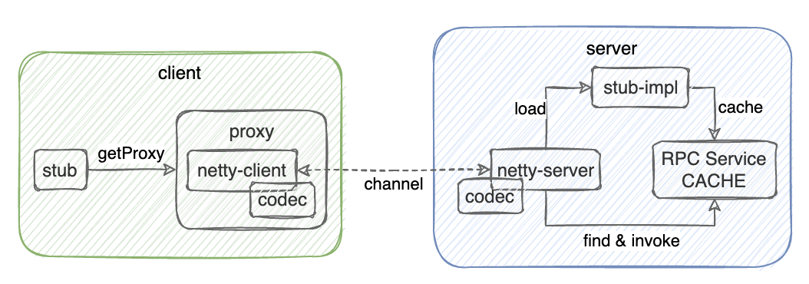

> RPC，即远程过程调用（ remote procedure call）。借助RPC可以做到像本地调用一样调用远程服务，是一种进程间的通信方式。**需要注意的是`RPC`并不是一个具体的技术，而是指整个网络远程调用过程。**

## 一、Java RMI

Java RMI，即远程方法调用(Remote Method Invocation)，是 Java 原生对 RPC 的一种实现。**它的实现依赖于JVM，因此它仅支持从一个JVM 进程到另一个 JVM 进程的调用。**


1. 客户端从远程服务器的注册表中查询并获取远程对象引用。 
2. 桩对象与远程对象具有相同的接口和方法列表，当客户端调用远程对象时，实际上是由相应的桩对象代理完成的。
3. 远程引用层在将桩的本地引用转换为服务器上对象的远程引用后，再将调用传递给传输层（Transport），由传输层通过TCP协议发送调用； 
4. 在服务器端，传输层监听入站连接，它一旦接收到客户端远程调用后，就将这个引用转发给其上层的远程引用层；
   1. 服务器端的远程引用层将客户端发送的远程应用转换为本地虚拟机的引用后，再将请求传递给骨架(Skeleton)；
   2. 骨架读取参数，又将请求传递给服务器，最后由服务器进行实际的方法调用。
5. 如果远程方法调用后有返回值，则服务器将这些结果又沿着“骨架->远程引用层->传输层”向下传递；
6. 客户端的传输层接收到返回值后，又沿着“传输层->远程引用层->桩”向上传递，然后由桩来反序列化这些返回值，并将最终的结果传递给客户端程序。

**使用步骤：**

1. 创建接口协议，这个接口协议后续会同时用在客户端（消费方）和服务端（提供方），注意这个接口需要`extends java.rmi.Remote`，并且接口中的抽象方法必须`throws java.rmi.RemoteException`

   ```java
   public interface CustUserService extends Remote {
       UserDTO getUserByUsername(String username) throws RemoteException;
   }
   ```

2. 服务端实现接口协议，注意还要同时`extends java.rmi.server.UnicastRemoteObject`，并在构造器中调用`super()`

   ```java
   public class CustUserServiceImpl extends UnicastRemoteObject implements CustUserService {
   
       @Serial
       private static final long serialVersionUID = -1534897060661745094L;
   
       private static final List<UserDTO> USER_DTO_LIST = List.of(
               new UserDTO("zhangsan", "123"),
               new UserDTO("lisi", "456")
       );
   
       public CustUserServiceImpl() throws RemoteException {
           super();
       }
   
       @Override
       public UserDTO getUserByUsername(String username) throws RemoteException {
           return USER_DTO_LIST.stream()
                   .filter(user -> username.equals(user.getUsername()))
                   .findFirst().orElse(null);
       }
   }
   ```

3. 在服务端注册`skeleton`具体的实现，即第2步的实例

   ```java
   public class RMIServer {
       public static void main(String[] args) {
           try {
               Registry registry = LocateRegistry.createRegistry(9999);
               CustUserService custUserService = new CustUserServiceImpl();
               registry.rebind("custUserService", custUserService);
               // 阻塞线程，等待客户端调用
               TimeUnit.MINUTES.sleep(2L);
           } catch (Exception e) {
               throw new RuntimeException(e);
           }
       }
   }
   ```

4. 在客户端获取注册的 stub 的 RPC 代理并调用

   ```java
   public class RMIClient {
       public static void main(String[] args) {
           try {
               Registry registry = LocateRegistry.getRegistry("127.0.0.1", 9999);
               CustUserService custUserService = (CustUserService) registry.lookup("custUserService");
               UserDTO userDTO = custUserService.getUserByUsername("lisi");
               System.out.println(userDTO.getUsername());
           } catch (Exception e) {
               throw new RuntimeException(e);
           }
       }
   }
   ```

## 二、使用Netty实现RPC

> Java 原生的 RMI 严重依赖序列化和反序列化，而这种情况下可能会造成严重的安全漏洞，因为 Java 的序列化和反序列化不但涉及到数据，还涉及到二进制的字节码，即使使用白名单机制也很难保证 100% 排除恶意构造的字节码。因此，使用RMI时，双方必须是内网互相信任的机器，不要把通信端口暴露在公网上作为对外服务。
>
> 基于此，市面上才会出现许多 RPC 框架以满足使用需求，如：Dubbo、gRPC等。这里我们尝试使用 Netty 自己搭建一套 RPC 实现。



1. 根据 RPC 的特性，消费方和提供方都需要约定一个接口协议，这个协议在客户端就是一份 stub，在服务端需要提供这个协议的具体实现，用 stub-impl 表示
2. 消费方在具体调用 stub 之前，可以由我们封装的 sdk 提供一个 ProxyFactory 来创建代理对象
3. 消费方利用创建出来的代理对象调用方法，代理对象内部实际上通过 JDK 动态代理机制，为其增强了一个 netty 客户端，在代理对象创建出来时，netty 客户端和服务端建立通信
4. netty 客户端将开发者的调用信息封装为一个 RpcRequest，并将这个 RpcRequest 通过 channel 发送给服务端
5. 提供方在系统启动时，载入所有的 stub-impl 至一个缓存中
6. 提供方使用 netty 服务端，在接收到来自 netty 客户端的数据后，解析 RpcRequest 并匹配远程消费方期望调用的服务，从缓存中取出实例执行，得到返回结果再封装 RpcResponse 通过 channel 发送给 netty 客户端
7. netty 客户端最终将远程返回的数据解析出来

**服务端实现：**

```java
/**
 * @Author yiwenup
 * @Description 标识当前的服务为一个 RPC 服务，并能注册在 Spring IOC 中
 */
@Target({ElementType.TYPE})
@Retention(RetentionPolicy.RUNTIME)
@Component
public @interface RpcService {
}
```

```java
/**
 * @Author yiwenup
 * @Description stub-impl
 */
@RpcService
public class UserServiceImpl implements UserService {

    private static final List<UserDTO> USER_DTO_LIST = List.of(
            new UserDTO("zhangsan", "123"),
            new UserDTO("lisi", "456")
    );

    @Override
    public UserDTO getUserByUsername(String username) {
        return USER_DTO_LIST.stream()
                .filter(user -> username.equals(user.getUsername()))
                .findFirst().orElse(null);
    }
}
```

```java
/**
 * @Author yiwenup
 * @Description netty 服务端
 */
@Component
public class RpcServer implements DisposableBean {

    private NioEventLoopGroup bossGroup;
    private NioEventLoopGroup workerGroup;

    @Resource
    private RpcServerHandler rpcServerHandler;

    @PostConstruct
    public void postConstruct() {
        bossGroup = new NioEventLoopGroup(1);
        workerGroup = new NioEventLoopGroup();
    }

    @PreDestroy
    public void preDestroy() {
        if (bossGroup != null) {
            bossGroup.shutdownGracefully();
        }
        if (workerGroup != null) {
            workerGroup.shutdownGracefully();
        }
    }

    public void serverStart(int port) {
        try {
            ChannelFuture bindFuture = new ServerBootstrap()
                    .group(bossGroup, workerGroup)
                    .channel(NioServerSocketChannel.class)
                    .childHandler(new ChannelInitializer<SocketChannel>() {
                        @Override
                        protected void initChannel(SocketChannel ch) throws Exception {
                            ch.pipeline().addLast(new StringEncoder(CharsetUtil.UTF_8));
                            ch.pipeline().addLast(new StringDecoder(CharsetUtil.UTF_8));
                            ch.pipeline().addLast(rpcServerHandler);
                        }
                    }).bind(port).syncUninterruptibly();
            System.out.println("RPC服务端启动成功，监听端口[" + port + "]...");
            bindFuture.channel().closeFuture().syncUninterruptibly();
        } catch (Exception e) {
            throw new RuntimeException(e);
        } finally {
            if (bossGroup != null) {
                bossGroup.shutdownGracefully();
            }
            if (workerGroup != null) {
                workerGroup.shutdownGracefully();
            }
        }
    }

    @Override
    public void destroy() throws Exception {
        if (bossGroup != null) {
            bossGroup.shutdownGracefully();
        }
        if (workerGroup != null) {
            workerGroup.shutdownGracefully();
        }
    }
}
```

```java
/**
 * @Author yiwenup
 * @Description 服务端处理，主要是解析RpcRequset，再匹配执行本地实例方法，最终封装RpcResponse
 */
@Component
@ChannelHandler.Sharable
public class RpcServerHandler extends SimpleChannelInboundHandler<String> implements ApplicationContextAware {

    private final static Map<String, Object> SERVICE_MAP = new ConcurrentHashMap<>();

    private final ObjectMapper objectMapper = new ObjectMapper();

    @Override
    public void channelActive(ChannelHandlerContext ctx) throws Exception {
        System.out.println("有客户端连接...");
    }

    @Override
    protected void channelRead0(ChannelHandlerContext ctx, String msg) throws Exception {
        RpcRequest rpcRequest = objectMapper.readValue(msg, RpcRequest.class);
        RpcResponse rpcResponse = new RpcResponse();
        rpcResponse.setRequestId(rpcRequest.getRequestId());
        try {
            Object service = SERVICE_MAP.get(rpcRequest.getClassName());
            if (service == null) {
                throw new RuntimeException("未匹配到服务实例");
            }
            FastClass fastClass = FastClass.create(service.getClass());
            FastMethod fastMethod = fastClass.getMethod(rpcRequest.getMethodName(), rpcRequest.getParameterTypes());
            rpcResponse.setResult(fastMethod.invoke(fastClass, rpcRequest.getParameters()));
        } catch (Exception e) {
            rpcResponse.setError(e.getMessage());
        }
        ctx.writeAndFlush(objectMapper.writeValueAsString(rpcResponse));
    }

    @Override
    public void exceptionCaught(ChannelHandlerContext ctx, Throwable cause) throws Exception {
        cause.printStackTrace();
    }

    @Override
    public void setApplicationContext(ApplicationContext context) throws BeansException {
        context.getBeansWithAnnotation(RpcService.class).forEach((k, v) -> {
            if (v.getClass().getInterfaces().length == 0) {
                throw new RuntimeException("当前实例未实现接口");
            }
            SERVICE_MAP.put(v.getClass().getInterfaces()[0].getName(), v);
        });
    }
}
```

```java
/**
 * @Author yiwenup
 * @Description
 */
@SpringBootApplication
public class ProviderServerApp implements CommandLineRunner {

    public static void main(String[] args) {
        SpringApplication.run(ProviderServerApp.class, args);
    }

    @Resource
    private RpcServer rpcServer;

    @Override
    public void run(String... args) throws Exception {
        new Thread(() -> rpcServer.serverStart(9999)).start();
    }
}
```

**客户端实现：**

```java
/**
 * 文件描述
 *
 * @Project yiwenup-sample
 * @Package cloud.yiwenup.sample.consumer.netty
 * @Author yiwenup
 * @Date 2024-06-19 19:16:56
 * @Description netty客户端
 */
public class RpcClient implements Closeable {

    private final String ip;
    private final int port;

    private NioEventLoopGroup nioEventLoopGroup;
    private Channel channel;
    private final RpcClientHandler rpcClientHandler = new RpcClientHandler();
    private final ExecutorService executorService = Executors.newCachedThreadPool();

    public RpcClient(String ip, int port) {
        this.ip = ip;
        this.port = port;
        initNettyClient();
    }

    public void initNettyClient() {
        try {
            nioEventLoopGroup = new NioEventLoopGroup();
            ChannelFuture connectFuture = new Bootstrap()
                    .group(nioEventLoopGroup)
                    .channel(NioSocketChannel.class)
                    .handler(new ChannelInitializer<SocketChannel>() {
                        @Override
                        protected void initChannel(SocketChannel ch) throws Exception {
                            ch.pipeline().addLast(new StringEncoder(CharsetUtil.UTF_8));
                            ch.pipeline().addLast(new StringDecoder(CharsetUtil.UTF_8));
                            ch.pipeline().addLast(rpcClientHandler);
                        }
                    })
                    .connect(ip, port)
                    .syncUninterruptibly();
            System.out.println("RPC客户端启动成功...");
            channel = connectFuture.channel();
        } catch (Exception e) {
            throw new RuntimeException(e);
        }
    }

    @Override
    public void close() {
        if (channel != null) {
            channel.close();
        }
        if (nioEventLoopGroup != null) {
            nioEventLoopGroup.shutdownGracefully();
        }
    }

    public String sendMsg(String msg) {
        rpcClientHandler.setRequestMsg(msg);
        Future<String> future = executorService.submit(rpcClientHandler);
        try {
            return future.get();
        } catch (Exception e) {
            throw new RuntimeException(e);
        }
    }
}
```

```java
/**
 * @Author yiwenup
 * @Description 客户端处理器
 */
public class RpcClientHandler extends SimpleChannelInboundHandler<String> implements Callable<String> {

    private ChannelHandlerContext context;
    private String requestMsg;
    private String responseMsg;

    public void setRequestMsg(String requestMsg) {
        this.requestMsg = requestMsg;
    }

    @Override
    public void channelActive(ChannelHandlerContext ctx) throws Exception {
        context = ctx;
    }

    @Override
    protected synchronized void channelRead0(ChannelHandlerContext ctx, String msg) throws Exception {
        responseMsg = msg;
        notify();
    }

    @Override
    public synchronized String call() throws Exception {
        context.writeAndFlush(requestMsg);
        wait();
        return responseMsg;
    }

    @Override
    public void exceptionCaught(ChannelHandlerContext ctx, Throwable cause) throws Exception {
        cause.printStackTrace();
    }
}
```

```java
/**
 * 文件描述
 *
 * @Project yiwenup-sample
 * @Package cloud.yiwenup.sample.consumer.netty
 * @Author yiwenup
 * @Date 2024-06-20 11:18:15
 * @Description 创建RPC远程代理
 */
public class RemoteProxy {

    private final static ObjectMapper OBJECT_MAPPER = new ObjectMapper();

    @SuppressWarnings("unchecked")
    public static <T> T createProxy(Class<T> interfazz) {
        return (T) Proxy.newProxyInstance(Thread.currentThread().getContextClassLoader(), new Class[]{interfazz}, (proxy, method, args) -> {
            try (RpcClient rpcClient = new RpcClient("127.0.0.1", 9999)) {
                RpcRequest rpcRequest = new RpcRequest();
                rpcRequest.setRequestId(UUID.randomUUID().toString());
                rpcRequest.setClassName(method.getDeclaringClass().getName());
                rpcRequest.setMethodName(method.getName());
                rpcRequest.setParameterTypes(method.getParameterTypes());
                rpcRequest.setParameters(args);
                String msg = rpcClient.sendMsg(OBJECT_MAPPER.writeValueAsString(rpcRequest));
                RpcResponse rpcResponse = OBJECT_MAPPER.readValue(msg, RpcResponse.class);
                if (rpcResponse.getError() != null) {
                    throw new RuntimeException(rpcResponse.getError());
                }
                return OBJECT_MAPPER.convertValue(rpcResponse.getResult(), method.getReturnType());
            }
        });
    }
}
```

```java
/**
 * @Author yiwenup
 * @Description
 */
public class ConsumerClientApp {
    public static void main(String[] args) {
        UserService userService = RemoteProxy.createProxy(UserService.class);
        UserDTO userDTO = userService.getUserByUsername("zhangsan");
        System.out.println(userDTO);
    }
}
```

