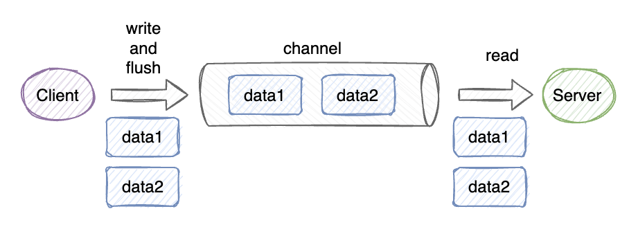

## 一、粘包和拆包原理

基于`TCP`协议的网络数据传输我们可以将其理解为是一个流，既然是流的形式，那么实际上是没有边界的概念的，客户端和服务端在交换数据的期间并不明确业务含义。**`TCP`只会根据底层缓冲区的情况划分数据包传送，因此在业务理解上的一个完整数据段可能会被拆分为多个数据包，或者将多个完整数据段合并为一个数据包。**

- 正常情况下，发送端和接收端通信，假设发送端发送`data1`和`data2`两份业务数据，接收端也能获取到`data1`和`data2`两份数据，则没有发生任何的粘包或粘包。

  

- 当发送端和接收端通信过程中，由于某个业务数据比较大，超出了本次数据传递的载荷，则可能会发生拆包，比如`data1`的数据内容比较多，那么可能会被拆分为`data1-1`和`data1-2`两份数据分别发送，数据最终在接收端看来就是两份数据，这种情况就是拆包。

  

- 当发送端和接收端通信过程中，由于某两次的数据包内容很小，通信层出于资源利用优化的考虑，会将两个数据包合并发送，比如`data1`和`data2`两份数据会被合并发送，数据最终在接收端看来就是一份整体的数据，这种情况就是粘包。

  

- 粘包和拆包也会有可能同时发生，比如发送端发送的`data1`和`data2`两份数据都是比较大的数据，因此缓冲区会将其拆分成两份数据，但是又因为拆分后的数据可能存在比较小的数据内容，因此会出现数据合并发送情况，此时既发生了拆包又发生了粘包。

  

## 二、粘包复现

当发送端连续发送`10`次一小段数据时，则可能会触发数据粘包。

```java
ch.pipeline().addLast(new SimpleChannelInboundHandler<String>() {
    @Override
    public void channelActive(ChannelHandlerContext ctx) throws Exception {
        for (int i = 0; i < 10; i++) {
            ctx.writeAndFlush("[" + i + "]Hello World!");
        }
    }

    @Override
    protected void channelRead0(ChannelHandlerContext ctx, String msg) throws Exception {

    }
});
```

此时接收端接收数据时，可以记录获取数据的次数来判断。粘包的情况下，`count`打印结果小于`10`

```java
ch.pipeline().addLast(new SimpleChannelInboundHandler<String>() {

    private int count = 0;

    @Override
    protected void channelRead0(ChannelHandlerContext ctx, String msg) throws Exception {
        System.out.println("客户端发来消息：" + msg);
        System.out.println("大小：" + Unpooled.copiedBuffer(msg.getBytes()).readableBytes());
        System.out.println("当前计数" + (++count));
    }
});
```

## 三、拆包复现

当发送端连续发送`10`次`102400`字节长度的数据时，则可能会触发拆包。

```java
ch.pipeline().addLast(new SimpleChannelInboundHandler<String>() {
    @Override
    public void channelActive(ChannelHandlerContext ctx) throws Exception {
        byte[] bytes = new byte[102400];
        Arrays.fill(bytes, 0);
        for (int i = 0; i < 10; i++) {
            ctx.writeAndFlush(new String(bytes));
        }
    }

    @Override
    protected void channelRead0(ChannelHandlerContext ctx, String msg) throws Exception {

    }
});
```

此时接收端接收数据时，可以记录获取数据的次数来判断。粘包的情况下，`count`打印结果大于`10`

```java
ch.pipeline().addLast(new SimpleChannelInboundHandler<String>() {

    private int count = 0;

    @Override
    protected void channelRead0(ChannelHandlerContext ctx, String msg) throws Exception {
        System.out.println("客户端发来消息：" + msg);
        System.out.println("大小：" + Unpooled.copiedBuffer(msg.getBytes()).readableBytes());
        System.out.println("当前计数" + (++count));
    }
});
```

## 四、解决方式

Netty提供了4种解码器，分别如下（这些**解码器要放在接收端，并且要放在 pipeline 的最前面**）：

- FixedLengthFrameDecoder：固定长度的拆包器，每个应用层数据包的都拆分成都是固定长度的大小

  ```java
  // 注意：解决粘包、拆包的解码器要放在最前面，否则失效
  ch.pipeline().addLast(new FixedLengthFrameDecoder(102400));
  ch.pipeline().addLast(new StringEncoder(CharsetUtil.UTF_8));
  ch.pipeline().addLast(new StringDecoder(CharsetUtil.UTF_8));
  ```

- LineBasedFrameDecoder：行拆包器，每个应用层数据包，都以换行符作为分隔符，进行分割拆分

  ```java
  // 注意：解决粘包、拆包的解码器要放在最前面，否则失效
  ch.pipeline().addLast(new LineBasedFrameDecoder(102400, true, true));
  ch.pipeline().addLast(new StringEncoder(CharsetUtil.UTF_8));
  ch.pipeline().addLast(new StringDecoder(CharsetUtil.UTF_8));
  ```

- DelimiterBasedFrameDecoder：分隔符拆包器，每个应用层数据包，都通过自定义的分隔符，进行分割拆分

  ```java
  // 注意：解决粘包、拆包的解码器要放在最前面，否则失效
  ch.pipeline().addLast(new DelimiterBasedFrameDecoder(102400,Unpooled.copiedBuffer("@".getBytes(CharsetUtil.UTF_8))));
  ch.pipeline().addLast(new StringEncoder(CharsetUtil.UTF_8));
  ch.pipeline().addLast(new StringDecoder(CharsetUtil.UTF_8));
  ```

- LengthFieldBasedFrameDecoder：基于数据包长度的拆包器，将应用层数据包的长度，作为接收端应用层数据包的拆分依据。按照应用层数据包的大小，拆包。**这个拆包器，有一个要求，就是应用层协议中包含数据包的长度**
