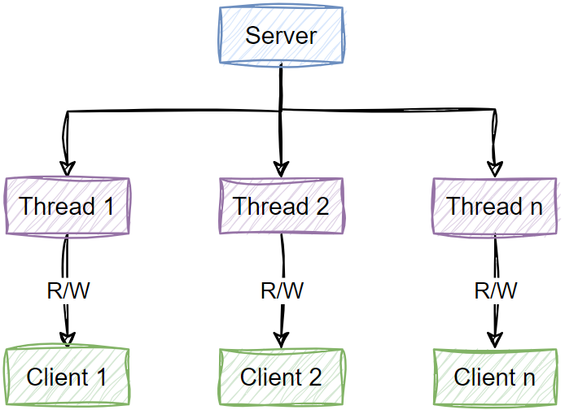

## 一、Reactor线程模型

传统的线程模型，是阻塞的，比如`Socket`编程，服务端对于一个客户端连接请求必须分配一个线程处理，如果这个请求所访问的资源尚未就绪，那么线程就会一直阻塞等待资源访问完成。

这种模式的缺点就是：当并发量上来的时候，服务端线程资源会快速占用，如果某些请求还阻塞了，那么服务器资源就会被消耗殆尽。

基于传统阻塞式`I/O`模型的问题，`Reactor`模式使用`I/O`复用监听事件的方式，将请求连接和业务处理解耦开来，由专门的线程监听连接事件，并将连接处理之后分派给其余线程继续业务处理。

`Reactor`模型有三种模式：

- 单`Reactor`单线程：Reactor 对象通过 Selector监控客户端请求事件，收到事件后通过 Dispatch 进行分发；如果是建立连接请求事件，则由 Acceptor 通过 Accept 处理连接请求，然后创建一个 Handler 对象处理连接完成后的后续业务处理。

  

- 单`Reactor`多线程：Reactor 对象通过 Selector 监控客户端请求事件，收到事件后，通过 Dispatch 进行分发；如果建立连接请求，则由 Acceptor 通过 Accept 处理连接请求；如果不是连接请求，则由 Reactor 分发调用连接对应的 Handler 来处理；Handler 只负责响应事件，不做具体的业务处理，进一步分发给后面的 worker 线程池的某个线程处理业务；Worker 线程池会分配独立线程完成真正的业务，并将结果返回给 Handler；Handler 收到响应后，再将结果返回给客户端。

  

- 主从`Reactor`多线程：Reactor 主线程 MainReactor 对象通过 Selector 监听客户端连接事件，收到事件后，通过 Acceptor 处理客户端连接事件；当 Acceptor 处理完客户端连接事件之后（与客户端建立好 Socket 连接），MainReactor 将连接分配给 SubReactor；SubReactor 将连接加入到自己的连接队列进行监听，并创建 Handler 对各种事件进行处理；当连接上有新事件发生的时候，SubReactor 就会调用对应的 Handler 处理；Handler 从连接上读取请求数据，将请求数据分发给 Worker 线程池进行业务处理；Worker 线程池会分配独立线程来完成真正的业务处理，并将处理结果返回给 Handler，Handler 向客户端发送响应数据；一个 MainReactor 可以对应多个 SubReactor，即一个 MainReactor 线程可以对应多个 SubReactor 线程。

  

## 二、Netty线程模型

> `Netty`就是在主从`Reactor`多线程模式的基础上，做了一定的改进。

- Netty 抽象出两组线程池：BossGroup 和 WorkerGroup，也可以叫做 BossNioEventLoopGroup 和 WorkerNioEventLoopGroup。每个线程池中都有 NioEventLoop 线程。**BossGroup 中的线程专门负责和客户端建立连接，WorkerGroup 中的线程专门负责处理连接上的读写**。BossGroup 和 WorkerGroup 的类型都是 NioEventLoopGroup。
- NioEventLoopGroup 相当于一个事件循环组，这个组中含有多个事件循环，每个事件循环就是一个 NioEventLoop
- NioEventLoop 表示一个不断循环的执行事件处理的线程，每个 NioEventLoop 都包含一个 Selector，用于监听注册在其上的 Socket 网络连接（Channel）
- NioEventLoopGroup 可以含有多个线程，即可以含有多个 NioEventLoop
- 每个 BossNioEventLoop 中循环执行以下三个步骤
  - **select**：轮训注册在其上的 ServerSocketChannel 的 accept 事件（OP_ACCEPT 事件）
  - **processSelectedKeys**：处理 accept 事件，与客户端建立连接，生成一个 NioSocketChannel，并将其注册到某个 WorkerNioEventLoop 上的 Selector 上
  - **runAllTasks**：再去以此循环处理任务队列中的其他任务
- 每个 WorkerNioEventLoop 中循环执行以下三个步骤
  - **select**：轮训注册在其上的 NioSocketChannel 的 read/write 事件（OP_READ/OP_WRITE 事件）
  - **processSelectedKeys**：在对应的 NioSocketChannel 上处理 read/write 事件
  - **runAllTasks**：再去以此循环处理任务队列中的其他任务
- 在以上两个**processSelectedKeys**步骤中，会使用 Pipeline（管道），Pipeline 中引用了 Channel，即通过 Pipeline 可以获取到对应的 Channel，Pipeline 中维护了很多的处理器（拦截处理器、过滤处理器、自定义处理器等）。
