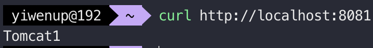
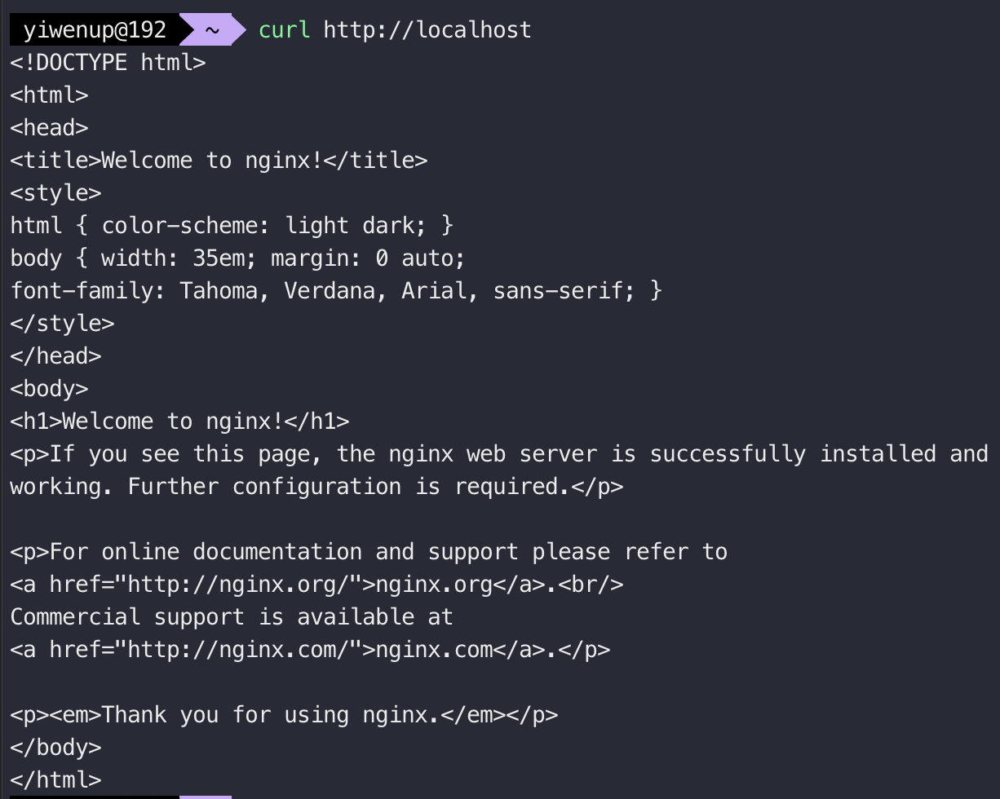
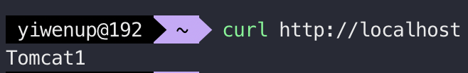

> 出于经济原因，笔者没有购买云服务器做练习，以下示例都采用`Docker`容器化部署`Nginx`以及`Tomcat`

## 一、反向代理

> 使用`Docker`启动一个`Tomcat`，并使用`Nginx`代理该`Tomcat`，实现反向代理。

1. `Tomcat`与`Nginx`服务启动

   ```sh
   docker run docker run --name tomcat1 -p 8081:8080 -it -d tomcat:8.5.100-jre8
   ```

   ```sh
   docker run docker run --name nginx -v ~/customize.conf:/etc/nginx/conf.d/customize.conf -it -p 80:80 -d nginx:stable-perl
   ```

2. 访问`http://localhost:8081`可以看见`Tomcat`的首页，笔者这里进入了`Tomcat`容器对`webapps/ROOT/index.jsp`做了调整

   

3. 访问`http://localhost`可以看见`Nginx`的欢迎页

   

4. 修改在宿主机上挂载的`customize.conf`配置文件，**反向代理是通过`proxy_pass`进行配置的**

   ```nginx
   server {
       listen       80;
       listen  [::]:80;
       server_name  localhost;
       
       location / {
           #root   /usr/share/nginx/html;
           #index  index.html index.htm;
           # Nginx 反向代理主要是通过 proxy_pass 配置
           proxy_pass http://172.17.0.2:8080/;
       }
   }
   ```

5. 重启`Nginx`容器，访问`http://localhost`可以看见`Tomcat`首页即为配置成功

   ```sh
   docker restart nginx
   ```

   

## 二、负载均衡

> 继续上述场景，现在再用`Docker`启动一个`Tomcat`，将其首页标识为`Tomcat2`，需要用`Nginx`代理这两个`Tomcat`组成的集群，实现请求负载能落到两个`Tomcat`的任何一个处理请求

1. 启动第二个`Tomcat`容器

   ```sh
   docker run docker run --name tomcat2 -p 8082:8080 -it -d tomcat:8.5.100-jre8
   ```

2. 访问`http://localhost:8082`可以看见第二个`Tomcat`的首页

   

3. 修改在宿主机上挂载的`customize.conf`配置文件，**负载均衡是通过`upstream`配合`proxy_pass`进行配置的**

   ```nginx
   # 声明服务集群
   upstream tomcat-cluster {
     server 172.17.0.2:8080;
     server 172.17.0.4:8080;
   }
   
   server {
       listen       80;
       listen  [::]:80;
       server_name  localhost;
   
       location / {
           # 这里要配置成 http://<host-name>/;
           proxy_pass http://tomcat-cluster/;
       }
   }


## 三、动静分离

> 继续第二部分的场景，现在需要一些静态资源访问经过`Nginx`直接处理返回，不再向后代理给`Tomcat`集群处理

调整宿主机上挂载的`customize.conf`配置文件，后续访问`http://localhost/html/index.html`则返回`Nginx`的首页地址

```nginx
upstream tomcat-cluster {
  server 172.17.0.2:8080;
  server 172.17.0.4:8080;
}

server {
    listen       80;
    listen  [::]:80;
    server_name  localhost;

    location / {
        proxy_pass http://tomcat-cluster/;
    }

    location /html/ {
        # 当请求有 /html/ 前缀时，会访问 /usr/share/nginx/ 目录，找到 /html/xxx 静态资源返回
        root   /usr/share/nginx;
    }
}
```


## 四、可能出现的问题

在使用同一宿主机`Docker`部署的情况下，`Nginx`一般不能直接请求通`Tomcat`容器，所以在`Nginx`容器侧无论怎么配置，反向代理也好负载均衡也罢，返回要么是 404 要么是 502

因此需要借助`Docker`网桥才能使`Nginx`容器访问到`Tomcat`容器，可以**通过如下命令查看`Docker`给各个容器所分配的`ip`地址，该`ip`地址在容器间是能互相访问通的**。

```sh
docker network inspect bridge
```

