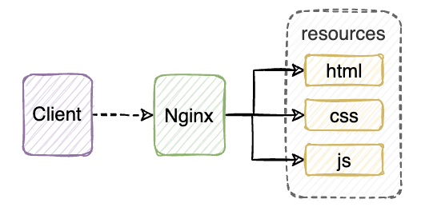
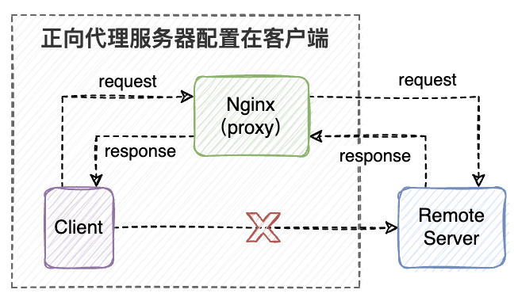
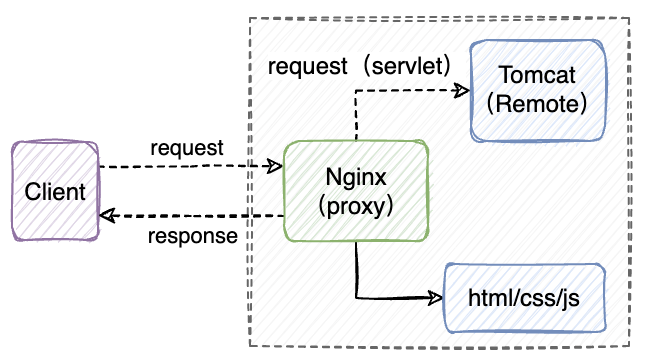

## 一、基础概念

`Nginx`是一个`HTTP`服务器，也可以作为反向代理、负载均衡器、静态资源缓存等场景使用，具有占用内存少、稳定性高、并发能力强等优势。

主要特点如下：

- 占用内存少，并发能力强。根据官方检测报告，`Nginx`能支持`5w`个并发，而在实际运用中，确实能支持`2~4w`个并发。
- 跨平台。可以在大多数类`unix`操作系统上运行。
- 上手容易，配置简单。主要就是一份`nginx.cnf`配置文件。
- 稳定性好，宕机概率低。

## 二、应用场景

### 2.1 HTTP 服务器

`Nginx`作为`HTTP`服务器使用是比较常见的使用场景，通常用于部署前端的`html/css/js`等资源。



### 2.2 正向代理服务器

当使用客户端无法访问远程服务的时候，可以借助代理服务器，客户端需要在本地配置好代理服务器的代理策略，后续客户端的请求都可以交由代理服务器，由代理服务器将请求转发给远程服务，再将远程服务的响应信息返回响应给客户端。



### 2.3 反向代理服务器

反向代理和正向代理最大的区别就是客户端不再需要配置代理服务器，并且实际的远程服务端在反向代理的作用下，不再对客户端可见。


### 2.4 负载均衡服务器

`Nginx`作为负载均衡服务器主要是解决服务端单实例的高负载问题，因此`Nginx`作为负载均衡服务器的同时通常也是一个反向代理服务器，而负载均衡发生的时机实际上就是该反向代理服务器根据背后的服务节点负载能力将请求转发这一环节。


### 2.5 动静分离

对于一些规模相对较大的应用来说，不会仅仅只涉及前端静态资源部署，后面一般都会有一个后端服务存在，最为经典的组合就是`Nginx + Tomcat`，前者将项目中的静态资源进行部署缓存，后者专注处理动态资源`Servlet`，这样才能充分发挥各自作为`web`服务器的优势。



## 三、原生方式安装

> 可参照官方文档：https://docs.nginx.com/nginx/admin-guide/installing-nginx/installing-nginx-open-source/#compiling-and-installing-from-source

1. 下载`Nginx`源码包并解压

   ```sh
   wget https://nginx.org/download/nginx-1.25.1.tar.gz && tar -zxvf nginx-1.25.1.tar.gz && cd nginx-1.25.1
   ```

2. 安装编译依赖

   ```sh
   yum install -y gcc pcre-devel zlib zlib-devel openssl openssl-devel
   ```

3. 检测依赖安装以及生成`Makefile`，执行无报错即可

   ```sh
   ./configure
   ```

   

4. 编译安装，结束后会在`/usr/local/`目录下出现`nginx`目录

   ```sh
   make && make install
   ```

## 四、常用命令

> `Nginx`比较简单，常用的命令主要三个。其中需要说明一下`-s`的含义是指代`signal`信号的意思，这也是由于`Nginx`是基于`master`和`worker`设计的。`master`监听客户端信号，并交由`worker`去执行。

- 启动`Nginx`服务

  ```sh
  ./nginx
  ```

- 停止`Nginx`服务

  ```sh
  ./nginx -s stop
  ```

- 重载配置（不停服）

  ```sh
  ./nginx -s reload
  ```
