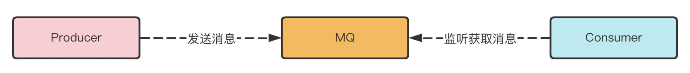

## 一、为什么使用消息队列

- 异步

  业务无关的后置处理操作，比如当前注册业务功能，会在注册业务完成之后，对注册用户发送短信告知随机用户号，此时发送短信的功能采用异步操作。

  注册信息落表成功之后，直接返回前端处理结果，之后的短信通知功能可以将短信内容发送一个消息到消息中间件中，由发送短信的组件监听此队列，消费消息并发送短信。

- 解耦

  微服务之间可以通过 RPC 框架实现远程调用，比如 Dubbo 或者 Spring Cloud Open Feign 框架。此外，还可以基于约定的上下文内容通过消息中间件实现信息交互，这个过程两套服务之间是可以无耦合的，消费方通过监听约定的队列，消费提供方发送的消息，进行本地处理。

  通常可以在进行微服务拆分的过程中使用，以此来解耦服务。

- 削峰填谷

  通常使用在电商等一些高并发场景，即在某一高峰时刻，瞬间会涌入大量请求，如果不加限流，那么大流量很可能直接压垮数据库，打崩服务。

  比如秒杀活动场景下，可以在业务层迅速处理订单业务返回用户处理结构，之后将生成的订单发送到消息队列中，让之后的库存服务等慢慢消费，执行后续的操作，秒杀之后的大量空闲时间还可以继续处理积压的订单消息。

- 分布式系统最终一致性

  微服务系统下的分布式事务的一种解决方案，即某一对外服务涉及很长的调用链，会有很多微服务参与，那么本地事务已经是无法满足一致性的需求来，所以可以采取一系列措施，比如采用 MQ 的可靠消息的最终一致性方案，该方案在分布式事务文章中进行总结。

## 二、消息队列有哪些缺点

- 降低了系统的可用性

  单节点的消息中间件会承担系统大量消息，成为系统的热点位置，这就引发了一个问题，如果消息中间件宕机不可用了，那么整套系统的正常功能可能会受到响应的影响，比如异步功能无法使用，使用消息中间件解耦的双方服务失联等。

- 提供了系统的复杂性

  **对于整套系统生态来说，每引入一项新的事物，都将会造成维护成本的提升。**消息队列作为中间件加入系统中，也会产生维护成本，需要考虑围绕消息队列可能会产生的一系列问题：**消息重复发送**、**消息顺序问题**、**消息丢失**、**消息积压**等。

## 三、如何解决消息队列带来的问题

### 1. 消息丢失问题

我们使用消息队列，通常由消息**生产者**创建**交换机**，

