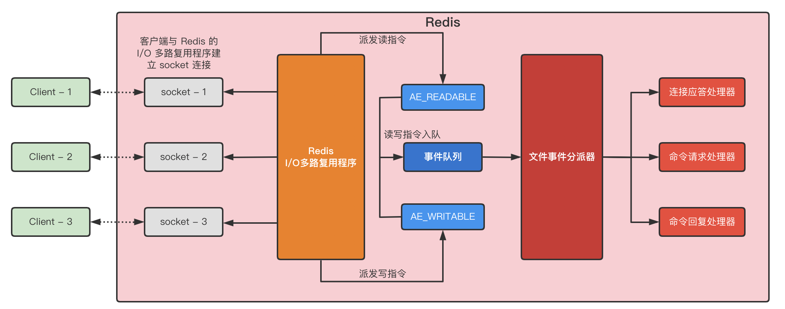
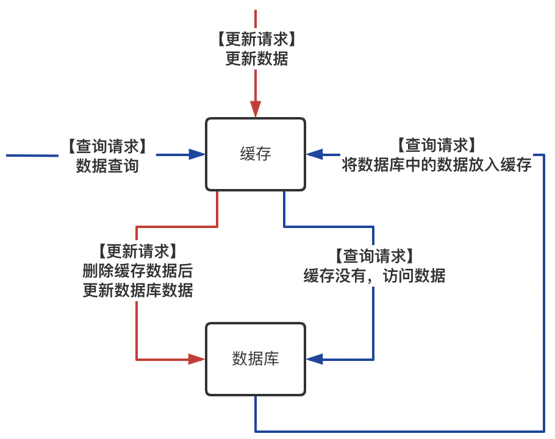

## 一、为什么使用缓存

- 高性能：缓存可以提升系统性能，通过缓存一些元数据、不会频繁发生改变的数据，在访问数据库查询数据之前提前将数据从缓存中查询出来，可以提高响应速度。
- 高并发：缓存可以在高峰期之前对热点数据进行提前预热，将他们载入缓存，以便在高峰期能够支撑更大的请求并发。

## 二、Redis 的数据类型以及使用场景

- string：短信验证码
- hash：缓存分组数据，比如字典项、元数据等
- set：可以基于 set 的特性做类似微博共同粉丝的查找
- list：可以做队列，比如微博的粉丝列表
- zset：排行榜

## 三、Redis 过期策略

### 1. 设置过期时间

- 定期删除：Redis 会每隔一段时间随机取 key 进行检查，如果当前的 key 是过期 key，则执行定期删除
- 惰性删除：当客户端主动查询某个 key，而这个 key 是过期 key，则会执行惰性删除。**惰性删除对定期删除的随机性导致的过期 key 删除不及时做了补充删除。**

### 2. 内存淘汰机制

> 内存淘汰机制在 Redis 可用内存空间不足时生效，会执行既定的**淘汰策略**，同时也是对惰性删除遗留的数据做了进一步的补充删除。

- noeviction：当内存不足时，写数据将报错
- allkeys-lru：当内存不足时，移除最近最少使用的 key
- allkeys-random：当内存不足时，随机移除 key
- volatile-lru：当内存不足时，移除最近最少使用的 key（设置了过期时间的）
- volatile-random：当内存不足时，随机移除 key（设置了过期时间的）
- volatile-ttl：当内存不足时，移除设置了过期时间的 key 中，最早过期的

**内存淘汰策略如何选择？为什么吗？**

一般使用`allkeys-lru`，首先当内存快要满的时候，还是得尽量保证 redis 是可以继续工作的，所以对于策略`noeviction`来说不可取，其次因为对于随机移除 key 的方式，不安全，可能会随机移除某些热点 key，导致缓存击穿或者缓存雪崩，所以可以排除策略`allkeys-random`以及`volatile-random`，接着继续分析`allkeys-lru`、`volatile-lru`以及`volatile-ttl`，既然是需要移除最近最少使用的 key，所以已经无所谓过期时间了，移除的范围是可以尽量大的。

## 四、Redis 内存模型



## 五、Reids 为什么快

- Redis 是采用基于 Reactor 模型的、非阻塞 I/O 多路复用机制
- Redis 基于内存进行数据访问
- Redis 是单线程的，避免了多线程上下文频繁切换的开销

## 六、手写 LRU 算法

> 以下思路采用基于 Java 原生数据结构 LinkedHashMap 进行实现

```java
public class LRUCache extends LinkedHashMap<K, V> {
    /**
     * 缓存大小
     */
    private final int cacheSize;
    
    /**
     * 构造器初始化缓存
     */
    public LRUCache(int cacheSize) {
        // 设置HasMap的初始大小，最后一个参数目的是让Map按访问顺序进行排序，最近访问的放在前面，最之前访问的放在最后
        super((int) (Math.ceil(cacheSize / 0.75) + 1), 0.75F, true);
        this.cacheSize = cacheSize;
    }
    
    @Override
    protected boolean removeEldestEntry(Map.Entry<K, V> eldest) {
        // 当Map中的数据量大于缓存阈值时，则自动删除最之前的的数据
        return this.size() > cacheSize;
    }
}
```

## 七、Redis 持久化

> Redis 有两种持久化策略：RDB 和 AOF
>
> Redis 的持久化策略是缓存数据备份以及灾难恢复的利器
>
> RBD 和 AOF 两者同时开启将会优先使用 AOF 策略

### 1. RBD

RDB 持久化策略，每隔一段时间生成一份缓存数据快照，每份快照都是独立的文件

- 优点
  - 对 Redis 读写服务的影响小
  - 灾难恢复速度快
- 缺点
  - 数据丢失会更多一些，比如在两次生成快照的间隙，Redis 宕机了，那么这段时间的数据就丢失了
  - Reids 基于 fork 子进程进行的缓存数据快照，如果当前待生成 RDB 文件很大的话，会导致 client 客户端卡顿

### 2. AOF

AOF 持久化策略会记录 Redis 的每一条写命令，将其持久化到文件中，始终是一个文件

**AOF 写文件实际上并不会直接将数据写磁盘文件，而是会先写入 os cache 中，之后 redis 会每隔一段时间执行 os fsync 将其强制刷入磁盘文件，使用 os cache 作为缓冲区，减少磁盘文件的频繁写**

- 优点
  - 数据丢失的少，基本保证了每一条写命令所缓存的数据都有可重现的痕迹
  - 如果当前 AOF 文件膨胀的过大，会有 rewrite 机制，即 Redis 会将写命令进行整合，删除一些过程数据
- 缺点
  - 文件相对来说比较大
  - 由于会记录每一次的写命令，所以会对写操作有一些影响
  - 灾难恢复速度慢，因为如果要恢复数据，必须一条一条的执行所记录的写操作

### 3. 备份和恢复策略

可以基于 redis 主从架构，redis master 节点对外读写，然后将数据异步的同步给 redis slaver 节点

master 节点采用 AOF 持久化策略保证数据的稳定性，能够减少数据的丢失

slaver 节点采用 RDB 持久化策略保证数据的完整性，能够在灾难过后迅速恢复数据

两种持久化策略结合使用，RDB 保证冷备，AOF 保证数据丢失少，灾后基于 RDB 迅速恢复部分数据，再基于 AOF 进行剩余缺失数据的补充

## 八、使用缓存会出现的问题

### 1. 缓存经典三大场景

- 缓存雪崩

  - 场景

    数据缓存系统宕机或者大量热点 key 在同一时刻失效，导致大量请求瞬间同时打在数据库上，从而引起数据库承载压力瞬间过大

  - 解决方案

    1. 采用二级缓存策略，保证在即使缓存雪崩的情况下，内存级缓存能够保护数据库
    2. 缓存数据过期时间设置为随机，防止大量 key 同时过期失效
    3. 设置热点 key 永不过期
    4. 如果 redis 是分布式集群部署，则将热点数据均匀分散到各个实例上，并使用`主从+哨兵`或者`redis cluster`保证高可用
    5. 雪崩过后尽快采用持久化机制进行数据恢复

- 缓存穿透

  - 场景

    请求要查询的 key 在缓存和数据库中都不存在，通常情况下是恶意攻击，这种请求方式会给数据库不断施压

  - 解决方案

    1. 接口处增加入参校验，对于不合法的入参直接拒绝访问
    2. 对于缓存和数据库中都不存在的数据，可以在 redis 中放一个默认值，设置短一些的过期时间，可以防止攻击者反复用同一个 key 攻击

- 缓存击穿

  - 场景

    大量请求同时访问某个热点 key，而该热点 key 恰好在此时过期失效了，那么大量的请求将会同时访问数据库

  - 解决方案

    1. 设置热点 key 永不过期
    2. 业务逻辑中对在缓存中没有查询到数据的情况下，在数据库访问前加锁，保证在同一时刻，只有一个请求线程可以争抢到锁，进行数据库访问，查询到数据之后，将数据置入缓存，再释放锁，将其余线程再重放，先去缓存查询，发现有数据，直接获取缓存数据后返回

### 2. 双写一致性问题

> 引入缓存后，虽然能够提升系统性能，使系统更好的承载高并发的挑战，但是如果数据库中的数据发生的变更，则需要保证缓存的数据也能在下次访问的时候不再是之前的老数据，这就是需要考虑的**缓存数据库双写一致性问题**。



一般情况下，在数据访问时，首先查询缓存数据，如果缓存中没有查到，则查询数据库，之后再将数据库中查询到的数据放入缓存，在更新数据的时候，先删除缓存，再更新数据库，下一次的查询自然会重新去数据库中提取数据放入缓存。这里必须要将缓存删除，如果是更新缓存的话，则会出现**缓存数据库双写一致性问题**。

但是在极端情况下，以上方案还是会出现问题，比如在缓存删除之后，准备更新数据库之前，此时并发了一个读请求，这个读请求会去缓存中查不到数据，进而访问数据库进行数据查询，之后把查询到的数据再次放入缓存。

解决方式是将数据库与缓存的读写串行化，可以构造一个内存队列，对当前读写请求进行排队，有序从队列中取出请求，如果是写请求则先删除缓存再更新数据库，而读请求在此时总是还在队列中等待线程消费。

### 3. Redis 并发竞争问题

> 多个 redis 客户端同时写 key 导致顺序错乱。

可以使用分布式锁，结合时间戳解决。分布式锁保证了同一时刻只有一个服务实例写 key；而时间戳则保证了下一次修改的版本是更新的
