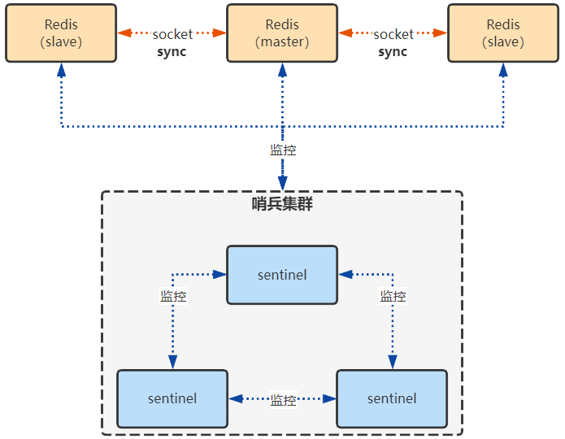
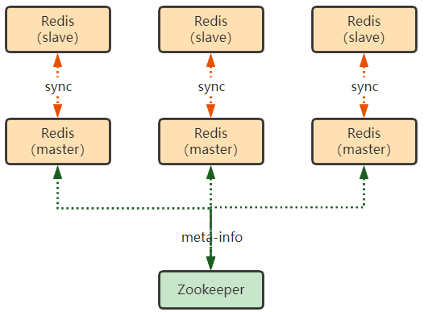
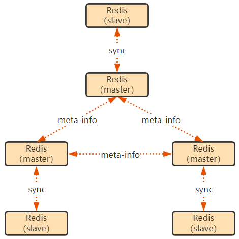

## 一、Redis 主从

### 1. 原理描述

1. 当从节点 slave 启动的时候，slave 会读取配置，获取 master 的连接信息
2. slave 内部会起一个定时任务，检查是否有 master 可以连接，如果有，则发送 **PSYNC** 尝试建立 socket 连接
3. 如果 master 配置了 requirepass，则 slave 需要发送 masterauth 进行认证
4. 当 salve 和 master 建立起 socket 连接的时候，如果是第一次建立连接，则会触发 master 的全量复制`full resynchornization`，如果是已经建立过连接的，则 master 会异步地将数据同步给 slave

### 2. 复制原理

- 如果是第一次建立连接 master 会在后台起一个线程，生成一份 RDB 文件，并将其发送个 slave，salve 收到文件后，将其保存在本地磁盘后，把文件内容载入内存
- 如果之前建立过连接，则 master 会异步地将缓存数据同步给 slave

### 3. 复制的机制

- **offset**：master 和 slave 都会维护一份自己的 offset，master 和 slave 都会累加自己的 offset，salve 每秒会上报 offset 给 master，master 将 slave 的 offset 进行保存
- **backlog**：master 给 slave 复制数据的时候，也会将该数据在 backlog 中写一份
- **master 的 run_id**：master 的 host+ip 不一定靠谱，master 在重启之后，他的 id 会发生变化， slave 会感知到变化进行全量复制

## 二、Redis 主从 + 哨兵

> **哨兵的作用**
>
> - **集群监控：**监控 master 和 slave 是否正常工作
> - **消息通知**
> - **故障转移**（**failover**）**：**如果 master 节点宕机了，则会自动选举出新的 master 节点
> - **配置中心：**如果选举了新的 master 节点，则会通知客户端新的 master 节点的信息

### 1. Sentinel 选举的过程

1. 如果在`is_master_down_after_milliseconds`之后，哨兵仍然 ping 不通 master 节点，则进入 **sdown**，为主观宕机
2. 如果有 **quorum** 个哨兵认为 master 宕机了，那么就会进入 **odown**，为客观宕机
3. 哨兵集群间进行投票，选举出某一个哨兵执行主备切换，如果当前某个哨兵得到了 **majority** 个哨兵的授权，则选举成功
4. 执行主备切换的哨兵会根据 slave 与 master 断开连接的时长、优先级、offset、run_id 等进行**综合考量**，选举出新的 master 节点
5. 如果哨兵主备切换执行失败了，则会有下一个哨兵接替执行并完成，**之后再将新的 master 的信息在哨兵集群传播**

### 2. 主从+哨兵的问题

> **主从 + 哨兵的模式只能保证集群的高可用，却无法保证数据零丢失**

- 在主从复制的过程中，如果 master 节点宕机了，那么这部分数据就丢失了
- 集群脑裂问题：由于网络分区原因，导致 master 节点和 slave、sentinel 失去联系，那么 sentinel 就会认为 master 宕机了，从而选举出新的 master 节点，此时实际上就出现了多个 master 节点的情况

## 三、Redis Cluster

> Redis Cluster 可以构造出多个主节点，每个主节点下再挂一个从节点，保证集群的高可用的同时也尽量避免数据丢失问题

### 1. 分布数据的算法

> 由于 Redis Cluster 模式下，会出现多个 master 节点，每个 master 节点都会承担数据读写的职责，所以如何保证数据的读写能够尽可能的合理分布在每一个 master 节点上，这就需要考量一些分布数据的算法

- **hash 算法：**对 key 进行 hash，之后与 master 的节点数量取模运算。但是这种方法不支持 master 的动态横向扩容，master 节点数量的改变会影响数据落的节点位置，会造成偏差
- **一致性 hash 算法：**假想出一个圆圈，上面每个点都会对应一个 hash 值，master 节点落在这个圈上。某个 key 计算了 hash 值，之后该 hash 值将对应落在这个圈的一个点上，从该点出发顺时针找到最近的一个节点，即为所要找的 master 节点。但是这种方式需要考虑每个 master 节点的数据间隔，不合理的情况下会造成数据倾斜，即某个节点会承担大量数据
- **redis cluster-hash slot：**将 16384 个槽点分配到 Redis 集群上，根据 key 计算 CRC16 的值，然后对 16384 取模，定位到 redis solt

### 2. 集群节点通信

- **使用 ZK 维护集群间的元数据**

- **每个节点维护一份集群元数据，如果某个节点发生了数据变更，则会通过 gossip 协议发送给其余节点通知对应变更**

### 3. 集群的故障选举

1. 如果某个节点在某次 **gossip ping** 之后的一段时间内没有收到 **gossip pong** 消息，则会进入 **pfail**，认为该节点主观宕机
2. 如果多数节点在 gossip ping 时都认为 pfail，则会进入 **fail**，认为该节点客观宕机
3. 此时需要其余 master 节点进行选举，将宕机 master 的从节点升为主节点。与 master 节点断开时间较长的 slave 无法参加选举，每个 slave 根据自己对 master 节点的 offset 进行排名，排名靠前的优先参与选举

