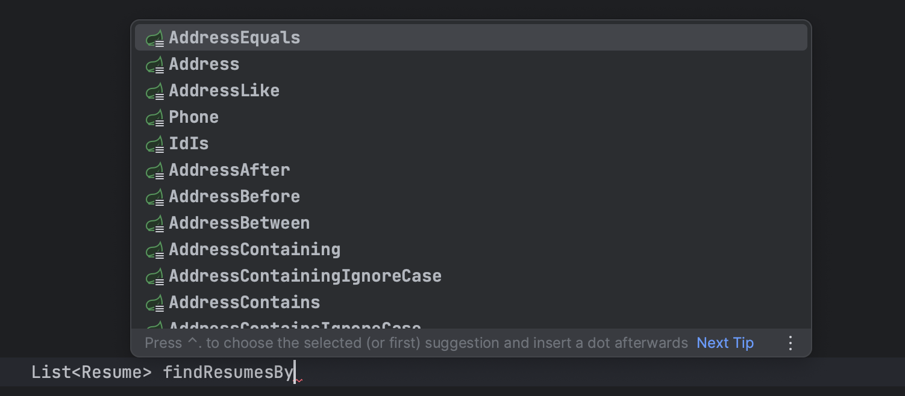
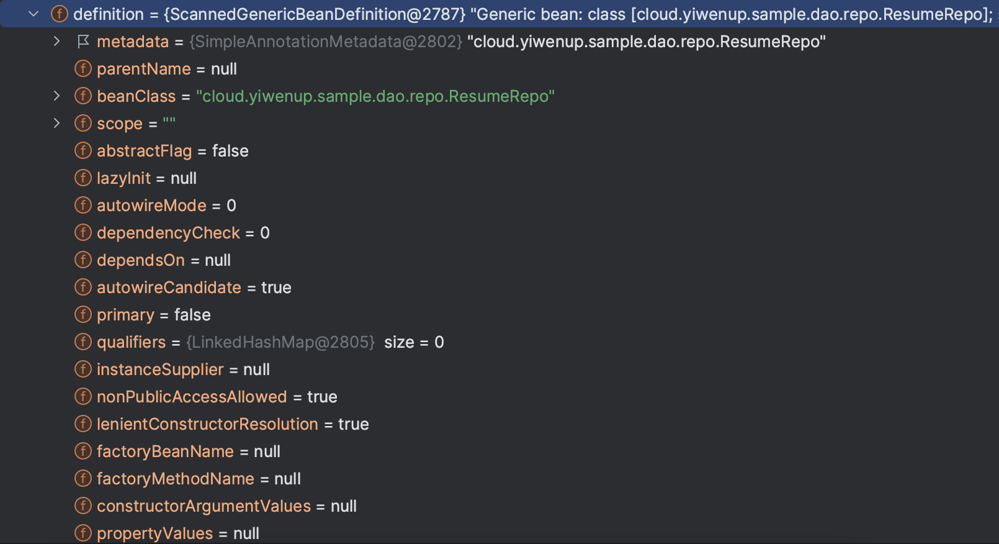
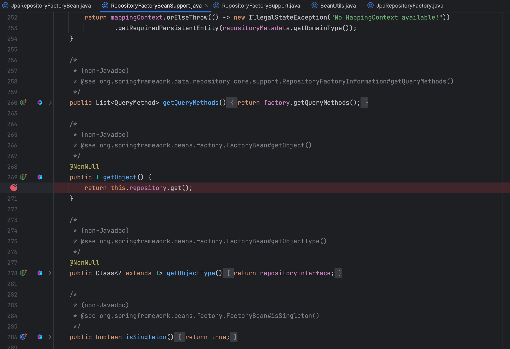

## 一、Spring Data JPA 认识

> `Spring Data JPA`是在`JPA`规范之上封装的一个`DAO`层的框架。
>
> `JPA`是一个持久层的规范，全称为`Java Persistent API`，在这个规范之下又兼顾`ORM`思想，于是有了`Hibernate`框架。`Hibernate`是对`JPA`与`ORM`的一种实现。
>
> 因此，`Spring Data JPA`是封装了`JPA`规范，而底层运行时引擎是依赖了`Hibernate`框架。


## 二、Spring Data  JPA 使用

### 2.1 整合 Spring

1. 配置`resources/applicationContext.xml`

   ```xml
   <?xml version="1.0" encoding="UTF-8"?>
   <beans xmlns="http://www.springframework.org/schema/beans"
          xmlns:context="http://www.springframework.org/schema/context"
          xmlns:jpa="http://www.springframework.org/schema/data/jpa"
          xmlns:xsi="http://www.w3.org/2001/XMLSchema-instance"
          xsi:schemaLocation="
          http://www.springframework.org/schema/beans
          http://www.springframework.org/schema/beans/spring-beans.xsd
          http://www.springframework.org/schema/context
          http://www.springframework.org/schema/context/spring-context.xsd
          http://www.springframework.org/schema/data/jpa
          http://www.springframework.org/schema/data/jpa/spring-jpa.xsd
   ">
   
       <!-- region 注入数据源 -->
       <context:property-placeholder location="classpath*:jdbc.properties"/>
       <bean id="datasource" class="com.alibaba.druid.pool.DruidDataSource">
           <property name="driverClassName" value="${jdbc.driverName}"/>
           <property name="url" value="${jdbc.url}"/>
           <property name="username" value="${jdbc.username}"/>
           <property name="password" value="${jdbc.password}"/>
       </bean>
       <!-- endregion -->
   
       <!-- region
       JPA 核心能力 EntityManager：
           Spring Data JPA             <->    Mybatis
           EntityManager               <->    SqlSession
           EntityManagerFactoryBean    <->    SqlSessionFactory
        -->
       <bean id="entityManager" class="org.springframework.orm.jpa.LocalContainerEntityManagerFactoryBean">
           <!-- 实体包扫描路径 -->
           <property name="packagesToScan" value="cloud.yiwenup.sample.dao.entity"/>
           <property name="dataSource" ref="datasource"/>
           <!-- JPA：javax.persistence.spi.PersistenceProvider 的实现 -->
           <property name="persistenceProvider">
               <bean class="org.springframework.orm.jpa.vendor.SpringHibernateJpaPersistenceProvider"/>
           </property>
           <!-- 不同JPA实现，对连接操作的细节不同，此处使用Hibernate实现 -->
           <property name="jpaDialect">
               <bean class="org.springframework.orm.jpa.vendor.HibernateJpaDialect"/>
           </property>
           <!-- 配置JPA实现细节，此处使用基于Hibernate的实现 -->
           <property name="jpaVendorAdapter">
               <bean class="org.springframework.orm.jpa.vendor.HibernateJpaVendorAdapter">
                   <!-- 启动时不执行DDL -->
                   <property name="generateDdl" value="false"/>
                   <!-- 运行时显示SQL -->
                   <property name="showSql" value="true"/>
                   <!-- 数据库类型，此处使用 PostgresSQL -->
                   <property name="database" value="POSTGRESQL"/>
                   <!-- 数据库平台，此处需要选用org.hibernate.dialect.Dialect的实现 -->
                   <property name="databasePlatform" value="org.hibernate.dialect.PostgreSQL10Dialect"/>
               </bean>
           </property>
       </bean>
       <!-- endregion -->
   
       <!-- 
       注入事务管理器org.springframework.orm.jpa.JpaTransactionManager，
       对比Mybaits，使用的是org.springframework.jdbc.datasource.DataSourceTransactionManager实现
        -->
       <bean id="transactionManager" class="org.springframework.orm.jpa.JpaTransactionManager">
           <property name="entityManagerFactory" ref="entityManager"/>
       </bean>
   
       <!-- 为接口创建JPA代理，需要配置包扫描路径 -->
       <jpa:repositories base-package="cloud.yiwenup.sample.dao.repo"
                         entity-manager-factory-ref="entityManager"
                         transaction-manager-ref="transactionManager"
       />
   
   </beans>
   ```

2. 创建`POJO`，需要使用一系列注解完成实体与表的映射

   ```java
   package cloud.yiwenup.sample.dao.entity;
   
   import javax.persistence.Column;
   import javax.persistence.Entity;
   import javax.persistence.GeneratedValue;
   import javax.persistence.Id;
   import javax.persistence.Table;
   
   @Entity
   @Table(name = "tb_resume")
   public class Resume {
   
       @Id
       @GeneratedValue(strategy = GenerationType.IDENTITY)
       private Long id;
   
       @Column(name = "name")
       private String name;
   
       @Column(name = "phone")
       private String phone;
   }
   ```

3. 创建操作接口，需要继承`org.springframework.data.jpa.repository.JpaRepository`和`org.springframework.data.jpa.repository.JpaSpecificationExecutor`，前者提供基本增删改查方法，后者提供动态`SQL`能力

   ```java
   package cloud.yiwenup.sample.dao.repo;
   
   import cloud.yiwenup.sample.dao.entity.Resume;
   import org.springframework.data.jpa.repository.JpaRepository;
   import org.springframework.data.jpa.repository.JpaSpecificationExecutor;
   
   public interface ResumeRepo extends JpaRepository<Resume, Long>, JpaSpecificationExecutor<Resume> {
   }
   ```

### 2.2 简单 CRUD

```java
@Test
public void test_jpa_findAll() {
    resumeRepo.findAll().forEach(System.out::println);
}

@Test
public void test_insert() {
    Resume entity = new Resume();
    entity.setId(4L);
    entity.setAddress("北京");
    entity.setName("李四");
    entity.setPhone("13100000000");
    // 新增和修改用的都是 save 方法，区别就是带了 ID 的是修改，没带的是新增
    Resume saved = resumeRepo.save(entity);
    System.out.println(saved);
}

@Test
public void test_finById() {
    System.out.println(resumeRepo.findById(4L).orElse(null));
}

@Test
public void test_findOne() {
    Resume probe = new Resume();
    probe.setId(4L);
    probe.setPhone("13100000000");
    // findOne 要明确保证当前查询条件仅能返回一条记录
    System.out.println(resumeRepo.findOne(Example.of(probe)).orElse(null));
}

@Test
public void test_findAll() {
    resumeRepo.findAll().forEach(System.out::println);
}

@Test
public void test_sort() {
    resumeRepo.findAll(Sort.by(Sort.Direction.ASC, "phone")).forEach(System.out::println);
}

@Test
public void test_page() {
    // 分页页码从0开始
    Page<Resume> page = resumeRepo.findAll(Pageable.ofSize(2));
    System.out.println(page.getNumber());
    page.getContent().forEach(System.out::println);

    // 指定页码，也是从0开始的
    Page<Resume> page1 = resumeRepo.findAll(PageRequest.of(1, 2));
    System.out.println(page1.getNumber());
    page1.getContent().forEach(System.out::println);
}
```

### 2.3 特殊使用 - JPQL

> `JPQL（Java Persistence Query Language）`是用于在 Java 持久化框架中执行查询的查询语言。

```java
public interface ResumeRepo extends JpaRepository<Resume, Long>, JpaSpecificationExecutor<Resume> {

    /**
     * 根据地址查询
     *
     * @param address 地址
     * @return 简历列表
     */
    @Query("from Resume where address = ?1")
    List<Resume> findResumesByAddress(String address);
}
```

```java
@Test
public void test_jpql() {
    resumeRepo.findResumesByAddress("上海").forEach(System.out::println);
}
```

### 2.4 特殊使用 - 原生SQL

> 主要是在`@Query`注解上，开启`nativeQuery=true`

```java
public interface ResumeRepo extends JpaRepository<Resume, Long>, JpaSpecificationExecutor<Resume> {
    /**
     * 根据电话模糊查询
     *
     * @param phone 电话
     * @return 简历列表
     */
    @Query(value = "select * from tb_resume where phone like ?1", nativeQuery = true)
    List<Resume> findResumesLikePhone(String phone);
}
```

```java
@Test
public void test_sql() {
    resumeRepo.findResumesLikePhone("13%").forEach(System.out::println);
}
```

### 2.5 特殊使用 - 方法命名

> `Spring Data JPA`提供了基于特殊规则的命名解析策略，只要按照其命名规则声明方法名称即可。



```java
public interface ResumeRepo extends JpaRepository<Resume, Long>, JpaSpecificationExecutor<Resume> {
    /**
     * 方法命名
     *
     * @param address 地址
     * @param phone   电话
     * @return 简历列表
     */
    List<Resume> findResumesByAddressEqualsAndPhoneLike(String address, String phone);
}
```

```java
@Test
public void test_namedRules() {
    resumeRepo.findResumesByAddressEqualsAndPhoneLike("北京", "131%").forEach(System.out::println);
}
```

## 三、Spring Data JPA 原理

首先能确定的是，我们只写了接口，但是调用时却能实现相应的方法，那么这里面一定是有动态代理，并且是**基于`JDK`的动态代理**。

此外，我们的使用方式是将该接口注入使用，那么这里一定是将实例托管到了`Spring`容器中，存在一个单例`Bean`，而基于`Spring`源码的了解，在产生`Bean`之前，会有一个阶段，是构造`BeanDefinition`，因此可以将断点放置在`org.springframework.beans.factory.support.AbstractBeanFactory#getMergedLocalBeanDefinition`，看看其`BeanDefinition`是怎么构造的。


主要是注意`BeanDefinition`中的`beanClass`属性，正常`Bean`的`beanClass`一般都是对应实现的类全路径，而通过`FactoryBean`代理出来的`Bean`，其`BeanDeinition`的`beanClass`是`XxxBeanFactory`，主要是看看在什么时候发生的改变。




可以发现，代理接口实现的是`org.springframework.data.jpa.repository.support.JpaRepositoryFactoryBean`，是经过`org.springframework.data.jpa.repository.config.JpaRepositoryConfigExtension#getRepositoryFactoryBeanClassName`特殊指定的。

根据`FactoryBean`的特性，最终注入到容器中的`Bean`是通过`getObject`方法返回的，而`JpaRepositoryFactoryBean`的返回值如下图



继续寻找`repository`是在何时被初始化的，于是找到了`org.springframework.data.repository.core.support.RepositoryFactoryBeanSupport#afterPropertiesSet`方法


最终来到了`org.springframework.data.repository.core.support.RepositoryFactorySupport#getRepository(java.lang.Class<T>, org.springframework.data.repository.core.support.RepositoryComposition.RepositoryFragments)`方法，主要是通过`Spring`的`ProxyFactory`产生了代理对象。并且接口的实现最终是会代理给`org.springframework.data.jpa.repository.support.SimpleJpaRepository`完成实际底层的`EntityManager`调用。


