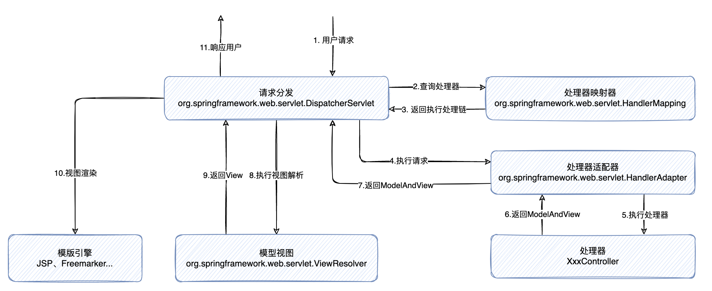

## Spring MVC应用

### 一、MVC体系

#### 1.1 三层架构和MVC模式

> 我们的开发架构一般都是基于两种形式，一种是`C/S`架构，也就是客户端/服务器；另一种是`B/S`架构 ，也就是浏览器服务器。在 JavaEE 开发中，几乎全都是基于`B/S`架构的开发。那么在`B/S`架构中，系统标准的三层架构包括：表现层、业务层、持久层。
>
> 而`MVC`是一种应用于表现层的设计模式，或者说风格，是`Model-View-Controller`的缩写。


**从三层架构来看：**

- 表现层：即`web`层，负责接收客户端请求，依赖业务层的处理结果，将结果响应客户端。表现层通常使用的代码组织模式即`MVC`。
- 业务层：负责处理主要业务逻辑，依赖持久层完成数据操作，事务应当加在业务层。
- 持久层：负责和数据交互，完成数据查询与持久化操作。

**从`MVC`模式来看：**

- View（视图）：通常指代我们的`html`和`jsp`页面，渲染和展示数据模型。
- Model（模型）：模型分**数据模型**和**业务模型**，数据模型封装数据，业务模型封装业务要素。
- Controller（控制器）：在应用程序中用于处理用户交互的部分。

### 二、Spring MVC

> `Spring MVC`全称为`Spring Web MVC`，可以认为是`Spring Framework`的一个模块。
>
> `Spring MVC`是一个基于`MVC`模式的轻量级`Web`框架，其本质上可以认为是对原生`Servlet`的简化。

#### 2.1 Spring MVC 流程示意



1. 用户发送请求，由`DispatcherServlet`统一接收处理；
2. `DispatcherServlet`将请求派发，从`HandlerMapping`获取处理器映射关系；
3. `HandlerMapping`返回执行处理链，其中会包含一些`Interceptor`；
4. `DispatcherServlet`调度`HandlerAdapter`执行请求；
5. `HandlerAdapter`调用具体的`Handler`处理请求，**此处基于适配器模式，兼容注解式`@Controller`的处理器或者实现接口`org.springframework.web.servlet.mvc.Controller`的一些处理器，或者不同类型的出/入参**；
6. 处理器返回`ModelAndView`；
7. `HandlerAdapter`将返回的`ModelAndView`传递回`DispatcherServlet`；
8. `DispatcherServlet`根据`ViewResolver`规则，查询视图模板；
9. `ViewResolver`返回视图模板规则；
10. `DispatcherServlet`根据视图模板和数据模型，完成视图渲染；
11. `DispatcherServlet`最终响应用用户，至此流程结束。

#### 2.2 Spring MVC 原生应用

1. 创建测试项目，主要目录结构为`src/main/java`、`src/main/resources`、`src/main/webapp`

   ```xml
   <!-- pom.xml 添加 tomcat7 运行插件 -->
   <build>
       <plugins>
           <plugin>
               <groupId>org.apache.tomcat.maven</groupId>
               <artifactId>tomcat7-maven-plugin</artifactId>
               <version>2.2</version>
               <configuration>
                   <!-- 应用上下文路径 -->
                   <path>/context1</path>
                   <!-- tomcat 监听端口号 -->
                   <port>8080</port>
               </configuration>
           </plugin>
       </plugins>
   </build>
   ```

   ```xml
   <!-- webapp/WEB-INF/web.xml -->
   <!DOCTYPE web-app PUBLIC
    "-//Sun Microsystems, Inc.//DTD Web Application 2.3//EN"
    "http://java.sun.com/dtd/web-app_2_3.dtd" >
   
   <web-app>
   </web-app>
   ```

   ```jsp
   <!-- webapp/index.jsp -->
   <html>
   <body>
   <h2>Hello World!</h2>
   </body>
   </html>
   ```

   按以上文件补充至测试项目中，运行命令`mvn tomcat7:run`，即启动`tomcat`服务，待启动完成之后，访问：`localhost:{端口}/{上下文路径}`，若看见`index.jsp`页面的内容，表示测试项目的初步搭建成功。

   

   

2. 添加`spring-webmvc`依赖

   ```xml
   <!-- pom.xml 添加 spring-webmvc 运行插件 -->
   <dependencies>
       <dependency>
           <groupId>org.springframework</groupId>
           <artifactId>spring-webmvc</artifactId>
       </dependency>
   </dependencies>
   ```

3. 在`web.xml`中注册`DispatcherServlet`组件，配置`spring-webmvc`的拦截规则

   ```xml
   <!DOCTYPE web-app PUBLIC
    "-//Sun Microsystems, Inc.//DTD Web Application 2.3//EN"
    "http://java.sun.com/dtd/web-app_2_3.dtd" >
   
   <web-app>
   
     <!-- 注册 springmvc 的 DispatcherServlet -->
     <servlet>
       <servlet-name>springmvc</servlet-name>
       <servlet-class>org.springframework.web.servlet.DispatcherServlet</servlet-class>
     </servlet>
   
     <!--
      配置 springmvc 的 DispatcherServlet 拦截规则
      方式一：后缀形式匹配（*.do/*.action/*.xxx）
      方式二：/（该方式不拦截.jsp，此外的所有静态资源都将会被拦截）
      方式三：/*（该方式拦截所有，包括.jsp）
      -->
     <servlet-mapping>
       <servlet-name>springmvc</servlet-name>
       <url-pattern>/</url-pattern>
     </servlet-mapping>
   
   </web-app>
   ```

4. 新增控制器`DemoController`，通过注解`@Controller`和`@RequestMapping`声明为一个处理器。当客户端请求`localhost:{端口}/{上下文路径}/demo/handle01`时，跳转至`src/main/webapp/WEB-INF/jsp/success.jsp`，返回服务端时间。

   ```java
   @Controller
   @RequestMapping("/demo")
   public class DemoController {
   
       @RequestMapping("/handle01")
       public ModelAndView handle01() {
           ModelAndView modelAndView = new ModelAndView();
           modelAndView.addObject("date", new Date());
           // 跳转至成功页面
           modelAndView.setViewName("/WEB-INF/jsp/success.jsp");
           return modelAndView;
       }
   }
   ```

   ```jsp
   <%@ page contentType="text/html;charset=UTF-8" isELIgnored="false" language="java" %>
   <html>
   <head>
       <title>成功页面</title>
   </head>
   <body>
       <!-- 此处使用EL表达式，从请求域取出key为date的值 -->
       <!-- 需要在文件头中声明 isELIgnored="false" 否则EL表达式无法生效 -->
   请求成功，当前服务器时间：${date}
   </body>
   </html>
   ```

5. 新增`src/main/resources/springmvc.xml`配置，注册`Bean`扫描规则、**处理器映射器和处理器适配器**。

   ```xml
   <?xml version="1.0" encoding="UTF-8"?>
   <beans xmlns="http://www.springframework.org/schema/beans"
          xmlns:xsi="http://www.w3.org/2001/XMLSchema-instance"
          xmlns:context="http://www.springframework.org/schema/context"
          xmlns:mvc="http://www.springframework.org/schema/mvc"
          xsi:schemaLocation="
          http://www.springframework.org/schema/beans
          http://www.springframework.org/schema/beans/spring-beans.xsd
          http://www.springframework.org/schema/context
          http://www.springframework.org/schema/context/spring-context.xsd
          http://www.springframework.org/schema/mvc
          http://www.springframework.org/schema/mvc/spring-mvc.xsd">
   
       <!-- 配置Bean扫描 -->
       <context:component-scan base-package="cloud.yiwenup.sample.webmvc"/>
   
       <!-- 注册处理器映射器和处理器适配器 -->
       <mvc:annotation-driven/>
   </beans>
   ```

6. 通过修改`src/main/webapp/WEB-INF/web.xml`，注册上述`springmvc.xml`至`DispatcherServlet`

   ```xml
   <!-- 注册 springmvc 的 DispatcherServlet -->
   <servlet>
       <servlet-name>springmvc</servlet-name>
       <servlet-class>org.springframework.web.servlet.DispatcherServlet</servlet-class>
       <init-param>
           <param-name>contextConfigLocation</param-name>
           <param-value>classpath:springmvc.xml</param-value>
       </init-param>
   </servlet>
   ```

7. 至此，运行命令`mvn tomcat7:run`启动服务端，访问`localhost:{端口}/{上下文路径}/demo/handle01`，页面返回服务端时间即成功。

   

#### 2.3 Spring MVC 原生应用拓展

- 我们在`DemoController`中配置的`ModelAndView`页面路径为物理路径，此处耦合了文件路径，可以通过配置视图解析器`ViewResolver`，定义前后缀拼接规则，后续交**由视图解析器将逻辑路径转化为物理路径**。

  ```xml
  <!-- src/main/resources/springmvc.xml -->
  <!-- 配置视图解析器 -->
  <bean id="viewResolver" class="org.springframework.web.servlet.view.InternalResourceViewResolver">
      <property name="prefix" value="/WEB-INF/jsp/"/>
      <property name="suffix" value=".jsp"/>
  </bean>
  ```

  ```java
  @RequestMapping("/handle01")
  public ModelAndView handle01() {
      ModelAndView modelAndView = new ModelAndView();
      modelAndView.addObject("date", new Date());
      // 完整视图物理路径由视图解析器组装
      modelAndView.setViewName("success");
      return modelAndView;
  }
  ```

- 除了使用`@Controller`声明请求处理器之外，还有一种实现接口`org.springframework.web.servlet.mvc.Controller`的方式，该方式仅了解即可。

  ```java
  @Component("/demo2/handle02") // 须显式指定Bean名称，该名称即为映射的请求路径
  public class Demo2Controller implements Controller {
      /**
       * javax.servlet.http.HttpServletRequest 与 javax.servlet.http.HttpServletResponse
       * 依赖 servlet-api，需要在 pom.xml 中引入以下依赖：
       * <dependency>
       *      <groupId>javax.servlet</groupId>
       *      <artifactId>servlet-api</artifactId>
       *      <version>2.5</version>
       *      <scope>provided</scope>
       * </dependency>
       */
      @Override
      public ModelAndView handleRequest(HttpServletRequest request, HttpServletResponse response) throws Exception {
          ModelAndView modelAndView = new ModelAndView();
          modelAndView.addObject("date", new Date());
          // 完整视图物理路径由视图解析器组装
          modelAndView.setViewName("success");
          return modelAndView;
      }
  }
  ```

  

