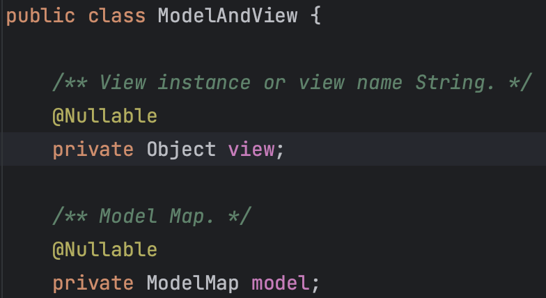
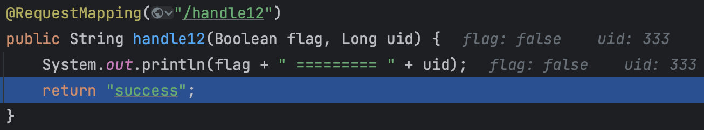
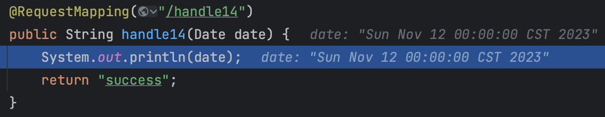

## Spring MVC 基础应用

### 一、MVC体系

#### 1.1 三层架构和MVC模式

> 我们的开发架构一般都是基于两种形式，一种是`C/S`架构，也就是客户端/服务器；另一种是`B/S`架构 ，也就是浏览器服务器。在 JavaEE 开发中，几乎全都是基于`B/S`架构的开发。那么在`B/S`架构中，系统标准的三层架构包括：表现层、业务层、持久层。
>
> 而`MVC`是一种应用于表现层的设计模式，或者说风格，是`Model-View-Controller`的缩写。


**从三层架构来看：**

- 表现层：即`web`层，负责接收客户端请求，依赖业务层的处理结果，将结果响应客户端。表现层通常使用的代码组织模式即`MVC`。
- 业务层：负责处理主要业务逻辑，依赖持久层完成数据操作，事务应当加在业务层。
- 持久层：负责和数据交互，完成数据查询与持久化操作。

**从`MVC`模式来看：**

- View（视图）：通常指代我们的`html`和`jsp`页面，渲染和展示数据模型。
- Model（模型）：模型分**数据模型**和**业务模型**，数据模型封装数据，业务模型封装业务要素。
- Controller（控制器）：在应用程序中用于处理用户交互的部分。

### 二、Spring MVC 使用

> `Spring MVC`全称为`Spring Web MVC`，可以认为是`Spring Framework`的一个模块。
>
> `Spring MVC`是一个基于`MVC`模式的轻量级`Web`框架，其本质上可以认为是对原生`Servlet`的简化。

#### 2.1 Spring MVC 流程示意


1. 用户发送请求，由`DispatcherServlet`统一接收处理；
2. `DispatcherServlet`将请求派发，从`HandlerMapping`获取处理器映射关系；
3. `HandlerMapping`返回执行处理链，其中会包含一些`Interceptor`；
4. `DispatcherServlet`调度`HandlerAdapter`执行请求；
5. `HandlerAdapter`调用具体的`Handler`处理请求，**此处基于适配器模式，兼容注解式`@Controller`的处理器或者实现接口`org.springframework.web.servlet.mvc.Controller`的一些处理器，或者不同类型的出/入参**；
6. 处理器返回`ModelAndView`；
7. `HandlerAdapter`将返回的`ModelAndView`传递回`DispatcherServlet`；
8. `DispatcherServlet`根据`ViewResolver`规则，查询视图模板；
9. `ViewResolver`返回视图模板规则；
10. `DispatcherServlet`根据视图模板和数据模型，完成视图渲染；
11. `DispatcherServlet`最终响应用用户，至此流程结束。

#### 2.2 Spring MVC 原生应用

1. 创建测试项目，主要目录结构为`src/main/java`、`src/main/resources`、`src/main/webapp`

   ```xml
   <!-- pom.xml 添加 tomcat7 运行插件 -->
   <build>
       <plugins>
           <plugin>
               <groupId>org.apache.tomcat.maven</groupId>
               <artifactId>tomcat7-maven-plugin</artifactId>
               <version>2.2</version>
               <configuration>
                   <!-- 应用上下文路径 -->
                   <path>/context1</path>
                   <!-- tomcat 监听端口号 -->
                   <port>8080</port>
               </configuration>
           </plugin>
       </plugins>
   </build>
   ```

   ```xml
   <!-- webapp/WEB-INF/web.xml -->
   <!DOCTYPE web-app PUBLIC
    "-//Sun Microsystems, Inc.//DTD Web Application 2.3//EN"
    "http://java.sun.com/dtd/web-app_2_3.dtd" >
   
   <web-app>
   </web-app>
   ```

   ```jsp
   <!-- webapp/index.jsp -->
   <html>
   <body>
   <h2>Hello World!</h2>
   </body>
   </html>
   ```

   按以上文件补充至测试项目中，运行命令`mvn tomcat7:run`，即启动`tomcat`服务，待启动完成之后，访问：`localhost:{端口}/{上下文路径}`，若看见`index.jsp`页面的内容，表示测试项目的初步搭建成功。

   

   

2. 添加`spring-webmvc`依赖

   ```xml
   <!-- pom.xml 添加 spring-webmvc 运行插件 -->
   <dependencies>
       <dependency>
           <groupId>org.springframework</groupId>
           <artifactId>spring-webmvc</artifactId>
       </dependency>
   </dependencies>
   ```

3. 在`web.xml`中注册`DispatcherServlet`组件，配置`spring-webmvc`的拦截规则

   ```xml
   <!DOCTYPE web-app PUBLIC
    "-//Sun Microsystems, Inc.//DTD Web Application 2.3//EN"
    "http://java.sun.com/dtd/web-app_2_3.dtd" >
   
   <web-app>
   
     <!-- 注册 springmvc 的 DispatcherServlet -->
     <servlet>
       <servlet-name>springmvc</servlet-name>
       <servlet-class>org.springframework.web.servlet.DispatcherServlet</servlet-class>
     </servlet>
   
     <!--
      配置 springmvc 的 DispatcherServlet 拦截规则
      方式一：后缀形式匹配（*.do/*.action/*.xxx）
      方式二：/（该方式不拦截.jsp，此外的所有静态资源都将会被拦截）
      方式三：/*（该方式拦截所有，包括.jsp）
      -->
     <servlet-mapping>
       <servlet-name>springmvc</servlet-name>
       <url-pattern>/</url-pattern>
     </servlet-mapping>
   
   </web-app>
   ```

4. 新增控制器`DemoController`，通过注解`@Controller`和`@RequestMapping`声明为一个处理器。当客户端请求`localhost:{端口}/{上下文路径}/demo/handle01`时，跳转至`src/main/webapp/WEB-INF/jsp/success.jsp`，返回服务端时间。

   ```java
   @Controller
   @RequestMapping("/demo")
   public class DemoController {
   
       @RequestMapping("/handle01")
       public ModelAndView handle01() {
           ModelAndView modelAndView = new ModelAndView();
           modelAndView.addObject("date", new Date());
           // 跳转至成功页面
           modelAndView.setViewName("/WEB-INF/jsp/success.jsp");
           return modelAndView;
       }
   }
   ```

   ```jsp
   <%@ page contentType="text/html;charset=UTF-8" isELIgnored="false" language="java" %>
   <html>
   <head>
       <title>成功页面</title>
   </head>
   <body>
       <!-- 此处使用EL表达式，从请求域取出key为date的值 -->
       <!-- 需要在文件头中声明 isELIgnored="false" 否则EL表达式无法生效 -->
   请求成功，当前服务器时间：${date}
   </body>
   </html>
   ```

5. 新增`src/main/resources/springmvc.xml`配置，注册`Bean`扫描规则、**处理器映射器和处理器适配器**。

   ```xml
   <?xml version="1.0" encoding="UTF-8"?>
   <beans xmlns="http://www.springframework.org/schema/beans"
          xmlns:xsi="http://www.w3.org/2001/XMLSchema-instance"
          xmlns:context="http://www.springframework.org/schema/context"
          xmlns:mvc="http://www.springframework.org/schema/mvc"
          xsi:schemaLocation="
          http://www.springframework.org/schema/beans
          http://www.springframework.org/schema/beans/spring-beans.xsd
          http://www.springframework.org/schema/context
          http://www.springframework.org/schema/context/spring-context.xsd
          http://www.springframework.org/schema/mvc
          http://www.springframework.org/schema/mvc/spring-mvc.xsd">
   
       <!-- 配置Bean扫描 -->
       <context:component-scan base-package="cloud.yiwenup.sample.webmvc"/>
   
       <!-- 注册处理器映射器和处理器适配器 -->
       <mvc:annotation-driven/>
   </beans>
   ```

6. 通过修改`src/main/webapp/WEB-INF/web.xml`，注册上述`springmvc.xml`至`DispatcherServlet`

   ```xml
   <!-- 注册 springmvc 的 DispatcherServlet -->
   <servlet>
       <servlet-name>springmvc</servlet-name>
       <servlet-class>org.springframework.web.servlet.DispatcherServlet</servlet-class>
       <init-param>
           <param-name>contextConfigLocation</param-name>
           <param-value>classpath:springmvc.xml</param-value>
       </init-param>
   </servlet>
   ```

7. 至此，运行命令`mvn tomcat7:run`启动服务端，访问`localhost:{端口}/{上下文路径}/demo/handle01`，页面返回服务端时间即成功。

   

#### 2.3 Spring MVC 原生应用拓展

- 我们在`DemoController`中配置的`ModelAndView`页面路径为物理路径，此处耦合了文件路径，可以通过配置视图解析器`ViewResolver`，定义前后缀拼接规则，后续交**由视图解析器将逻辑路径转化为物理路径**。

  ```xml
  <!-- src/main/resources/springmvc.xml -->
  <!-- 配置视图解析器 -->
  <bean id="viewResolver" class="org.springframework.web.servlet.view.InternalResourceViewResolver">
      <property name="prefix" value="/WEB-INF/jsp/"/>
      <property name="suffix" value=".jsp"/>
  </bean>
  ```

  ```java
  @RequestMapping("/handle01")
  public ModelAndView handle01() {
      ModelAndView modelAndView = new ModelAndView();
      modelAndView.addObject("date", new Date());
      // 完整视图物理路径由视图解析器组装
      modelAndView.setViewName("success");
      return modelAndView;
  }
  ```

- 除了使用`@Controller`声明请求处理器之外，还有一种实现接口`org.springframework.web.servlet.mvc.Controller`的方式，该方式仅了解即可。

  ```java
  @Component("/demo2/handle02") // 须显式指定Bean名称，该名称即为映射的请求路径
  public class Demo2Controller implements Controller {
      /**
       * javax.servlet.http.HttpServletRequest 与 javax.servlet.http.HttpServletResponse
       * 依赖 servlet-api，需要在 pom.xml 中引入以下依赖：
       * <dependency>
       *      <groupId>javax.servlet</groupId>
       *      <artifactId>servlet-api</artifactId>
       *      <version>2.5</version>
       *      <scope>provided</scope>
       * </dependency>
       */
      @Override
      public ModelAndView handleRequest(HttpServletRequest request, HttpServletResponse response) throws Exception {
          ModelAndView modelAndView = new ModelAndView();
          modelAndView.addObject("date", new Date());
          // 完整视图物理路径由视图解析器组装
          modelAndView.setViewName("success");
          return modelAndView;
      }
  }
  ```

### 三、Spring MVC 九大组件


- **处理器映射器`org.springframework.web.servlet.HandlerMapping`：**`HandlerMapping`是用来查找`Handler`的，`Handler`具体可以是类，也可以是方法。`Handler`负责实际的请求处理，**在请求到达`HandlerMapping`之后，其将会查询并返回包含`Handler`和`Interceptor`的执行链**。
- **处理器适配器`org.springframework.web.servlet.HandlerAdapter`**：**由于`SpringMVC`支持多种形式的`Handler`声明，而最终都需要交由底层的`javax.servlet.Servlet#service`执行，因此需要`HandlerAdapter`介入完成适配职责**。
- **处理器异常解析器`org.springframework.web.servlet.HandlerExceptionResolver`**：在`Handler`发生异常时，由`HandlerExceptionResolver`根据异常设置`ModelAndView`，之后再将异常渲染至页面。
- **视图解析器`org.springframework.web.servlet.ViewResolver`**：用于根据视图名`viewName`和区域`locale`解析出视图`View`。`View`可以渲染页面，即将数据填入模版中。默认情况下，`SpringMVC`会为我们注册`org.springframework.web.servlet.view.InternalResourceViewResolver`这个实现，他是用于`JSP`模版引擎的。
- **文件上传解析器`org.springframework.web.multipart.MultipartResolver`**：主要用于文件上传，会将`HttpServletRequest`解析成`MultipartHttpServletRequest`，使其拥有文件相关功能。
- **语言解析器`org.springframework.web.servlet.LocaleResolver`**：用于从请求中解析出`locale`，该组件为`i18n`的基础。
- **主题解析器`org.springframework.web.servlet.ThemeResolver`**：用于解析主题。
- **请求视图名转换器`org.springframework.web.servlet.RequestToViewNameTranslator`**：用于从请求中解析出视图名，`ViewResolver`需要根据`viewName`解析出`View`，但有的`Handler`并没有显式设置`viewName`，因此需要该组件，从请求中尝试解析出视图名`viewName`。
- **重定向管理器`org.springframework.web.servlet.FlashMapManager`**：用来管理`FalshMap`的。`FlashMap`用于重定向时的参数传递，比如在处理用户订单时候，为了避免重复提交，可以处理完`post`请求之后重定向到一个`get`请求，这个`get`请求可以用来显示订单详情之类的信息。这样做虽然可以规避用户重新提交订单的问题，但是在这个⻚面上要显示订单的信息，这些数据从哪里来获得呢?因为重定向时没有有传递参数这一功能的，如果不想把参数写进`URL`（不推荐），那么就可以通过`FlashMap`来传递。只需要在重定向之前将要传递的数据写入请求（可以通过ServletRequestAttributes#getRequest方法获得）的属性`OUTPUT_FLASH_MAP_ATTRIBUTE`中，这样在重定向之后的`Handler`中`SpringMVC`就会自动将其设置到`Model`中，在显示订单信息的⻚面上就可以直接从Model中获取数据。

### 四、数据封装原理

在第二节的例子中，通过使用`ModelAndView`将模型与视图返回，进一步的做一些变形，我们将`ModelAndView`放入方法形参中声明，实现效果也是一样的：

```java
@RequestMapping("/handle02")
public ModelAndView handle02(ModelAndView modelAndView) {
    modelAndView.addObject("date", new Date());
    modelAndView.setViewName("success");
    return modelAndView;
}
```

我们继续观察`ModelAndView`的源码结构，可以发现其有两部分主要内容：`Objetc view`和`ModelMap model`。不难猜测`view`即我们之前的`success`页面名称，而`model`即我们之前放置数据的部分：



于是，我们可以再一次对测试代码进行变形，将`view`和`model`拆分开来：此处将视图名称直接返回，而数据承载使用了`ModelMap`对象，发现效果也是一样的。

```java
@RequestMapping("/handle03")
public String handle03(ModelMap modelMap) {
    modelMap.addAttribute("date", new Date());
    return "success";
}
```

继续分析`ModelMap`的源码，可以发现，他本质上就是一个`Map`结构：


那么，继续将测试代码变形，我们把形参直接替换成`Map`结构是否还会是同样的效果呢？答案是仍然一致！

```java
@RequestMapping("/handle04")
public String handle04(Map<String, Object> map) {
    map.put("date", new Date());
    return "success";
}
```

除此之外，继续改造测试代码，将形参数据类型替换成`Model`，效果也是一样的。

```java
@RequestMapping("/handle05")
public String handle05(Model model) {
    model.addAttribute("date", new Date());
    return "success";
}
```

实际上，`ModelMap`、`Map`和`Model`在底层运行时，都是`BindingAwareModelMap`类型，具体关系如下图所示，所以不论如何替换，运行时的数据模型封装都使用`BindingAwareModelMap`对象。


### 五、请求参数绑定

> 在原生的`Serlvet`开发模式下，我们获取请求域中的参数，通常是通过`request.getParameter("age")`。而`Spring MVC`针对请求参数绑定的场景，使用**反射**的方式，为开发者提供了便利，只需要将形参名声明和报文中字段名对应上，就可以实现参数接收。

#### 5.1 原生 Servlet API 支持

> 支持诸如`javax.servlet.http.HttpServletRequest`、`javax.servlet.http.HttpServletResponse`、`javax.servlet.http.HttpSession`等原生`Servlet API`。

例如请求：`/demo/handle11?uid=333`。


#### 5.2 简单参数

> 支持八种基本数据类型及其包装类。**需要注意以下要点：**
>
> 1. 应使用包装类型，因为基础类型都有默认值，无法表示`null`
> 2. `Boolean`类型支持：`true`、`false`、`0`、`1`

例如请求：`/demo/handle12?uid=333&flag=0`。



#### 5.3 POJO

> 支持`POJO`封装。本质上也是通过反射实现赋值，需要满足如下操作即可。
>
> 1. 直接声明形参
> 2. 传输的参数名称要求和声明形参的参数名称一一对应。
> 3. 如果有`POJO`嵌套，则只需要用`.`表示映射路径

例如请求：`/demo/handle13?uid=333&flag=0&order.oid=1`。


#### 5.4 日期

> 日期需要显式声明日期格式，否则针对前端传来的日期字符串，`Spring MVC`无法准确的将其映射成一个日期对象，进而抛出异常。

例如请求：`/demo/handle14?date=2023-11-12`。

若缺少日期格式转换的配置，则将会出现如下`400`问题。服务端抛出异常`MethodArgumentTypeMismatchException`


而日期格式化配置，需要实现`org.springframework.core.convert.converter.Converter`接口，具体实现如下：

1. 实现`org.springframework.core.convert.converter.Converter`接口

   ```java
   public class DateConverter implements Converter<String, Date> {
       @Override
       public Date convert(String source) {
           SimpleDateFormat sdf = new SimpleDateFormat("yyyy-MM-dd");
           try {
               return sdf.parse(source);
           } catch (ParseException e) {
               throw new RuntimeException(e);
           }
       }
   }
   ```

2. 通过`org.springframework.format.support.FormattingConversionServiceFactoryBean`将自定义转换策略注册

   ```xml
   <!-- src/main/resources/springmvc.xml -->
   <bean id="conversionService" class="org.springframework.format.support.FormattingConversionServiceFactoryBean">
       <property name="converters">
           <set>
               <bean class="cloud.yiwenup.sample.webmvc.converter.DateConverter"/>
           </set>
       </property>
   </bean>
   ```

3. 为处理器适配器`org.springframework.web.servlet.config.AnnotationDrivenBeanDefinitionParser`注册`conversion-service`

   ```xml
   <!-- src/main/resources/springmvc.xml -->
   <mvc:annotation-driven conversion-service="conversionService"/>
   ```



#### 5.5 @RequestParam

> `@RequestParam`注解用于解决传参和形参名称不一致的场景，完成显式映射规则指定。**但要注意的是，其声明的传参别名，不再兼容原形参名称。**

### 六、Spring MVC 与 RESTful

> `RESTful`是一种`web`软件架构⻛格，它不是标准也不是协议，它倡导的是一个资源定位及资源操作的⻛格。

#### 6.1 REST

REST（Representational State Transfer）

- 表现层`Representational`：把资源具体呈现出来的形式，叫做它的表现层。比如，文本可以用`txt`格式表现，也可以用`HTML`格式、`XML`格式、`JSON`格式表现，甚至可以采用二进制格式。
- 状态转化`State Transfer`：每发出一个请求，就代表了客户端和服务器的一次交互过程。

个人理解其思想是将网络上的任何事物（歌曲、视频、服务、文本等）都抽象成一种资源，这些资源有很多的**表现形式**，可以是`xml`、可以是`json`、设置可以是二进制格式。那么每一次的请求都是对这些资源的操作，引导资源的**状态发生改变**。

- 在不需要遵循`RESTful`的时候，定义的接口通常是在`url`中以**动词+名词**的形式来表示本次资源操作，比如：`http://localhost:8080/user/queryUserById?id=3`
- 在`RESTful`的风格建议下，通常是用需要操作的资源的`uri`标识声明在`url`中，而将操作分离出来，表现在请求方式中，比如：`GET http://localhost:8080/user/3`，**具体的表现就是`url`中不再会表现出操作，即不会有动词。**

#### 6.2 Spring MVC 支持

> 原生`Spring MVC`与原生`HTML`并不支持`GET`和`POST`之外的请求类型。

1. 原生`HTML`实现`PUT`、`DELETE`支持

   ```html
   <form method="post" action="/demo/user/333">
       <!-- 通过 hidden 的 input 标签，将 delete 操作以 _method 传入 -->
       <input type="hidden" name="_method" value="delete"/>
       <input type="submit" value="提交DELETE请求">
   </form>
   ```

2. 原生`Spring MVC`实现`PUT`、`DELETE`支持

   ```xml
   <!-- src/main/resources/springmvc.xml -->
   <!-- 注册REST请求支持 PUT、DELETE -->
   <filter>
       <filter-name>restfulFilter</filter-name>
       <filter-class>org.springframework.web.filter.HiddenHttpMethodFilter</filter-class>
   </filter>
   <filter-mapping>
       <filter-name>restfulFilter</filter-name>
       <!-- 注意此处是 /* -->
       <url-pattern>/*</url-pattern>
   </filter-mapping>
   ```

   ```java
   @RequestMapping(value = "/user/{uid}", method = RequestMethod.DELETE)
   public String handle15(@PathVariable("uid") String uid) {
       System.out.println(uid);
       return "success";
   }
   ```

### 七、SpringMVC 的 Ajax 支持

> `Spring MVC`主要使用**`@RequestBody`**和**`@ResponseBody`**两个注解实现`Ajax`支持，前者能够将请求体中的`JSON`反序列化为参数对象，而后者能够将后端返回的响应对象序列化为`JSON`数据回调给`Ajax`处理。

1. 引入`jackson`依赖，支持`JSON`处理

   ```xml
   <dependency>
       <groupId>com.fasterxml.jackson.core</groupId>
       <artifactId>jackson-core</artifactId>
   </dependency>
   <dependency>
       <groupId>com.fasterxml.jackson.core</groupId>
       <artifactId>jackson-databind</artifactId>
   </dependency>
   <dependency>
       <groupId>com.fasterxml.jackson.core</groupId>
       <artifactId>jackson-annotations</artifactId>
   </dependency>
   ```

2. 前端`ajax`使用示例

   ```html
   <div>
       <h2>Ajax json交互</h2>
       <fieldset>
           <input type="button" id="ajaxBtn" value="ajax提交"/>
       </fieldset>
   </div>
   ```

   ```javascript
   $(function () {
       $("#ajaxBtn").bind("click", function () {
           url: '/demo/handle07',
           type: 'POST',
           data: '{"id":"1","name":"李四"}',
           contentType: 'application/json;charset=utf-8', dataType: 'json',
           success: function (data) {
           	alert(data.name);
           }
       })
   })
   ```

3. 后端代码示例

   ```java
   @RequestMapping("/handle07")
   // 添加@ResponseBody之后，不再走视图解析器那个流程，而是等同于response直接输出数据
   public @ResponseBody User handle07(@RequestBody User user) {
   	// 业务逻辑处理，修改name为张三丰
       user.setName("张三丰");
       return user;
   }
   ```
