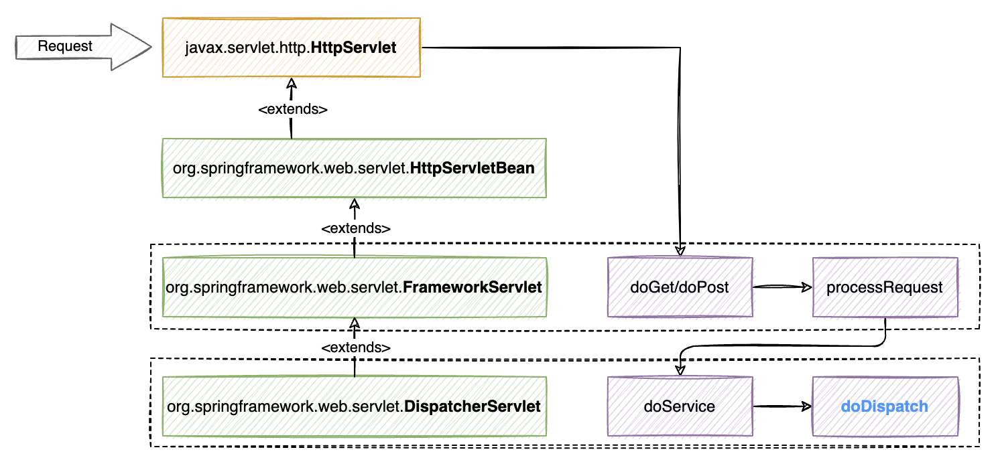
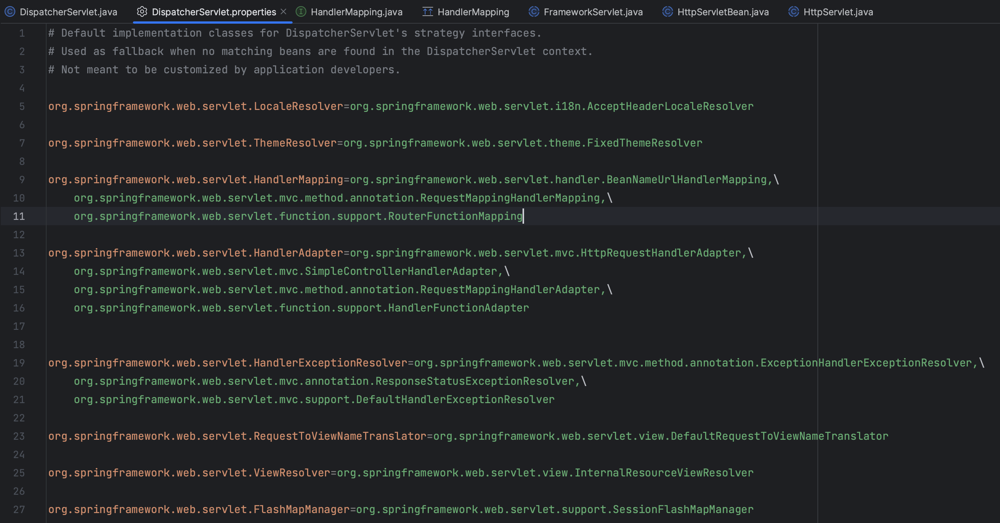
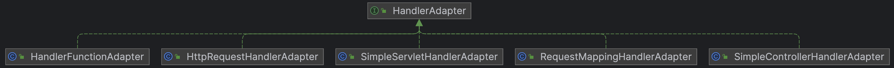
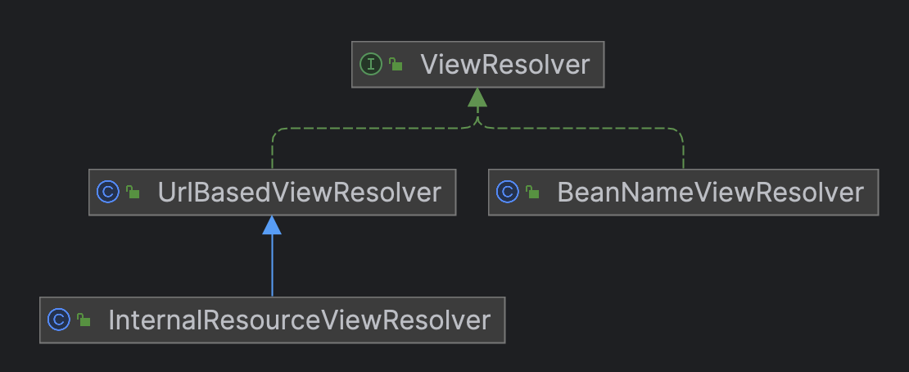
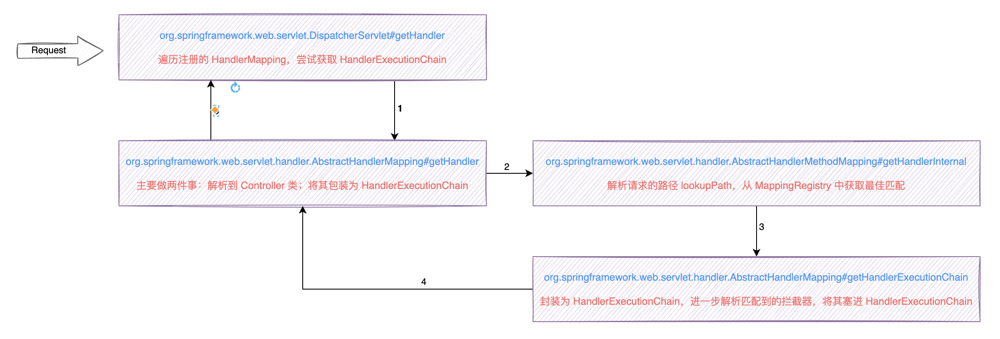
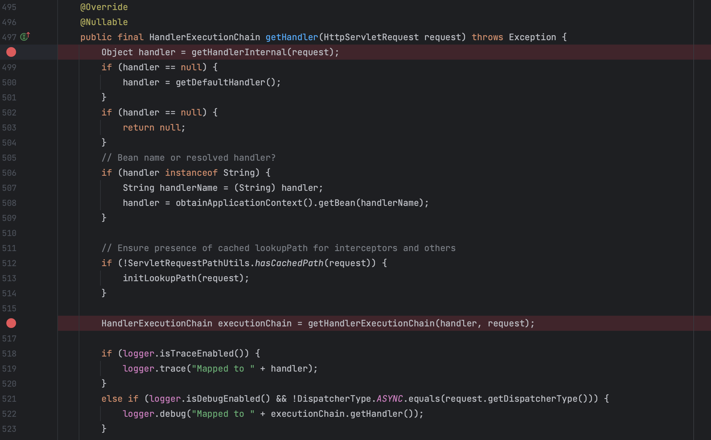
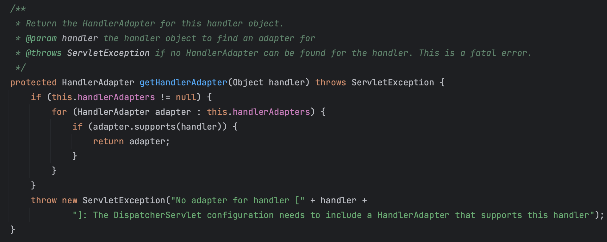
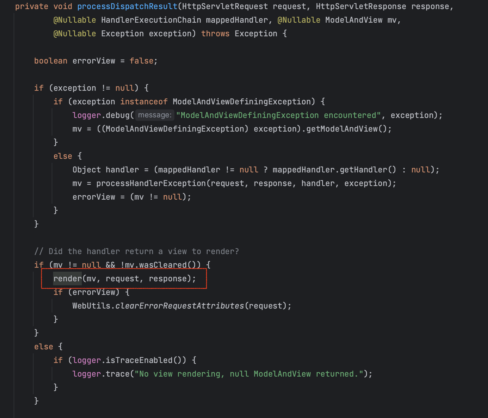

## Spring MVC 源码分析

### 一、主流程梳理

> 根据`Spring MVC`依然是针对`JavaEE`的封装这个思路，而传统`JavaEE`开发是通过实现`javax.servlet.http.HttpServlet`接口，并重写其中的`doGet`与`doPost`方法。
>
> 顺着`javax.servlet.http.HttpServlet`这个线索，可以继续深入探索`Spring MVC`到底为`web`层做了哪些事。



- 实际上`javax.servlet.http.HttpServlet`的`doGet/doPost`方法是在`org.springframework.web.servlet.FrameworkServlet`中实现的，而`doGet/doPost`方法的实现中都仅调用了一个`processRequest`方法。

  ```java
  @Override
  protected final void doGet(HttpServletRequest request, HttpServletResponse response) throws ServletException, IOException {
  
      processRequest(request, response);
  }
  
  
  @Override
  protected final void doPost(HttpServletRequest request, HttpServletResponse response) throws ServletException, IOException {
  
      processRequest(request, response);
  }
  ```

- 接着`processRequest`方法的调用链路上有一处核心位置，即调用了`doService`方法，这个方法在当前类`org.springframework.web.servlet.FrameworkServlet`中是个抽象方法，需要子类实现。

  ```java
  protected abstract void doService(HttpServletRequest request, HttpServletResponse response) throws Exception;
  ```

- `doService`在`org.springframework.web.servlet.DispatcherServlet`类中实现，调用链路上有一处核心位置，即调用了`doDispatch`方法，该方法承载了`Spring MVC`的关键逻辑。

  ```java
  @Override
  protected void doService(HttpServletRequest request, HttpServletResponse response) throws Exception {
      logRequest(request);
  
      // Keep a snapshot of the request attributes in case of an include,
      // to be able to restore the original attributes after the include.
      Map<String, Object> attributesSnapshot = null;
      if (WebUtils.isIncludeRequest(request)) {
          attributesSnapshot = new HashMap<>();
          Enumeration<?> attrNames = request.getAttributeNames();
          while (attrNames.hasMoreElements()) {
              String attrName = (String) attrNames.nextElement();
              if (this.cleanupAfterInclude || attrName.startsWith(DEFAULT_STRATEGIES_PREFIX)) {
                  attributesSnapshot.put(attrName, request.getAttribute(attrName));
              }
          }
      }
  
      // Make framework objects available to handlers and view objects.
      request.setAttribute(WEB_APPLICATION_CONTEXT_ATTRIBUTE, getWebApplicationContext());
      request.setAttribute(LOCALE_RESOLVER_ATTRIBUTE, this.localeResolver);
      request.setAttribute(THEME_RESOLVER_ATTRIBUTE, this.themeResolver);
      request.setAttribute(THEME_SOURCE_ATTRIBUTE, getThemeSource());
  
      if (this.flashMapManager != null) {
          FlashMap inputFlashMap = this.flashMapManager.retrieveAndUpdate(request, response);
          if (inputFlashMap != null) {
              request.setAttribute(INPUT_FLASH_MAP_ATTRIBUTE, Collections.unmodifiableMap(inputFlashMap));
          }
          request.setAttribute(OUTPUT_FLASH_MAP_ATTRIBUTE, new FlashMap());
          request.setAttribute(FLASH_MAP_MANAGER_ATTRIBUTE, this.flashMapManager);
      }
  
      RequestPath previousRequestPath = null;
      if (this.parseRequestPath) {
          previousRequestPath = (RequestPath) request.getAttribute(ServletRequestPathUtils.PATH_ATTRIBUTE);
          ServletRequestPathUtils.parseAndCache(request);
      }
  
      try {
          // 核心位置，执行请求派发
          doDispatch(request, response);
      }
      finally {
          if (!WebAsyncUtils.getAsyncManager(request).isConcurrentHandlingStarted()) {
              // Restore the original attribute snapshot, in case of an include.
              if (attributesSnapshot != null) {
                  restoreAttributesAfterInclude(request, attributesSnapshot);
              }
          }
          if (this.parseRequestPath) {
              ServletRequestPathUtils.setParsedRequestPath(previousRequestPath, request);
          }
      }
  }
  ```

  ```java
  protected void doDispatch(HttpServletRequest request, HttpServletResponse response) throws Exception {
      HttpServletRequest processedRequest = request;
      HandlerExecutionChain mappedHandler = null;
      boolean multipartRequestParsed = false;
  
      WebAsyncManager asyncManager = WebAsyncUtils.getAsyncManager(request);
  
      try {
          ModelAndView mv = null;
          Exception dispatchException = null;
  
          try {
              processedRequest = checkMultipart(request);
              multipartRequestParsed = (processedRequest != request);
  
              // Determine handler for the current request.
              // 获取处理器映射器
              mappedHandler = getHandler(processedRequest);
              if (mappedHandler == null) {
                  noHandlerFound(processedRequest, response);
                  return;
              }
  
              // Determine handler adapter for the current request.
              // 获取处理器适配器
              HandlerAdapter ha = getHandlerAdapter(mappedHandler.getHandler());
  
              // Process last-modified header, if supported by the handler.
              String method = request.getMethod();
              boolean isGet = HttpMethod.GET.matches(method);
              if (isGet || HttpMethod.HEAD.matches(method)) {
                  long lastModified = ha.getLastModified(request, mappedHandler.getHandler());
                  if (new ServletWebRequest(request, response).checkNotModified(lastModified) && isGet) {
                      return;
                  }
              }
  
              // 拦截器前置处理
              if (!mappedHandler.applyPreHandle(processedRequest, response)) {
                  return;
              }
  
              // Actually invoke the handler.
              // 反射调用处理器
              mv = ha.handle(processedRequest, response, mappedHandler.getHandler());
  
              if (asyncManager.isConcurrentHandlingStarted()) {
                  return;
              }
  
              applyDefaultViewName(processedRequest, mv);
              // 拦截器后置处理
              mappedHandler.applyPostHandle(processedRequest, response, mv);
          }
          catch (Exception ex) {
              dispatchException = ex;
          }
          catch (Throwable err) {
              // As of 4.3, we're processing Errors thrown from handler methods as well,
              // making them available for @ExceptionHandler methods and other scenarios.
              dispatchException = new NestedServletException("Handler dispatch failed", err);
          }
          // 视图渲染
          processDispatchResult(processedRequest, response, mappedHandler, mv, dispatchException);
      }
      catch (Exception ex) {
          triggerAfterCompletion(processedRequest, response, mappedHandler, ex);
      }
      catch (Throwable err) {
          triggerAfterCompletion(processedRequest, response, mappedHandler,
                                 new NestedServletException("Handler processing failed", err));
      }
      finally {
          if (asyncManager.isConcurrentHandlingStarted()) {
              // Instead of postHandle and afterCompletion
              // 拦截器视图渲染后处理
              if (mappedHandler != null) {
                  mappedHandler.applyAfterConcurrentHandlingStarted(processedRequest, response);
              }
          }
          else {
              // Clean up any resources used by a multipart request.
              if (multipartRequestParsed) {
                  cleanupMultipart(processedRequest);
              }
          }
      }
  }
  ```

### 二、核心位置 - initStrategies

> 之前一篇文章归集过`Spring MVC`的九大组件，那么这些组件是在何时何处初始化与管理的，答案就在`org.springframework.web.servlet.DispatcherServlet`中。

- 九大组件声明为`DispatcherServlet`的成员变量。

  

- 而该成员变量则在`org.springframework.web.servlet.DispatcherServlet#onRefresh`方法中，调用`initStrategies`引导完成初始化工作。

  ```java
  /**
   * This implementation calls {@link #initStrategies}.
   */
  @Override
  protected void onRefresh(ApplicationContext context) {
      initStrategies(context);
  }
  
  /**
   * Initialize the strategy objects that this servlet uses.
   * <p>May be overridden in subclasses in order to initialize further strategy objects.
   */
  protected void initStrategies(ApplicationContext context) {
      initMultipartResolver(context);
      initLocaleResolver(context);
      initThemeResolver(context);
      initHandlerMappings(context);
      initHandlerAdapters(context);
      initHandlerExceptionResolvers(context);
      initRequestToViewNameTranslator(context);
      initViewResolvers(context);
      initFlashMapManager(context);
  }
  ```

- initMultipartResolver：主要是去容器中获取名称为`multipartResolver`的`MultipartResolver`实现。

- initLocaleResolver：主要是去容器中获取名称为`localeResolver`的`LocaleResolver`实现。

- initThemeResolver：主要是去容器中获取名称为`themeResolver`的`ThemeResolver`实现。

- initHandlerMappings：默认配置下，是去容器中获取所有`HandlerMapping`的实现，为了保证`HandlerMapping`能够注册成功，兜底方案是可以通过`getDefaultStrategies`方法，在`DispatcherServlet.properties`文件中加载类。

  

  

- initHandlerAdapters：默认配置下，是去容器中获取所有`HandlerAdapter`的实现，为了保证`HandlerAdapter`能够注册成功，兜底方案是可以通过`getDefaultStrategies`方法，在`DispatcherServlet.properties`文件中加载类。

  

  

- initHandlerExceptionResolvers：默认配置下，是去容器中获取所有`initHandlerExceptionResolvers`的实现，为了保证`initHandlerExceptionResolvers`能够注册成功，兜底方案是可以通过`getDefaultStrategies`方法，在`DispatcherServlet.properties`文件中加载类。

  

  

- initRequestToViewNameTranslator：主要是去容器中获取名称为`viewNameTranslator`的`RequestToViewNameTranslator`实现。

- initViewResolvers：默认配置下，是去容器中获取所有`initViewResolvers`的实现，为了保证`initViewResolvers`能够注册成功，兜底方案是可以通过`getDefaultStrategies`方法，在`DispatcherServlet.properties`文件中加载类。

  

  

- initFlashMapManager：主要是去容器中获取名称为`flashMapManager`的`FlashMapManager`实现。

### 三、核心位置 - getHandler



1. 遍历注册的`HandlerMapping`，尝试获取`HandlerExecutionChain`

   

2. `AbstractHandlerMapping#getHandler`主要做两件事：一是解析`Controller`及其对应的`Method`封装；二是解析拦截器`HandlerInterceptor`，将拦截器与上述对象进一步封装为`HandlerExecutionChain`

   

   - 解析请求的路径`lookupPath`，从`MappingRegistry`中获取最佳匹配

     

   - 封装为`HandlerExecutionChain`，进一步解析匹配到的拦截器，将其塞进`HandlerExecutionChain`

     

### 四、核心位置 - getHandlerAdapter

遍历每个`HandlerAdapter`，尝试获取能支持当前`handler`的并返回



### 五、核心位置 - handle


`Spring MVC`通过处理器适配器`HandlerAdapter`的`handler`方法转发请求，返回`ModelAndView`。


1. `HanlderAdaper`调用`AbstractHandlerMethodAdapter`的`handle`方法执行
1. `AbstractHandlerMethodAdapter`调用内部的抽象方法`handleInternal`，该方法由`RequestMappingHandlerAdapter`实现
1. `RequestMappingHandlerAdapter`调用内部的`invokeHandlerMethod`方法，此处会将`HandlerMethod`对象包装为`ServletInvocableHandlerMethod`对象以及封装`HttpServletRequest`和`HttpServletResponse`为一个`ServletWebRequest`对象，最终调用`ServletInvocableHandlerMethod`的`invokeAndHandle`方法
1. `ServletInvocableHandlerMethod`调用`invokeAndHandle`方法，触发内部的`invokeForRequest`方法调用
1. `InvocableHandlerMethod`调用`invokeForRequest`方法，解析即将要调用方法的形参列表，触发内部`doInvoke`方法调用
1. `InvocableHandlerMethod`调用`doInvoke`方法最终通过反射方式`method.invoke(getBean(), args)`实现目标方法的反射调用

### 六、核心位置 - processDispatchResult


`Spring MVC`处理请求从`org.springframework.web.servlet.DispatcherServlet#render`方法开始



