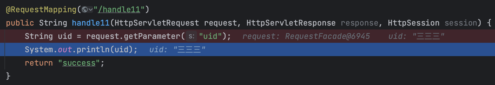

## Spring MVC 附录

### 一、中文乱码解决

#### 1.1 页面乱码

对于原生`Spring MVC`的使用过程中，最原始的模版引擎是`JSP`渲染页面，若出现中文乱码，如下图所示：


则需要检查当前`JSP`的文件头中是否声明了编码格式，将编码格式`contentType`修正为`text/html;charset=UTF-8`即可。

```jsp
<%@ page contentType="text/html;charset=UTF-8" isELIgnored="false" language="java" %>
```

#### 1.2 POST 请求乱码

在客户端与服务端交互过程中，`POST`请求中携带的参数若包含中文，在原生`SpringMVC`场景下则可能会出现乱码，如下图所示：


解决方式主要是配置一个过滤器`org.springframework.web.filter.CharacterEncodingFilter`，初始化编码格式以及拦截路径即可。

```xml
<filter>
    <filter-name>encodingFilter</filter-name>
    <filter-class>org.springframework.web.filter.CharacterEncodingFilter</filter-class>
    <init-param>
        <param-name>encoding</param-name>
        <param-value>UTF-8</param-value>
    </init-param>
    <init-param>
        <param-name>forceRequestEncoding</param-name>
        <param-value>true</param-value>
    </init-param>
    <init-param>
        <param-name>forceResponseEncoding</param-name>
        <param-value>true</param-value>
    </init-param>
</filter>
<!-- 编码过滤器拦截规则 -->
<filter-mapping>
    <filter-name>encodingFilter</filter-name>
    <url-pattern>/*</url-pattern>
</filter-mapping>
```



#### 1.3 GET 请求乱码

在客户端与服务端交互过程中，`GET`请求中携带的参数若包含中文，在原生`SpringMVC`场景下则可能会出现乱码，如下图所示：


`GET`请求的参数乱码问题，需要调整`web`服务器的配置。对于`Tomcat`中间件，可以通过添加参数`uriEncoding`，指定为`UTF-8`即可。

```xml
<!-- maven 插件式引入 Tomcat -->
<plugin>
    <groupId>org.apache.tomcat.maven</groupId>
    <artifactId>tomcat7-maven-plugin</artifactId>
    <version>2.2</version>
    <configuration>
        <!-- 应用上下文路径 -->
        <path>/context1</path>
        <!-- tomcat 监听端口号 -->
        <port>8080</port>
        <!-- 解决 GET 请求参数中文乱码问题 -->
        <uriEncoding>UTF-8</uriEncoding>
    </configuration>
</plugin>
```

```xml
<!-- 外部配置方式 Tomcat 服务，修改 server.xml  -->
<Connector URIEncoding="utf-8" connectionTimeout="20000" port="8080" protocol="HTTP/1.1" redirectPort="8443"/>
```

### 二、静态资源读取

