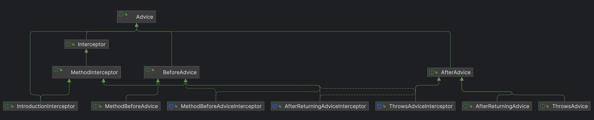
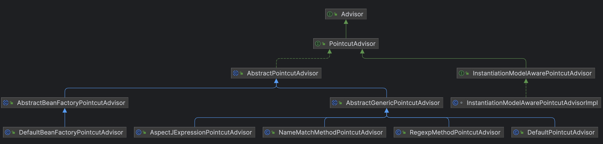

## 一、Spring 概览


### 1.1 Spring Data Access/Integration

- JDBC：提供了一个 JDBC 抽象层，它可以消除冗长的 JDBC 编码和解析数据库厂商特有的错误代码。 这个模块包含了 Spring 对 JDBC 数据访问进行封装的所有类
- ORM：如 JPA、Hibernate、iBatis 等，提供了 一个交互层
- OXM：Object/XML 映射实现包括 JAXB、 Castor、 XMLBeans、 JiBX 和 XStrearn
- JMS：包含了 一些制造和消费消息的特性
- Transaction：支持编程和声明式的事务管理，这些事务类必须实现特定的接口，并且对所有的 POJO 都适用

### 1.2 Web

**提供了基础的面向 Web 的集成特性。例如，多文件上传、使用 servlet listeners 初始化 IOC 容器以及一个面向 Web 的应用上下文。 它还包含 Spring 远程支持中 Web 的相关部分**

### 1.3 AOP

- **Aspects：** 提供了对 AspectJ 的集成支持。
- **Instrumentation：** 提供了 class instrumentation 支持和 classloader 实现，使得可以在特定的应用服务器上使用

### 1.4 Core Container

- 总体模块：Core 和 Beans 模块是框架的基础部分，提供 IOC（控制反转）和 DI（依赖注入）特性。 这里的基础概念是BeanFactory，它提供对 Factory 模式的经典实现来消除对程序单例模式的需要，并真正地允许你从程序逻辑中分离出依赖关系和配置
- Core：主要包含 Spring 框架基本的核心工具类， Spring 的其他组件都要用到这个包里的类，Core 模块是其他组件的基本核心。
- Beans：它包含访问配置文件、创建和管理 bean 以及进行 Inversion Of Control I Dependency Injection ( IOC/DI ）操作相关的所有类。
- Context：构建于 Core 和 Beans 模块基础之上，提供了一种类似 JNDI 注册器的框架式的对象访问方法。 Context 模块继承了 Beans 的特性，为 Spring 核心提供了大量扩展，添加了对国际化（例如资源绑定）、事件传播、资源加载和对 Context 的透明创建的支持。Context 模块同时也支持 J2EE 的一些特性， ApplicationContext 接口是 Context
- SPEL（Expression Language）：提供了强大的表达式语言，用于在运行时查询和操纵对象

### 1.5 Test

支持使用 JUnit 和 TestNG

## 二、Spring 整体脉络







## 三、Spring IOC 使用

> IOC 核心思想：资源不由使用资源的双方管理，而由不使用资源的第三方管理，因此可以实现：资源集中管理，实现资源的可配置和易管理；降低了使用双方的依赖程度，解耦；可维护性、扩展性、灵活性提高

### 2.1 XML 式

1. `beans.xml`定义`Bean`信息

   ```xml
   <?xml version="1.0" encoding="UTF-8"?>
   <beans xmlns="http://www.springframework.org/schema/beans"
          xmlns:xsi="http://www.w3.org/2001/XMLSchema-instance"
          xsi:schemaLocation="http://www.springframework.org/schema/beans http://www.springframework.org/schema/beans/spring-beans.xsd">
   
       <bean id="user" class="cloud.yiwenup.sample.spring.framework.entity.User">
           <property name="username" value="zhangsan"/>
           <property name="password" value="123"/>
       </bean>
   
   </beans>
   ```

2. 读取配置文件`beans.xml`，测试获取容器中的`Bean`

   ```java
   BeanFactory context = new ClassPathXmlApplicationContext("beans.xml");
   User user = context.getBean(User.class);
   System.out.println(user);
   ```

### 2.2 注解式

1. 定义配置类，配置`Bean`注入容器

   ```java
   /**
    * 文件描述
    *
    * @Project yiwenup-sample
    * @Package cloud.yiwenup.sample.spring.framework.config
    * @Author yiwenup
    * @Date 2022-06-14 17:14:28
    * @Description
    */
   @Configuration
   public class User4AnnoConfig {
       @Bean
       public User4Anno user4Anno() {
           User4Anno user4Anno = new User4Anno();
           user4Anno.setUsername("李四");
           user4Anno.setPassword("456");
           return user4Anno;
       }
   }
   ```

   ```java
   /**
    * 文件描述
    *
    * @Project yiwenup-sample
    * @Package cloud.yiwenup.sample.spring.framework.entity
    * @Author yiwenup
    * @Date 2022-06-14 17:06:15
    * @Description
    */
   public class User4Anno {
       private String username;
       private String password;
       // 省略 get/set/toString
   }
   ```

2. 加载配置类，获取`Bean`

   ```java
   BeanFactory context = new AnnotationConfigApplicationContext(User4AnnoConfig.class);
   User4Anno user = context.getBean(User4Anno.class);
   System.out.println(user);
   ```

### 2.3 包扫描

> 比如现在引入了某个外部的功能，但是并没有声明将注入`IOC`中，可以配置扫描规则，将其扫入`IOC`中

```java
/**
 * 文件描述
 *
 * @Project yiwenup-sample
 * @Package cloud.yiwenup.sample.spring.framework.config
 * @Author yiwenup
 * @Date 2022-06-14 17:14:28
 * @Description 假设现在要扫 Spring 包里面的 ClassPathXmlApplicationContext 类
 */
@Configuration
@ComponentScan(
        basePackages = {"org.springframework.context.support"},
        includeFilters = {
                @ComponentScan.Filter(type = FilterType.ASSIGNABLE_TYPE, classes = {ClassPathXmlApplicationContext.class})
        }, useDefaultFilters = false)
public class User4AnnoConfig {
}
```

```java
package org.springframework.context.annotation;

public enum FilterType {
    // 注解
    ANNOTATION,
    // 指定的类
    ASSIGNABLE_TYPE,
    // ASPECTJ
    ASPECTJ,
    // 正则
    REGEX,
    // 自定义
    CUSTOM;

    private FilterType() {
    }
}
```

> 设置可以通过自定义规则来进行包扫描

```java
/**
 * 文件描述
 *
 * @Project yiwenup-sample
 * @Package cloud.yiwenup.sample.spring.framework.filter
 * @Author yiwenup
 * @Date 2022-06-14 17:37:18
 * @Description
 */
public class CustomFilter implements TypeFilter {
    @Override
    public boolean match(MetadataReader metadataReader, MetadataReaderFactory metadataReaderFactory) throws IOException {
        // 获取类的元信息
        ClassMetadata classMetadata = metadataReader.getClassMetadata();
        // 获取注解的元信息
        AnnotationMetadata annotationMetadata = metadataReader.getAnnotationMetadata();
        // 获取资源的元信息
        Resource resource = metadataReader.getResource();

        return "org.springframework.context.support.ClassPathXmlApplicationContext".equals(classMetadata.getClassName());
    }
}
```

```java
/**
 * 文件描述
 *
 * @Project yiwenup-sample
 * @Package cloud.yiwenup.sample.spring.framework.config
 * @Author yiwenup
 * @Date 2022-06-14 17:14:28
 * @Description 假设现在要扫 Spring 包里面的 ClassPathXmlApplicationContext 类
 */
@Configuration
@ComponentScan(
        basePackages = {"org.springframework.context.support"},
        includeFilters = {
                @ComponentScan.Filter(type = FilterType.CUSTOM, classes = {CustomFilter.class})
        }, useDefaultFilters = false)
public class User4AnnoConfig {
}
```

### 2.4 导入 Bean 的方式

- @Import

  ```java
  @Configuration
  @Import(value = {User4Scan.class})
  public class User4AnnoConfig {
  }
  ```

- 实现`ImportSeletor`

  ```java
  public class BeanImporter implements ImportSelector {
      @Override
      public String[] selectImports(AnnotationMetadata importingClassMetadata) {
          return new String[]{User4Scan.class.getName()};
      }
  }
  ```

  ```java
  @Configuration
  @Import(value = {BeanImporter.class})
  public class User4AnnoConfig {
  }
  ```

- 实现`ImportBeanDefinitionRegister`

  ```java
  public class BeanImporter2 implements ImportBeanDefinitionRegistrar {
  
      @Override
      public void registerBeanDefinitions(AnnotationMetadata importingClassMetadata, BeanDefinitionRegistry registry) {
          BeanDefinition beanDefinition = new RootBeanDefinition(User4Scan.class);
          registry.registerBeanDefinition("user4Scan", beanDefinition);
      }
  }
  ```

  ```java
  @Configuration
  @Import(value = {BeanImporter2.class})
  public class User4AnnoConfig {
  }
  ```

- `FacotryBean`

  ```java
  public class BeanImporter3 implements FactoryBean<User4Scan> {
  
      @Override
      public User4Scan getObject() throws Exception {
          User4Scan user4Scan = new User4Scan();
          user4Scan.setUsername("王五");
          user4Scan.setPassword("789");
          return user4Scan;
      }
  
      @Override
      public Class<?> getObjectType() {
          return User4Scan.class;
      }
  
      @Override
      public boolean isSingleton() {
          return true;
      }
  }
  ```

  ```java
  @Configuration
  @Import(value = {BeanImporter3.class})
  public class User4AnnoConfig {
  }
  ```

## 四、Spring AOP 使用

> AOP 面向切面编程，要实现的是在我们原来写的代码的基础上，进行一定的包装，如在方法执行前、方法返回后、方法抛出异常后等地方进行一定的拦截处理或者叫增强处理。
>
> AspectJ 是 AOP 编程的完全解决方案，它能做许多AOP实现不了的事情。Spring AOP 致力于解决的是企业级开发中最普遍的 AOP 需求（方法织入）
>
> Spring AOP 中的 @Aspect、@PointCut、@Before、@After、@Around 都来自 AspectJ，但功能都由 SpringAOP 自己实现

### 4.1 接口式 - Advice 系

> - 拦截器的粒度只控制到了类级别，类中所有的方法都进行了拦截

1. 测试功能类

   ```java
   /**
    * 文件描述
    *
    * @Project yiwenup-sample
    * @Package cloud.yiwenup.sample.spring.framework.entity.aop
    * @Author yiwenup
    * @Date 2022-06-15 09:35:01
    * @Description
    */
   public interface AopInter {
       int add(int numA, int numB);
       int sub(int numA, int numB);
       int multi(int numA, int numB);
       int div(int numA, int numB);
   }
   ```

   ```java
   /**
    * 文件描述
    *
    * @Project yiwenup-sample
    * @Package cloud.yiwenup.sample.spring.framework.entity.aop.impl
    * @Author yiwenup
    * @Date 2022-06-15 09:36:46
    * @Description
    */
   public class AopImpl implements AopInter {
       @Override
       public int add(int numA, int numB) {
           return numA + numB;
       }
   
       @Override
       public int sub(int numA, int numB) {
           return numA - numB;
       }
   
       @Override
       public int multi(int numA, int numB) {
           return numA * numB;
       }
   
       @Override
       public int div(int numA, int numB) {
           return numA / numB;
       }
   }
   ```

2. 切面

   ```java
   /**
    * 文件描述
    *
    * @Project yiwenup-sample
    * @Package cloud.yiwenup.sample.spring.framework.aspect.interfaces
    * @Author yiwenup
    * @Date 2022-06-15 09:49:45
    * @Description
    */
   public class BeforeMethod implements MethodBeforeAdvice {
       @Override
       public void before(Method method, Object[] args, Object target) throws Throwable {
           System.out.println("MethodBeforeAdvice => 方法：" + method.getName() + " 参数：" + Arrays.asList(args));
       }
   }
   ```

   ```java
   /**
    * 文件描述
    *
    * @Project yiwenup-sample
    * @Package cloud.yiwenup.sample.spring.framework.aspect.interfaces
    * @Author yiwenup
    * @Date 2022-06-15 10:51:54
    * @Description
    */
   public class AroundMethod implements MethodInterceptor {
       @Override
       public Object invoke(MethodInvocation invocation) throws Throwable {
           // 方法信息
           Method method = invocation.getMethod();
           // 方法名
           String methodName = method.getName();
           // 参数数量
           int parameterCount = method.getParameterCount();
           // 参数类型
           Class<?>[] parameterTypes = method.getParameterTypes();
           // 返回值类型
           Class<?> returnType = method.getReturnType();
   
           // 参数
           Object[] arguments = invocation.getArguments();
           System.out.println("MethodInterceptor => 方法：" + methodName + " 执行前，参数：" + Arrays.asList(arguments));
           Object ret = invocation.proceed();
           System.out.println("MethodInterceptor => 方法：" + methodName + " 执行后，返回值：" + ret);
           return ret;
       }
   }
   ```

3. 动态代理（有接口的用`Jdk动态代理`，无接口的用`Cglib动态代理`）

   ```java
   /**
    * 文件描述
    *
    * @Project yiwenup-sample
    * @Package cloud.yiwenup.sample.spring.framework.config
    * @Author yiwenup
    * @Date 2022-06-14 17:14:28
    * @Description
    */
   @Configuration
   public class User4AnnoConfig {
   
       @Bean
       public MethodBeforeAdvice methodBeforeAdvice() {
           return new BeforeMethod();
       }
   
       @Bean
       public MethodInterceptor methodInterceptor() {
           return new AroundMethod();
       }
   
       @Bean
       public ProxyFactoryBean proxyFactoryBean() {
           ProxyFactoryBean proxyFactoryBean = new ProxyFactoryBean();
           // 编排切面，有顺序的
           proxyFactoryBean.setInterceptorNames("methodInterceptor", "methodBeforeAdvice");
           proxyFactoryBean.setTarget(new AopImpl());
           return proxyFactoryBean;
       }
   }
   ```

### 4.2 接口式 - Advisor 系

> - Advisor = Advice + PointCut
> - 这种方式基于上面的好处在于：可以更加细粒度的控制需要拦截待处理的方法，做到了期望方法级别的增强

1. 测试功能类

   ```java
   /**
    * 文件描述
    *
    * @Project yiwenup-sample
    * @Package cloud.yiwenup.sample.spring.framework.entity.aop
    * @Author yiwenup
    * @Date 2022-06-15 09:35:01
    * @Description
    */
   public interface AopInter {
       int add(int numA, int numB);
       int sub(int numA, int numB);
       int multi(int numA, int numB);
       int div(int numA, int numB);
   }
   ```

   ```java
   /**
    * 文件描述
    *
    * @Project yiwenup-sample
    * @Package cloud.yiwenup.sample.spring.framework.entity.aop.impl
    * @Author yiwenup
    * @Date 2022-06-15 09:36:46
    * @Description
    */
   public class AopImpl implements AopInter {
       @Override
       public int add(int numA, int numB) {
           return numA + numB;
       }
   
       @Override
       public int sub(int numA, int numB) {
           return numA - numB;
       }
   
       @Override
       public int multi(int numA, int numB) {
           return numA * numB;
       }
   
       @Override
       public int div(int numA, int numB) {
           return numA / numB;
       }
   }
   ```

2. 切面

   ```java
   /**
    * 文件描述
    *
    * @Project yiwenup-sample
    * @Package cloud.yiwenup.sample.spring.framework.aspect.interfaces
    * @Author yiwenup
    * @Date 2022-06-15 10:51:54
    * @Description
    */
   public class AroundMethod implements MethodInterceptor {
       @Override
       public Object invoke(MethodInvocation invocation) throws Throwable {
           // 方法信息
           Method method = invocation.getMethod();
           // 方法名
           String methodName = method.getName();
           // 参数数量
           int parameterCount = method.getParameterCount();
           // 参数类型
           Class<?>[] parameterTypes = method.getParameterTypes();
           // 返回值类型
           Class<?> returnType = method.getReturnType();
   
           // 参数
           Object[] arguments = invocation.getArguments();
           System.out.println("MethodInterceptor => 方法：" + methodName + " 执行前，参数：" + Arrays.asList(arguments));
           Object ret = invocation.proceed();
           System.out.println("MethodInterceptor => 方法：" + methodName + " 执行后，返回值：" + ret);
           return ret;
       }
   }
   ```

3. 动态代理

   ```java
   /**
    * 文件描述
    *
    * @Project yiwenup-sample
    * @Package cloud.yiwenup.sample.spring.framework.config
    * @Author yiwenup
    * @Date 2022-06-14 17:14:28
    * @Description 
    */
   @Configuration
   public class User4AnnoConfig {
   
       /**
        * Advisor = Advice + PonitCut
        */
       @Bean
       public NameMatchMethodPointcutAdvisor nameMatchMethodPointcutAdvisor() {
           NameMatchMethodPointcutAdvisor nameMatchMethodPointcutAdvisor = new NameMatchMethodPointcutAdvisor();
           // 设置 Advice
           nameMatchMethodPointcutAdvisor.setAdvice(methodInterceptor());
           // 设置待拦截的方法
           nameMatchMethodPointcutAdvisor.setMappedNames("sub");
           return nameMatchMethodPointcutAdvisor;
       }
   
       @Bean
       public MethodInterceptor methodInterceptor() {
           return new AroundMethod();
       }
   
       @Bean
       public ProxyFactoryBean proxyFactoryBean() {
           ProxyFactoryBean proxyFactoryBean = new ProxyFactoryBean();
           // 将 Advisor 设置进来
           proxyFactoryBean.setInterceptorNames("nameMatchMethodPointcutAdvisor");
           proxyFactoryBean.setTarget(new AopImpl());
           return proxyFactoryBean;
       }
   }
   ```

### 4.3 接口式 - AutoProxy

> 上述方式，只能针对某个类做代理增强，存在`ProxyFactoryBean`和具体类的耦合，每增加一个待增强的类，就需要一个`FactoryBean`，为此，`AutoProxy`提供了一种全局代理生效的方式

1. 测试功能类

   ```java
   /**
    * 文件描述
    *
    * @Project yiwenup-sample
    * @Package cloud.yiwenup.sample.spring.framework.entity.aop
    * @Author yiwenup
    * @Date 2022-06-15 09:35:01
    * @Description
    */
   public interface AopInter {
       int add(int numA, int numB);
       int sub(int numA, int numB);
       int multi(int numA, int numB);
       int div(int numA, int numB);
   }
   ```

   ```java
   /**
    * 文件描述
    *
    * @Project yiwenup-sample
    * @Package cloud.yiwenup.sample.spring.framework.entity.aop.impl
    * @Author yiwenup
    * @Date 2022-06-15 09:36:46
    * @Description
    */
   public class AopImpl implements AopInter {
       @Override
       public int add(int numA, int numB) {
           return numA + numB;
       }
   
       @Override
       public int sub(int numA, int numB) {
           return numA - numB;
       }
   
       @Override
       public int multi(int numA, int numB) {
           return numA * numB;
       }
   
       @Override
       public int div(int numA, int numB) {
           return numA / numB;
       }
   }
   ```

2. 切面

   ```java
   /**
    * 文件描述
    *
    * @Project yiwenup-sample
    * @Package cloud.yiwenup.sample.spring.framework.aspect.interfaces
    * @Author yiwenup
    * @Date 2022-06-15 10:51:54
    * @Description
    */
   public class AroundMethod implements MethodInterceptor {
       @Override
       public Object invoke(MethodInvocation invocation) throws Throwable {
           // 方法信息
           Method method = invocation.getMethod();
           // 方法名
           String methodName = method.getName();
           // 参数数量
           int parameterCount = method.getParameterCount();
           // 参数类型
           Class<?>[] parameterTypes = method.getParameterTypes();
           // 返回值类型
           Class<?> returnType = method.getReturnType();
   
           // 参数
           Object[] arguments = invocation.getArguments();
           System.out.println("MethodInterceptor => 方法：" + methodName + " 执行前，参数：" + Arrays.asList(arguments));
           Object ret = invocation.proceed();
           System.out.println("MethodInterceptor => 方法：" + methodName + " 执行后，返回值：" + ret);
           return ret;
       }
   }
   ```

3. 动态代理

   ```java
   /**
    * 文件描述
    *
    * @Project yiwenup-sample
    * @Package cloud.yiwenup.sample.spring.framework.config
    * @Author yiwenup
    * @Date 2022-06-14 17:14:28
    * @Description 假设现在要扫 Spring 包里面的 ClassPathXmlApplicationContext 类
    */
   @Configuration
   public class User4AnnoConfig {
       @Bean(value = "testAop")
       public AopInter aopInter() {
           return new AopImpl();
       }
   
       @Bean
       public NameMatchMethodPointcutAdvisor nameMatchMethodPointcutAdvisor() {
           NameMatchMethodPointcutAdvisor nameMatchMethodPointcutAdvisor = new NameMatchMethodPointcutAdvisor();
           nameMatchMethodPointcutAdvisor.setAdvice(methodInterceptor());
           nameMatchMethodPointcutAdvisor.setMappedNames("add");
           return nameMatchMethodPointcutAdvisor;
       }
   
       @Bean
       public MethodInterceptor methodInterceptor() {
           return new AroundMethod();
       }
   
       @Bean
       public BeanNameAutoProxyCreator beanNameAutoProxyCreator() {
           BeanNameAutoProxyCreator beanNameAutoProxyCreator = new BeanNameAutoProxyCreator();
           // 配置拦截的 Advisor/Intercepter/Advice
           beanNameAutoProxyCreator.setInterceptorNames("nameMatchMethodPointcutAdvisor");
           beanNameAutoProxyCreator.setBeanNames("test*");
           return beanNameAutoProxyCreator;
       }
   }
   ```

4. 设置还可以使用默认实现`DefaultAdvisorAutoProxyCreator`，来让所有的`Advisor`自动生效

   ```java
   /**
    * 文件描述
    *
    * @Project yiwenup-sample
    * @Package cloud.yiwenup.sample.spring.framework.config
    * @Author yiwenup
    * @Date 2022-06-14 17:14:28
    * @Description 假设现在要扫 Spring 包里面的 ClassPathXmlApplicationContext 类
    */
   @Configuration
   public class User4AnnoConfig {
       @Bean(value = "testAop")
       public AopInter aopInter() {
           return new AopImpl();
       }
   
       @Bean
       public NameMatchMethodPointcutAdvisor nameMatchMethodPointcutAdvisor() {
           NameMatchMethodPointcutAdvisor nameMatchMethodPointcutAdvisor = new NameMatchMethodPointcutAdvisor();
           nameMatchMethodPointcutAdvisor.setAdvice(methodInterceptor());
           nameMatchMethodPointcutAdvisor.setMappedNames("add");
           return nameMatchMethodPointcutAdvisor;
       }
   
       @Bean
       public MethodInterceptor methodInterceptor() {
           return new AroundMethod();
       }
   
       // @Bean
       // public BeanNameAutoProxyCreator beanNameAutoProxyCreator() {
       //     BeanNameAutoProxyCreator beanNameAutoProxyCreator = new BeanNameAutoProxyCreator();
       //     beanNameAutoProxyCreator.setInterceptorNames("nameMatchMethodPointcutAdvisor");
       //     beanNameAutoProxyCreator.setBeanNames("test*");
       //     return beanNameAutoProxyCreator;
       // }
   
       // 上述 BeanNameAutoProxyCreator 还需要配置指定的 Advisor 定点生效，这种默认方式可以让全局 Advisor 都生效
       @Bean
       public DefaultAdvisorAutoProxyCreator beanNameAutoProxyCreator() {
           return new DefaultAdvisorAutoProxyCreator();
       }
   }
   ```

### 4.4 注解式

- @Pointcut
- @Before
- @After
- @AfterReturning
- @AfterThrowing

---

**BeanFactory 和 ApplactionContext 的区别**：

- BeanFactory 是懒加载的，ApplactionContext 是非懒加载的（可以指定为懒加载）
- BeanFactory 只有一个职责就是调用 getBean() 生产 Bean，而 ApplactionContext 是 BeanFactoy 的扩张，是面向用户的，有更多的实现（包括AOP、读取资源文件、国际化等）