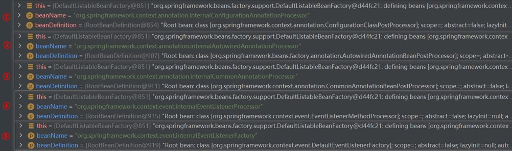
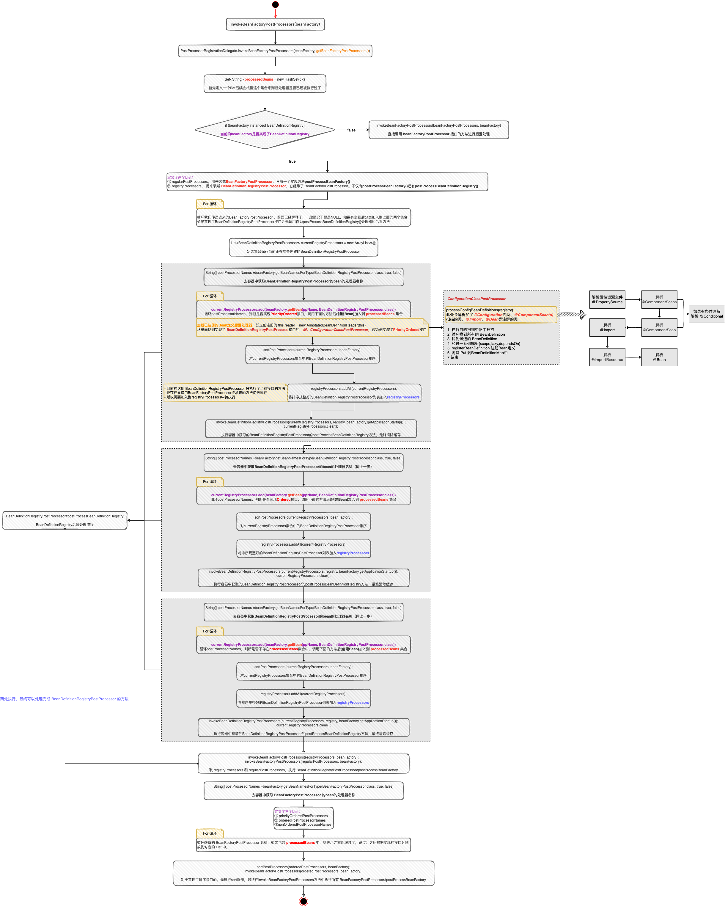

## 零、IOC 容器初始化三大步


- this()
- register(componentClasses)
- **refresh()**

## 一、this


- 调用父类的构造函数，初始化`BeanFactory`

  ```java
  // DefaultListableBeanFactory 是 BeanFactory 最底层的、功能最全的实现，即我们常说的 IOC 容器。
  this.beanFactory = new DefaultListableBeanFactory();
  ```

- 初始化`BeanDefinitionReader`

  ```java
  // 过程中主要做了两件事：注册内置的 BeanPostProcessor，注册内置的核心 BeanDefinition
  this.reader = new AnnotatedBeanDefinitionReader(this);
  ```
  
- 条件表达式计算初始化

  ```java
  // 初始化条件表达式计算
  this.conditionEvaluator = new ConditionEvaluator(registry, environment, null);
  
  public ConditionContextImpl(@Nullable BeanDefinitionRegistry registry,
                              @Nullable Environment environment, @Nullable ResourceLoader resourceLoader) {
      // 设置 IOC 容器的 ApplicationContext 对象
      this.registry = registry;
      // 设置 BeanFactory 对象
      this.beanFactory = deduceBeanFactory(registry);
      // // 设置环境对象
      this.environment = (environment != null ? environment : deduceEnvironment(registry));
      // 设置资源加载对象
      this.resourceLoader = (resourceLoader != null ? resourceLoader : deduceResourceLoader(registry));
      // 设置类加载器
      this.classLoader = deduceClassLoader(resourceLoader, this.beanFactory);
  }
  ```

- 注册核心组件，包含一些**内置**的`BeanDefinition`/`PostProcessor`



  > - 解析配置类的组件（会解析加了**@Configuration的配置类**，以及**@ComponentScan**、**@ComponentScans**注解扫描的包，还会解析**@Bean**、**@Import**等注解的类）：
  >
  >   internalConfigurationAnnotationProcessor => ConfigurationAnnotationProcessor
  >
  > - 解析 @Autowired 的组件：
  >
  >   internalAutowiredAnnotationProcessor => AutowiredAnnotationBeanPostProcessor
  >
  > - 解析 @Resourece/@WebServiceRef/@EJB 注解的组件：
  >
  >   internalCommonAnnotationProcessor => CommonAnnotationBeanPostProcessor
  >
  > - 处理 @EventListener 的组件：
  >
  >   internalEventListenerFactory => DefaultEventListenerFactory
  >
  >   internalEventListenerProcessor => EventListenerMethodProcessor

  ```java
  // 注册核心的组件
  AnnotationConfigUtils.registerAnnotationConfigProcessors(this.registry);
  ```

  ```java
  /**
   * 为容器中注册解析配置类的后置处理器 ConfigurationClassPostProcessor
   * org.springframework.context.annotation.internalConfigurationAnnotationProcessor
   */
  if (!registry.containsBeanDefinition(CONFIGURATION_ANNOTATION_PROCESSOR_BEAN_NAME)) {
     RootBeanDefinition def = new RootBeanDefinition(ConfigurationClassPostProcessor.class);
     def.setSource(source);
     beanDefs.add(registerPostProcessor(registry, def, CONFIGURATION_ANNOTATION_PROCESSOR_BEAN_NAME));
  }
  
  /**
   * 这方法为BeanDefinition设置了一个Role，ROLE_INFRASTRUCTURE代表这是spring内部的，并非用户定义的
   * registry.registerBeanDefinition(beanName, definition);是一个接口方法，
   * 实现类是 DefaultListableBeanFactory
   *    核心工作就是
   *    a.this.beanDefinitionMap.put(beanName, beanDefinition);
   *      把beanName作为key，beanDefinition作为value，放到map里面
   *    b.beanDefinitionNames就是一个List<String>,这里就是把beanName放到List中去
   * DefaultListableBeanFactory就是我们所说的容器,里面放着beanDefinitionMap， beanDefinitionNames，
   *      beanDefinitionMap是一个hashMap，beanName作为Key,beanDefinition作为Value，
   *      beanDefinitionNames是一个集合，里面存放了beanName
   */
  private static BeanDefinitionHolder registerPostProcessor(
      BeanDefinitionRegistry registry, RootBeanDefinition definition, String beanName) {
  
      definition.setRole(BeanDefinition.ROLE_INFRASTRUCTURE);
      // 核心已在上方注释
      registry.registerBeanDefinition(beanName, definition);
      return new BeanDefinitionHolder(definition, beanName);
  }
  ```


---

- 初始化`ClassPathBeanDefinitionScanner`

  ```java
  this.scanner = new ClassPathBeanDefinitionScanner(this);
  ```

## 二、register

> 将从`ApplicationContext`中**导入的配置类**封装为一个`BeanDefinition`，仅封装`BeanDefinition`，**此时尚未进行实例化**

```java
/**
 * register 的核心逻辑
 */
private <T> void doRegisterBean(Class<T> beanClass, @Nullable String name, @Nullable Class<? extends Annotation>[] qualifiers, @Nullable Supplier<T> supplier, @Nullable BeanDefinitionCustomizer[] customizers) {

    AnnotatedGenericBeanDefinition abd = new AnnotatedGenericBeanDefinition(beanClass);
    // 判断是否需要跳过注解，spring中有一个@Condition注解，当不满足条件，这个bean就不会被解析
    if (this.conditionEvaluator.shouldSkip(abd.getMetadata())) {
        return;
    }

    abd.setInstanceSupplier(supplier);
    // 解析bean的作用域，如果没有设置的话，默认为单例
    ScopeMetadata scopeMetadata = this.scopeMetadataResolver.resolveScopeMetadata(abd);
    abd.setScope(scopeMetadata.getScopeName());
    // 获得beanName
    String beanName = (name != null ? name : this.beanNameGenerator.generateBeanName(abd, this.registry))
    // 解析通用注解，填充到AnnotatedGenericBeanDefinition
    // 解析的注解 Lazy，Primary，DependsOn，Role，Description
    AnnotationConfigUtils.processCommonDefinitionAnnotations(abd);
    if (qualifiers != null) {
        for (Class<? extends Annotation> qualifier : qualifiers) {
            if (Primary.class == qualifier) {
                abd.setPrimary(true);
            }
            else if (Lazy.class == qualifier) {
                abd.setLazyInit(true);
            }
            else {
                abd.addQualifier(new AutowireCandidateQualifier(qualifier));
            }
        }
    }
    if (customizers != null) {
        for (BeanDefinitionCustomizer customizer : customizers) {
            customizer.customize(abd);
        }
    }

    BeanDefinitionHolder definitionHolder = new BeanDefinitionHolder(abd, beanName);
    definitionHolder = AnnotationConfigUtils.applyScopedProxyMode(scopeMetadata, definitionHolder, this.registry);
    // 注册，最终会调用DefaultListableBeanFactory中的registerBeanDefinition方法去注册
    BeanDefinitionReaderUtils.registerBeanDefinition(definitionHolder, this.registry);
}
```

- 通过 `AnnotatedGenericBeanDefinition` 的构造方法，获得配置类的 `BeanDefinition`
- 判断需不需要跳过注册，Spring 中有一个 `@Condition` 注解，如果不满足条件，就会跳过这个类的注册
- 解析作用域，如果没有设置的话，默认为单例
- 获得 `BeanName`
- 解析通用注解（`@Lazy`/`@Primary`/`@DependsOn`/`@Role`/`@Description`）并填充到 `AnnotatedGenericBeanDefinition` 
- 限定符处理，不是特指`@Qualifier`注解，也有可能是`@Primary`，或者是`@Lazy`，或者是其他
- 把`AnnotatedGenericBeanDefinition`数据结构和`beanName`封装到一个对象中（方便传参）
- 注册，最终会调用` DefaultListableBeanFactory `中的 `registerBeanDefinition() `方法

## 三、refresh（容器刷新十三步）

> 以上两大步只是实例化了一个工厂，然后初始化了一些核心 Bean，以及一些配置类。
>
> refresh() 方法这一步将会做具体业务 Bean 的实例化和后续功能的完善

```java
@Override
public void refresh() throws BeansException, IllegalStateException {
   synchronized (this.startupShutdownMonitor) {
      // 1:准备刷新上下文环境
      // 刷新预处理，和主流程关系不大，就是保存了容器的启动时间，启动标志等
      prepareRefresh();

      //2:告诉子类初始化Bean工厂(MVC),获取Bean工厂
      // 和主流程关系也不大，最终获得了DefaultListableBeanFactory
      ConfigurableListableBeanFactory beanFactory = obtainFreshBeanFactory();

      // 3:对Bean工厂进行填充属性
      /**
       * ①添加了两个后置处理器：
       *    a.ApplicationContextAwareProcessor
       *    b.ApplicationListenerDetector
       * ②设置忽略自动装配和允许自动装配的接口,如果不存在某个bean的时候，
       *  spring就自动注册singleton bean
       * ③ 设置了bean表达式解析器
       */
      prepareBeanFactory(beanFactory);

      try {
         // 4:空方法 留给子类去实现该接口 允许在上下文子类中对Bean工厂进行后置处理。
         postProcessBeanFactory(beanFactory);

         // 5:调用Bean工厂的后置处理器.
         // 执行自定义的BeanFactoryPostProcessor和内置的BeanFactoryPostProcessor
         invokeBeanFactoryPostProcessors(beanFactory);

         // 6:注册BeanPostProcessors
         registerBeanPostProcessors(beanFactory);

         // 7:初始化国际化资源处理器.
         initMessageSource();

         // 8:创建事件多播器
         initApplicationEventMulticaster();

         // 9:这个方法同样也是留个子类实现的springboot也是从这个方法进行启动tomcat的.
         // 模板方法，在容器刷新的时候可以自定义逻辑，不同的Spring容器做不同的事情
         onRefresh();

         // 10:将事件监听器注册到多播器上
         registerListeners();

         // 11:实例化懒加载单例Bean的，也就是Bean绝大部分都是在这里被创建出来的
         finishBeanFactoryInitialization(beanFactory);

         // 12:最后容器刷新 发布刷新事件(Spring cloud也是从这里启动的)
         finishRefresh();
      }

      catch (BeansException ex) {
         if (logger.isWarnEnabled()) {
            logger.warn("Exception encountered during context initialization - " +
                  "cancelling refresh attempt: " + ex);
         }

         // Destroy already created singletons to avoid dangling resources.
         destroyBeans();

         // Reset 'active' flag.
         cancelRefresh(ex);

         throw ex;
      }

      finally {
         // 13.清除元数据缓冲，实例化后就不需要了
         resetCommonCaches();
      }
   }
}

```

### 3.1 prepareRefresh

> 准备刷新上下文环境

### 3.2 obtainFreshBeanFactory

> 告诉子类初始化Bean工厂(MVC),获取Bean工厂

### 3.3 prepareBeanFactory

> 对Bean工厂进行填充属性

- 设置了一个类加载器
- 设置了bean表达式解析器
- 添加了属性编辑器的支持
- 添加了一个后置处理器：`ApplicationContextAwareProcessor`，此后置处理器实现了BeanPostProcessor接口
- 设置了一些忽略自动装配的接口
- 设置了一些允许自动装配的接口，并且进行了赋值操作
- 在容器中还没有 XX 的 bean 的时候，帮我们注册 beanName 为 XX 的 singleton bean，这些是默认的环境 Bean

### 3.4 postProcessBeanFactory

> 空方法，留给子类实现。用于自定义后置处理BeanFactory。

### 3.5 invokeBeanFactoryPostProcessors

> 调用Bean工厂的后置处理器(内置+自定义)。该方法去还会实例化几个内置bean



- 调用BeanFactoryPostProcess
- Bean定义注册BeanDefinitionMap中
- 实例化部分内置Bean

### 3.6 registerBeanPostProcessors

> 注册Bean的后置处理器

### 3.7 initMessageSource

> 初始化国际资源

### 3.8 initApplicationEventMulticaster

> 创建事件多播器

- 判断容器中有无，有直接拿，没有new()

  ```java
  new SimpleApplicationEventMulticaster(beanFactory)
  ```

- 将对象注入到容器中

  ```java
  beanFactory.registerSingleton(APPLICATION_EVENT_MULTICASTER_BEAN_NAME, this.applicationEventMulticaster)
  ```

### 3.9 onRefresh

> 空方法，留给子类实现

### 3.10 registerListeners

> 将事件监听器注册到多播器上

- ApplicationListener接口监听器解析

  ```java
  // 循环获取容器中的早期对象，注册都多播器中
  getApplicationEventMulticaster().addApplicationListenerBean(listenerBeanName)
  ```

- 解析@EventListener或基础ApplicationEvent

- 发布事件

  ```java
  publishEvent()
  ```

### 3.11 finishBeanFactoryInitialization

> 实例化懒加载单例Bean的。Bean的创建过程（生命周期）

- 实例化
- 赋值
- 初始化
- 加入单例池

### 3.12 finishRefresh

> 容器刷新，发布事件，**Spring Cloud 就是在这里启动的**

### 3.13 resetCommonCaches

> 启动完成后，清除过程中产生的元数据缓存

