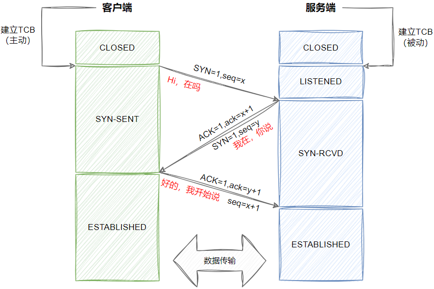
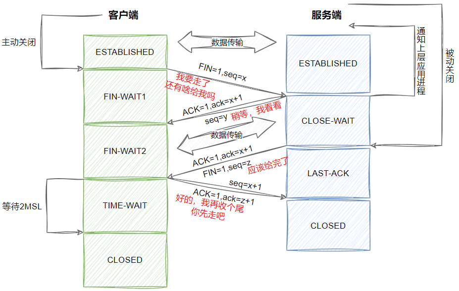

> HTTP 通信由 TCP/IP 承载的， TCP/IP 是全球计算机及网络设备都在使用的一种常用的分组交换网络分层协议集。客户端应用程序可以打开一条 TCP/IP 连接，连接到可能运行在世界任何地方的服务器应用程序。一旦连接建立，在客户端和服务器的计算机之间交换的报文就永远不会丢失、 受损或失序。

## 一、三次握手

> TCP协议目的是为了保证数据能在两端准确连续的流动，TCP 用一种叫做 **TCB（传输控制块）**的数据结构，把发给不同设备的数据封装起来，一个 TCB 数据块包含了数据发送双方对应的socket信息以及拥有装载数据的缓冲区。在两个设备要建立连接发送数据之前，双方都必须要做一些准备工作，分配内存建立起TCB数据块就是连接建立前必须要做的准备工作。

0. **准备工作：**最开始的时候客户端和服务器都是处于CLOSED状态。主动打开连接的为客户端，被动打开连接的是服务器。TCP服务器进程先创建传输控制块 TCB，时刻准备接受客户进程的连接请求，此时服务器就进入了 LISTEN（监听）状态。
1. **第一次握手：**TCP 客户端进程先创建传输控制块TCB，然后向服务器发出连接请求报文，SYN=1 是报文首部中的同部位，同时选择一个初始序列号 seq=x 。此时，TCP客户端进程进入了 SYN-SENT（同步已发送状态）状态。
2. **第二次握手：**TCP 服务器收到请求报文后，如果同意连接，则发出确认报文。确认报文中应该 ACK=1，SYN=1，确认号是 ack=x+1，同时也要为自己初始化一个序列号 seq=y，此时，TCP 服务器进程进入了 SYN-RCVD（同步收到）状态。
3. **第三次握手：**TCP客户进程收到确认后，还要向服务器给出确认。确认报文的 ACK=1，ack=y+1，自己的序列号 seq=x+1，此时，TCP连接建立，客户端进入 ESTABLISHED（已建立连接）状态。当服务器收到客户端的确认后也进入established状态，此后双方就可以开始通信了。

## 二、四次挥手

> 数据传输完毕后，双方都可释放连接。最开始的时候，客户端和服务器都是处于 established（表示连接已经建立）状态，然后客户端主动关闭，服务器被动关闭。

1. 第一次挥手：客户端进程发出连接释放报文，并且停止发送数据。释放数据报文首部，FIN=1（FIN表示关闭连接，SYN表示建立连接），其序列号为seq=u（等于前面已经传送过来的数据的最后一个字节的序号加1）。此时，客户端进入 FIN-WAIT-1（终止等待1）状态。
2. 第二次挥手：服务器收到连接释放报文，发出确认报文，ACK=1，ack=u+1（确认序号为收到的序号加1），并且带上自己的序列号seq=v，此时，服务端就进入了 CLOSE-WAIT（关闭等待）状态。TCP 服务器通知高层的应用进程，客户端向服务器的方向就释放了，这时候处于半关闭状态，即客户端已经没有数据要发送了，但是服务器若发送数据，客户端依然要接受。这个状态还要持续一段时间，也就是整个CLOSE-WAIT状态持续的时间。
3. 第三次挥手：客户端收到服务器的确认请求后，此时，客户端就进入FIN-WAIT-2（终止等待2）状态，等待服务器发送连接释放报文（在这之前还需要接受服务器发送的最后的数据）。
4. 第四次挥手：服务器将最后的数据发送完毕后，就向客户端发送连接释放报文，FIN=1，ack=u+1，由于在半关闭状态，服务器很可能又发送了一些数据，假定此时的序列号为seq=w，此时，服务器就进入了LAST-ACK（最后确认）状态，等待客户端的确认。
5. 客户端收到服务器的连接释放报文后，必须发出确认，ACK=1，ack=w+1，而自己的序列号是seq=u+1，此时，客户端就进入了TIME-WAIT（时间等待）状态。注意此时TCP连接还没有释放，必须经过2*MSL（最长报文段寿命）的时间后，当客户端撤销相应的TCB后，才进入CLOSED状态。
6. 服务器只要收到了客户端发出的确认，立即进入 CLOSED 状态。同样，撤销 TCB 后，就结束了这次的 TCP 连接。可以看到，服务器结束 TCP 连接的时间要比客户端早一些。
