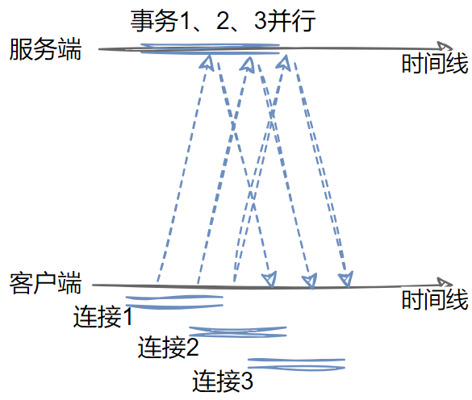
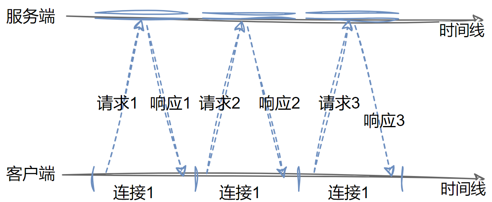
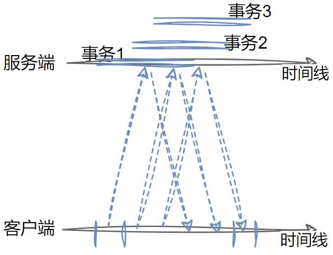

## 一、TCP时延分析

> `HTTP`协议构建于`TCP`协议之上， 所以`HTTP`事务的性能在很大程度上取决于底层`TCP`通道的性能。 
>
> `HTTP`事务的时延有以下几种主要原因：
>
> - 通过`DNS`解析系统将`URI`中的主机名转换成一个`IP`地址要花费对应的时间
> - 每条新的`TCP`连接都会有连接建立时延，但如果有数百个`HTTP`事务的话， 这个时间消耗值会快速地叠加上去
> - 网络传输请求报文及服务器处理请求报文都需要时间
> - `Web`服务器回送`HTTP`响应的花费时间
>
> 这些网络时延的大小取决于硬件速度、网络和服务器的负载，请求和响应报文的尺寸，以及客户端和服务器之间的距离。`TCP`协议的技术复杂性也会对时延产生巨大的影响，主要从以下几点考虑：
>
> - `TCP`连接建立握手
> - `TCP`慢启动拥塞控制
> - `TCP`延迟确认算法
> - `Nagle`算法

### 2.1 TCP握手时延

这个在三次握手中有详细的阐述，此处不再赘述。主要的时延还是集中在三次握手的流程中，三次握手都会存在客户端和服务端之间传输小段的数据包。

### 2.2 慢启动

**慢启动设计之初是为了避免瞬间大量的报文注入到网络中，造成网络拥堵问题。**慢启动的思路就是在主机刚开始发送数据报的时候先探测一下网络的状况，如果网络状况良好，发送方每发送一次文段都能正确的接受确认报文段。那么就从小到大的增加拥塞窗口的大小，即增加发送窗口的大小， 用于防止网络的突然过载和拥塞。

`TCP`慢启动限制了一个`TCP`端点在任意时刻可以传输的分组数。 简单来说，每成功接收一个分组，发送端就有了发送另外两个分组的权限。 **如果某个`HTTP`事务有大量数据要发送，是不能一次将所有分组都发送出去的。必须发送一个分组，等待确认，然后可以发送两个分组， 每个分组都必须被确认，这样就可以发送四个分组了，以此类推。 这种方式被称为“打开拥塞窗口”**。

### 2.3 延迟ACK

由于`ACK`报文很小，所以`TCP`允许在发往相同方向的输出数据分组中对其进行“捎带”。`TCP`将返回的确认信息与输出的数据分组结合在一起，可以更有效地利用网络。为了增加`ACK`报文找到同向传输数据分组的可能性， 很多`TCP`栈都实现了一种“延迟确认” 算法。 延迟确认算法会在一个特定的窗口时间（通常是`100 ～ 200`毫秒）内将输出确认存放在缓冲区中，以寻找能够捎带它的输出数据分组。如果在那个时间段内没有输出数据分组， 就将确认信息放在单独的分组中传送。 

### 2.4 Nagle算法

`TCP/IP`协议中，无论发送多少数据，总是要在数据前面加上协议头，同时，对方接收到数据，也需要发送ACK表示确认。为了尽可能的利用网络带宽，`TCP`总是希望尽可能的发送足够大的数据。（一个连接会设置`MSS`参数，因此，`TCP/IP`希望每次都能够以`MSS`尺寸的数据块来发送数据）。

`Nagle`算法就是为了尽可能发送大块数据，避免网络中充斥着许多小数据块。如果 TCP 发送了大量包含少量数据的分组， 网络的性能就会严重下降。 

- `Nagle`算法鼓励发送全尺寸的数据段：`Nagle`算法试图在发送一个分组之前， 将大量`TCP`数据绑定在一起，以提高网络效率。
- 一个`TCP`连接上最多只能有一个未被确认的未完成的小分组，在该分组`ACK`到达之前不能发送其他的小分组。如果其他分组仍然在传输过程中，就将那部分数据缓存起来。
- 只有当挂起分组被`ACK`，或者缓存中积累了足够发送一个全尺寸分组的数据时， 才会将缓存的数据发送出去。

`Nagle`算法会引发几种`HTTP`性能问题。首先，小的`HTTP`报文可能无法填满一个分组， 可能会因为等待那些永远不会到来的额外数据而产生时延。其次，`Nagle`算法与**延迟确认**之间的交互存在问题——`Nagle`算法会阻止数据的发送， 直到有确认分组抵达为止，但确认分组自身会被延迟确认算法延迟`100～ 200`毫秒。

`HTTP`应用程序常常会在自己的栈中设置参数`TCP_NODELAY`， 禁用`Nagle`算法，提高性能。（`Tomcat`通过`server.xml`进行设置，默认为`true`，表示禁用。）

## 二、串行事务解决

在早期的`HTTP`协议中，对于事务的处理是按串行机制的。也就是说在加载一个复杂页面的时候，`TCP`连接会在上一次连接响应之后被释放，再重新建立连接传输数据，再响应释放，如此往复。此时**整体`TCP`的时延就是一种叠加的关系了，存在一定性能问题**。针对这种情况，当下的一些解决方案能够在一定程度缓解：1）并行连接；2）持久连接；3）管道化连接。

### 2.1 并行连接

`HTTP`允许客户端（浏览器）打开多条`TCP`连接， 并行地执行多个`HTTP`事务（每个`TCP`连接处理一个`HTTP`事务）。

但是并行连接不一定更快，多个浏览器端开放出多个`TCP`连接会造成服务端的请求处理过载，引起服务端性能下降。

针对上述问题，实际上浏览器是限制了同一个域名下的并行连接总数量。

### 2.2 持久连接

`HTTP/1.1`（以及`HTTP/1.0`的各种增强版本）允许`HTTP`设备在事务处理结束之后将`TCP`连接保持在打开状态（`Connection: Keep-Alive`），以便为未来的`HTTP`请求重用现存的连接。**在事务处理结束之后仍然保持在打开状态的`TCP`连接被称为持久连接。** 非持久连接会在每个事务结束之后关闭。 持久连接会在不同事务之间保持打开状态，直到客户端或服务器决定将其关闭为止。

在持久连接中，每一个`HTTP`请求都是串行的。每个请求的发送都必须等待上一个请求的响应。

重用已对目标服务器打开的空闲持久连接，就可以避开缓慢的连接建立阶段。而且，已经打开的连接还可以避免慢启动的拥塞适应阶段，以便更快速地进行数据的传输。

### 2.3 管道化连接

`HTTP/1.1`允许在持久连接上使用管道化`pipeline`技术。 这是相对于`keep-alive`连接的又一性能优化。

在响应到达之前，可以将多条请求放入队列。当第一条请求通过网络流向另一端的服务器时，第二条和第三条请求也可以开始发送了。在高时延网络条件下，这样做可以降低网络的环回时间，提高性能。

对管道化连接有几条限制与建议：

- 必须按照与请求相同的顺序回送`HTTP`响应（如果顺序发送了请求1/2/3，那么无论服务器处理哪个请求更快，相应的时候必须按照请求的顺序响应）。由于`HTTP`报文中没有序列号标签，因此如果收到的响应失序了，就没办法将其与请求匹配起来了。
- `HTTP`客户端必须做好连接会在任意时刻关闭的准备。 如果客户端打开了一条持久连接，并立即发出了`10`条请求，服务器可能在只处理了`5`条请求之后关闭连接，剩下的`5`条请求会失败，客户端必须能够应对这些过早关闭连接的情况， 重新发出这些请求。
- 只有幂等的请求能够被管线化。`HTTP`客户端不应该用管道化的方式发送会产生副作用的请求（比如`POST`）。由于无法安全地重试 `POST`这样的非幂等请求， 所以出错时， 就存在某些方法永远不会被执行的风险。 
