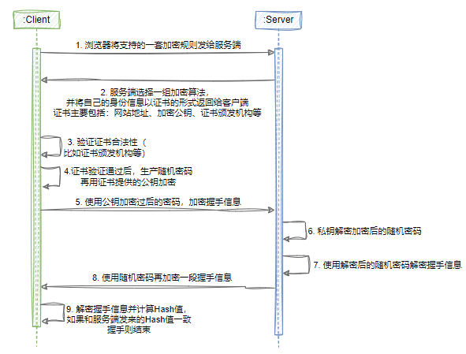
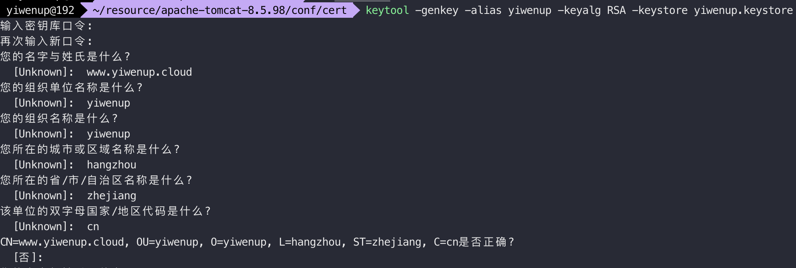

## 一、HTTPS支持

> HTTPS 数据传输相对于 HTTP 来说会更加安全，主要区别在于：
>
> - HTTPS 协议使用时需要到电子商务授权认证机构 CA 申请 SSL（SecureSocket Layer：* TLS 是 SSL 的升级） 证书
> - 在 Tomcat 的配置中，HTTP 默认端口号是 8080，HTTPS 默认端口号是 8443
> - HTTPS 相当于 HTTP 的升级版，具有 SSL 加密的安全性传输协议，对数据的传输进行加密
> - HTTP 的连接是无状态不安全的，而 HTTPS 由 HTTP + SSL 协议构建，是可进行加密传输、身份认证的网络协议，会更安全

### 1.1 HTTPS工作原理

> HTTPS 在正常浏览器客户端和服务端数据传输之前会进行一次握手，在握手的过程中将**确定双方加密数据传输的密码信息**



1. 客户端向服务端提供一套能支持的加密算法
2. 服务端**选择一组加密算法**后，**将自己的身份信息以证书的形式一并返回**给客户端
3. 客户端**验证证书的合法性**，包括证书的颁发机构、当前访问地址与证书中注册的网站地址等。如果证书合法则会在浏览器上标识一个小锁的图标；如果证书不合法则提示用户当前访问不受信
4. 在证书合法或者用户接受当前访问不受信的前提下，都算验证通过。之后**客户端生成随机密码并用证书中提供的公钥加密该随机密码**
5. 客户端**使用加密过后的随机密码，对握手信息加密**后发送给服务端
6. 服务端使用私钥解密随机密码
7. 服务端**使用解密后的随机密码解密握手信息**
8. 服务端用随机密码再加密一段握手信息，连同该握手信息的Hash值一并传给客户端
9. 客户端解密握手信息并计算Hash值，如果和服务端发送来的Hash值一致则握手结束
10. **后续所有的通信数据都由之前生成的随机密码利用对称加密算法加密**

### 1.2 Tomcat配置HTTP

1. 使用 JDK 提供的工具生成免费的密钥库文件

   ```sh
   keytool -genkey -alias yiwenup -keyalg RSA -keystore yiwenup.keystore
   ```

   

2. 配置 conf/server.xml 文件

   ```xml
   <Connector port="8443" protocol="org.apache.coyote.http11.Http11NioProtocol" maxThreads="150" schema="https" secure="true" SSLEnabled="true">
       <SSLHostConfig>
           <Certificate certificateKeystoreFile="/home/cert/yiwenup.keystore" certificateKeystorePassword="yiwenup" type="RSA"/>
       </SSLHostConfig>
   </Connector>
   ```

3. 使用 8443 端口访问

## 二、性能优化

