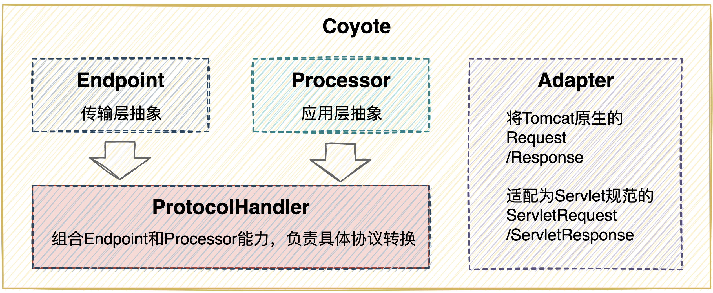

官网地址：https://tomcat.apache.org/

版本下载（8.5.50）：https://archive.apache.org/dist/tomcat/tomcat-8/v8.5.50/

## Tomcat处理请求的过程

### http请求处理过程

> HTTP请求只是定义了数据的组织形式（通信格式），是一个应用层协议。数据传输依靠的是TCP/IP协议，HTTP数据内容本质上是嵌在TCP数据包中的一段。


1. 用户在浏览器操作，发起请求。
2. 浏览器发起tcp连接请求，希望和服务器建立链接（socket）
3. 服务器接收到请求并建立链接（三次握手）
4. 连接通道建立成功之后，浏览器生成HTTP格式的数据包，发送请求数据包（请求行、请求头、请求体等）
5. 服务器解析HTTP格式数据包，并处理请求
6. 服务端发送响应数据包
7. 客户端解析HTTP格式的响应数据包并渲染页面
8. 浏览器呈现静态数据给用户

### Tomcat处理请求的过程

> Tomcat是一个HTTP服务器，能够接受并处理HTTP请求。
>
> Tomcat服务器接收到请求之后，把请求交给Servlet容器进行处理，Servlet容器通过Servlet接口调用业务类进行请求处理。注意，这里服务器并不是直接将请求交给业务类，而是中间加入了Servlet容器与Servlet接口，是为了解耦。Servlet容器和Servlet接口这一套内容称为Servlet规范。
>
> **Tomcat既按照Servlet规范提供了实现，又具备了HTTP服务器的功能。**


1. 当用户请求某个URL资源时，HTTP服务器将其原生的Request封装为一个ServletRequest对象
2. 进一步调用Servlet容器中的具体Servlet，这个过程通过URL与Servlet的映射关系进行匹配
3. 如果Servlet还没有被加载，则通过反射实例化这个Servlet，并调用他的init方法进行初始化
4. 接着调用Servlet的service方法处理请求，请求的处理结果使用ServletResponse进行封装
5. 最终将ServletResponse对象返回给HTTP服务器，HTTP服务器再把响应转化为原生的Response发送给客户端

## Tomcat总体架构

> Tomcat设计了两个主要的核心组件来完成Tomcat的两大特性：连接器（Connector）和容器（Container）
>
> 
>
> - 连接器（Connector）：完成HTTP服务器特性，负责对外交流。处理Socket链接，负责网络字节流与Request和Response对象的转化。
> - 容器（Container）：完成Servlet规范，负责内部处理。加载和管理Servlet，处理具体请求。

## Tomcat连接器组件Coyote

> **Coyote是Tomcat中连接组件的名称**，是对外的接口。客户端通过对Coyote与服务器建立链接、发送请求并接收响应。
>
> - Coyote封装了底层的网络通信（Socket与请求、响应处理）
> - Coyote使Catalina容器与具体的请求协议以及IO操作方式完全解耦
> - Coyote使Socket输入转化为Request对象，进一步封装后，交由Catalina容器进行处理，请求处理完成之后，Catalina通过Coyote将Response对象写入输出流中
> - Coyote负责的是具体的协议（应用层）和IO（传输层）相关内容

### Coyote支持的协议

> 前面我们主要了解到，Tomcat内部有一个核心的组件是负责对外连接工作的，该连接组件的名称为`Coyote`。既然负责了对客户端的连接，就应用有相关协议支持（传输层与应用层）。


### Coyote内部组件

> 以下将进一步细化`Coypote`内部组件，了解其关于传输层、应用层协议处理相关的设计，以及如何实现对**Servlet容器Catalina**的解耦有一个认识。



- Endpoint：对传输层的抽象（TCP/IP）。是Coyote的通信端点，即通信监听的接口。具体处理Socket的通信编码，对Socket进行接收和发送。
- Processor：对应用层的抽象（HTTP/AJP）。是Coyote的协议处理接口。Processor接收到来自Endpoint的字节流后，将其解析成为Tomcat原生的Request/Response对象。
- ProtocolHandler：通过Endpoint和Processor，实现针对具体协议的处理能力。Tomcat按照支持的协议以及IO提供了6个实现：AjpNioProtpcol、AjpAprProtocol、AjpNio2Protocol、Http11NioProtocol、Http11Nio2Protocol、Http11AprProtocol。
- Adapter：将Tomcat原生的Request/Response对象转换为Servlet规范标准的ServletRequest/ServletResponse

## Tomcat容器组件Catalina

> Tomcat是由一系列可配置（conf/server.xml）的组件构成的web容器，而catalina是tomcat的servlet容器组件。
>
> 从另一个角度来说，tomcat本质上是一个servlet容器，所以可以认为catalina是tomcat的核心，其他的组件是为catalina提供支撑服务的，比如：Coyote提供链接通信，Jasper提供JSP引擎，Naming提供JNDI服务，Juli提供日志服务。

### Tomcat实例内部组件

> 通常我们称一个Tomcat实例为一个`Server`，这个`Server`中即包含了负责连接处理的`Connector`以及遵循Servelt规范实现的容器`Container`。
>
> 一个`Tomcat`实例具体内部的组件可通过`conf/server.xml`进行配置，后续学习主要围绕该`server.xml`展开了解。

```xml
<?xml version="1.0" encoding="UTF-8"?>
<Server port="8005" shutdown="SHUTDOWN">
  <Listener className="org.apache.catalina.startup.VersionLoggerListener" />
  <Listener className="org.apache.catalina.core.AprLifecycleListener" SSLEngine="on" />
  <Listener className="org.apache.catalina.core.JreMemoryLeakPreventionListener" />
  <Listener className="org.apache.catalina.mbeans.GlobalResourcesLifecycleListener" />
  <Listener className="org.apache.catalina.core.ThreadLocalLeakPreventionListener" />
    
  <GlobalNamingResources>
    <Resource name="UserDatabase" auth="Container"
              type="org.apache.catalina.UserDatabase"
              description="User database that can be updated and saved"
              factory="org.apache.catalina.users.MemoryUserDatabaseFactory"
              pathname="conf/tomcat-users.xml" />
  </GlobalNamingResources>
    
  <Service name="Catalina">
    <Connector port="8080" protocol="HTTP/1.1"
               connectionTimeout="20000"
               redirectPort="8443"
               maxParameterCount="1000"
               />
    
    <Engine name="Catalina" defaultHost="localhost">
      <Realm className="org.apache.catalina.realm.LockOutRealm">
        <Realm className="org.apache.catalina.realm.UserDatabaseRealm"
               resourceName="UserDatabase"/>
      </Realm>

      <Host name="localhost"  appBase="webapps"
            unpackWARs="true" autoDeploy="true">
        <Valve className="org.apache.catalina.valves.AccessLogValve" directory="logs"
               prefix="localhost_access_log" suffix=".txt"
               pattern="%h %l %u %t &quot;%r&quot; %s %b" />
      </Host>
    </Engine>
  </Service>
</Server>
```

根据`Tomcat`源码包中默认的`server.xml`可以初步看出来：

- 一个`Server`实例就代表着一个`Tomcat`
- 一个`Server`实例中可以配置多个`Service`
- 一个`Service`中可以配置多个`Connector`和一个`Engine`
- 一个`Engine`可以配置一个`Host`

## Tomcat核心配置

> 顺着上面的`confg/server.xml`，进一步探索`Tomcat`在这个配置文件中的一些核心配置项。

### Server

```xml
<!-- 
  port: 监听关闭服务的端口
  shutdown：关闭服务器的指令字符串
-->
<Server port="8005" shutdown="SHUTDOWN">
  <!-- 以日志形式输出服务器、操作系统、JVM的版本信息 -->
  <Listener className="org.apache.catalina.startup.VersionLoggerListener" />
  <!-- Security listener. Documentation at /docs/config/listeners.html
  <Listener className="org.apache.catalina.security.SecurityListener" />
  -->
  <!-- 服务器启动时加载、服务器停止时销毁APR。如果找不到APR库，则会输出日志，并不影响Tomcat启动 -->
  <Listener className="org.apache.catalina.core.AprLifecycleListener" SSLEngine="on" />
  <!-- 避免JRE内存泄漏 -->
  <Listener className="org.apache.catalina.core.JreMemoryLeakPreventionListener" />
  <!-- 服务器启动时加载、服务器停止时销毁全局命名服务 -->
  <Listener className="org.apache.catalina.mbeans.GlobalResourcesLifecycleListener" />
  <!-- 在Context停止时重建Executor中的线程池，避免ThreadLocal相关的内存泄漏 -->
  <Listener className="org.apache.catalina.core.ThreadLocalLeakPreventionListener" />
    
  <!-- GlobalNamingResources定义全局命名服务 -->
  <GlobalNamingResources>
    <Resource name="UserDatabase" auth="Container"
              type="org.apache.catalina.UserDatabase"
              description="User database that can be updated and saved"
              factory="org.apache.catalina.users.MemoryUserDatabaseFactory"
              pathname="conf/tomcat-users.xml" />
  </GlobalNamingResources>
    
  <Service name="Catalina">
    <!-- ... -->
  </Service>
</Server>
```

### Service

```xml
<!-- 
该标签用于创建Service实例，默认使用org.apache.catalina.core.StandardService实现。
Service的子标签有：Listener、Executor、Connector、Engine
其中：
Listener：用于为Service声明周期添加监听器
Executor：用于配置Service共享线程池
Connector：用于配置Service的连接器
Engine：用于配置Service中连接器对应的Servlet容器引擎
 -->
<Service name="Catalina">
  <Executor name="tomcatThreadPool" namePrefix="catalina-exec-" maxThreads="150" minSpareThreads="4"/>
  
  <Connector executor="tomcatThreadPool" port="8080" protocol="HTTP/1.1" connectionTimeout="20000" redirectPort="8443" maxParameterCount="1000">
    <!-- ... -->
  </Connector>

  <Engine name="Catalina" defaultHost="localhost">
    <!-- ... -->
  </Engine>
</Service>
```

### Executor

```xml
<!--
默认情况下，Service 并未添加共享线程池配置，如果需要使用到共享线程池，则可以使用该标签配置。
name：线程池名称
namePrefix：线程前缀，完整的线程名称则表现为 namePrefix + 线程编号
maxThreads：最大线程数
minSpareThreads：活跃线程数，即核心线程数，这部分线程不会被回收销毁
maxIdleTime：线程空闲时间，超过该时间后，空闲线程将会被回收销毁，单位毫秒
maxQueueSize：等待处理请求队列大小，默认为 Integer.MAX_VALUE，表示队列无限大。特殊情况外，该配置不需要更改，否则可能会导致部分请求不会被处理
prestartminSpareThreads：线程池启动时是否启动核心线程，默认不启动
threadPriority：线程池中的线程优先级，默认为 5，值从 1 到 10
className：线程池实现策略，默认为 org.apache.catalina.core.StandardThreadExecutor，如有需要，可以自行基于 org.apache.catalina.Executor 扩展策略。
-->
<Executor name="tomcatThreadPool" 
          namePrefix="catalina-exec-" 
          maxThreads="150" 
          minSpareThreads="4"
          maxIdleTime="60000"
          maxQueueSize="Integer.MAX_VALUE"
          prestartminSpareThreads="false"
          threadPriority="5"
          className="org.apache.catalina.core.StandardThreadExecutor" />
```

### Connector

```xml
<!-- 
默认情况下，Tomcat 配置两个 Connector，一个用于支持 HTTP 协议，一个用于支持 AJP 协议。大多数情况下，这部分不需要再额外添加连接器了，根据需求优化配置即可。
port：端口号。Connector 用于创建服务端 Socket 并进行监听，等待客户端请求连接。如果设置为 0，则 Tomcat 会随机选择一个端口号分配给当前的 Connector
protocol：访问协议。默认为 HTTP/1.1
connectionTimeout：Connector 接收连接后的等待超时时间，单位为毫秒， -1 表示不超时
redirectPort：当前 Connector 不支持 SSL 请求，在接收到一个符合 security-constraint 的请求，则需要 SSL 传输，Catalina 会自动将请求重定向到指定端口
executor：指定共享线程池的名称
URIEncoding：用于指定 URI 的字符编码，Tomcat8.x 默认的编码为 UTF-8，Tomcat7.x 默认的编码为 ISO-8859-1
-->
<Connector port="8080" protocol="HTTP/1.1" connectionTimeout="20000" redirectPort="8443" maxParameterCount="1000"/>
<Connector port="8009" protocol="AJP/1.3" address="::1" redirectPort="8443" maxParameterCount="1000"/>
```

```xml
<!-- 使用共享线程池示例 -->
<Connector port="8080" 
               protocol="HTTP/1.1"
               executor="commonExecutor"
               maxThreads="1000"
               minSpareThreads="100"
               acceptCount="1000"
               maxConnection="1000"
               connectionTimeout="20000"
               compression="on"
               compressionMinSize="2048"
               disableUploadTimeout="true"
               redirectPort="8443"
               URIEncoding="UTF-8"
               />
```

### Engine

```xml
<!-- 
一个 Engine 表示一个 Servlet 引擎
 
name：指定 Engine 名称，默认为 Catalina
defaultHost：默认的虚拟主机名称，当客户端请求所指向的虚拟主机无效时，会交由默认虚拟主机处理，此处默认主机为 localhost
-->
<Engine name="Catalina" defaultHost="localhost">
    <!-- ... -->
</Engine>
```

### Realm

```xml
<!-- 
位于 Engine 标签下，配置安全加密相关的 
-->
<Realm className="org.apache.catalina.realm.LockOutRealm">
    <Realm className="org.apache.catalina.realm.UserDatabaseRealm" resourceName="UserDatabase"/>
</Realm>
```

### Host

```xml
<!-- 
Host 用于配置一个虚拟主机，即一个网站站点
name：虚拟主机名称
appBase：站点程序的根目录
unpackWARs：解压 WAR 包
autoDeploy：热部署站点内容
-->
<Host name="localhost"  appBase="webapps" unpackWARs="true" autoDeploy="true">
```

### Valve

```xml
<!-- 
位于 Host 标签下，配置处理过程（阀） 
此处示例的作用是访问日志配置
-->
<Valve className="org.apache.catalina.valves.AccessLogValve" directory="logs" prefix="localhost_access_log" suffix=".txt" pattern="%h %l %u %t &quot;%r&quot; %s %b" />
```

### Context

```xml
<!--
位于 Host 标签下，配置一个上下文环境，即一个虚拟主机下可以部署多份 web 应用资源
此处示例表示请求该虚拟主机下的 /web_demo 路径（localhost:8080/web_demo），则可以访问 /xxx/web_demo 部分的资源
-->
<Context docBase="/xxx/web_demo" path="/web_demo" />
```

