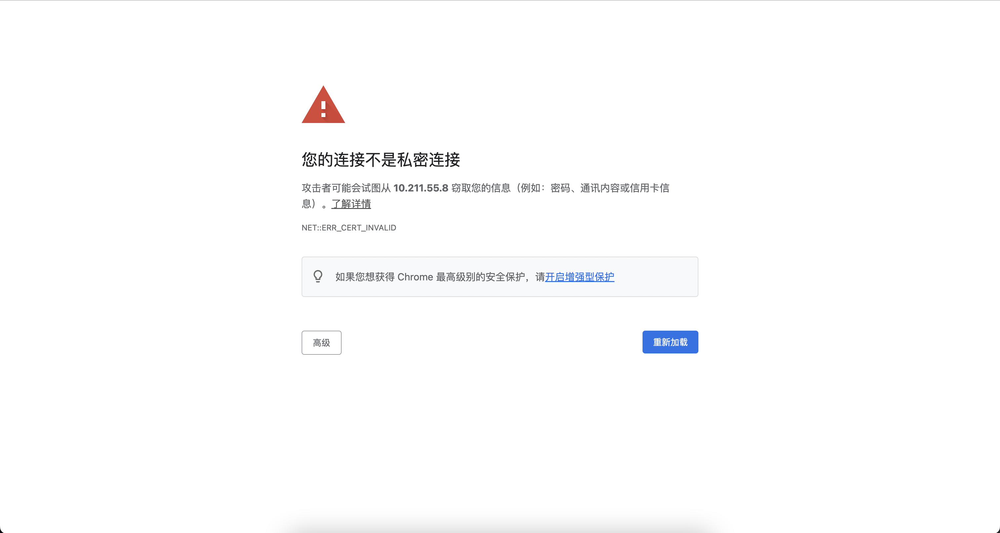
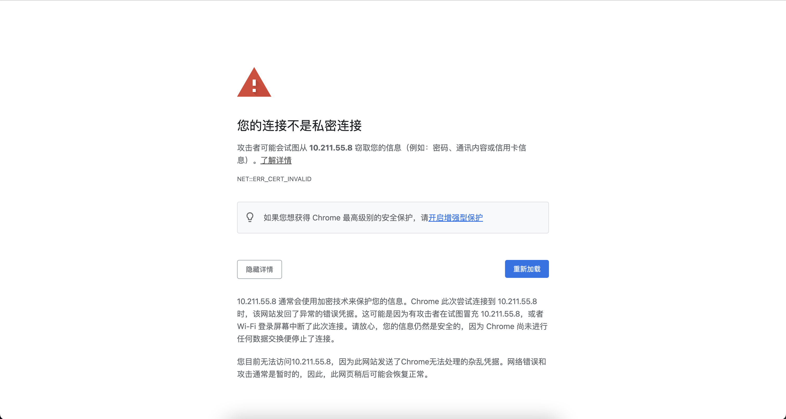

## 一、问题描述

我访问的是本地虚拟机，在`k8s`集群上安装的`dashboard`，提示无法访问

## 二、问题分析

这是由于采用了`https`协议但是又没有安装证书导致的，一般情况下点击"高级"，选择继续访问即可，但是此页面的"高级"选项并没有可以继续操作的按钮

## 三、问题解决

直接在键盘敲`thisisunsafe`，即可，不需要选择哪个输入框，该页面捕捉的是键盘输入事件
