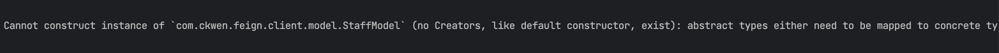

## 一、问题描述

在某次系统优化的过程中，需要基于原先预留的策略接口，实现新的功能，其中涉及了两个微服务的交互，示意图如下。

其中需要关注的点是：

- 微服务之间的参数是一种多态的实现，`serviceA`中构造了一个基类`baseDTO`作为方法的入参，具体在调用的时候区分是`aDTO`还是`bDTO`。`serviceB`作为也在接口处定义了一个`baseDTO`作为入参接受，**根据多态的特性，理论上是可以接收到`aDTO`和`bDTO`的对象的，这一点在同一个服务中完全没有问题。**

但是在微服务远程调用过程中，不论是`spring cloud`体系还是`dubbo`体系，都会涉及到参数的序列化与反序列化过程，问题就出现了。

## 二、问题分析

如上的报错信息是指：消费方在反序列化参数的时候，发现入参是一个抽象类，因而无法构造实例来反序列化参数对象，需要我们指定一个带有构造器的对象。

## 三、问题解决
