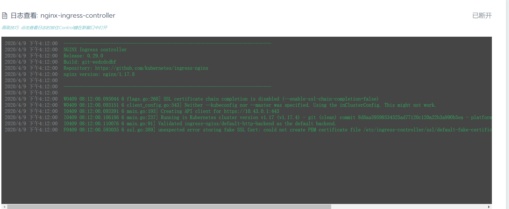

## 一、问题描述

由于公司安全部门的漏洞扫描，所负责的平台中部分`k8s`节点存在漏洞`CVE-2020-11724`，需要升级`quay.io/kubernetes-ingress-controller/nginx-ingress-controller:0.25.1`至`quay.io/kubernetes-ingress-controller/nginx-ingress-controller:0.33.0`。

在升级过程中，我们修改了`ds`，将镜像直接替换，发现`pod`启动报错，日志大致如下（网图，侵权删）



## 二、问题分析

其实报错已经比较明显，其中有`permission denied`字眼，多半是当前容器中的操作用户权限不足所致，继续查看`ds`的配置，其中有一段如下：

```yaml
securityContext:
	allowPrivilegeEscalation: true
	capabilities:
		add:
		- NET_BIND_SERVICE
		drop:
		- ALL
	runAsUser: 33
```

`runAsUser`便是指定当前用户的操作权限的

## 三、问题解决

修改`runAsUser: 33`为`runAsUser: 101`即可。
