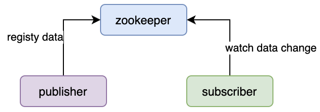
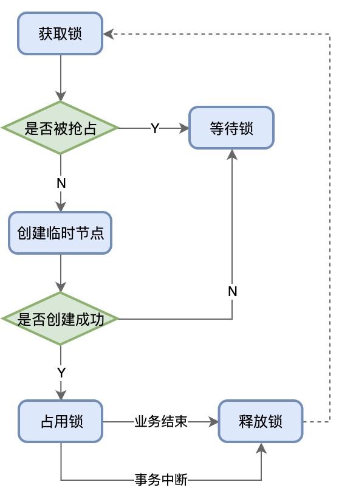
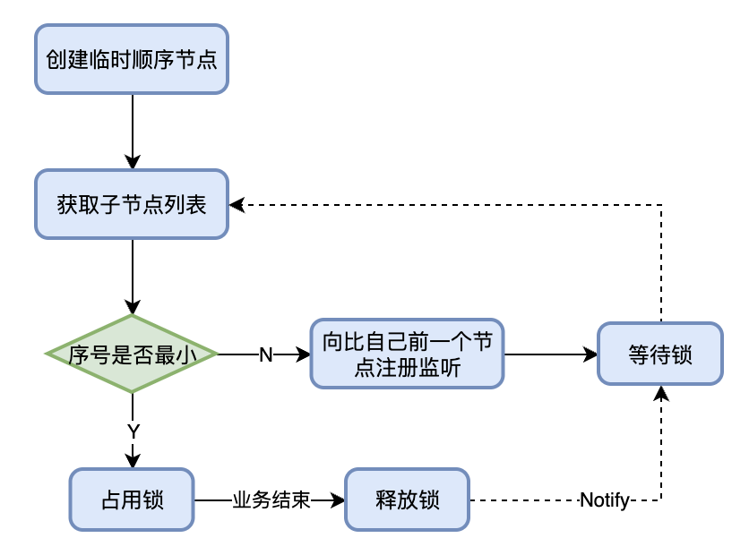

## 一、数据发布/订阅

一般来说，数据发布/订阅架构模式有两种主流的实现：**推（Push）**和**拉（Pull）**。推强调的是数据发布者调用数据订阅者提供的接口，将变更数据推送到订阅方；拉强调的是数据订阅者定时轮询数据发布者的接口，将变更数据从发布方获取到本地。

在分布式系统架构设计中，我们会发现一般的设计思路都会造成数据发布者和数据订阅者在接口协议上是有耦合的，处理耦合的思路也比较朴素，一般就是加中间件，这里可以选用`Zookeeper`。

`Zookeeper`实现数据发布/订阅主要是**借助其监听机制**



- 首先`publisher`在启动的时候会将数据注册在`zk`的某个节点上；`subscriber`在启动的时候会监听这个节点的数据变更事件
- 在双方运行的过程中，`publisher`会发生一些数据变更，并将变更作用在`zk`节点的数据中，此时该节点由于有监听注册，则会将变更通知给`subscriber`

**代码实现（基于 Curator）：**

```java
/**
 * 文件描述
 *
 * @Author yiwenup
 * @Description 配置发布
 */
public class ConfigPublisher {

    private static final CuratorFramework CURATOR_CLIENT;

    private static final Map<String/*dataKey*/, String/*dataValue*/> CONFIGS = Maps.newHashMap();

    static {
        // 创建测试数据
        CONFIGS.put("jdbc-url", "jdbc:mysql://192.168.33.45:3306/user?useSSL=false");
        CONFIGS.put("username", "sys");
        CONFIGS.put("password", "123#us");

        // 创建客户端
        CURATOR_CLIENT = CuratorFrameworkFactory.builder()
                .connectString("127.0.0.1:55003")
                .retryPolicy(new BoundedExponentialBackoffRetry(1000, 3000, 2))
                .namespace("configs")
                .build();
        CURATOR_CLIENT.start();
    }

    public static void main(String[] args) {
        try {
            // 注册DB配置参数
            for (Map.Entry<String, String> entry : CONFIGS.entrySet()) {
                CURATOR_CLIENT.create()
                        .creatingParentsIfNeeded()
                        .forPath("/db/" + entry.getKey(), entry.getValue().getBytes(StandardCharsets.UTF_8));
                System.out.println("数据：" + entry.getKey() + "创建成功");
            }
            // 模拟数据变更
            Scanner scanner = new Scanner(System.in);
            while (scanner.hasNextLine()) {
                String data = scanner.nextLine();
                CURATOR_CLIENT.setData().forPath("/db/password", data.getBytes(StandardCharsets.UTF_8));
            }
        } catch (Exception e) {
            throw new RuntimeException(e);
        } finally {
            CURATOR_CLIENT.close();
        }
    }
}
```

```java
/**
 * 文件描述
 *
 * @Author yiwenup
 * @Description 配置订阅
 */
public class ConfigSubscriber {

    private static final CuratorFramework CURATOR_CLIENT;

    static {
        // 创建客户端
        CURATOR_CLIENT = CuratorFrameworkFactory.builder()
                .connectString("127.0.0.1:55003")
                .retryPolicy(new BoundedExponentialBackoffRetry(1000, 3000, 2))
                .namespace("configs")
                .build();
        CURATOR_CLIENT.start();
    }

    public static void main(String[] args) {
        // 注册监听
        try (CuratorCache curatorCache = CuratorCache.builder(CURATOR_CLIENT, "/db/password")
                .withOptions(CuratorCache.Options.SINGLE_NODE_CACHE).build()) {
            curatorCache.listenable().addListener((type, oldData, data) -> {
                if (CuratorCacheListener.Type.NODE_CHANGED.equals(type)) {
                    System.out.println("数据[" + oldData.getPath() + "]从" + new String(oldData.getData()) + "变动为" + new String(data.getData()) + "...");
                }
            });
            curatorCache.start();
            // 阻塞进程
            System.in.read();
        } catch (Exception ignore) {
        }
    }
}
```

## 二、分布式ID

在分布式场景下，我们可以总结如下几种全局ID生成策略：

- UUID
- 全局自增表
- 雪花算法
- Redis的Incr命令

其中最不建议使用的是全局自增表，因为至少会涉及多数据源应用，且依赖数据库的稳定，存在一定的架构复杂性。

通常认为架构简单采用`UUID`和雪花算法就足够了，而依赖中间件可以考虑`Redis`或者借助`ZK`生成全局ID。

但仍需结合场景综合考量，比如**用于主键数据，则不适合通过`UUID`生成，因为它是无序的会导致索引建立效率低下**

利用`ZK`生成全局ID主要是**借助其顺序节点序号递增特性**，并且**基于`CP`特性在大并发场景下生成全局唯一ID是最适合不过的了**。

**代码实现（基于 Curator）：**

```java
/**
 * 文件描述
 *
 * @Author yiwenup
 * @Description 分布式ID生成器
 */
public class DistributeIdGenerator {

    private static final String PREFIX = "/order/order-id-";

    private final static CuratorFramework ZK_CLIENT;

    private final static ExecutorService EXECUTOR = Executors.newFixedThreadPool(8);

    static {
        ZK_CLIENT = CuratorFrameworkFactory.builder()
                .connectString("127.0.0.1:55003")
                .retryPolicy(new BoundedExponentialBackoffRetry(1000, 3000, 2))
                .namespace("distribute-id")
                .build();
        ZK_CLIENT.start();
    }

    public static void main(String[] args) {
        try {
            for (int i = 0; i < 4000; i++) {
                EXECUTOR.submit(() -> {
                    try {
                        String string = ZK_CLIENT.create().creatingParentContainersIfNeeded()
                                .withMode(CreateMode.PERSISTENT_SEQUENTIAL)
                                .forPath(PREFIX);
                        System.out.println("线程" + Thread.currentThread().getName() + "获取到分布式ID为：" + string.replace(PREFIX, ""));
                    } catch (Exception e) {
                        throw new RuntimeException(e);
                    }
                });
            }
            System.in.read();
        } catch (Exception e) {
            throw new RuntimeException(e);
        } finally {
            ZK_CLIENT.close();
            EXECUTOR.shutdown();
        }
    }
}
```

## 三、集群节点维护

集群管理，包括集群监控与集群控制两⼤块，前者侧重对集群运⾏时状态的收集，后者则是对集群进⾏操作与控制。

在传统的基于Agent的分布式集群管理体系中，都是通过在集群中的每台机器上部署⼀个 Agent，由这个 Agent 负责主动向指定的⼀个监控中⼼系统（监控中⼼系统负责将所有数据进⾏集中处理，形成⼀系列报表，并负责实时报警，以下简称“监控中⼼”）汇报⾃⼰所在机器的状态。在集群规模适中的场景下，这确实是⼀种在⽣产实践中⼴泛使⽤的解决⽅案，能够快速有效地实现分布式环境集群监控，但是⼀旦系统的业务场景增多，集群规模变⼤之后，该解决⽅案的弊端也就显现出来了：

- **⼤规模升级困难：**以客户端形式存在的 Agent，在⼤规模使⽤后，⼀旦遇上需要⼤规模升级的情况，就⾮常麻烦，在升级成本和升级进度的控制上⾯临巨⼤的挑战。
- **统⼀的Agent⽆法满⾜多样的需求：**对于机器的CPU使⽤率、负载（Load）、内存使⽤率、⽹络吞吐以及磁盘容量等机器基本的物理状态，使⽤统⼀的Agent来进⾏监控或许都可以满⾜。但是，如果需要深⼊应⽤内部，对⼀些业务状态进⾏监控，例如，在⼀个分布式消息中间件中，希望监控到每个消费者对消息的消费状态；或者在⼀个分布式任务调度系统中，需要对每个机器上任务的执⾏情况进⾏监控。很显然，对于这些业务耦合紧密的监控需求，不适合由⼀个统⼀的Agent来提供。
- **编程语⾔多样性：**随着越来越多编程语⾔的出现，各种异构系统层出不穷。如果使⽤传统的Agent⽅式，那么需要提供各种语⾔的 Agent 客户端。另⼀⽅⾯，“监控中⼼”在对异构系统的数据进⾏整合上⾯临巨⼤挑战。

借助`ZK`临时节点和监听机制，可以实现集群机器存活监控系统，若监控系统在/clusterServers节点上注册⼀个Watcher监听，那么但凡进⾏动态添加机器的操作，就会在/clusterServers节点下创建⼀个临时节点：/clusterServers/[Hostname]，这样，监控系统就能够实时监测机器的变动情况。

**代码实现（基于 Curator）：**

```java
/**
 * 文件描述
 *
 * @Author yiwenup
 * @Description 节点监听
 */
public class NodeWatcher {

    private final static CuratorFramework ZK_CLIENT;

    static {
        ZK_CLIENT = CuratorFrameworkFactory
                .builder()
                .connectString("127.0.0.1:55003")
                .retryPolicy(new BoundedExponentialBackoffRetry(3000, 5000, 3))
                .namespace("clusterServers")
                .build();
        ZK_CLIENT.start();
    }

    public static void main(String[] args) {
        try (CuratorCache curatorCache = CuratorCache.builder(ZK_CLIENT, "/nodes").build()) {
            curatorCache.listenable().addListener((type, oldData, data) -> {
                if (CuratorCacheListener.Type.NODE_CREATED.equals(type) && !"/nodes".equals(data.getPath())) {
                    System.out.println("节点：" + data.getPath().replace("/nodes/", "") + "上线");
                }
                if (CuratorCacheListener.Type.NODE_DELETED.equals(type) && !"/nodes".equals(oldData.getPath())) {
                    System.out.println("节点：" + oldData.getPath().replace("/nodes/", "") + "下线");
                }
            });
            curatorCache.start();
            System.in.read();
        } catch (Exception e) {
            throw new RuntimeException(e);
        } finally {
            ZK_CLIENT.close();
        }
    }
}
```

```java
/**
 * 文件描述
 *
 * @Author yiwenup
 * @Description 业务节点
 */
public class BizNode {

    private final static CuratorFramework ZK_CLIENT;

    static {
        ZK_CLIENT = CuratorFrameworkFactory
                .builder()
                .connectString("127.0.0.1:55003")
                .retryPolicy(new BoundedExponentialBackoffRetry(3000, 5000, 3))
                .namespace("clusterServers")
                .build();
        ZK_CLIENT.start();
    }

    public static void main(String[] args) {
        try{
            ZK_CLIENT.create().creatingParentContainersIfNeeded().withMode(CreateMode.EPHEMERAL).forPath("/nodes/192.168.4.2");
        } catch (Exception e) {
            throw new RuntimeException(e);
        } finally {
            ZK_CLIENT.close();
        }
    }
}
```

## 四、Master选举

在分布式系统中，Master往往⽤来协调集群中其他系统单元，具有对分布式系统状态变更的决定权。

通常情况下，我们**可以选择常⻅的关系型数据库中的主键特性来实现**：集群中的所有机器都向数据库中插⼊⼀条相同主键 ID 的记录，数据库会帮助我们⾃动进⾏主键冲突检查，也就是说，所有进⾏插⼊操作的客户端机器中，只有⼀台机器能够成功，那么，我们就认为向数据库中成功插⼊数据的客户端机器成为Master。这种方式的弊端在于当Master节点宕机了，没有任何一种便捷的机制通知到集群进行重新选举。

Master选举的过程是借助了`ZK`的`CP`**强一致性这一特性，即多个集群节点向Zookeeper同时创建同一个ZNode节点，有且仅有一个集群节点能够创建成功**。

**代码实现（基于 Curator）：**

```java
/**
 * 文件描述
 *
 * @Author yiwenup
 * @Description 主节点选举
 */
public class MasterElection {

    private final static CuratorFramework ZK_CLIENT;

    private final static Executor EXECUTOR = Executors.newFixedThreadPool(10);

    static {
        ZK_CLIENT = CuratorFrameworkFactory
                .builder()
                .connectString("127.0.0.1:55003")
                .retryPolicy(new BoundedExponentialBackoffRetry(3000, 5000, 3))
                .namespace("cluster")
                .build();
        ZK_CLIENT.start();
    }

    public static void main(String[] args) {
        try {
            for (int i = 0; i < 30; i++) {
                EXECUTOR.execute(MasterElection::registerMaster);
            }
            System.in.read();
        } catch (Exception e) {
            throw new RuntimeException(e);
        } finally {
            ZK_CLIENT.close();
        }
    }

    public static void registerMaster() {
        try {
            ZK_CLIENT.create().creatingParentContainersIfNeeded().withMode(CreateMode.EPHEMERAL).forPath("/master", Thread.currentThread().getName().getBytes(StandardCharsets.UTF_8));
        } catch (Exception e) {
            if (e instanceof KeeperException.NodeExistsException) {
                watchMaster();
            } else {
                throw new RuntimeException(e);
            }
        }
    }

    public static void watchMaster() {
        try {
            CuratorCache curatorCache = CuratorCache.builder(ZK_CLIENT, "/master").build();
            curatorCache.listenable().addListener((type, oldData, data) -> {
                if (CuratorCacheListener.Type.NODE_DELETED.equals(type)) {
                    System.out.println("线程" + Thread.currentThread().getName() + "监听到master宕机...");
                    // 监听主节点是否挂掉，挂掉则尝试注册
                    registerMaster();
                }
            }, EXECUTOR);
            curatorCache.start();
        } catch (Exception e) {
            throw new RuntimeException(e);
        }
    }
}
```

## 五、分布式锁

分布式锁是控制分布式系统之间同步访问共享资源的⼀种⽅式。如果不同的系统或是同⼀个系统的不同主机之间共享了⼀个或⼀组资源，那么访问这些资源的时候，往往需要通过⼀些互斥⼿段来防⽌彼此之间的⼲扰，以保证⼀致性，在这种情况下，就需要使⽤分布式锁了。

### 5.1 排他锁

排他锁（Exclusive Locks，简称 X 锁），⼜称为写锁或ᇿ占锁，是⼀种基本的锁类型。如果事务 T1对数据对象 O1加上了排他锁，那么在整个加锁期间，只允许事务 T1对 O1进⾏读取和更新操作，其他任何事务都不能再对这个数据对象进⾏任何类型的操作，直到T1释放了排他锁。



- 获取锁：所有的客户端都会试图在一个path节点下创建相同的临时⼦节点。基于Zookeeper的CP特性，最终只有⼀个客户端能够创建成功，那么就可以认为该客户端获取了锁。同时，所有没有获取到锁的客户端就需要到该节点上注册⼀个Watcher监听，以便实时监听到该节点的变更情况。
- 释放锁：排他锁基于临时节点的特性，在以下两种情况下，都有可能释放锁：当前获取锁的客户端机器发⽣宕机，那么ZooKeeper上的这个临时节点就会被移除；正常执⾏完业务逻辑后，客户端就会主动将⾃⼰创建的临时节点删除。⽆论在什么情况下移除了lock节点，ZooKeeper都会通知所有在注册了Watcher监听的客户端。这些客户端在接收到通知后，再次重新发起分布式锁获取，即重复“获取锁”的过程。

**代码实现（基于 Curator）：**

```java
/**
 * 文件描述
 *
 * @Author yiwenup
 * @Description 排他锁
 */
public class XLock {

    private static final CuratorFramework CLIENT;

    private static final Executor EXECUTOR = Executors.newFixedThreadPool(10);

    static {
        CLIENT = CuratorFrameworkFactory
                .builder()
                .connectString("127.0.0.1:55003")
                .retryPolicy(new BoundedExponentialBackoffRetry(3000, 5000, 3))
                .namespace("lock")
                .build();
        CLIENT.start();
    }

    public static void main(String[] args) {
        for (int i = 0; i < 5; i++) {
            EXECUTOR.execute(() -> {
                InterProcessMutex mutex = new InterProcessMutex(CLIENT, "/x-lock");
                try {
                    System.out.println("线程" + Thread.currentThread().getName() + "准备抢占锁资源...");
                    mutex.acquire();
                    System.out.println("线程" + Thread.currentThread().getName() + "进行业务处理...");
                    TimeUnit.SECONDS.sleep(2L);
                    mutex.release();
                } catch (Exception e) {
                    throw new RuntimeException(e);
                }
            });
        }
    }
}
```

### 5.2 共享锁

共享锁（Shared Locks，简称S锁），⼜称为读锁，同样是⼀种基本的锁类型。如果事务T1对数据对象O1加上了共享锁，那么当前事务只能对O1进⾏读取操作，其他事务也只能对这个数据对象加共享锁，直到该数据对象上的所有共享锁都被释放。

共享锁和排他锁最根本的区别在于，加上排他锁后，数据对象只对⼀个事务可⻅，⽽加上共享锁后，数据对所有事务都可⻅。


- 获取锁：所有客户端都在Zookeeper上注册一个临时顺序节点，并在注册成功后获取其余兄弟节点（**此处有羊群效应**）和注册一个节点变更的监听，确定自己的所处的序号。对于读请求：若没有⽐⾃⼰序号⼩的⼦节点或所有⽐⾃⼰序号⼩的⼦节点都是读请求，那么表明⾃⼰已经成功获取到共享锁，同时开始执⾏读取逻辑，若有写请求，则需要等待。对于写请求：若⾃⼰不是序号最⼩的⼦节点，那么需要等待。

  *羊群效应：所有注册了监听的节点，都会导致监听回调的过程中，Zookeeper会将所有节点列表提供出来，这里会在短时间内产生大量通知，造成性能和网络开销。*这里实际上只需要对自己的上一个节点注册监听即可，用于确定自己是否是最小的节点，逻辑上会复杂一些，但是性能会有一定提升，可以结合集群规模斟酌。

- 释放锁：同排他锁

**代码实现（基于 Curator）：**

```java
/**
 * 文件描述
 *
 * @Author yiwenup
 * @Description 共享锁
 */
public class SLock {

    private static final CuratorFramework CLIENT;

    private static final Executor EXECUTOR = Executors.newFixedThreadPool(10);

    static {
        CLIENT = CuratorFrameworkFactory
                .builder()
                .connectString("127.0.0.1:55003")
                .retryPolicy(new BoundedExponentialBackoffRetry(3000, 5000, 3))
                .namespace("lock")
                .build();
        CLIENT.start();
    }

    public static void main(String[] args) {
        InterProcessReadWriteLock readWriteLock = new InterProcessReadWriteLock(CLIENT, "/s-lock");
        for (int i = 0; i < 8; i++) {
            EXECUTOR.execute(() -> {
                try {
                    int x = new Random().nextInt(100);
                    if (x % 2 == 0) {
                        InterProcessReadWriteLock.ReadLock readLock = readWriteLock.readLock();
                        System.out.println("线程" + Thread.currentThread().getName() + "准备抢占读锁");
                        readLock.acquire();
                        System.out.println("线程" + Thread.currentThread().getName() + "读业务处理中...");
                        readLock.release();
                        System.out.println("线程" + Thread.currentThread().getName() + "释放读锁");
                    } else {
                        InterProcessReadWriteLock.WriteLock writeLock = readWriteLock.writeLock();
                        System.out.println("线程" + Thread.currentThread().getName() + "准备抢占写锁");
                        writeLock.acquire();
                        System.out.println("线程" + Thread.currentThread().getName() + "写业务处理中...");
                        writeLock.release();
                        System.out.println("线程" + Thread.currentThread().getName() + "释放写锁");
                    }
                } catch (Exception e) {
                    throw new RuntimeException(e);
                }
            });
        }

    }
}
```

## 六、分布式队列

### 6.1 FIFO模型

FIFO（First Input First Output，先⼊先出），FIFO 队列是⼀种⾮常典型且应⽤⼴泛的按序执⾏的队列模型：先进⼊队列的请求操作先完成后，才会开始处理后⾯的请求。



- 所有客户端在同一Path下创建⼀个**临时顺序节点**
- 获取所有⼦节点，即获取队列中所有的元素
- 确定⾃⼰的节点序号在所有⼦节点中的顺序
- 如果⾃⼰的序号不是最⼩，那么需要等待，同时向⽐⾃⼰序号⼩的最后⼀个节点注册Watcher监听
- 接收到Watcher通知后，再获取所有子节点，重复判断和注册监听或者执行逻辑

### 6.2 Barrier模型

Barrier指分布式系统之间的⼀个协调条件，规定了⼀个队列的元素必须都集聚后才能统⼀进⾏安排，否则⼀直等待。这往往出现在那些⼤规模分布式并⾏计算的应⽤场景上：最终的合并计算需要基于很多并⾏计算的⼦结果来进⾏。


- 开始时，父节点是⼀个已经存在的默认节点，并且将其节点的数据内容赋值为⼀个数字n来代表Barrier值，例如n=10表示只有当父节点下的⼦节点个数达到10后，才会打开Barrier。
- 之后，所有的客户端都会到父节点下创建⼀个**临时节点**
- 获取父节点的数据内容：10
- 获取父节点下的所有⼦节点，同时注册对⼦节点变更的Watcher监听
- 统计⼦节点的个数
- 如果⼦节点个数还不⾜10个，那么需要等待
- 接受到Wacher通知后，再次获取所有所有子节点，重复注册监听或者执行逻辑
