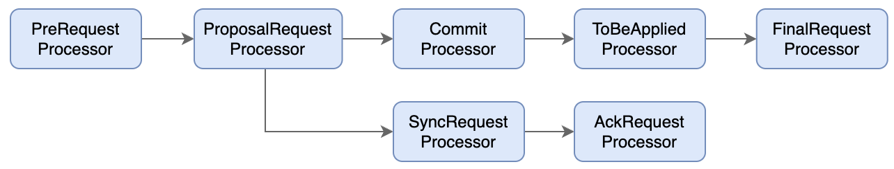
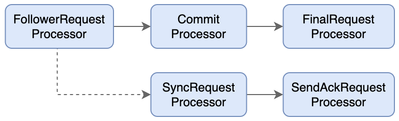
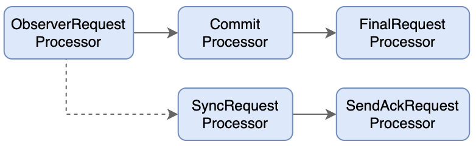

> `Zookeeper`集群一共分三类节点角色：`Leader`、`Follower`和`Obeserver`。每个服务器角色都对应了一串由`Processor`组成的处理链开展工作。

## 一、Leader

Zookeeper集群⼯作的核⼼，其主要⼯作有以下两个：

- 事务请求的唯⼀调度和处理者，保证集群事务处理的顺序性
- 集群内部各服务器的调度者

-  PrepRequestProcessor：请求预处理器，也是leader服务器中的第⼀个请求处理器。在Zookeeper中，那些会改变服务器状态的请求称为事务请求（创建节点、更新数据、删除节点、创建会话等），PrepRequestProcessor能够识别出当前客户端请求是否是事务请求。对于事务请求，PrepRequestProcessor处理器会对其进⾏⼀系列预处理，如创建请求事务头、事务体、会话检查、ACL检查和版本检查等。
- ProposalRequestProcessor。事务投票处理器。也是Leader服务器事务处理流程的发起者，对于⾮事务性请求，ProposalRequestProcessor会直接将请求转发到CommitProcessor处理器，不再做任何处理，⽽对于事务性请求，处理将请求转发到CommitProcessor外，还会根据请求类型创建对应的Proposal提议，并发送给所有的Follower服务器来发起⼀次集群内的事务投票。同时，ProposalRequestProcessor还会将事务请求交付给SyncRequestProcessor进⾏事务⽇志的记录。
- SyncRequestProcessor。事务⽇志记录处理器。⽤来将事务请求记录到事务⽇志⽂件中，同时会触发Zookeeper进⾏数据快照。
- AckRequestProcessor。负责在SyncRequestProcessor完成事务⽇志记录后，向Proposal的投票收集器发送ACK反馈，以通知投票收集器当前服务器已经完成了对该Proposal的事务⽇志记录。
- CommitProcessor。事务提交处理器。对于⾮事务请求，该处理器会直接将其交付给下⼀级处理器处理；对于事务请求，其会等待集群内 针对Proposal的投票直到该Proposal可被提交，利⽤CommitProcessor，每个服务器都可以很好地控制对事务请求的顺序处理。
- ToBeCommitProcessor。该处理器有⼀个toBeApplied队列，⽤来存储那些已经被CommitProcessor处理过的可被提交的Proposal。其会将这些请求交付给FinalRequestProcessor处理器处理，待其处理完后，再将其从toBeApplied队列中移除。
- FinalRequestProcessor。⽤来进⾏客户端请求返回之前的操作，包括创建客户端请求的响应，针对事务请求，该处理器还会负责将事务应⽤到内存数据库中。

## 二、Follower

Zookeeper集群状态中的跟随者，其主要⼯作有以下三个：

-  处理客户端⾮事务性请求（读取数据），转发事务请求给Leader服务器
- 参与事务请求Proposal的投票
- 参与Leader选举投票

-  FollowerRequestProcessor：⽤作识别当前请求是否是事务请求，若是，那么Follower就会将该请求转发给Leader服务器，Leader服务器在接收到这个事务请求后，就会将其提交到请求处理链，按照正常事务请求进⾏处理。
- SendAckRequestProcessor：承担了事务⽇志记录反馈的⻆⾊，在完成事务⽇志记录后，会向Leader服务器发送ACK消息以表明⾃身完成了事务⽇志的记录⼯作。

## 三、Observer

ZooKeeper⾃3.3.0版本开始引⼊的⼀个全新的服务器⻆⾊，观察ZooKeeper集群的最新状态变化并将这些状态变更同步过来。**通常⽤于在不影响集群事务处理能⼒的前提下提升集群的⾮事务处理能⼒。**

- 仅处理客户端⾮事务性请求（读取数据），转发事务请求给Leader服务器
- **不**参与事务请求Proposal的投票
- **不**参与Leader选举投票

- Observer虽然在初始化阶段会将SyncRequestProcessor处理器也组装上去，但是在实际运⾏过程中，Leader服务器不会将事务请求的投票发送给Observer服务器
