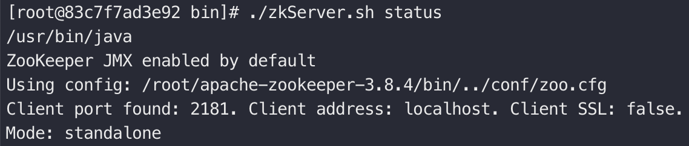
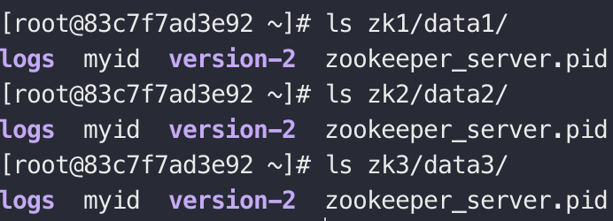

> zookeeper version：3.8.4
>
> java version：1.8

## 一、单机搭建

1. 单机搭建这里主要是修改`zoo.cfg`文件，**特殊指定一下后续数据（dataDir）和事务日志的存放地址（dataLogDir）**。

```properties
tickTime=2000
initLimit=10
syncLimit=5
dataDir=/root/apache-zookeeper-3.8.4/data
dataLogDir=/root/apache-zookeeper-3.8.4/data/logs
clientPort=2181
```

2. 启动`zookeeper`服务端

```sh
./zkServer.sh start
```

3. 看到如下提示，则表示启动成功

   

4. 执行如下命令，查看单机部署状态

   

## 二、集群搭建

为了方便测试和验证功能，可以在一台机器上搭建集群，称为伪集群。因此，这里规划伪集群搭建包含3个zk服务：

- 客户端端口：2181、2182、2183
- 集群通信端口：2281、2282、2283
- 选举投票端口：2381、2382、2383
- 数据日志存储地址：/data1、/data2、/data3


1. 文件准备：分别创建数据目录、日志目录，并写入`myid`文件

   ```sh
   mkdir -p zk1/data1/logs zk2/data2/logs zk3/data3/logs
   ```

   ```sh
   touch zk1/data1/myid zk2/data2/myid zk3/data3/myid
   ```

   ```sh
   echo 1 > zk1/data1/myid & echo 2 > zk2/data2/myid & echo 3 > zk3/data3/myid
   ```

2. 为每一个服务配置`zoo.cfg`，注意调整`dataDir`、`dataLogDir`和`clientPort`

   ```properties
   tickTime=2000
   initLimit=10
   syncLimit=5
   # 数据文件存放位置
   dataDir=/root/zk1/data1
   # 日志文件存放位置
   dataLogDir=/root/zk1/data1/logs
   # 客户端通信端口
   clientPort=2181
   # 集群配置：server.<myid>=<节点ip>:<集群通信端口>:<投票选举端口>
   server.1=172.17.0.2:2281:2381
   server.2=172.17.0.2:2282:2382
   server.3=172.17.0.2:2283:2383
   ```

3. 当start了一个zk服务时，实际上由于集群选举的过半机制，只有1/3的zk参与了投票，还不能产生leader，此时这个服务并不是 running 状态

   

4. 当再start一个服务的时候，集群中会有2/3的服务参与投票，此时会产生一个leader，其余服务为follower

   

5. 至此，zk的伪集群就搭建完成了

   
