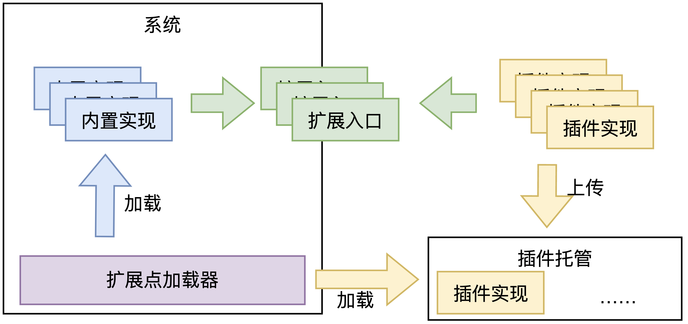
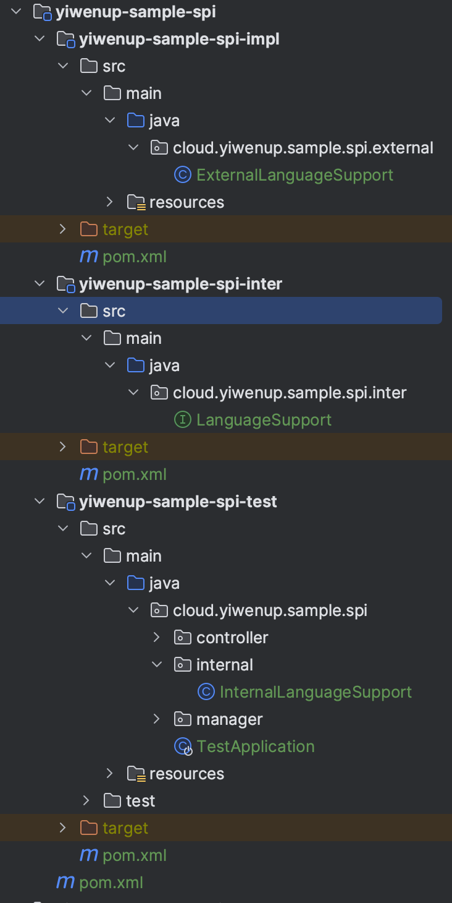

## 一、前置知识

> `SPI`即`Service Provider Interface`，是一种用来被第三方实现或者扩展的接口，它可以用来启用框架扩展和替换组件，本质上是**基于面向接口编程＋策略模式＋约定配置文件实现的动态加载机制**。
>
> Java、Spring、Dubbo都支持不同类型的SPI机制。

### 1.1 Java SPI

> Java原生SPI是Java标准库提供的一种服务提供者机制。它基于在JAR文件的META-INF/services目录下的配置文件，列出了服务接口的实现类。**通过ServiceLoader类，应用程序可以动态加载这些实现类。**
>
> - **标准化**：Java原生SPI是Java标准的一部分，因此它在Java平台上具有广泛的支持和兼容性。
> - **轻量级**：它没有复杂的依赖关系或配置文件，易于使用。
> - **松耦合**：服务提供者和消费者之间的耦合度较低，允许在不修改代码的情况下添加或替换实现类。

### 1.2 Spring SPI

> Spring SPI是Spring框架提供的扩展机制，它基于spring.factories文件来配置和加载各种扩展点。Spring SPI不仅用于服务提供者，还用于各种Spring功能的扩展。**通过SpringFactoriesLoader类，应用程序可以动态加载这些实现类。**
>
> - **丰富的扩展点**：Spring SPI支持许多扩展点，如BeanPostProcessor、ApplicationListener等，不仅限于服务提供者。
> - **集成Spring生态系统**：它与Spring框架集成，可以轻松与Spring Boot等Spring项目一起使用。
> - **丰富的元信息**：spring.factories文件中的元信息可以提供更多的配置和属性信息。

### 1.3 Dubbo SPI

> Dubbo SPI是Apache Dubbo框架提供的一种扩展点机制，它基于META-INF/dubbo目录下的配置文件来定义扩展点和扩展实现。Dubbo SPI主要用于扩展Dubbo框架的各种功能，如协议、负载均衡、注册中心等。**通过ExtensionLoader类，应用程序可以动态加载这些实现类。**
>
> - **强大的扩展点支持**：Dubbo SPI支持大量的扩展点，可以自定义扩展各种Dubbo功能。
> - **丰富的配置**：每个扩展点都可以在配置文件中进行详细的配置，支持参数传递。
> - **集成Dubbo生态系统**：Dubbo SPI与Dubbo框架深度集成，可以实现高度可定制化的Dubbo功能。

## 二、实现简述

> 基于上述三种`SPI`的实现形态，Java原生的方式实际上是比较好的一种选型，最直接的原因就是在于不与任何框架产生耦合。

### 2.1 方案设计



- 首先需要定义好一个`SPI`接口，该接口可提供给客户，根据自身场景编写对应的实现。
- 此外，需要一个插件加载引擎，其核心便是由`ServiceLoader`实现，需要考虑两处功能点：一是在系统启动的过程中，加载指定位置的扩展包，将外部策略载入 JVM；二是允许客户在系统运行的过程中，动态将扩展的外部策略载入内存。
- 最后需要一个上传接口，方便客户将其扩展的包进行上传，此处上传逻辑需要保证能将扩展的包上传到指定位置。

### 2.2 模块介绍



- yiwenup-sample-spi-inter：仅定义接口，后续打包提供给客户进行实现，也提供给当前系统使用，进行默认实现。
- yiwenup-sample-spi-impl：模拟客户的扩展项目，依赖 yiwenup-sample-spi-inter 的接口，提供一个扩展实现。
- yiwenup-sample-spi-test：模拟当前系统，依赖 yiwenup-sample-spi-inter 的接口，提供一个默认实现。

### 2.3 核心实现

用`Map`数据结构缓存策略标识与实现的映射关系，在程序启动时载如默认策略。当外部请求来临，调用 getPlugin 方法时，判断策略尚未被缓存，即表示需要加载一个扩展的实现，因此读取指定文件路径，使用`URLClassLoader`加载对应路径的扩展`jar`，并绑定给`ServiceLoader`进行加载，获取第一个`SPI`实例，此时热加载完成。

```java
public class SupportManager {

    public static final String UPLOAD_LOCATION = "/data/upload";

    private SupportManager() {
    }

    private final static Map<String, LanguageSupport> LANGUAGE_SUPPORT_MAP = new ConcurrentHashMap<>();

    static {
        LANGUAGE_SUPPORT_MAP.put("internal", new InternalLanguageSupport());
    }

    public static LanguageSupport getPlugin(String type) {
        LanguageSupport languageSupport = LANGUAGE_SUPPORT_MAP.get(type);
        if (languageSupport != null) {
            return languageSupport;
        }
        // ❌不使用类加载器无法实现
        // languageSupport = ServiceLoader.load(LanguageSupport.class).iterator().next();

        File directory = new File(UPLOAD_LOCATION);
        if (directory.listFiles() != null) {
            File[] files = directory.listFiles();
            URL[] urls = new URL[files.length];
            try {
                for (int i = 0; i < files.length; i++) {
                    urls[i] = files[i].toURI().toURL();
                }
            } catch (Exception e) {
                throw new RuntimeException(e);
            }

            try (URLClassLoader urlClassLoader = URLClassLoader.newInstance(urls, LanguageSupport.class.getClassLoader())) {
                languageSupport = ServiceLoader.load(LanguageSupport.class, urlClassLoader).iterator().next();
                LANGUAGE_SUPPORT_MAP.put(type, languageSupport);
            } catch (Exception e) {
                throw new RuntimeException(e);
            }
        }
        return languageSupport;
    }
}
```
