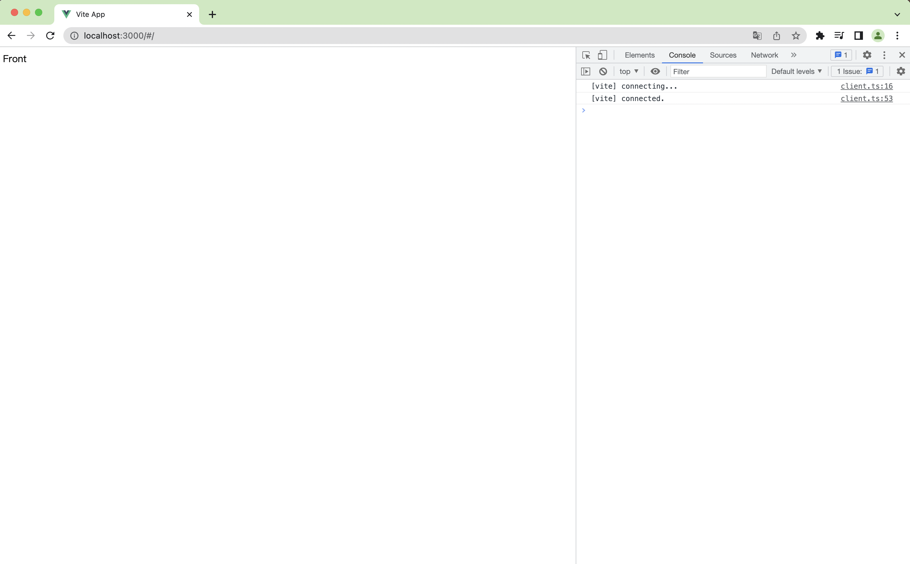
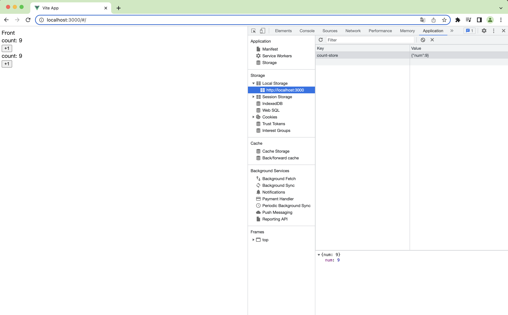

## 一、开发框架搭建

### 1. 开发工具

- webstorm

### 2. 开发环境

- node
- pnpm

### 3. 技术选型

- vue3（渐进式框架）
- typescript（语言）
- vite2（包管理）
- vue-router（路由）
- pinia（状态管理）
- tailwindcss（样式）
- element-plus（组件）

## 二、初始化项目

1. 使用 `npm ` 创建项目

   ```sh
   npm create vite@latest
   ```

   

2. 使用 `pnpm` 安装依赖

   ```sh
   pnpm i
   ```

3. 启动服务

   ```sh
   pnpm run dev
   ```

   

   

## 三、风格规约

1. 安装 `ESLint` 和 `prettier`

   ```sh
   pnpm i prettier eslint eslint-config-prettier eslint-plugin-prettier eslint-plugin-vue vue-eslint-parser @typescript-eslint/eslint-plugin @typescript-eslint/parser -D
   ```

2. 配置 `.eslintrc.json`

   ```json
   {
     "root": true,
     "env": {
       "browser": true,
       "node": true,
       "es2021": true
     },
     "globals": {
       "node": true
     },
     "extends": [
       // "eslint:recommended",
       "plugin:vue/vue3-recommended",
       // "plugin:@typescript-eslint/recommended",
       "plugin:prettier/recommended"
     ],
     "parser": "vue-eslint-parser",
     "parserOptions": {
       "ecmaVersion": 12,
       "parser": "@typescript-eslint/parser",
       "sourceType": "module"
     },
     "plugins": ["@typescript-eslint"],
     "ignorePatterns": ["types/env.d.ts", "node_modules/**", "**/dist/**"],
     "rules": {
       "@typescript-eslint/no-unused-vars": "error",
       "@typescript-eslint/no-var-requires": "off",
       "@typescript-eslint/consistent-type-imports": "error",
       "@typescript-eslint/explicit-module-boundary-types": "off",
       "@typescript-eslint/ban-ts-ignore": "off",
       "@typescript-eslint/explicit-function-return-type": "off",
       "@typescript-eslint/no-explicit-any": "off",
       "@typescript-eslint/no-empty-function": "off",
       "@typescript-eslint/no-use-before-define": "off",
       "@typescript-eslint/ban-ts-comment": "off",
       "@typescript-eslint/ban-types": "off",
       "@typescript-eslint/no-non-null-assertion": "off",
       "vue/singleline-html-element-content-newline": "off",
       "vue/multiline-html-element-content-newline": "off",
       "vue/no-v-html": "off",
       "semi": ["error", "always"],
     }
   }
   ```

3. 配置`.editorconfig`

   ```sh
   root = true
   
   [*]
   charset = utf-8
   end_of_line = lf
   indent_size = 2
   indent_style = space
   insert_final_newline = true
   ij_html_quote_style = double
   max_line_length = 120
   tab_width = 2
   trim_trailing_whitespace = true
   
   [{*.har,*.jsb2,*.jsb3,*.json,.babelrc,.eslintrc,.prettierrc,.stylelintrc,bowerrc,jest.config}]
   indent_size = 2
   
   [{*.htm.*.html,*.ng,*.sht,*.shtm,*.shtml}]
   indent_size = 2
   tab_width = 2
   ```

4. 配置`.prettierrc.json`

   ```json
   {
     "printWidth": 100,
     "tabWidth": 2,
     "useTabs": false,
     "semi": true,
     "vueIndentScriptAndStyle": true,
     "singleQuote": true,
     "quoteProps": "as-needed",
     "bracketSpacing": true,
     "trailingComma": "es6",
     "jsxBracketSameLine": true,
     "jsxSingleQuote": true,
     "arrowParens": "always",
     "insertPragma": false,
     "requiredPragma": false,
     "proseWrap": "never",
     "htmlWhitespaceSensitivity": "ignore",
     "endOfLine": "auto",
     "rangeStart": 0
   }
   ```

## 四、别名配置

1. 查看 `node` 版本

   ```sh
   node -v
   ```

2. 搜索 `@types/node` 的版本

   ```sh
   pnpm view @types/node versions
   ```

3. 选择安装最接近的版本

   ```sh
   pnpm add @types/node@17.0.23 -D
   ```

4. 调整`vite.config.ts`

   ```typescript
   import { defineConfig } from 'vite';
   import vue from '@vitejs/plugin-vue';
   import * as path from 'path';
   
   // region 别名解析函数
   const resolve = (p: string) => {
     return path.resolve(__dirname, p);
   };
   // endregion
   
   // https://vitejs.dev/config/
   export default defineConfig({
     resolve: {
       // region 别名解析
       alias: {
         '@': resolve('./src'),
       },
       // endregion
     },
     plugins: [vue()],
   });
   ```

5. 调整 `tsconfig.json`

   ```json
   {
     "compilerOptions": {
       "target": "esnext",
       "useDefineForClassFields": true,
       "module": "esnext",
       "moduleResolution": "node",
       "strict": true,
       "jsx": "preserve",
       "sourceMap": true,
       "resolveJsonModule": true,
       "esModuleInterop": true,
       "lib": ["esnext", "dom"],
       // region 别名自动导入
       "baseUrl": ".",
       "paths": {
         "@/*": ["./src/*"],
       },
       // endregion
     },
     "include": ["src/**/*.ts", "src/**/*.d.ts", "src/**/*.tsx", "src/**/*.vue"],
     "references": [{ "path": "./tsconfig.node.json" }]
   }
   ```

## 五、集成路由

1. 安装 `vue-router4`

   ```sh
   pnpm add vue-router@4
   ```

2. 创建测试页面`src/views/Front.vue`

   ```vue
   <template>
     <div>Front</div>
   </template>
   
   <script lang="ts" setup></script>
   
   <style lang="scss" scoped></style>
   ```

3. 创建路由模块`src/router/modules/front.ts`

   ```typescript
   import type { RouteRecordRaw } from 'vue-router';
   
   const routes: RouteRecordRaw[] = [
     {
       path: '/',
       component: () => import('@/views/Front.vue'),
     },
   ];
   
   export default routes;
   ```

4. 创建路由导出`src/router/index.ts`

   ```typescript
   import type { RouteRecordRaw } from 'vue-router';
   import { createRouter, createWebHashHistory } from 'vue-router';
   
   const routes: RouteRecordRaw[] = [];
   
   // region vite 特性，按正则匹配批量导出文件
   const files = import.meta.globEager('./modules/*.ts');
   for (const path in files) {
     // 解析文件中的模块信息
     const module = files[path];
     // module.default 数组存放了当前模块下所有的路由信息，统一存放到路由数组中
     routes.push(...module.default);
   }
   // endregion
   
   // region 创建路由实例
   const router = createRouter({
     history: createWebHashHistory(),
     routes: routes,
   });
   // endregion
   
   export default router;
   ```

5. 调整`src/main.ts`，挂载路由组件

   ```typescript
   import { createApp } from 'vue';
   import App from './App.vue';
   import router from '@/router';
   
   const app = createApp(App);
   
   app.use(router);
   
   app.mount('#app');
   ```

6. `App.vue` 调整，使用路由

   ```vue
   <template>
     <router-view />
   </template>
   ```

7. 为了方便测试，可以复制`front.ts`，新建一个`admin.ts`，同样的，复制`Front.vue`，新建一个`Admin.vue`，配置`admin.ts`路由为`/admin`

8. 启动页面，测试访问`/`以及`/admin`

   

   

## 六、集成状态管理

1. 安装 `pinia`

   ```sh
   pnpm add pinia
   ```

2. 创建状态管理导出文件 `src/store/index.ts`

   ```typescript
   import { createPinia } from 'pinia';
   
   const pinia = createPinia();
   
   export default pinia;
   ```

3. 挂载状态管理`src/main.ts`

   ```typescript
   import { createApp } from 'vue';
   import App from './App.vue';
   import router from '@/router';
   import pinia from '@/store';
   
   const app = createApp(App);
   
   app.use(router);
   app.use(pinia);
   
   app.mount('#app');
   ```

4. 创建测试模块状态管理`src/store/modules/useCountStore.ts`

   ```typescript
   import { defineStore } from 'pinia';
   
   const useCountStore = defineStore({
     id: 'count',
     state: () => ({ num: 1 }),
     actions: {
       increment() {
         this.num++;
       },
     },
   });
   
   // region 创建状态实例
   const instance = useCountStore();
   // endregion
   
   // region 订阅状态变化，将对象持久化到浏览器
   instance.$subscribe((_, state) => {
     localStorage.setItem('count-store', JSON.stringify({ ...state }));
   });
   // endregion
   
   // region 加载状态时，从浏览器取值并赋值
   const item = localStorage.getItem('count-store');
   if (item) {
     instance.$state = JSON.parse(item);
   }
   // endregion
   
   export default useCountStore;
   ```

5. 在页面使用进行测试

   ```vue
   <template>
     <div>Front</div>
     <div>count: {{ countStore.num }}</div>
     <button @click="countStore.increment()">+1</button>
     <!-- region 使用 pinia 响应式 -->
     <div>count: {{ toRefs.num.value }}</div>
     <button @click="toRefs.num.value++">+1</button>
     <!-- endregion -->
   </template>
   
   <script lang="ts" setup>
     import useCountStore from '@/store/modules/useCountStore';
     import { storeToRefs } from 'pinia';
   
     const countStore = useCountStore();
     // region 使用 pinia 响应式
     const toRefs = storeToRefs(countStore);
     // endregion
   </script>
   
   <style lang="scss" scoped></style>
   ```

6. 测试页面

   

## 七、集成样式

1. 安装 `tailwindcss`

   ```sh
   pnpm install -D tailwindcss@latest postcss@latest autoprefixer@latest
   ```

2. 初始化配置文件，命令执行后将会创建文件 `postcss.config.js` 以及 `tailwind.config.js`

   ```sh
   npx tailwindcss init -p
   ```

3. 安装 `sass`

   ```sh
   pnpm add sass
   ```

4. 参照官方文档配置`postcss.config.js`

   ```js
   module.exports = {
     plugins: {
       tailwindcss: {},
       autoprefixer: {},
     },
   };
   
   ```

5. 参照官方文档配置`tailwind.config.js`

   ```js
   module.exports = {
     content: ['./index.html', './src/**/*.{vue,js,ts,jsx,tsx}'],
     theme: {
       extend: {},
     },
     plugins: [],
   };
   ```

6. 参照官方文档配置样式文件`src/assets/styles/index.scss`

   ```scss
   @tailwind base;
   @tailwind components;
   @tailwind utilities;
   ```

7. 导入样式配置 `src/main.ts`

   ```typescript
   import { createApp } from 'vue';
   import App from './App.vue';
   import router from '@/router';
   import pinia from '@/store';
   import '@/assets/styles/index.scss';
   
   const app = createApp(App);
   
   app.use(router);
   app.use(pinia);
   
   app.mount('#app');
   ```

8. 测试页面引入样式，测试是否成功

   ```vue
   <template>
     <div>Front</div>
     <div>count: {{ countStore.num }}</div>
     <button class="bg-green-200 text-white rounded" @click="countStore.increment()">+1</button>
     <!-- region 使用 pinia 响应式 -->
     <div>count: {{ toRefs.num.value }}</div>
     <button class="bg-red-300 text-white rounded" @click="toRefs.num.value++">+1</button>
     <!-- endregion -->
   </template>
   
   <script lang="ts" setup>
     import useCountStore from '@/store/modules/useCountStore';
     import { storeToRefs } from 'pinia';
   
     const countStore = useCountStore();
     // region 使用 pinia 响应式
     const toRefs = storeToRefs(countStore);
     // endregion
   </script>
   
   <style lang="scss" scoped></style>
   ```

   

## 八、集成组件

1. 参照官方文档，安装 `element-plus`

   ```sh
   pnpm add element-plus
   ```

2. 参照官方文档，安装 `element-plus` 按需引入插件

   ```sh
   pnpm add -D unplugin-vue-components unplugin-auto-import
   ```

3. 参考官方文档，配置 `vite.config.ts`

   ```typescript
   import { defineConfig } from 'vite';
   import vue from '@vitejs/plugin-vue';
   import * as path from 'path';
   import AutoImport from 'unplugin-auto-import/vite';
   import Components from 'unplugin-vue-components/vite';
   import { ElementPlusResolver } from 'unplugin-vue-components/resolvers';
   
   // region 别名解析函数
   const resolve = (p: string) => {
     return path.resolve(__dirname, p);
   };
   // endregion
   
   // https://vitejs.dev/config/
   export default defineConfig({
     resolve: {
       // region 别名解析
       alias: {
         '@': resolve('./src'),
       },
       // endregion
     },
     plugins: [
       vue(),
       // region element-plus 按需引入
       AutoImport({
         resolvers: [ElementPlusResolver()],
       }),
       Components({
         resolvers: [ElementPlusResolver()],
       }),
       // endregion
     ],
   });
   ```

4. 测试页面引入一个 `element-plus` 组件，测试引入成功

   ```vue
   <template>
     <div>Front</div>
     <div>count: {{ countStore.num }}</div>
     <button class="bg-green-200 text-white rounded" @click="countStore.increment()">+1</button>
     <!-- region 使用 pinia 响应式 -->
     <div>count: {{ toRefs.num.value }}</div>
     <button class="bg-red-300 text-white rounded" @click="toRefs.num.value++">+1</button>
     <!-- endregion -->
     <!-- region element-plus-->
     <el-button>Test!!</el-button>
     <!--  endregion-->
   </template>
   
   <script lang="ts" setup>
     import useCountStore from '@/store/modules/useCountStore';
     import { storeToRefs } from 'pinia';
   
     const countStore = useCountStore();
     // region 使用 pinia 响应式
     const toRefs = storeToRefs(countStore);
     // endregion
   </script>
   
   <style lang="scss" scoped></style>
   ```

   

   

## 九、集成图标库

   1. 安装 `iconify`

      ```sh
      pnpm add @iconify/iconify
      ```

      ```sh
      pnpm add vite-plugin-purge-icons @iconify/json -D
      ```

   2. 配置 `vite.config.ts`

      ```typescript
      import { defineConfig } from 'vite';
      import vue from '@vitejs/plugin-vue';
      import * as path from 'path';
      import AutoImport from 'unplugin-auto-import/vite';
      import Components from 'unplugin-vue-components/vite';
      import { ElementPlusResolver } from 'unplugin-vue-components/resolvers';
      import PurgeIcons from 'vite-plugin-purge-icons';
      
      // region 别名解析函数
      const resolve = (p: string) => {
        return path.resolve(__dirname, p);
      };
      // endregion
      
      // https://vitejs.dev/config/
      export default defineConfig({
        resolve: {
          // region 别名解析
          alias: {
            '@': resolve('./src'),
          },
          // endregion
        },
        plugins: [
          vue(),
          // region element-plus 按需引入
          AutoImport({
            resolvers: [ElementPlusResolver()],
          }),
          Components({
            resolvers: [ElementPlusResolver()],
          }),
          // endregion
          // region iconify 按需引入
          PurgeIcons({
            content: ['**/*.html', '**/*.js', '**/*.vue'],
          }),
          // endregion
        ],
      });
      ```

   3. 导入图标 `main.ts`

      ```typescript
      import { createApp } from 'vue';
      import App from './App.vue';
      import router from '@/router';
      import pinia from '@/store';
      import '@/assets/styles/index.scss';
      import '@purge-icons/generated';
      
      const app = createApp(App);
      
      app.use(router);
      app.use(pinia);
      
      app.mount('#app');
      ```

   4. 测试页面通过 `html` 方式引入图标，测试

      ```vue
      <template>
        <div>Front</div>
        <div>count: {{ countStore.num }}</div>
        <button class="bg-green-200 text-white rounded" @click="countStore.increment()">+1</button>
        <!-- region 使用 pinia 响应式 -->
        <div>count: {{ toRefs.num.value }}</div>
        <button class="bg-red-300 text-white rounded" @click="toRefs.num.value++">+1</button>
        <!-- endregion -->
        <!-- region element-plus-->
        <el-button>Test!!</el-button>
        <!--  endregion-->
        <!-- region html 方式引入图标 -->
        <span class="iconify" data-icon="flat-color-icons:search"></span>
        <!--  endregion-->
      </template>
      
      <script lang="ts" setup>
        import useCountStore from '@/store/modules/useCountStore';
        import { storeToRefs } from 'pinia';
      
        const countStore = useCountStore();
        // region 使用 pinia 响应式
        const toRefs = storeToRefs(countStore);
        // endregion
      </script>
      
      <style lang="scss" scoped></style>
      ```

      

   5. 通过自定义组件方式引入图标，创建图标组件 `src/components/common/AppIcon.vue`

      ```vue
      <template>
        <!-- 使用 vue3 props 语法 -->
        <span class="iconify" :data-icon="props.icon"></span>
      </template>
      <script lang="ts" setup>
        const props = defineProps<{
          icon: string;
        }>();
      </script>
      <style lang="scss" scoped></style>
      ```

   6. 测试页面使用自定义组件

      ```vue
      <template>
        <div>Front</div>
        <div>count: {{ countStore.num }}</div>
        <button class="bg-green-200 text-white rounded" @click="countStore.increment()">+1</button>
        <!-- region 使用 pinia 响应式 -->
        <div>count: {{ toRefs.num.value }}</div>
        <button class="bg-red-300 text-white rounded" @click="toRefs.num.value++">+1</button>
        <!-- endregion -->
        <!-- region element-plus-->
        <el-button>Test!!</el-button>
        <!--  endregion-->
        <!-- region html 方式引入图标 -->
        <span class="iconify" data-icon="flat-color-icons:search"></span>
        <!--  endregion-->
        <!-- region 自定义组件方式引入图标 -->
        <app-icon icon="bi:search-heart"></app-icon>
        <!--  endregion-->
      </template>
      
      <script lang="ts" setup>
        import useCountStore from '@/store/modules/useCountStore';
        import { storeToRefs } from 'pinia';
        import AppIcon from '@/components/common/AppIcon.vue';
      
        const countStore = useCountStore();
        // region 使用 pinia 响应式
        const toRefs = storeToRefs(countStore);
        // endregion
      </script>
      
      <style lang="scss" scoped></style>
      ```

      

## 十、搭建后管页面

