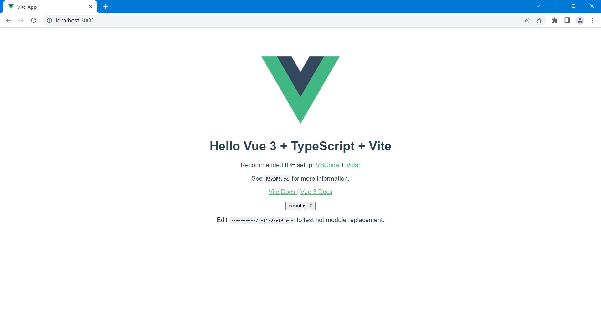

## 一、开发框架搭建

### 1. 开发工具

- webstorm

### 2. 开发环境

- node
- pnpm

### 3. 技术选型

- vue3（渐进式框架）
- typescript（语言）
- vite2（包管理）
- vue-router（路由）
- pinia（状态管理）
- tailwindcss（样式）
- element-plus（组件）

## 二、初始化项目

1. 使用 `npm ` 创建项目

   ```sh
   npm create vite@latest
   ```

   

2. 使用 `pnpm` 安装依赖

   ```sh
   pnpm i
   ```

3. 启动服务

   ```sh
   pnpm run dev
   ```

   

   

## 三、风格规约


