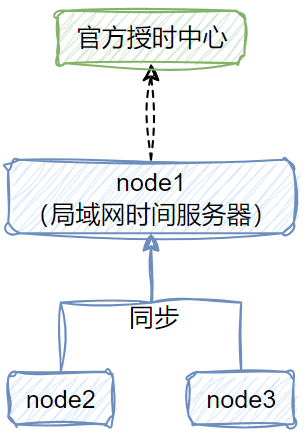

> 分布式一定是集群，而集群不一定是分布式的。
>
> 分布式是指将一个系统拆分为多个**子系统**，每个子系统负责各自的功能模块，独立部署各司其职
>
> 集群是指让多个实例共同工作，最常见/最简单的集群就是将一个应用复制多份部署。

## 一、时钟同步问题


不论对于负载均衡服务器、应用服务器还是数据库服务器，如果在统一系统内，服务器时间不一致的话，在某些业务场景下就容易导致数据错乱，最经典比如事件溯源架构、审计日志能力等场景，都是比较依赖时序性的。

## 二、时钟同步思路

### 2.1 场景一

> 对于分布式集群中，**所有节点都可以访问互联网**的情况，处理方式还是比较简单的。


在联网环境下，我们只需要在对应的服务节点上执行如下命令，即可和官方的**授时中心**同步时间：

```sh
ntpdate -u ntp.api.bz
```

- ntp 表示网络时间协议，而 ntpdate 是这个协议下的命令；
- ntp.api.bz 是某一个授时中心的地址
- 对于以上命令，还**可以结合操作系统的定时任务机制，按一定频次自动执行时钟同步**

### 2.2 场景二

> 对于分布式集群中，**部分节点甚至所有节点都无法访问互联网**的情况，大体的思路都是选择一台服务器作为局域网时间服务器，其余节点向这个服务器做时钟同步。



如果集群中有节点能访问互联网，那么就选择这个节点按场景一的命令去同步授时中心的时间，如果没有节点能联网的话，则手动设置时间，后续按如下步骤执行：

1. 选择好一个局域网内时钟服务器

2. 配置时间服务器的 /etc/ntp.conf 文件

   ```sh
   # 1. 如果有 restrict default ignore，则注释该行
   # 2. 放开局域⽹同步功能
   restrict <网段ip，比如 192.168.0.0> mask 255.255.255.0 nomodify notrap
   # 3. 配置硬件时钟和网络时间保持一致
   server 127.127.1.0 # local clock
   fudge 127.127.1.0 stratum 10
   ```

3. 重启局域网时间服务器生效并配置开启自启动

   ```sh
   service ntpd restart && chkconfig ntpd on
   ```

4. 其余节点向局域网时间服务器同步时间

   ```sh
   ntpdate <局域网时间服务器ip>
   ```

   
